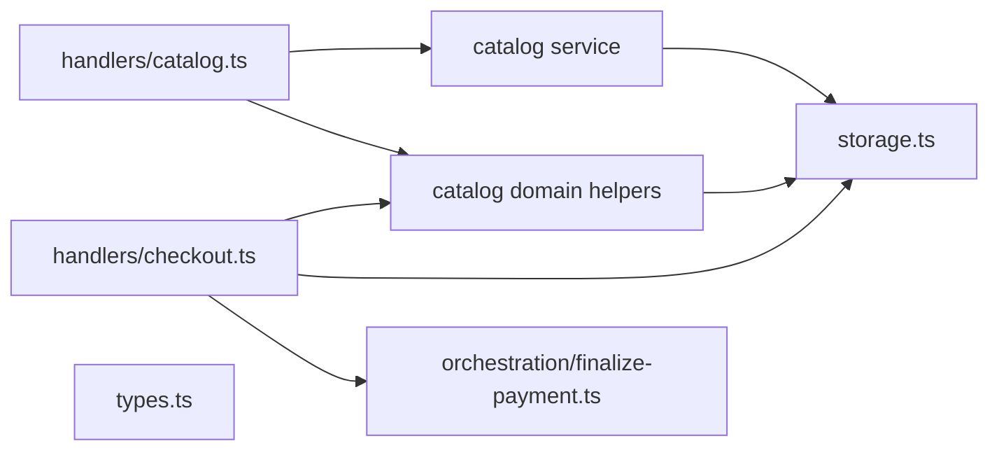

# Consolidated Execution Plan

## Scope and constraints
- Target module: `packages/plugins/commerce`.
- Preserve Stage-1 scope lock: no payment provider routing changes, no MCP write surfaces, no changes to checkout webhook finalize semantics.
- Follow the phased order in `emdash-commerce-product-catalog-v1-spec-updated.md`:
  - [Phase 1 Foundation](./emdash-commerce-product-catalog-v1-spec-updated.md#phase-1--foundation-schema-and-invariants)
  - [Phase 2 Media/assets](./emdash-commerce-product-catalog-v1-spec-updated.md#phase-2--mediaassets-abstraction)
  - [Phase 3 Variable product model](./emdash-commerce-product-catalog-v1-spec-updated.md#phase-3--variable-product-model)
  - [Phase 4 Digital entitlement model](./emdash-commerce-product-catalog-v1-spec-updated.md#phase-4--digital-entitlement-model)
  - [Phase 5 Bundle model](./emdash-commerce-product-catalog-v1-spec-updated.md#phase-5--bundle-model)
  - [Phase 6 Catalog organization/retrieval](./emdash-commerce-product-catalog-v1-spec-updated.md#phase-6--catalog-organization-and-retrieval)
  - [Phase 7 Order snapshot integration](./emdash-commerce-product-catalog-v1-spec-updated.md#phase-7--order-snapshot-integration)
- Keep edits additive and type-safe; route-level contract remains in [`packages/plugins/commerce/src/index.ts`](/Users/vidarbrekke/Dev/emDash/packages/plugins/commerce/src/index.ts).
- Preserve strict handler layering: catalog and checkout handlers must not invoke each other directly.
- Add explicit immutable field rules and response-shape contracts before entity expansion work.
- Feature flags should be used only where rollout risk or frontend surface maturity requires it.

## High-level architecture flow


## Canonical catalog-domain contracts (before implementation)
- Immutable updates:
  - `Product` immutable fields: `id`, `type`, `createdAt`, `productCode` (if present), and lifecycle governance of `status` if you introduce hard publication rules.
  - `SKU` immutable fields: `id`, `productId`, `createdAt`, and any immutable identity fields in the product type payload.
  - Merge-on-write is allowed only after validating incoming fields against the immutable set.
- Asset workflow:
  - Asset metadata registration (`catalog asset create/register`) is separated from binary upload transport.
  - Upload transport remains in media/asset infrastructure; catalog owns only asset record+link lifecycle.
- Variant product invariants:
  - For variable products, each SKU option map must include exactly one value for each variant-defining attribute.
  - No missing values, no extra values, and no duplicate values per attribute on a single SKU.
  - Duplicate variant signatures are rejected.
- Bundle pricing ownership:
  - v1 bundle discount config is explicitly stored on the bundle product record, not on dedicated pricing records or component rows.
- Snapshot boundary:
  - Snapshot builders live in `src/lib` and are consumed by checkout; checkout handlers do not contain core catalog logic.
- Response shape contract:
  - Define DTOs once in `src/lib/catalog-dto.ts`:
    - product detail DTO
    - catalog listing DTO
    - admin product DTO
    - bundle summary DTO
    - variant matrix DTO

## Data migration and backfill approach
- Any new collection/table addition requires `storage` + `database` registration and migration notes for rollback and replay.
- For existing rows, define defaults during migration (status, visibility, bundle pricing defaults, snapshot fields).
- Add backfill tasks where historical rows are impacted:
  - Add new fields with nullable defaults in v1, then migrate critical fields in a safe pass.
  - For legacy orders without snapshots, render from live catalog when snapshot missing but emit monitoring alerts; prefer hardening `snapshot` as required in phase-7.

## Feature flags
- Phase 1–3: no feature flag required (core invariants and foundation).
- Phase 4–6: optional rollout flags if admin UI or search/readers are not yet ready.
- Phase 7: gate snapshot writes behind a deployment flag only if you need a controlled rollout; keep read path backward-tolerant.

## PLQN approach per phase
For each phase below, the strategy matrix is explicit and side-by-side comparisons are embedded so we always choose the highest-value implementation before coding.

### Phase 1 — Foundation hardening (update + lifecycle)
- **Strategy A (chosen): Minimal additive handlers + schemas** in the existing catalog module.
  - Leverages current `StoredProduct`/`StoredProductSku` shapes and route style. Low risk, directly matches phase expectations.
- **Strategy B:** introduce generic catalog command-service first.
  - Better abstraction separation, but too much indirection before all later entities exist.
- **Strategy C:** regenerate schema + typed model from metadata.
  - Strong long-term consistency, high setup cost and migration risk.
- **Strategy D:** skip update/state endpoints.
  - Fails phase-1 exit criteria (`can update it`).

**Why A wins:** lowest complexity, high YAGNI compliance, enough DRY via helper reuse, scalable for later endpoint growth.

#### Implement
1. Extend schemas for updates/state in [`packages/plugins/commerce/src/schemas.ts`](/Users/vidarbrekke/Dev/emDash/packages/plugins/commerce/src/schemas.ts):
   - `productUpdateInputSchema`
   - `productSkuUpdateInputSchema`
   - `productStateInputSchema` (archive/unarchive)
   - `productSkuStateInputSchema`
2. Extend catalog handlers in [`packages/plugins/commerce/src/handlers/catalog.ts`](/Users/vidarbrekke/Dev/emDash/packages/plugins/commerce/src/handlers/catalog.ts):
   - `updateProductHandler` and `updateProductSkuHandler` use immutable-field checks and reject attempts to overwrite forbidden fields.
   - `updateProductHandler`
   - `updateProductSkuHandler`
   - `archiveProductHandler`
   - `setSkuStatusHandler`
3. Update route wiring in [`packages/plugins/commerce/src/index.ts`](/Users/vidarbrekke/Dev/emDash/packages/plugins/commerce/src/index.ts) with new endpoints.
4. Add/extend tests in [`packages/plugins/commerce/src/handlers/catalog.test.ts`](/Users/vidarbrekke/Dev/emDash/packages/plugins/commerce/src/handlers/catalog.test.ts).
5. Add helper-level tests in `src/lib/catalog-domain.ts` (or existing shared helper module) for immutable-field enforcement and transition guards.

```ts
// Phase-1 immutable-field merge intent
const nowIso = new Date().toISOString();
const immutable = {
  id: existing.id,
  createdAt: existing.createdAt,
  type: existing.type,
  updatedAt: nowIso,
};
const input = sanitizeMutableUpdates({ ...existing, ...ctx.input, ...immutable });
await products.put(existing.id, input);
```

### Phase 2 — Media/assets abstraction (upload-first + links)
- **Strategy A (chosen): Add explicit `product_assets` + `product_asset_links`.**
  - Provider-neutral records and link semantics support product and SKU images; aligns with spec and portability.
- **Strategy B:** reuse content/assets directly on catalog rows.
  - Simple short term, fragile portability and governance.
- **Strategy C:** add full media adapter layer first.
  - Over-abstracted for v1.
- **Strategy D:** defer media.
  - Violates phase-2 exit criteria and required retrieval shapes.

**Why A wins:** direct spec alignment, strong DRY boundaries, safe future provider switch.

#### Implement
1. Add types in [`packages/plugins/commerce/src/types.ts`](/Users/vidarbrekke/Dev/emDash/packages/plugins/commerce/src/types.ts):
   - `StoredProductAsset`
   - `StoredProductAssetLink`
2. Add storage config in [`packages/plugins/commerce/src/storage.ts`](/Users/vidarbrekke/Dev/emDash/packages/plugins/commerce/src/storage.ts):
   - `productAssets` collection + indexes
   - `productAssetLinks` collection + unique constraints for primary image role per product
3. Add schemas + handlers:
   - `product-assets/register` (asset metadata row from existing media reference)
   - `catalog/asset/link` (associate asset row with product/SKU)
   - `catalog/asset/unlink` (dissociate without touching upload transport)
   - `catalog/asset/reorder` (per-target position)
   - files: [`packages/plugins/commerce/src/schemas.ts`](/Users/vidarbrekke/Dev/emDash/packages/plugins/commerce/src/schemas.ts), [`packages/plugins/commerce/src/handlers/catalog.ts`](/Users/vidarbrekke/Dev/emDash/packages/plugins/commerce/src/handlers/catalog.ts)
4. Wire routes in [`packages/plugins/commerce/src/index.ts`](/Users/vidarbrekke/Dev/emDash/packages/plugins/commerce/src/index.ts).
5. Add tests in [`packages/plugins/commerce/src/handlers/catalog.test.ts`](/Users/vidarbrekke/Dev/emDash/packages/plugins/commerce/src/handlers/catalog.test.ts).
6. Add explicit API contract test verifying catalog routes never trigger binary upload behavior.

```ts
// Phase-2 invariant (single primary per product)
if (role === 'primary_image' && productId) {
  const primary = await productAssetLinks.query({ where: { productId, role: 'primary_image' }, limit: 1 });
  if (primary.items.length > 0) throw ...
}
```

### Phase 3 — Variable product model
- **Strategy A (chosen): Add attribute tables + normalized option-mapping rows.**
  - Enforces uniqueness and variant-defining rules deterministically.
- **Strategy B:** embed option JSON blobs per SKU.
  - Weak for validation, indexing, and duplicate-combo checks.
- **Strategy C:** generic metadata map approach.
  - Flexible but ambiguous, less reliable at compile-time and runtime.
- **Strategy D:** defer to later phase.
  - Misses phase exit criteria and increases rewrite risk.

**Why A wins:** correct constraints with manageable complexity and good long-term query behavior.

#### Implement
1. Storage additions:
   - `productAttributes`, `productAttributeValues`, `productSkuOptionValues` in [`packages/plugins/commerce/src/storage.ts`](/Users/vidarbrekke/Dev/emDash/packages/plugins/commerce/src/storage.ts)
2. Types in [`packages/plugins/commerce/src/types.ts`](/Users/vidarbrekke/Dev/emDash/packages/plugins/commerce/src/types.ts)
3. Validation + handler flow in [`packages/plugins/commerce/src/handlers/catalog.ts`](/Users/vidarbrekke/Dev/emDash/packages/plugins/commerce/src/handlers/catalog.ts):
   - create variable product with attributes/values
   - create SKU option map
   - reject missing/extra/duplicated option values and duplicate combinations
4. Add schemas in [`packages/plugins/commerce/src/schemas.ts`](/Users/vidarbrekke/Dev/emDash/packages/plugins/commerce/src/schemas.ts)
5. Add retrieval handler for variant matrix in catalog detail route.
6. Add unit tests for invariant checks in a shared helper module:
   - exact variant-defining coverage
   - no duplicate map rows per SKU+attribute
   - no duplicate combinations for same product

```ts
// Phase-3 deterministic signature
const signature = options.map(o => `${o.attributeId}:${o.attributeValueId}`).sort().join('|');
if (seen.has(signature)) throw ...duplicate variant combination...
if (options.length !== variantAttributeIds.length) throw ...missing/extra option value...
if (new Set(options.map((o) => o.attributeId)).size !== options.length) throw ...duplicate attribute...
```

#### Notes
- Implemented in this pass with:
  - separate attribute/value metadata rows,
  - `sku option map` rows for variable SKUs,
  - signature-based duplicate combination rejection,
  - exact variant-defining coverage checks in shared helper module + handler guardrails.

### Phase 4 — Digital entitlement model
- **Strategy A (chosen): Separate `digital_assets` and `digital_entitlements`.
  - Keeps media vs entitlement semantics explicit and composable for mixed fulfilment.
- **Strategy B:** coerce file assets into product image roles.
  - Leaks concerns and breaks access policy.
- **Strategy C:** entitlement at checkout only.
  - Correctness and auditability are weak.
- **Strategy D:** force all mixed products into bundles.
  - Conflicts with spec behavior principle.

**Why A wins:** explicit, portable, and aligns with anti-pattern guidance.

#### Implement
1. Add types/storage:
   - `digitalAssets`, `digitalEntitlements` in [`packages/plugins/commerce/src/types.ts`](/Users/vidarbrekke/Dev/emDash/packages/plugins/commerce/src/types.ts)
   - corresponding storage collections in [`packages/plugins/commerce/src/storage.ts`](/Users/vidarbrekke/Dev/emDash/packages/plugins/commerce/src/storage.ts)
2. Add handlers:
   - `digital-assets/create`
   - `digital-entitlements/create`
   - `digital-entitlements/remove`
   - files: [`packages/plugins/commerce/src/handlers/catalog.ts`](/Users/vidarbrekke/Dev/emDash/packages/plugins/commerce/src/handlers/catalog.ts)
3. Add schemas in [`packages/plugins/commerce/src/schemas.ts`](/Users/vidarbrekke/Dev/emDash/packages/plugins/commerce/src/schemas.ts)
4. Expose retrieval in product detail route: include entitlements summary.

### Phase 5 — Bundle model
- **Strategy A (chosen): Explicit `bundle_components` and derived pricing/availability.**
  - Enforces non-owned bundle inventory and component-based computation.
- **Strategy B:** synthetic discount-only metadata on products.
  - Not auditable for composition.
- **Strategy C:** reuse variable-product option model as bundle engine.
  - Conflates concepts and weakens validation.
- **Strategy D:** defer bundle support.
  - Fails phase exit criteria.

**Why A wins:** spec-aligned and scalable for mixed component types.

#### Implement
1. Add `bundleComponents` in [`packages/plugins/commerce/src/types.ts`](/Users/vidarbrekke/Dev/emDash/packages/plugins/commerce/src/types.ts).
2. Store v1 bundle discount config on `StoredProduct` as:
   - `bundleDiscountType`
   - `bundleDiscountValueMinor` (fixed)
   - `bundleDiscountValueBps` (percentage)
2. Add storage collections in [`packages/plugins/commerce/src/storage.ts`](/Users/vidarbrekke/Dev/emDash/packages/plugins/commerce/src/storage.ts)
3. Add schema + handlers:
   - `bundle-components/add`
   - `bundle-components/remove`
   - `bundle-components/reorder`
   - `bundle/compute`
4. Add utility in [`packages/plugins/commerce/src/lib`](/Users/vidarbrekke/Dev/emDash/packages/plugins/commerce/src/lib) or new helper file for deterministic discount and availability.
5. Add integration tests (price/availability, invalid component refs, recursive prevention where possible via validation).

#### Execution status (current)
Completed in this implementation pass with:
- `bundleComponents` collection and indexes added in storage/types.
- bundle discount fields stored on `StoredProduct`.
- `bundle-components/*` and `bundle/compute` routes exposed in `index.ts`.
- deterministic bundle compute helper added in `src/lib/catalog-bundles.ts`.
- handler-level tests in `handlers/catalog.test.ts` covering add/reorder/remove/compute and invalid composition.

```ts
const derived = components.reduce((sum, c) => sum + c.priceMinor * c.qty, 0);
const discountMinor = discountType === 'percentage' ? Math.floor(derived * (discountBps ?? 0) / 10_000) : Math.max(0, fixedAmount ?? 0);
const finalMinor = Math.max(0, derived - discountMinor);
```

### Phase 6 — Catalog organization and retrieval
- **Strategy A (chosen): Explicit category/tag entities + links + filterable retrieval.**
  - Enables storefront/admin filtering without custom brittle parsing.
- **Strategy B:** metadata tags in JSON.
  - cheap now, costly later for indexing and consistency.
- **Strategy C:** external search-only taxonomy.
  - weak for source-of-truth reads and admin operations.
- **Strategy D:** config-coded taxonomies.
  - not scalable or editable.

**Why A wins:** durable retrieval model and direct alignment with retrieval requirements.

#### Implement
1. Add collections/types:
   - `categories`, `productCategoryLinks`, `productTags`, `productTagLinks` in types/storage files.
2. Add schemas for slug/name + relation operations.
3. Define DTOs before final retrieval implementation (in `src/lib/catalog-dto.ts`):
   - `ProductDetailDTO`
   - `CatalogListingDTO`
   - `ProductAdminDTO`
   - `BundleSummaryDTO`
   - `VariantMatrixDTO`
4. Add list/detail handlers for:
   - catalog listing filters by category/tag/status/visibility
   - admin retrieval shape includes lifecycle/inventory summary hints
5. Implement response mapping through the shared DTO builders in [`packages/plugins/commerce/src/handlers/catalog.ts`](/Users/vidarbrekke/Dev/emDash/packages/plugins/commerce/src/handlers/catalog.ts).
6. Route additions in [`packages/plugins/commerce/src/index.ts`](/Users/vidarbrekke/Dev/emDash/packages/plugins/commerce/src/index.ts).
7. Route-level response-shape validation and filter/list behavior for `categoryId`/`tagId` included in `ProductResponse` and listing handlers.

#### Execution status (current)
Completed in this implementation pass with:
- category/tag entities and link rows added in types/storage.
- category/tag DTO members and catalog request filtering enabled in handlers.
- category/tag routes exposed through `index.ts` with list/create/link/unlink endpoints.

#### Residual checks before phase closure
- Ensure all schema-level route contract tests include category/tag indexes/lookup paths.

### Phase 7 — Order snapshot integration
- **Strategy A (chosen): Snapshot within order line payload at checkout write time.**
  - Immediate immutable history guarantee with minimal storage surface change.
- **Strategy B:** separate order-line snapshot collection.
  - Cleaner model but higher complexity and I/O.
- **Strategy C:** keep live references only.
  - violates snapshot requirement and historical correctness.
- **Strategy D:** async post-checkout denormalization.
  - eventual consistency risk for order history integrity.

**Why A wins:** reaches required behavior quickly with smallest blast radius.

#### Execution status (current)
- Snapshot shape and snapshot line payload now extended in [`packages/plugins/commerce/src/types.ts`](/Users/vidarbrekke/Dev/emDash/packages/plugins/commerce/src/types.ts).
- Snapshot utility added in [`packages/plugins/commerce/src/lib/catalog-order-snapshots.ts`](/Users/vidarbrekke/Dev/emDash/packages/plugins/commerce/src/lib/catalog-order-snapshots.ts).
- Checkout now enriches and persists snapshots in [`packages/plugins/commerce/src/handlers/checkout.ts`](/Users/vidarbrekke/Dev/emDash/packages/plugins/commerce/src/handlers/checkout.ts) and stores them in pending state for replay.
- Checkout regression coverage added in [`packages/plugins/commerce/src/handlers/checkout.test.ts`](/Users/vidarbrekke/Dev/emDash/packages/plugins/commerce/src/handlers/checkout.test.ts).
- Snapshot coverage now includes:
  - digital entitlement and image snapshot assertions,
  - bundle summary assertions,
  - idempotent checkout replay invariance (frozen snapshot retained on repeated replay).

#### Implement
1. Expand `OrderLineItem` in [`packages/plugins/commerce/src/types.ts`](/Users/vidarbrekke/Dev/emDash/packages/plugins/commerce/src/types.ts) with a `snapshot` field.
2. Add snapshot builder utilities in [`packages/plugins/commerce/src/lib/catalog-order-snapshots.ts`](/Users/vidarbrekke/Dev/emDash/packages/plugins/commerce/src/lib/catalog-order-snapshots.ts) and domain helpers used by catalog reads as needed.
3. Update checkout handler (`packages/plugins/commerce/src/handlers/checkout.ts`) to call snapshot helper:
   - product/sku titles, sku code, prices, options, image snapshot, entitlement/bundle hints
4. Ensure `checkout` stores snapshot into each `OrderLineItem` before `orders.put(...)`.
5. Add tests around historical integrity in order rendering path:
   - update product title/price/sku status after checkout and assert order still renders frozen data.
6. Add immutability tests around snapshot payload:
   - snapshot object is not recomputed from live catalog on read
   - write path is stable under repeated checkout calls for idempotent carts

### Dependencies and file touches (planned sequence)
1. `packages/plugins/commerce/src/storage.ts` (collection contracts, indexes, uniqueness)
2. `packages/plugins/commerce/src/types.ts` (domain model growth)
3. `packages/plugins/commerce/src/schemas.ts` (input validation for each endpoint)
4. `packages/plugins/commerce/src/handlers/catalog.ts` (core catalog CRUD + media + variable + digital + bundle + classification)
5. `packages/plugins/commerce/src/index.ts` (route exposure)
6. `packages/plugins/commerce/src/lib/catalog-dto.ts` and `packages/plugins/commerce/src/lib/catalog-order-snapshots.ts` (shared helpers)
7. `packages/plugins/commerce/src/handlers/checkout.ts` (snapshot integration)
8. `packages/plugins/commerce/src/handlers/catalog.test.ts`, `packages/plugins/commerce/src/contracts/storage-index-validation.test.ts`, and any new test files per phase
9. `packages/plugins/commerce/src/services` if a dedicated `catalog-service` abstraction is introduced for shared helper extraction.
10. Docs updates (`HANDOVER.md`, `COMMERCE_EXTENSION_SURFACE.md`, `COMMERCE_DOCS_INDEX.md`) where scope/phase states changed.

### Acceptance criteria by phase
- **Phase 1:** create/read/update/get simple product + sku with invalid shape rejection.
- **Phase 2:** upload-link-read path works; primary image uniqueness enforced per product.
- **Phase 3:** variable attributes + option matrix works; each SKU has exactly one option for every variant-defining attribute; missing/extra/duplicate/skewed option values rejected.
- **Phase 4:** one digital SKU can be linked to one-or-more protected digital assets.
- **Phase 5:** fixed bundle pricing + availability derived from components; no independent bundle stock assumptions.
- **Phase 6:** catalog list filters by category/tag; admin can inspect basic states.
- **Phase 7:** historical order lines are snapshot-driven; later catalog edits do not alter rendered history.

## Test emphasis additions
- Unit invariants (always): immutable-field guards, variable SKU combination checks, primary image uniqueness, bundle availability formula.
- Cross-phase regression (vital): idempotent cart checkout snapshot generation and repeat snapshot payloads.
- Property-style checks (where practical): deterministic option signatures and bundle availability floor behavior.

### Risks and mitigation
- **Cross-cutting index discipline:** keep index coverage in `storage.ts` for every new query path (`status`, `productId`, `skuId`, `role`, `categoryId`, `tagId`) to avoid read regressions.
- **Rollback safety:** each phase can be feature-gated and merged independently.
- **Validation coupling:** avoid silent overwrites by using merge-on-write updates and explicit immutable fields where required.
- **Invariant coupling to checkout:** snapshot fields must be treated as immutable once order is created.
