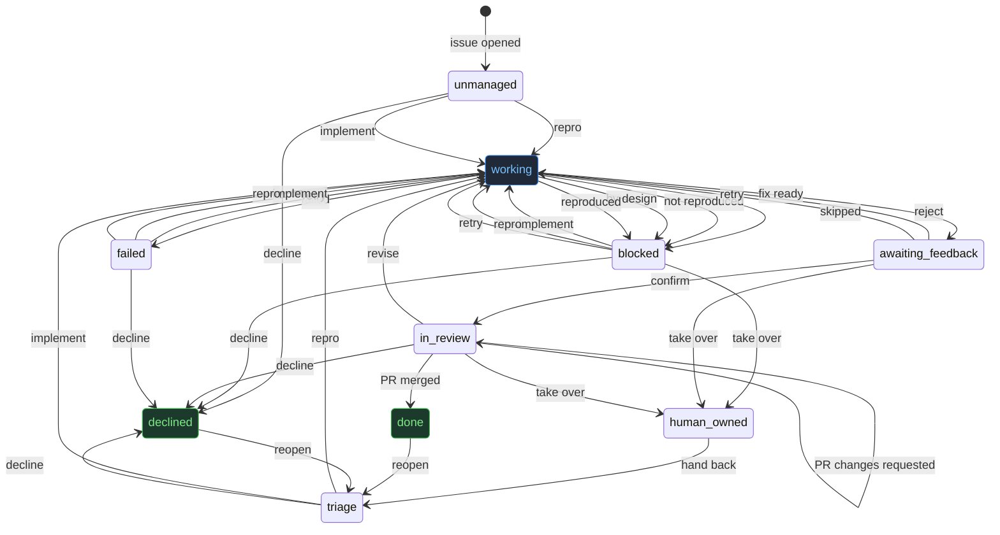

<!-- GENERATED by .github/bot/generate.ts from machine.ts. Do not edit by hand. -->

# emdashbot state machine

The single source of truth is [`.github/bot/machine.ts`](./bot/machine.ts). This file
and [`machine.json`](./bot/machine.json) are generated from it; CI fails if they drift.

A work item (an issue, plus its eventual PR) carries **exactly one `kind` label and
one `state` label** at all times. `kind` is the category; `state` is the lifecycle phase.

## Kinds

- `bot:bug`
- `bot:enhancement`
- `bot:task`

## Lifecycle

## States

| State | Label | Board column | Flags | Meaning |
| --- | --- | --- | --- | --- |
| `unmanaged` | — | (none) | — | No bot labels yet. An issue nobody has handed to the bot. Entry commands work directly. |
| `triage` | `bot:triage` | Triage | — | Filed and awaiting a decision on whether/how the bot should act. |
| `working` | `bot:working` | Working | transient | An agent run is in flight (reproduce / diagnose / verify / fix / implement). |
| `blocked` | `bot:blocked` | Blocked | — | The bot stopped and needs a human decision. Covers the old skipped / not-reproduced / reproduced-no-fix / by-design outcomes; the reason is in the bot's comment. |
| `awaiting_feedback` | `bot:awaiting-feedback` | Awaiting feedback | — | A fix is staged on bot/fix-<n>; waiting for the reporter or a maintainer to confirm or reject. |
| `in_review` | `bot:in-review` | In review | — | A PR is open. The review/* sub-states live on the PR and roll up here. On a bot PR, a plain `@emdashbot` comment is feedback; explicit verbs still win. |
| `human_owned` | `bot:human-owned` | Human owned | — | A maintainer took it over; the bot stays disengaged but the item stays on the board. |
| `done` | `bot:done` | Done | terminal | Shipped (PR merged) or confirmed resolved. |
| `declined` | `bot:declined` | Declined | terminal | Won't be actioned (by design, out of scope, or a maintainer call). |
| `failed` | `bot:failed` | Failed | — | An agent run errored or produced no usable result. Retryable -- not a dead end. |

## Command grammar

Every command is spoken as `@emdashbot <verb>`; a few also have label shortcuts.
The bot ends each comment with the commands valid from the current state, so the
interface is self-documenting. `@emdashbot status` renders the item's position on demand.

| Command | Who | Effect |
| --- | --- | --- |
| `@emdashbot repro` (or label `bot:repro`) | maintainer | Reproduce the issue as a bug and attempt a fix. |
| `@emdashbot implement <directive>` (or label `bot:implement`) | maintainer | Build the described change (feature or directed fix), skipping the bug-repro gate. |
| `@emdashbot retry` | maintainer | Re-run the last agent action. |
| `@emdashbot revise <feedback>` | maintainer | Send review feedback back into the agent to update the open PR branch. |
| `@emdashbot confirm` | reporter, maintainer | Confirm the staged fix works; open a PR. |
| `@emdashbot reject` | reporter, maintainer | The staged fix does not work; retry with feedback. |
| `@emdashbot decline` | maintainer | Won't be actioned; move to declined. |
| `@emdashbot reopen` | maintainer | Bring a terminal item back into triage. |
| `@emdashbot take over` | maintainer | A maintainer takes the item; the bot disengages but stays on the board. |
| `@emdashbot hand back` | maintainer | Return a human-owned item to the bot. |
| `@emdashbot status` | reporter, maintainer | Render the item's current state and available commands. |
| `@emdashbot help` | reporter, maintainer | Show the command grammar. |

### Implicit feedback on a bot PR

An `@emdashbot` mention is always required; only the verb is optional in these states:

- In `in_review`, an `@emdashbot` comment that isn't a known verb is treated as `revise` (the comment body becomes the argument).

## Transitions

Agent results (`agent.*`) and PR lifecycle events (`pr.*`) are fired by workflows,
not humans. The router looks up exactly one transition per (state, event); an event
with no transition from the current state is a no-op (the control listener replies
with the valid commands instead of erroring).

| From | Event | Actors | Action | To | Note |
| --- | --- | --- | --- | --- | --- |
| `unmanaged` | `repro` | maintainer | `investigate.repro` | `working` |  |
| `unmanaged` | `implement` | maintainer | `investigate.implement` | `working` | implement works straight from an untriaged issue |
| `unmanaged` | `decline` | maintainer | — | `declined` |  |
| `triage` | `repro` | maintainer | `investigate.repro` | `working` |  |
| `triage` | `implement` | maintainer | `investigate.implement` | `working` | enhancement/feature lane -- no repro gate |
| `triage` | `decline` | maintainer | — | `declined` |  |
| `working` | `agent.skipped` | system | — | `blocked` | reason: skipped (was a sink) |
| `working` | `agent.not_reproduced` | system | — | `blocked` | reason: not-reproduced (was a sink) |
| `working` | `agent.by_design` | system | — | `blocked` | reason: by-design |
| `working` | `agent.reproduced` | system | — | `blocked` | reason: fix needs a decision |
| `working` | `agent.fix_ready` | system | — | `awaiting_feedback` | executor pushes bot/fix-<n>; orchestrator asks the reporter to confirm. PR opens on confirm, not here. |
| `working` | `agent.failed` | system | — | `failed` |  |
| `blocked` | `implement` | maintainer | `investigate.implement` | `working` |  |
| `blocked` | `repro` | maintainer | `investigate.repro` | `working` |  |
| `blocked` | `retry` | maintainer | `investigate.repro` | `working` |  |
| `blocked` | `decline` | maintainer | — | `declined` |  |
| `blocked` | `take_over` | maintainer | — | `human_owned` |  |
| `awaiting_feedback` | `confirm` | reporter, maintainer | `openPr` | `in_review` |  |
| `awaiting_feedback` | `reject` | reporter, maintainer | `investigate.revise` | `working` | retry with reporter feedback |
| `awaiting_feedback` | `retry` | maintainer | `investigate.repro` | `working` |  |
| `awaiting_feedback` | `take_over` | maintainer | — | `human_owned` |  |
| `in_review` | `pr.opened` | system | — | `in_review` | idempotent; sets review sub-state |
| `in_review` | `pr.approved` | system | — | `in_review` | review sub-state only |
| `in_review` | `pr.changes_requested` | system | — | `in_review` | review sub-state only |
| `in_review` | `revise` | maintainer | `investigate.revise` | `working` | PR feedback -> agent (was impossible) |
| `in_review` | `pr.merged` | system | — | `done` |  |
| `in_review` | `decline` | maintainer | `closePr` | `declined` |  |
| `in_review` | `take_over` | maintainer | — | `human_owned` |  |
| `human_owned` | `hand_back` | maintainer | — | `triage` |  |
| `done` | `reopen` | maintainer | — | `triage` |  |
| `declined` | `reopen` | maintainer | — | `triage` |  |
| `failed` | `retry` | maintainer | `investigate.repro` | `working` |  |
| `failed` | `implement` | maintainer | `investigate.implement` | `working` |  |
| `failed` | `repro` | maintainer | `investigate.repro` | `working` |  |
| `failed` | `decline` | maintainer | — | `declined` |  |

## Labels to provision

Kinds: `bot:bug`, `bot:enhancement`, `bot:task`

States: `bot:triage`, `bot:working`, `bot:blocked`, `bot:awaiting-feedback`, `bot:in-review`, `bot:human-owned`, `bot:done`, `bot:declined`, `bot:failed`
