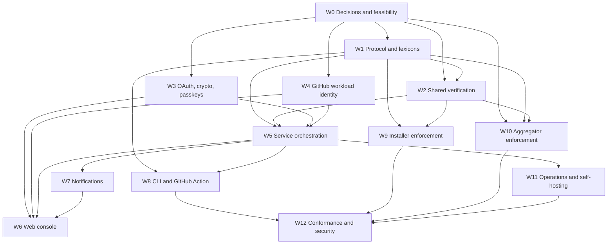

# Delegated Release Service Implementation Plan

Companion: [Implementation spec](./spec.md)

Status: execution plan pending Gate 0 decisions and feasibility results

This plan turns the delegated release service spec into independently deliverable workstreams. It defines ownership boundaries, dependencies, integration gates, and completion criteria. It intentionally contains no time estimates.

## Outcomes

The implementation is complete when:

1. A publisher can establish an atproto OAuth grant restricted to create-only release records.
2. GitHub Actions can submit an attested release without storing an atproto credential.
3. The service validates the artifact, manifest access, provenance, source, workflow, and signed profile policy.
4. Releases requiring confirmation are held until a currently authorized approver uses a previously enrolled, UV-capable passkey.
5. The service publishes exactly one immutable release record and reconciles ambiguous PDS responses.
6. An EmDash installer independently repeats integrity, provenance, and policy verification.
7. The aggregator records policy history, verifies provenance, and excludes policy-violating releases from default discovery.
8. Publishers can manage delegation, workflow policies, approvers, notification endpoints, and audit history through the web console.
9. The hosted service and a fresh Workers/D1 self-host pass the same conformance suite.

## Execution Rules

- Protocol and security semantics live in shared packages, not independently in the service, installer, and aggregator.
- Every workstream lands tests with its implementation. Tests are not a cleanup phase.
- New public record fields remain optional until the stable namespace migration.
- No component accepts `transition:generic` as a fallback for delegated publishing.
- No implementation path may overwrite a release record.
- Every asynchronous consumer is idempotent before it is connected to a real queue.
- User-facing console work uses Kumo, Lingui, and RTL-safe layout from its first PR.
- Public beta may begin after Gate 4. Production launch remains blocked on accurate aggregator policy history in Gate 5.
- Work behind an incomplete integration must be unreachable by default, not merely undocumented.

## Dependency Model

### Workstream IDs

| ID | Workstream | Primary output |
| --- | --- | --- |
| `W0` | Decisions and feasibility | Ratified contracts and proved platform assumptions |
| `W1` | Protocol and lexicons | Profile policy and release provenance records |
| `W2` | Shared verification | One verification implementation for all consumers |
| `W3` | OAuth, crypto, and passkeys | Secure identity, grant custody, and approval primitives |
| `W4` | Workload identity | GitHub OIDC verification and typed workflow policies |
| `W5` | Service persistence and orchestration | D1 state machine, queues, publication, reconciliation |
| `W6` | Publisher and approver console | Full management and approval UI |
| `W7` | Notifications | Email, signed webhooks, outbox delivery |
| `W8` | CLI and GitHub Action | Author and CI clients |
| `W9` | Installer enforcement | Independent install-time verification |
| `W10` | Aggregator enforcement | Historical policy and discovery filtering |
| `W11` | Operations and self-hosting | Production config, observability, abuse controls, runbooks |
| `W12` | Conformance and security | Cross-component, browser, adversarial, and production tests |

### High-Level Graph



### Critical Path

```text
W0 record/auth/provenance feasibility
-> W1 record contracts
-> W2 shared artifact and provenance verification
-> W5 intent validation and PDS publication
-> W9 independent installer enforcement
-> W10 accurate aggregator policy history
-> W12 end-to-end conformance and production launch gate
```

`W3` and `W4` run in parallel with `W1` and `W2` after their respective Gate 0 spikes. `W6`, `W7`, and most of `W8` begin once the service API and lifecycle contracts are frozen, without waiting for aggregator history work.

## Integration Gates

### Gate 0: Design and Platform Feasibility

Required before protocol or service implementation is treated as production work:

- Package profile extension and repository anchor are ratified.
- Release baseline and declared-access escalation semantics are ratified.
- Public CLI spelling is decided.
- Create-only repo scope works on each supported PDS without broad fallback.
- Confidential OAuth sessions can be restored and refreshed safely in workerd.
- The selected Sigstore implementation verifies a real GitHub provenance bundle in workerd.
- An aggregator event source can recover intermediate profile values with verifiable ordering.

Gate owner: `W0`.

### Gate 1: Protocol and Verification Foundation

- New profile and release extension fixtures round-trip through generated lexicon types.
- Existing profile writers preserve unknown and policy extensions.
- Shared checksum, fetch, bundle, access-diff, and provenance tests pass in Node and workerd.
- Installer, service, and aggregator can consume the same fixture corpus.

Gate owners: `W1`, `W2`.

### Gate 2: Secure Service Core

- A publisher can establish and revoke an exact create-only delegation.
- GitHub OIDC submission creates one D1 intent and survives Queue redelivery.
- Automatic and passkey-approved paths publish through the same final verification function.
- Ambiguous PDS writes reconcile exact match, confirmed absence, and conflict.
- No profile write or release overwrite operation exists in the retained-session path.

Gate owners: `W3`, `W4`, `W5`.

### Gate 3: Independent Consumer Enforcement

- A clean EmDash site independently blocks absent-required, failed, and unverifiable provenance.
- The installer does not trust release-service or aggregator verification status.
- The aggregator marks unsupported or unverified policy state and excludes it from default discovery.

Gate owners: `W9`, minimum `W10`.

### Gate 4: Hosted Beta Readiness

- Full console, multiple passkeys, email, webhooks, audit, recovery, and delegation health work without operator database edits.
- Official CLI and GitHub Action pass the service conformance suite.
- Abuse limits, encryption rotation, alerts, backup/export, and self-hosting docs are complete.
- External security review has no unresolved critical or high findings.

Gate owners: `W6`, `W7`, `W8`, `W11`, `W12`.

### Gate 5: Production Registry Launch

- Aggregator policy-at-publication history is accurate under rapid profile changes, event reordering, queue delay, and replay.
- Downgrade cooldown and notification behavior pass conformance tests.
- Default discovery cannot recommend a release whose required provenance is pending, invalid, or unverifiable.
- End-to-end production smoke succeeds from real GitHub OIDC through PDS, aggregator, and clean-site installation.

Gate owners: `W10`, `W12`.

## Workstream W0: Decisions and Feasibility

This workstream closes the implementation blockers in the spec. Its outputs are executable fixtures and recorded decisions, not exploratory prose alone.

### `W0.1` Ratify the record shape

Decide and update RFC #1870 with:

- Exact profile extension NSID.
- Exact location and canonical form of the signed repository URL.
- Release-policy object shape and defaults.
- Provenance reference shape.
- Stable treatment of unknown provenance predicates.
- Experimental-to-stable NSID migration consequences for OAuth grants.

Output: accepted RFC text and matching JSON examples.

Dependencies: none.

### `W0.2` Ratify escalation semantics

Decide:

- Highest-semver current release as the baseline.
- First release uses empty access.
- Out-of-order publication behavior.
- `allowedHosts` containment rules.
- Unknown constraint changes are conservatively escalating.
- Which baseline changes invalidate an approval.

Output: decision table consumed directly by `W2.4` tests.

Dependencies: none.

### `W0.3` Prove create-only PDS support

Build a minimal confidential client and test:

- `atproto repo:<experimental-release-nsid>?action=create` authorization.
- Successful release create.
- Rejected update, delete, profile create/update, and unrelated collection writes.
- Revocation endpoint behavior.
- Key-removal behavior before and after access-token expiry.

Targets: Bluesky-hosted PDS and at least one alternative implementation intended for support.

Output: committed integration fixture or reproducible test harness plus compatibility matrix.

Dependencies: `W0.1` draft NSID.

### `W0.4` Prove confidential OAuth custody in workerd

Exercise real `@atcute/oauth-node-client` behavior with:

- Private-key JWT and published JWKS.
- Separate client assertion and DPoP keys.
- D1-backed session restore.
- Nonce retry.
- Concurrent refresh attempts under a D1 lease.
- Rotating refresh tokens and client assertion keys.

Output: service-auth prototype and exact persisted session requirements.

Dependencies: none.

### `W0.5` Prove Sigstore verification in workerd

Use a real `actions/attest-build-provenance` bundle to map and verify:

- Sigstore signature and transparency evidence.
- Artifact subject digest.
- Repository ID and URL.
- Commit SHA and ref.
- Workflow identity and SLSA builder fields.
- RFC `sourceRepository` and `builderId` mapping.

Output: Workers-compatible verifier choice, fixture, and field-mapping contract.

Dependencies: `W0.1` provenance draft.

### `W0.6` Prove historical aggregator input

Publish profile states `strict -> relaxed -> strict` before the aggregator queue drains, with a release between transitions. Prove the chosen source can recover all values, ordering keys, CIDs, revisions, and commit proof material.

Output: selected event source and ingest prototype. If no source can provide this, return to the RFC before implementing cooldown semantics.

Dependencies: none.

### `W0.7` Decide public CLI shape

Resolve `emdash-plugin` versus `emdash plugin`, including compatibility policy and documentation naming.

Output: one command spelling used by `W8` and RFC examples.

Dependencies: none.

### W0 Completion

Gate 0 passes. Any failed feasibility spike changes the RFC or architecture before downstream work proceeds.

## Workstream W1: Protocol and Lexicons

### `W1.1` Add package profile extension

Files:

- `packages/registry-lexicons/lexicons/com/emdashcms/experimental/package/profile.json`
- New `profileExtension.json`
- Generated exports and types.

Deliver:

- Optional `extensions` container.
- Signed repository anchor.
- `requireProvenance`, `confirmation`, and `approvers`.
- Semantic validation for DID uniqueness, policy values, and URL canonicalization.

Dependencies: `W0.1`.

### `W1.2` Add release provenance

Extend `releaseExtension.json` with the ratified provenance reference and add semantic validation for predicate, URL, checksum, source, and builder.

Dependencies: `W0.1`, `W0.5` field mapping.

### `W1.3` Regenerate and publish typed contracts

- Regenerate atcute types.
- Export value and type symbols from the package barrel.
- Add valid, absent-policy, unknown-predicate, and invalid fixture tests.
- Document experimental/stable NSID lookup through exported constants.

Dependencies: `W1.1`, `W1.2`.

### `W1.4` Preserve extensions in all profile writers

Update interactive publish and profile update paths, especially:

- `ProfileInput`.
- `buildProfileRecord`.
- `stampLastUpdated`.
- Profile update validation and CLI serialization.

Regression test: write strict policy, run a later ordinary interactive publish, and verify the extension survives unchanged.

Dependencies: `W1.1`.

### `W1.5` Add profile-policy editing to the local CLI core

Provide a profile-scoped, interactive-only operation that:

- Fetches and validates the current profile.
- Preserves unrelated extension data.
- Applies one policy edit.
- Uses `swapRecord` with the fetched CID.
- Never shares its OAuth session with the release service.

Dependencies: `W1.3`, `W1.4`.

### `W1.6` Update permission-set and namespace migration contracts

- Publish or update the experimental release permission set if applicable.
- Document that stable NSID migration requires reauthorization.
- Add a typed helper that returns the active release collection and scope string.

Dependencies: `W0.3`, `W1.3`.

### `W1.7` Add create-only release publishing helper

Extend `registry-client` with a narrow delegated-release helper that:

- Constructs and validates the deterministic `<slug>:<version>` rkey.
- Serializes the canonical release record from verified inputs.
- Performs exactly one create through `createRecord` or a single-create `applyWrites` call.
- Exposes no update, delete, profile write, `putRecord`, or overwrite option.
- Returns the AT URI and CID needed for reconciliation.

Dependencies: `W1.3`, `W1.6`.

### W1 Completion

The protocol can represent every signed fact required by the service and installer, and existing tools cannot accidentally strip policy.

## Workstream W2: Shared Verification

Create `packages/registry-verification` and make its APIs usable in Workers and Node.

### `W2.1` Package scaffold and fixture corpus

- Add package build, exports, tests, and workerd compatibility job.
- Establish canonical fixture directories for records, tarballs, checksums, and Sigstore bundles.
- Define stable verification error codes shared by all consumers.

Dependencies: Gate 0.

### `W2.2` Checksums and safe resource fetching

Extract and reconcile existing checksum behavior. Add the dedicated verifier-Worker boundary for untrusted outbound fetches, manual redirects, byte/time limits, URL validation, DNS defense-in-depth, and injectable test transport.

Dependencies: `W2.1`.

### `W2.3` Canonical plugin bundle validation

Unify CLI and core tar readers. Reject traversal, duplicate normalized paths, links, devices, duplicate manifests, gzip bombs, and limit violations. Return the validated manifest and canonical access.

Dependencies: `W2.1`.

### `W2.4` Declared-access canonicalization and escalation

Implement in `packages/plugin-types/src/declared-access.ts`:

- Canonical form.
- Equality.
- Structured diff.
- Escalation predicate.
- Stable digest input.

Drive implementation from the ratified `W0.2` table.

Dependencies: `W0.2`, `W1.3`.

### `W2.5` Provenance verification

Implement the `ProvenanceVerifier` interface and GitHub/SLSA v1 adapter proved in `W0.5`. Include trust-root update strategy and no partial-success state.

Dependencies: `W0.5`, `W1.2`, `W2.2`.

### `W2.6` Record and policy verification

Add helpers that:

- Validate profile and release lexicons.
- Normalize absent policy defaults.
- Match release package/rkey/version.
- Resolve the signed repository anchor.
- Verify required/optional/failed provenance semantics.
- Produce a structured verification report suitable for console, installer, and aggregator.

Dependencies: `W1.3`, `W2.2`, `W2.4`, `W2.5`.

### `W2.7` Direct PDS read helpers

Extend `registry-client` with unauthenticated direct-PDS profile/release reads, bounded rkey enumeration, lexicon validation, and semver baseline selection. Do not route these helpers through the aggregator.

Dependencies: `W1.3`, `W0.2`.

### W2 Completion

Given the same profile, release, artifact, and provenance fixtures, service, installer, and aggregator receive the same verification result and error code.

## Workstream W3: OAuth, Crypto, and Passkeys

### `W3.1` Service encryption

Implement versioned AES-GCM envelope encryption with HKDF-derived purpose keys and associated row identity. Cover OAuth session blobs, DPoP keys, emails, webhook destinations, and webhook secrets.

Dependencies: Gate 0.

### `W3.2` Confidential client metadata and JWKS

Serve stable metadata and JWKS routes, support overlapping assertion keys, and validate deployment-derived client ID, redirects, scope declaration, and public origin.

Dependencies: `W0.4`, `W1.6` for final scope.

### `W3.3` D1 OAuth stores

Implement separate logical stores for:

- Console identity.
- Approver identity proof.
- Durable release delegation.

Persist only the release delegation after callback. Encrypt all sensitive state.

Dependencies: `W3.1`, `W3.2`.

### `W3.4` Session refresh coordination

Implement `PublisherCoordinator` with D1 leases, rotated-session CAS persistence, proactive refresh, jitter, reauthorization state, revocation, and ambiguous refresh recovery.

Dependencies: `W0.4`, `W3.3`, `W5.2` repository primitives.

### `W3.5` Console and approver identity sessions

- Convert successful `atproto` OAuth into short-lived, hashed, same-origin service sessions.
- Delete unneeded OAuth session material.
- Bind approver identity proof to invitation or requested DID.
- Add CSRF and session rotation.

Dependencies: `W3.3`, `W5.1` app scaffold.

### `W3.6` Required-UV passkey primitives

Extend `packages/auth` additively with configurable user verification and typed challenge context. Preserve existing CMS behavior by default.

Dependencies: none after Gate 0.

### `W3.7` Service passkey repository and ceremonies

- Multiple named credentials per DID.
- OAuth-before-registration.
- Required UV.
- Bound approval/rejection challenges.
- Atomic challenge consumption and counter update.
- Individual revocation requires fresh atproto identity proof and, when another active credential exists, an assertion from another credential.
- Last-credential recovery may proceed from fresh atproto proof alone, but emits a high-severity audit event and notifications to every affected publisher.

Dependencies: `W3.5`, `W3.6`, `W5.2`.

### W3 Completion

The service can prove publisher and approver DIDs, hold only the exact writer grant, serialize refresh, and verify replay-resistant UV passkey ceremonies.

## Workstream W4: GitHub Workload Identity

### `W4.1` Issuer-neutral interfaces

Define `WorkloadIssuer`, `VerifiedWorkload`, policy matcher, and stable failure codes without GitHub-specific types leaking into intent orchestration.

Dependencies: Gate 0.

### `W4.2` GitHub JWT verification

Verify discovery, remote JWKS, issuer, audience, token times, immutable repository/owner IDs, workflow identity, ref, SHA, run ID, run attempt, and optional environment.

Dependencies: `W4.1`.

### `W4.3` Typed workload-policy model

Implement D1 repository and semantic matcher for repository, workflow, refs, and environments. No arbitrary expressions.

Dependencies: `W4.1`, `W5.2`.

### `W4.4` Replay and cancellation identity

- Hash and reserve each raw JWT until expiry.
- Bind submission evidence to policy ID/version.
- Require matching repository, workflow, run ID, and run attempt for workload cancellation.
- Allow separately audited publisher-console cancellation.

Dependencies: `W4.2`, `W4.3`, `W5.3`.

### W4 Completion

A verified token maps to exactly one normalized workload identity and either one authorized package policy or a stable rejection.

## Workstream W5: Service Persistence and Orchestration

### `W5.1` Worker application scaffold

Create `apps/release-service` using the aggregator's Cloudflare Vite and workers-vitest patterns. Add D1, Queues, DLQs, cron, static assets, generated Worker types, health route, and fail-closed configuration validation.

Dependencies: Gate 0.

### `W5.2` D1 schema and repositories

Land migrations and typed repositories for:

- Publisher accounts and delegations.
- Console/OAuth transactions.
- Workload policies and JWT replay.
- Approver identities, credentials, invitations, and challenges.
- Release targets, intents, and approvals.
- Notification endpoints, outbox, deliveries, and audit.

Include unique constraints, owner columns, indexes, CAS state version, expiring leases, and a cryptographically random `public_intent_id` distinct from any internal row identifier. Public APIs, approval URLs, CLI output, notifications, and audit links use only the opaque public ID.

Dependencies: `W5.1`, data contracts from `W1`, `W3`, and `W4` may land incrementally.

### `W5.3` Intent submission

- Verify OIDC before remote fetch.
- Reject publishers excluded by the deployment's allowed-publisher policy before creating state or fetching user-controlled URLs.
- Validate request and reserve JWT, idempotency key, and release target atomically.
- Create intent, audit event, and validation outbox row in one D1 batch.
- Return stable `202`, duplicate, and conflict responses.

Dependencies: `W1.3`, `W4.2`, `W4.3`, `W5.2`.

### `W5.4` Validation worker

- Resolve DID and PDS.
- Fetch signed profile and baseline releases.
- Validate artifacts, manifest access, and provenance.
- Derive signed policy, escalation, approval requirement, approval digest inputs, and expiry.
- Transition by CAS and write outbox events.

Dependencies: `W2.3`, `W2.6`, `W2.7`, `W5.3`.

### `W5.5` Approval and rejection lifecycle

- Revalidate profile and baseline before challenge creation.
- Before returning substantive approval details, issuing a challenge, or accepting approval/rejection, fetch the current profile policy and require the authenticated approver DID to remain listed. An unauthenticated approval URL reveals only minimal package/status data and the login action.
- Recompute approval digest before challenge verification.
- Store append-only approval/rejection evidence.
- Invalidate approval when any bound fact changes.
- Transition approved intent to publish queue.

Dependencies: `W3.7`, `W5.4`.

### `W5.6` Final verification and PDS publication

- Re-run full verification.
- Acquire publisher publication/session lease.
- Create one deterministic release record.
- Reconcile timeout or transport ambiguity by direct read and canonical comparison.
- Distinguish published, confirmed absent/retryable, immutable conflict, and reauthorization-required.

Dependencies: `W1.7`, `W3.4`, `W5.4`, `W5.5`.

### `W5.7` Outbox, Queues, cron, and recovery

- Transactional outbox drainer.
- Idempotent Queue consumers.
- DLQ forensics.
- Stage expiry.
- Lease reclamation.
- Publishing reconciliation.
- Proactive OAuth refresh.
- Bounded pruning of consumed tokens and challenges.

Dependencies: `W5.2`, `W5.4`, `W5.6`.

### `W5.8` Versioned JSON API

Implement CI, publisher, and approver endpoints from the spec with shared response envelopes, stable error codes, request IDs, owner checks, pagination, CSRF protection, and generated API-client types. Enforce the deployment's allowed-publisher policy on publisher login/delegation and every CI submission. Expose only `public_intent_id` for intent addressing; internal row IDs never cross the API boundary.

Dependencies: endpoint-specific service operations from `W3` through `W5.7`.

### W5 Completion

Gate 2 passes with real D1, Queue redelivery, and fake-PDS integration tests.

## Workstream W6: Publisher and Approver Console

### `W6.1` Console foundation

- React SPA through Worker static assets.
- Kumo component setup.
- Lingui extraction and locale loading.
- `LocaleDirectionProvider` and logical classes.
- Authenticated router, API client, error boundaries, and session expiry behavior.

Dependencies: `W3.5`, initial `W5.8` session endpoints.

### `W6.2` Publisher overview and delegation

Show delegation scope, PDS, status, refresh health, assertion key, revoke, and reauthorize flows. Never imply key removal revokes current access tokens immediately.

Dependencies: `W3.4`, delegation endpoints in `W5.8`.

### `W6.3` Packages and workload policies

- Read-only signed profile policy.
- Listed-versus-enrolled approver matrix.
- Typed GitHub repository/workflow/ref/environment editor.
- Generate local CLI command for signed profile-policy changes.

Dependencies: `W4.3`, package/policy endpoints, `W8.3` command contract.

### `W6.4` Intent and approval views

- Lifecycle timeline.
- Workload evidence.
- Artifact and provenance checks.
- Baseline and structured access diff.
- Approval, rejection, blocked, expired, conflict, and revalidation states.

Dependencies: `W5.4`, `W5.5`, approval endpoints.

### `W6.5` Passkey and enrolment UI

- Invitation acceptance.
- atproto identity callback.
- Multiple credential registration, naming, listing, and revocation.
- High-severity recovery warnings.
- No enrol-and-approve combined action.

Dependencies: `W3.7`, passkey endpoints.

### `W6.6` Notifications and audit UI

- Verified email configuration.
- Webhook creation, one-time secret display, event selection, test, rotation, and failure state.
- Paginated audit filters and export.

Dependencies: `W7`, audit endpoints.

### `W6.7` Localization, accessibility, and RTL completion

- No hard-coded user-facing strings.
- Keyboard and screen-reader pass.
- Arabic end-to-end pass.
- WebAuthn status and error announcements.
- Mobile approval review remains usable without hiding security details.

Dependencies: all `W6` screens.

### W6 Completion

Every service-local publisher and approver operation is available through the console without direct D1 access.

## Workstream W7: Notifications

### `W7.1` Notification event contract

Define versioned event types and safe payloads. Separate internal event data from the intentionally minimal email/webhook payload.

Dependencies: lifecycle contract from `W5.4` through `W5.7`.

### `W7.2` Endpoint ownership and verification

- Explicit publisher owner on every endpoint.
- Optional approver recipient.
- Email verification.
- Webhook URL validation and test delivery through the shared verifier/egress boundary.
- Event allowlists and disabled state.

Dependencies: `W2.2`, `W3.1`, `W5.2`.

### `W7.3` Email adapter

Implement Cloudflare Email Service behind `Mailer`, with text and HTML templates, localized copy where recipient locale is known, and no sensitive intent detail in mail.

Dependencies: `W7.1`, `W7.2`.

### `W7.4` Signed webhook adapter

- Stable delivery ID and event schema version.
- Timestamped HMAC over raw body.
- Dedicated untrusted-egress boundary.
- Retry, jitter, DLQ, disable threshold, and secret rotation overlap.

Dependencies: `W2.2`, `W7.1`, `W7.2`.

### `W7.5` Delivery dispatcher

Consume outbox events, materialize per-endpoint deliveries, deduplicate, record attempts, and surface failures to console and audit.

Dependencies: `W5.7`, `W7.3`, `W7.4`.

### W7 Completion

Every lifecycle and credential-security event reaches configured destinations with at-least-once, auditable delivery.

## Workstream W8: CLI and GitHub Action

### `W8.1` Shared delegated-service API client

Add `packages/registry-client/src/delegated` with typed requests, envelopes, polling, idempotency, stable errors, and no browser-specific dependency.

Dependencies: API schemas from `W5.8`.

### `W8.2` Delegation command

Open the service authorization flow, wait for completion, display exact granted scope and service origin, and report reauthorization requirements.

Dependencies: `W3.2` through `W3.5`, `W8.1`.

### `W8.3` Profile policy command

Implement the ratified local profile-policy editor from `W1.5`, including add/remove approver, confirmation, provenance requirement, conflict handling, and JSON output.

Dependencies: `W1.5`, `W0.7`.

### `W8.4` Enrol and approve commands

Open service-hosted browser ceremonies and wait for a terminal result. Do not attempt WebAuthn in the terminal.

Dependencies: `W3.7`, approval API, `W8.1`.

### `W8.5` Release submit, status, and cancel commands

- Build request from local manifest/artifact/provenance inputs.
- Acquire workload token only in CI-supported mode.
- Poll until published, awaiting approval, or terminal failure.
- Emit stable JSON for automation.

Dependencies: `W5.8`, `W8.1`.

### `W8.6` Official GitHub Action

- Request an audience-scoped OIDC token.
- Submit with deterministic idempotency input.
- Poll status.
- Output intent ID, status, approval URL, and release URI.
- Support cancellation from the same run identity.
- Accept no atproto secret.

Dependencies: `W4`, `W5.8`, `W8.1`.

### W8 Completion

First-time delegation and steady-state automated release work through documented commands and the official Action.

## Workstream W9: Installer Enforcement

### `W9.1` Replace duplicate integrity helpers

Move core artifact checksum, tar, and manifest consistency checks to `@emdash-cms/registry-verification` without behavior regression for existing releases.

Dependencies: `W2.2`, `W2.3`, `W2.4`.

### `W9.2` Fetch signed profile policy and provenance

Extend direct-PDS install resolution to validate profile and release extensions and retain the profile CID used for the decision.

Dependencies: `W1.3`, `W2.6`, `W2.7`.

### `W9.3` Enforce provenance semantics

- Optional and absent: install with explicit unattested status.
- Required and absent: block.
- Present and valid: continue.
- Present and failed/unverifiable: block, regardless of policy default.

Dependencies: `W9.1`, `W9.2`.

### `W9.4` Admin consent and provenance UI

Show source, builder, workflow identity, verification status, and precise errors without presenting provenance as a safety guarantee. Localize and test RTL.

Dependencies: `W9.3`.

### `W9.5` Historical-policy limitation handling

Apply current signed policy as a conservative direct-install floor and expose when historical policy-at-publication is unavailable. Never trust the aggregator to relax a current signed requirement.

Dependencies: `W9.2`, RFC clarification.

### W9 Completion

Gate 3 installer criteria pass against valid, absent, tampered, foreign-source, and unknown-predicate fixtures.

## Workstream W10: Aggregator Enforcement

### `W10.1` Event-specific ingest source

Replace or extend current Jetstream/current-record ingestion with the `W0.6` proved source. Carry ordering key, event CID, repo revision, record value, and proof blocks through Queue jobs.

Dependencies: `W0.6`.

### `W10.2` Policy history schema and ingest

- Persist every package policy event.
- Classify tightening, weakening, and approver changes.
- Associate each release with the last preceding profile event.
- Handle profile/release arrival reordering through pending state and retry.

Dependencies: `W1.3`, `W10.1`.

### `W10.3` Release provenance verification pipeline

- Persist provenance reference and policy event.
- Queue shared verification.
- CAS `pending -> valid|invalid|unverifiable`.
- Record stable reasons and verification time.

Dependencies: `W2.6`, `W10.2`.

### `W10.4` Minimum default filtering

Before hosted beta, expose policy status and exclude releases that are pending, invalid, or unverifiable when current signed policy requires provenance. This may use current policy as a conservative floor until historical ingest is complete.

Dependencies: `W1.3`, `W2.6`; does not wait for `W10.1`.

### `W10.5` Accurate policy-at-publication views

Update latest-release, search, package, and audit views to use the associated historical policy event. Explicit audit reads may include violating releases with reasons.

Dependencies: `W10.2`, `W10.3`.

### `W10.6` Downgrade cooldown and notification

- Detect `requireProvenance: true -> false`.
- Continue enforcing the strict prior floor through configured cooldown.
- Notify signed security contacts through the approved channel.
- Audit legitimate expiry and repeated downgrade transitions.

Dependencies: `W10.2`, `W7` notification adapter or an explicitly separate aggregator notifier.

### `W10.7` Reconciliation and backfill

Backfill current records and available historical events, retry pending policy associations, reverify stale provenance, and preserve immutable duplicate-release behavior.

Dependencies: `W10.2`, `W10.3`, `W10.5`.

### W10 Completion

Gate 5 aggregator criteria pass under event reordering, rapid profile transitions, queue delays, retries, and backfill.

## Workstream W11: Operations and Self-Hosting

### `W11.1` Deployment configuration

Define fail-closed Worker bindings and variables for D1, Queues, DLQs, static assets, verifier Worker, email, public origin, OAuth metadata, GitHub audience, encryption keys, and allowed publisher policy.

Dependencies: `W5.1`, `W7` binding choices.

### `W11.2` Key and session operations

Runbooks and tooling for:

- Client assertion key overlap and removal.
- Application encryption-key migration.
- Webhook secret rotation.
- Publisher revocation and reauthorization.
- Compromised deployment emergency response.

Dependencies: `W3.1` through `W3.4`, `W7.4`.

### `W11.3` Observability and alerts

Implement metrics and structured logs for lifecycle latency, validation failures, OAuth refresh, lease contention, PDS ambiguity, approval expiry, Queue age, DLQs, and delivery failures. Add security alerts listed in the spec.

Dependencies: service lifecycle stabilized in `W5`, notification lifecycle in `W7`.

### `W11.4` Abuse controls

- Rate limits by publisher, policy, package, and source.
- Active-intent and remote-byte quotas.
- OIDC replay and policy-mismatch detection.
- Strict CSP, cookies, origin, and framing policy.
- Log/Sentry redaction tests.

Dependencies: `W4`, `W5`, `W6`.

### `W11.5` Backup, restore, and audit export

Document and test D1 backup/export, encrypted-row restore, intent/audit export, and recovery after Queue loss. Restoration must not duplicate PDS releases.

Dependencies: `W5.7`, `W3.1`.

### `W11.6` Workers self-hosting path

Provide a deployment template and guide that creates D1, Queues, DLQs, cron, verifier Worker, email adapter, OAuth keys, and secrets in another Cloudflare account. Include a post-deploy conformance command.

Dependencies: `W11.1` through `W11.5`.

### W11 Completion

An operator can deploy, monitor, rotate, back up, restore, revoke, and incident-respond without undocumented database edits.

## Workstream W12: Conformance and Security

This workstream owns cross-component testing. Unit and workstream integration tests remain with their implementation workstreams.

### `W12.1` Shared conformance fixtures

Version fixtures for profiles, releases, access diffs, GitHub tokens, Sigstore bundles, service API responses, aggregator events, and installer outcomes. Every component imports fixtures rather than copying JSON.

Dependencies: `W1`, `W2`, `W4` contracts.

### `W12.2` Real workerd integration suite

Cover D1 migrations, Queues, DLQs, cron, OAuth stores, refresh contention, state CAS, outbox recovery, expiry, encryption, and verifier Worker calls.

Dependencies: `W3`, `W5`, `W7`.

### `W12.3` Browser/WebAuthn suite

Using the existing virtual authenticator pattern, cover multiple credentials, UV rejection, challenge replay, separate enrolment/approval, removal authorized by another active credential, last-credential OAuth recovery, affected-publisher notifications, rejection, Arabic RTL, accessibility, and mobile approval review.

Dependencies: `W3.7`, `W6`.

### `W12.4` End-to-end protocol suite

Run fake GitHub issuer -> release service -> test PDS -> aggregator -> clean EmDash installer. Include automatic, approval-required, tampered, changed-profile, changed-baseline, ambiguous-write, and downgrade cases.

Dependencies: `W5`, `W8`, `W9`, `W10`.

### `W12.5` Adversarial and fuzz testing

- Tar and Sigstore parser fuzzing.
- URL, redirect, DNS, and webhook SSRF cases.
- OIDC claim confusion and replay.
- OAuth refresh race and key rotation.
- Cross-tenant endpoint and intent authorization.
- Allowed-publisher rejection at console login/delegation and CI submission.
- Guessing and internal-row-ID attempts against public intent routes.
- Approval digest mutation and cross-action replay.
- Queue duplicate, reorder, poison, and DLQ behavior.

Dependencies: feature-complete implementations.

### `W12.6` External security review

Review scope includes service compromise blast radius, OAuth custody, DPoP storage, encryption/key rotation, WebAuthn ceremonies, OIDC policy, PDS reconciliation, parser boundaries, notification egress, and tenant isolation.

Dependencies: Gates 2 and 3.

### `W12.7` Self-host and production smoke

First provision a fresh Workers/D1 self-host from `W11.6` and run the same delegated-release conformance suite used for the hosted service. Then use a controlled GitHub repository, real OIDC, supported PDS, hosted service, production aggregator, and disposable EmDash site. Verify rollback disables new submissions without invalidating published records or losing staged audit data.

Dependencies: `W11.6` and Gates 0 through 4; final hosted production run after Gate 5 implementation.

### W12 Completion

No unresolved critical/high security findings, all conformance suites pass, and the production smoke satisfies Gate 5.

## Recommended Merge Sequence

The following sequence preserves parallelism while keeping each merge independently coherent. Items on the same row may proceed concurrently after their dependencies land.

| Sequence | Merge unit | Depends on |
| --- | --- | --- |
| 1 | Gate 0 RFC decisions and CLI naming | None |
| 2 | Create-only OAuth/PDS spike | Draft record NSID |
| 3 | Confidential OAuth/workerd spike | None |
| 4 | Sigstore/workerd spike | Draft provenance shape |
| 5 | Aggregator historical-event prototype | None |
| 6 | Profile and release lexicons plus generated types | Gate 0 record decisions |
| 7 | Profile-extension preservation regression fix | Profile lexicon |
| 8 | Create-only release publishing helper | Generated types, scope contract |
| 9 | Shared package scaffold, checksum, fetch, and bundle validation | Gate 0 |
| 10 | Declared-access canonical diff | Escalation decision, generated types |
| 11 | Shared provenance and record verification | Sigstore spike, lexicons, safe fetch |
| 12 | Passkey required-UV and challenge-context extension | Gate 0 |
| 13 | Release-service scaffold and initial D1 migrations | Gate 0 |
| 14 | Encryption, confidential metadata, and OAuth stores | OAuth spike, scaffold |
| 15 | GitHub verifier and workload-policy repository | Scaffold |
| 16 | Intent submission and validation worker | Shared verification, GitHub policy, D1 repositories |
| 17 | Enrolment and multiple-passkey service flow | OAuth identity, passkey extension, D1 repositories |
| 18 | Approval digest and approval/rejection lifecycle | Validation worker, passkey flow |
| 19 | Publication, refresh coordination, and reconciliation | Create-only helper, approval lifecycle, OAuth store |
| 20 | Outbox, Queues, cron, expiry, and recovery | Core lifecycle |
| 21 | Versioned API client and CI endpoints | Core lifecycle/API |
| 22 | Installer shared-verification migration and enforcement | Shared verification, lexicons |
| 23 | Minimum aggregator policy status and filtering | Shared verification, lexicons |
| 24 | Console foundation, delegation, policy, intent, passkey, approval, and audit pages | Stable service API and service flows |
| 25 | Email, webhook, and delivery workers | Outbox lifecycle |
| 26 | Notification console pages | Notification API and delivery workers |
| 27 | CLI delegation, policy, enrolment, approval, and release commands | API client and service flows |
| 28 | Official GitHub Action | CI API and GitHub verifier |
| 29 | Event-specific aggregator ingest and policy history | Historical-event prototype |
| 30 | Aggregator provenance pipeline, historical views, and cooldown | Policy history, notifications |
| 31 | Operations, self-hosting, and conformance hardening | Feature-complete service |
| 32 | Self-host conformance, production smoke, and launch gate | All prior launch dependencies |

## Parallelization Map

After Gate 0:

- Team A can execute `W1` protocol and lexicons.
- Team B can start `W2.1` through `W2.3` and finish provenance after `W1.2`.
- Team C can execute `W3.1`, `W3.6`, and service OAuth after the OAuth spike.
- Team D can scaffold `W5.1`, define generic repositories, and implement `W4`.
- Team E can implement `W10.1` from the historical-event prototype independently of the service.

After Gate 1:

- `W5` validation and publication become the main integration path.
- `W9` installer work can proceed independently against shared fixtures.
- `W10.3` provenance processing can proceed once event-specific policy association exists.

After Gate 2:

- `W6`, `W7`, and `W8` can proceed in parallel against the stable API.
- `W11` can add production bindings, observability, and runbooks.
- `W12` can begin full cross-component suites.

## Dependency Risks

| Risk | Impacted work | Required response |
| --- | --- | --- |
| Supported PDS rejects create-only scope | `W3`, `W5`, `W8` | Change RFC/support matrix; never add broad fallback. |
| Sigstore verifier cannot run in workerd | `W2`, `W5`, `W9`, `W10` | Resolve runtime compatibility or controlled cryptographic worker design before Gate 1. |
| Historical profile values cannot be recovered | `W10`, production launch | Redesign history source or revise RFC downgrade guarantees before Gate 5. |
| Profile extension shape changes after implementation | `W1`, all consumers | Block downstream schema work until ratification; regenerate fixtures together. |
| D1 refresh lease proves unsafe under real atcute behavior | `W3`, `W5` | Introduce per-publisher DO coordinator behind `PublisherCoordinator`, keeping D1 canonical. |
| Current CLI profile update strips extensions | `W1`, policy security | Land preservation regression fix with the lexicon, before policy can be set. |
| GitHub attestation fields differ from RFC assumptions | `W0`, `W2`, `W4` | Ratify mapping from real bundle and update RFC fields before verifier implementation. |
| Verifier Worker cannot enforce required egress policy | `W2`, `W7`, self-hosting | Require controlled egress proxy for deployments with private connectivity. |

## Definition of Done for Every Work Item

- Intended behavior and failure behavior are both tested.
- New persisted state has a forward-only migration and real D1 test.
- New async work is idempotent under duplicate and reordered delivery.
- New API behavior has a stable error code and API-client coverage.
- Security-sensitive comparisons use canonical forms and constant-time comparison where applicable.
- No secrets or private notification data appear in logs, errors, fixtures, or snapshots.
- User-facing strings are localized and new layouts pass RTL review.
- Package changes include an appropriate changeset.
- `pnpm build`, targeted tests, `pnpm lint:quick`, and relevant typechecks pass.
- The workstream's integration gate documentation is updated with actual verification evidence.

## First Execution Set

Start these immediately and in parallel:

1. `W0.1` and `W0.2`: ratify protocol record and escalation contracts.
2. `W0.3`: create-only PDS compatibility spike.
3. `W0.4`: confidential OAuth and D1 refresh-lock spike.
4. `W0.5`: real GitHub Sigstore bundle verification in workerd.
5. `W0.6`: event-specific aggregator history prototype.
6. `W0.7`: settle CLI spelling.

Do not start the production service state machine until `W0.3`, `W0.4`, and `W0.5` pass. Protocol fixture work may begin from draft shapes, but publishing lexicons waits for `W0.1` and `W0.2` ratification.
