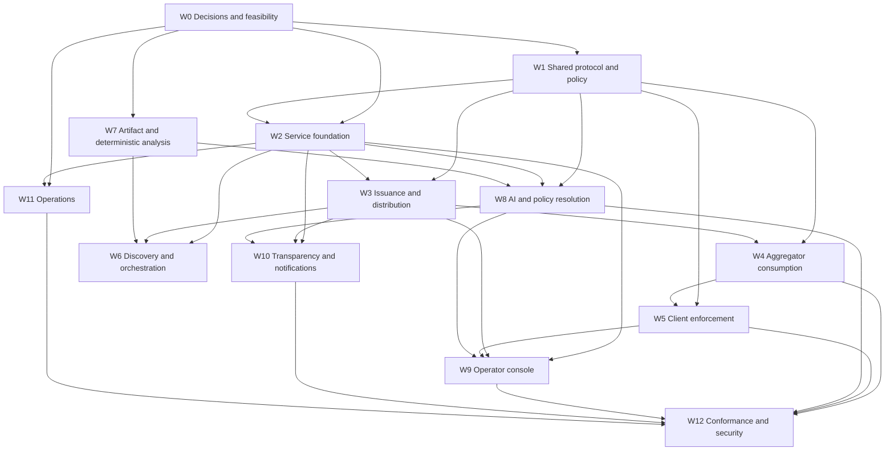

# Plugin Registry Labelling Service Implementation Plan

Companion: [Implementation spec](./spec.md)

Status: execution plan pending Gate 0 contract and platform decisions

This plan turns the plugin registry labelling-service spec into independently deliverable workstreams. It defines dependencies, integration gates, file ownership, merge boundaries, and completion criteria. It intentionally contains no time estimates.

## Outcomes

The implementation is complete when:

1. Every valid new registry release is independently observed and receives a CID-bound assessment state.
2. The EmDash labeler issues standard DRISL-signed labels through public `queryLabels` and replayable `subscribeLabels` endpoints.
3. A fresh aggregator verifies, ingests, hydrates, and enforces labels from configured labelers.
4. Official clients require an active positive assessment and consistently block pending, errored, yanked, taken-down, or high-risk releases.
5. Deterministic validation, capability analysis, code/metadata AI, image analysis, and publisher-history context run under one versioned policy.
6. AI can hard-block only critical security or impersonation findings; quality findings warn or downrank.
7. Reviewers can inspect evidence, rerun assessments, and override false positives; admins alone control emergency `!takedown` and publisher-wide compromise actions.
8. Public assessment summaries explain decisions without exposing private evidence or exploit details.
9. Publishers receive actionable notices and have a documented manual reconsideration route.
10. Signing-key rotation, full label replay, assessment outages, artifact failures, backups, and disaster recovery are exercised.
11. The hosted service and a fresh third-party aggregator pass the same public protocol conformance suite.

## Execution Rules

- The [spec](./spec.md) is the source of truth for policy and behavior. This plan may sequence work but must not weaken its invariants.
- Label vocabulary, subject/CID rules, and official-client effects are frozen before production labels are issued.
- Standard label serialization/signature logic and consumer policy logic have one shared implementation each. Do not duplicate them across the labeler, aggregator, registry client, core handlers, and admin.
- Every asynchronous producer/consumer is idempotent before it is connected to a real Queue, Workflow, Durable Object, or Jetstream source.
- A Jetstream event is discovery only. No public label, including `assessment-pending`, is signed before source-record verification.
- Model output is normalized evidence. It never calls signing primitives or selects arbitrary label values.
- Automated labels target an exact release URI + CID. Package and publisher labels remain manual in v1.
- No positive assessment requirement is enabled in production until first-party releases have been assessed and rollback is tested.
- Incomplete integration remains unreachable by default. Feature flags may expose staging paths, but production clients must not depend on half-built label state.
- Tests land with each workstream. Protocol, security, and failure tests are not deferred to the final gate.
- `.opencode/plans` is ephemeral coordination material. Retained runtime code and tests must never import it. A feasibility spike does not become a product test merely because it was useful; vectors and fixtures move into normal package/test directories only when they test an implemented EmDash component.
- The operator console uses Kumo and RTL-safe logical layout from its first UI change. Decision (2026-07-13): no Lingui/i18n in the console — it is internal infrastructure with a handful of operators, and the catalog/build machinery isn't worth carrying. Plain English strings; `packages/admin` localization rules are unaffected.
- Existing unrelated worktree changes are left untouched.
- Published-package changes receive changesets when their workstream lands.

## Dependency Model

### Workstream IDs

| ID    | Workstream                             | Primary output                                                                 |
| ----- | -------------------------------------- | ------------------------------------------------------------------------------ |
| `W0`  | Decisions and feasibility              | Ratified contracts and proved platform assumptions                             |
| `W1`  | Shared protocol and policy             | Lexicons, label crypto, policy schema, and moderation semantics                |
| `W2`  | Service foundation and persistence     | `apps/labeler`, D1 state, bindings, queues, and workflow skeleton              |
| `W3`  | Label issuance and distribution        | Typed signer, label history, query API, and replayable subscription            |
| `W4`  | Aggregator label consumption           | Verified subscription, current state, hydration, redaction, and cascades       |
| `W5`  | Client eligibility enforcement         | One moderation helper used by registry client, core, CLI, and admin            |
| `W6`  | Discovery and assessment orchestration | Independent Jetstream ingest, verified subjects, run lifecycle, reconciliation |
| `W7`  | Artifact and deterministic analysis    | Safe artifact acquisition, bundle checks, capability analysis                  |
| `W8`  | AI, image, and policy resolution       | Versioned model pipeline, normalized findings, automated decisions             |
| `W9`  | Operator authentication and console    | Access-protected review UI and manual label actions                            |
| `W10` | Transparency and notifications         | Public assessment API, policy document, email, reconsideration flow            |
| `W11` | Operations and self-hosting            | Deployment, secrets, observability, backups, rotation, runbooks                |
| `W12` | Conformance and security               | Cross-component, adversarial, browser, and production-launch verification      |

### High-Level Graph



### Critical Paths

Protocol and enforcement path:

```text
W0 contract decisions
-> W1 shared labels and policy
-> W2 service state foundation
-> W3 signed distribution
-> W4 aggregator consumption
-> W5 install/update enforcement
-> W12 conformance
```

Automated assessment path:

```text
W0 model/artifact/capability feasibility
-> W7 deterministic analysis
-> W8 AI and policy resolution
                         \
W2 service foundation -> W6 verified discovery/orchestration
                         /
                 -> W12 conformance
```

Operational launch path:

```text
W2 service foundation
-> W3 signer
-> W9 operator controls
-> W11 key/backup/incident operations
-> W12 production drill
```

`W4` can begin against signed fixtures before the hosted labeler is deployed. `W7` can build shared artifact primitives in parallel with `W2` after Gate 0. `W9` can build read-only assessment views after the state/API contracts freeze, but mutation UI waits for `W3` and `W5`.

## Integration Gates

### Gate 0: Contract and Platform Decisions

Required before production implementation is treated as stable:

- Experimental labeler NSIDs and public API shapes are ratified.
- Label vocabulary, subject/CID rules, blocking matrix, and override precedence are represented as executable policy fixtures.
- The `security:yanked` to `security-yanked` production preflight is complete.
- The labeler-declaration strategy is decided: minimal `app.bsky.labeler.service/self` or base label service plus EmDash policy document.
- Signing-key format, Secrets Store binding, generation ceremony, and recovery custody are selected.
- DRISL labels signed in workerd verify in an independent ATProto implementation, and vice versa.
- The aggregator mirror contract can supply artifact bytes and metadata required by the assessor.
- The deterministic capability-analysis rule set (declared-vs-actual access) and the exact critical block rule for code/capability findings are confirmed.
- `@cf/moonshotai/kimi-k2.7-code` and its structured-output path can process representative plugin code and image inputs through the Workers AI binding (`env.AI`).

Gate owner: `W0`.

### Gate 1: Shared Contract Foundation

- Labeler lexicons generate and round-trip through checked-in types.
- Shared policy fixtures produce identical outcomes in Node and workerd.
- DRISL sign/verify vectors pass in the shared package.
- Every current registry consumer recognizes `security-yanked` and the complete blocking vocabulary.
- No production label has been issued under the legacy colon value.

Gate owners: `W1`.

### Gate 2: Signed Label Distribution

- An authorized test action produces one signed label and one immutable audit action.
- `queryLabels` returns it with valid signature and pagination.
- `subscribeLabels` replays it from cursor `0`, resumes after disconnect, and streams a later negation.
- A fresh aggregator verifies the source DID/key, ingests history, and projects correct current state.
- Key rotation test vectors and replay behavior pass.

Gate owners: `W2`, `W3`, minimum `W4`.

### Gate 3: Consumer Eligibility Contract

- Aggregator request-header parsing and `atproto-content-labelers` behavior pass contract tests.
- Search, package, release, and latest-release endpoints expand publisher/package/release subjects correctly.
- One registry-client helper returns the same eligibility result for browser, server install, update, and CLI paths.
- Missing positive assessment, pending, error, blocking labels, package/publisher cascades, yanks, and takedowns cannot be installed through official paths.
- Manual override precedence works for an exact release CID and cannot override broader manual blocks.

Gate owners: `W4`, `W5`.

### Gate 4: Automated Assessment

- A verified release event creates one idempotent run and no label is signed before record verification.
- Verified mirror bytes are checksum-checked and safely extracted; declared-URL fallback passes SSRF/adversarial tests.
- Permanent validation failures become deterministic findings; transient failures retry and become `assessment-error` only after exhaustion.
- Capability-analysis, code/metadata, image, and publisher-history stages produce normalized findings.
- Policy emits blocking labels only for critical security/impersonation findings and warning labels for quality findings.
- A model outage never creates a malicious-content label.

Gate owners: `W6`, `W7`, `W8`.

### Gate 5: Operator and Transparency Readiness

- Reviewers/admins authenticate through verified Access JWTs and see only role-allowed actions.
- False-positive unblock atomically negates selected automated labels and issues `assessment-passed` plus `assessment-overridden`.
- Only admins can issue/retract `!takedown` and `publisher-compromised`.
- Public current/historical assessment APIs distinguish automated runs, pending runs, and manual actions.
- Notification outbox delivers block/warn/retraction notices without exposing private evidence.
- Arabic RTL, keyboard, localization, and confirmation-ceremony tests pass.

Gate owners: `W9`, `W10`.

### Gate 6: Production Launch

- Every first-party release has a current assessment under the production policy.
- Positive-assessment enforcement is enabled only after the assessed catalog and rollback path are verified.
- Full label replay into a clean aggregator reproduces current state.
- Signing-key rotation, compromised-key response, D1 restore, Jetstream cursor recovery, Queue/DLQ recovery, and notification recovery drills pass.
- External security review has no unresolved critical or high findings.
- Production smoke succeeds from release publication through assessment, label ingest, discovery, and clean-site install decision.
- No source/test imports `.opencode/plans`, every retained fixture tests an implemented EmDash component, and this planning folder is removed before the umbrella PR merges.

Gate owners: `W11`, `W12`, with all preceding gates complete.

## Workstream W0: Decisions and Feasibility

This workstream converts the remaining ratification points into executable decisions and platform proofs.

### `W0.1` Freeze public identifiers and API shapes

Decide:

- Experimental labeler query/procedure NSIDs.
- Whether a decision-notice repository record ships in v1.
- Stable path for `/.well-known/emdash-labeler-policy.json`.
- Public assessment ID format and current-assessment lookup parameters.
- Error codes and pagination/cursor shapes.

Output: approved lexicon examples and endpoint table used by `W1.2`.

Dependencies: none.

### `W0.2` Freeze label policy fixtures

Encode table-driven fixtures for:

- Eligibility labels and precedence.
- Blocking security labels.
- Warning/quality labels.
- Manual release/package/publisher labels.
- CID-bound versus URI-wide applicability.
- Manual override behavior.
- Negation and expiration.
- Accepted-labeler and `redact` policy.

Output: machine-readable fixture set with expected `eligible | pending | error | blocked` outcomes.

Dependencies: none.

### `W0.3` Complete the vocabulary cutover audit

Inspect and enumerate every current use of `security:yanked`, including:

- `apps/aggregator` migrations and SQL filters.
- Aggregator read endpoint descriptions/tests.
- `packages/registry-client` docs/types/tests.
- `packages/core/src/api/handlers/registry.ts` install/update checks.
- Admin rendering/tests.
- Seed/deployment data, if any.

Define the preflight query for persisted legacy labels and the temporary dual-read procedure only if production data exists.

Output: exact patch list and migration decision for `W1.1`.

Dependencies: none.

### `W0.4` Prove label crypto interoperability

Build a focused workerd prototype using `@atcute/cbor` and `@atcute/crypto`:

- Construct only allowed v1 fields.
- DRISL encode, hash, and sign with selected curve/key format.
- Verify through an independent implementation or reference vectors.
- Verify an independently signed label in the prototype.
- Reject extra fields, wrong keys, malformed bytes, and invalid signatures.
- Define the minimal routine-rotation and compromise procedure: issuance pause boundary, DID update ordering, old-key identification, historical re-signing, and subscriber recovery.

Output: selected crypto API and key-lifecycle contract consumed by `W3.7` and documented by `W11.4`. W1.4 adds vectors only alongside the implemented signer/verifier.

Dependencies: signing-key format draft.

### `W0.5` Decide identity and declaration hosting

Decision: v1 uses the base `#atproto_labeler` service plus the EmDash policy document without an `app.bsky.labeler.service/self` declaration. The declaration is application-specific and its report-scope metadata would misrepresent a service that rejects standard moderation reports. Clients obtain localized label definitions from the versioned policy document.

The labeler deployment owns the static DID document and policy endpoint. W3.1 publishes the DID fixture with `#atproto_label` and `#atproto_labeler`; the ratified moderation-policy fixture is the policy source of truth.

Output: DID document fixture, declaration/policy fixture, and deployment ownership.

Dependencies: `W0.1` draft vocabulary.

### `W0.6` Prove artifact mirror consumption

Against the current/planned aggregator mirror:

- Resolve release coordinates to mirror URL/object metadata.
- Fetch the exact bundle without privileged database coupling.
- Verify release record, CID, artifact ID, and checksum.
- Distinguish mirror miss, transient failure, and permanent mismatch.
- Confirm declared-URL fallback inputs.

Output: artifact acquisition contract consumed by `W7`.

Dependencies: none.

Decision (2026-07-16): v1 acquisition is DECLARED-URL-FIRST — the aggregator mirror is unbuilt (`records-consumer.ts` TODO; `mirrored_artifacts` never populated), and the release record's checksum/CID pin makes a declared-URL fetch exactly as verifiable as a mirror fetch, so the mirror is an availability/resilience layer, not an integrity requirement. The labeler fetches from the publisher's declared artifact URL under the ratified SSRF controls (HTTPS, DNS/redirect hardening, byte/time budgets, no ambient credentials) with checksum/CID verification; dead or changed URLs classify as the existing transient/permanent acquisition failures. W7.2's acquisition module is written mirror-ready with a source-preference switch: the future mirror interface is a deterministic R2 object key derived from release coordinates, resolved through the aggregator service binding (same read-path pattern ratified for W8.4 slice 3), and mirror-first ordering activates when the aggregator mirror lands on its own timetable (delegated release-service branch) without changing the labeler contract. W7 is no longer gated on aggregator mirror work.

### `W0.7` Confirm AI model and capability analysis

Evaluate representative fixtures through:

- Confirm `@cf/moonshotai/kimi-k2.7-code` via the Workers AI binding (`env.AI`) handles full-bundle code analysis and image analysis with strict structured output. `@cf/zai-org/glm-5.2` (text-only, same binding) is an available alternative; v1 ships single-model.
- Confirm the release artifact size cap fits within the model's context window; otherwise define the coverage-degradation fallback (`partial`/`unavailable` rather than silent truncation).
- Define the deterministic capability-analysis rule set: API-surface extraction (network/fetch, storage, `eval`/`Function`, filesystem, crypto, env/process, DOM) versus declared access.
- Record model input/output limits, supported file/image types, and prompt version.

Output: confirmed model + capability-analysis baseline.

Dependencies: policy fixtures from `W0.2`.

### W0 Completion

Gate 0 passes. Failed crypto, identity, mirror, or model assumptions change the spec before downstream production work continues.

## Workstream W1: Shared Protocol and Policy

Create or extend shared packages so the labeler and every consumer use the same contracts.

### `W1.1` Apply the label vocabulary cutover

Update all current references from `security:yanked` to `security-yanked` and centralize the complete vocabulary.

Files include:

- `apps/aggregator/migrations/0001_init.sql`
- `apps/aggregator/src/routes/xrpc/searchPackages.ts`
- `packages/registry-client/src/discovery/index.ts`
- `packages/core/src/api/handlers/registry.ts`
- Registry admin components and tests.

If `W0.3` finds persisted legacy values, add the bounded compatibility read and explicit removal condition. Do not emit new colon-valued labels.

Dependencies: `W0.2`, `W0.3`.

### `W1.2` Add labeler lexicons

Under `packages/registry-lexicons/lexicons/com/emdashcms/experimental/labeler/`, define:

- Assessment/public finding definitions.
- `getAssessment`.
- `getCurrentAssessment`.
- `listAssessments`.
- `getPolicy`.
- Optional decision-notice record if ratified.

Use standard `com.atproto.label.*` lexicons for label distribution rather than redefining labels.

Dependencies: `W0.1`.

### `W1.3` Generate and export typed contracts

- Regenerate atcute types.
- Export values and types from `packages/registry-lexicons/src/index.ts`.
- Extend `NSID`, `QUERY_NSIDS`, and procedure/record constants as appropriate.
- Add valid/invalid/current/manual-override/superseded fixtures.
- Add a changeset for the published lexicon package.

Dependencies: `W1.2`.

### `W1.4` Create shared label crypto primitives

Create `packages/registry-moderation` (or a ratified equivalent) with Workers/Node-compatible exports:

- Strict `LabelV1` construction.
- `signLabel` and `verifyLabel`.
- Public-key extraction for `#atproto_label`.
- Signature and key-rotation error codes.
- External test vectors from `W0.4`.

No generic `signObject` API is exported.

Dependencies: `W0.4`.

### `W1.5` Implement policy and subject applicability

In the shared moderation package:

- Export label vocabulary and definitions.
- Parse versioned policy fixtures.
- Classify labels as eligibility, automated blocking, warning, or manual system labels.
- Evaluate source DID, negation, expiration, CID binding, and subject scope.
- Expand publisher/package/release subject sets from typed inputs.
- Enforce manual override precedence without bypassing broader manual blocks.
- Export the single pure `evaluateReleaseModeration` function and `ReleaseModeration` result type used by every consumer.
- Drive evaluator behavior from the `W0.2` fixture corpus.

Dependencies: `W0.2`.

### `W1.6` Implement accepted-labeler header parsing

Add a shared RFC-8941-compatible parser/serializer for:

- `atproto-accept-labelers`.
- `atproto-content-labelers`.
- DID deduplication.
- Boolean `redact` merge behavior.
- Missing versus empty distinction.
- Invalid syntax errors.

Dependencies: none after Gate 0.

### `W1.7` Publish policy schema and fixtures

Define the machine-readable policy document schema, versioning rules, localized label definitions, official-client effects, contact fields, and assessment schema version.

Fixtures cover:

- Current production policy.
- Unknown future labels.
- Invalid block mappings.
- AI critical quality normalization to warning.
- Manual action restrictions.

Dependencies: `W1.3`, `W1.5`.

### W1 Completion

Gate 1 passes. The signer, aggregator, registry client, core handlers, CLI, and admin can consume one typed policy and fixture corpus.

## Workstream W2: Service Foundation and Persistence

### `W2.1` Scaffold `apps/labeler`

Follow `apps/aggregator` deployment conventions:

- Cloudflare Vite plugin.
- Wrangler config and generated Worker types.
- D1 migrations.
- Queues and DLQs.
- Workflows binding.
- Durable Object migrations.
- R2 evidence binding.
- Workers AI binding (`AI`), no AI Gateway.
- Static assets for the later console.
- Real workerd/D1 Vitest configuration.

Add root/CI scripts so `apps/labeler` build, typecheck, tests, and migrations are not skipped by package-only filters.

Dependencies: Gate 0, `W1.3` package shape.

### `W2.2` Implement D1 migrations

Create tables from the spec for:

- `subjects`.
- `assessments` and `current_assessments`.
- `findings` and `evidence_objects`.
- `issued_labels` and `label_sequence`.
- `actions` and `notifications`.
- `ingest_state`.
- Assessment stage attempts and dead-letter metadata where needed.

Add constraints/indexes for run-key uniqueness, subject lookup, current assessment, label sequence, and outbox delivery.

Dependencies: `W1.5`, schema ratification.

### `W2.3` Implement typed repositories

Create narrow repositories for:

- Subject observation/deletion.
- Assessment run creation and state transition.
- Current-assessment projection.
- Findings/evidence metadata.
- Action audit.
- Notification outbox.
- Ingest cursors.

Repositories expose transaction-scoped operations needed by finalization. Do not spread raw SQL across handlers and workflow steps.

Dependencies: `W2.2`.

### `W2.4` Implement assessment lifecycle state machine

Define legal transitions for:

```text
observed -> verifying -> pending -> running -> passed | warned | blocked | error
                                   -> stale | cancelled
```

Include:

- Deterministic `runKey` and stable trigger IDs.
- Redelivery idempotency.
- Workflow lease/ownership.
- Immutable operator-trigger/action reference shape used by rerun backends and later UI.
- Typed assessment-stage adapter interfaces and policy-proposal/finalization boundary, with deterministic stub implementations for orchestration tests.
- Supersession links.
- Preserve immutable completed row state; derive public `superseded` when a newer completed current assessment links to it and replaces the current pointer.
- Current pointer update only on successful completed finalization.
- Pending/error labels represented as effects, not database state shortcuts.

Dependencies: `W2.3`.

### `W2.5` Implement evidence storage boundary

- Hash every evidence object.
- Store large private evidence in R2 and references in D1.
- Separate public summaries from private detail at the type boundary.
- Support lifecycle metadata without deciding an organization retention policy.
- Prevent public serializers from accepting private evidence types.

Dependencies: `W2.3`.

### `W2.6` Add health and internal diagnostics

Provide unauthenticated liveness and protected readiness/detail endpoints covering D1, Queue, Workflow, DO, AI, R2, signing configuration, and policy version without exposing secrets.

Dependencies: `W2.1`, `W2.3`.

### W2 Completion

The service can persist and recover every lifecycle state without model or label-distribution code. All migrations and repositories pass real workerd/D1 tests.

## Workstream W3: Label Issuance and Distribution

### `W3.1` Provision service identity and key material

Staging and production both use real custom domains on the emdashcms.com zone from the start; no workers.dev DID identity. Production key generation is a maintainer action performed later: the maintainer generates the scalar and keeps the offline copy in Keeper. Code work uses a disposable staging key until then and must not block on the production ceremony.

- Add the minimal staging custom-domain, D1, Secrets Store, and static DID/policy bindings required to exercise the signer. Full production environment hardening remains in `W11.1`.
- Deploy staging `did:web` document.
- Publish `#atproto_label` and `#atproto_labeler` entries.
- Configure Secrets Store binding for the private key.
- Publish the selected declaration/policy discovery path.
- Add startup validation that public/private key IDs agree.

Dependencies: `W0.5`, `W2.1` app scaffold.

### `W3.2` Implement typed issuance proposals

Define separate proposal types for:

- Automated assessment labels.
- Reviewer release actions, including `security-yanked`.
- Reviewer package actions limited to `package-disputed`.
- Admin release/package/publisher/system actions, including `!takedown` and `publisher-compromised`.
- Negations.

The issuer validates vocabulary, actor role, subject type, CID rules, finding category/severity, reason, action ID, and idempotency key before signing.

Dependencies: `W1.4`, `W1.5`, `W2.3`.

### `W3.3` Implement atomic sequence and issuance

In one D1 transaction:

- Allocate the next sequence without `MAX(seq)`.
- Store immutable action/assessment linkage.
- Store the signed label.
- Update any effective local projection.
- Commit outbox/broadcast work.

Concurrent issuance tests prove monotonic unique sequence and idempotent retries.

Dependencies: `W3.2`.

### `W3.4` Implement `queryLabels`

Support:

- URI patterns.
- Sources.
- Limit and cursor.
- Full signatures.
- Negation/history semantics.
- Stable ordering and pagination.
- Public rate limits.

Dependencies: `W3.3`, standard lexicon types.

### `W3.5` Implement Subscriber Durable Object

One named DO:

- Accepts inbound WebSockets with Hibernation API.
- Replays D1 rows after cursor.
- Joins live broadcast only after replay boundary is safe.
- Handles cursor `0` full history.
- Isolates slow/broken subscribers.
- Recovers entirely from D1 after eviction/restart.

Dependencies: `W3.3`.

### `W3.6` Implement `subscribeLabels`

Wire the standard XRPC subscription endpoint to the Subscriber DO and cover framing, info/error messages, cursor validation, disconnect/reconnect, replay/live race, and backpressure.

Dependencies: `W3.5`.

### `W3.7` Implement routine key rotation

- Pause issuance.
- Publish new DID key.
- Resume with new key ID.
- Lazily re-sign queried historical labels without changing `cts`.
- Expose rotation status and alerts.

Dependencies: `W0.4` key-lifecycle contract, `W3.4`.

### `W3.8` Reject unsupported standard reports

Implement `com.atproto.moderation.createReport` as an explicit `NotSupported` XRPC response while v1 report intake is deferred. The handler never writes a report row or enqueues work. Add a conformance test and keep the identity/declaration metadata consistent with this behavior.

Dependencies: `W0.5`, XRPC router from `W3.4`.

### W3 Completion

The labeler passes Gate 2's signer/query/subscription checks independently of automated assessment.

## Workstream W4: Aggregator Label Consumption

### `W4.1` Implement labeler configuration and DID resolution

Use the existing `labelers` table for bounded trusted/discoverable sources. Resolve endpoint/key, cache with expiry, refresh periodically, and retry once on signature failure.

Dependencies: `W1.4`, `W3.1` fixtures.

### `W4.2` Implement outbound subscription Durable Object

One DO per configured labeler:

- Connect to `subscribeLabels`.
- Resume from `ingest_state` cursor.
- Verify signatures before Queue acceptance.
- Refresh DID key on first verification failure.
- Persist cursor only after durable acceptance.
- Reconnect with jittered backoff.
- Support cursor `0` rebuild.

Dependencies: `W4.1`, `W3.6` or protocol fixtures.

### `W4.3` Implement Labels Queue consumer

Before the first ingest write, add the forward aggregator migration from the `W0.3` audit: replace the `labels` history identity `(src, uri, val, cts)` with a collision-safe event identity (signed-label digest plus unique verified `(src, source_sequence, frame_index)` coordinates), with deterministic duplicate, multi-label-frame, and same-`cts` conflict handling.

In a D1 transaction:

- Insert append-only label history.
- Upsert `label_state` only for newer `cts`.
- Preserve negation, expiry, CID, trusted source, signature, and received metadata.
- Ignore duplicate and out-of-order state changes correctly.

Dependencies: `W4.2`.

### `W4.4` Parse request labeler policy

At the aggregator request boundary:

- Parse `atproto-accept-labelers` once using `W1.6`.
- Apply deployment defaults only when absent.
- Treat empty as no labelers.
- Reject malformed syntax.
- Resolve unavailable sources.
- Pass typed policy to all handlers.
- Set and CORS-expose `atproto-content-labelers`.

Dependencies: `W1.6`.

### `W4.5` Implement batched subject expansion and hydration

Refactor `apps/aggregator/src/routes/xrpc/views.ts` and handlers to batch labels for:

- Publisher DID.
- Package profile URI/current CID.
- Release URI/current CID.

Apply accepted source, negation, expiry, URI-wide, and CID-bound rules. Avoid mapper-level N+1 queries.

Dependencies: `W1.5`, `W4.3`, `W4.4`.

### `W4.6` Implement endpoint filtering/redaction

Update:

- `searchPackages`.
- `getPackage`.
- `resolvePackage`.
- `listReleases`.
- `getLatestRelease`.

Requirements:

- `redact` handles `!takedown`/`!suspend`.
- Direct reads return explainable tombstone/moderation state.
- Latest release is selected dynamically from eligible releases, not blindly from `packages.latest_version`.
- Package/publisher labels cascade at policy evaluation, not by copying labels.

Dependencies: `W1.5` shared evaluator, `W4.5`.

### `W4.7` Add replay and reconciliation

- Rebuild one labeler from cursor `0` into an empty projection.
- Compare local sequence/high-water state with subscription progress.
- Re-resolve signing keys on cron.
- Emit component metrics/events for lag and verification failure; `W11.3` turns them into deployment dashboards and alerts.

Dependencies: `W4.3`.

### W4 Completion

The aggregator consumes any conforming configured labeler and produces deterministic hydrated/filtering behavior from the shared policy.

## Workstream W5: Client Eligibility Enforcement

### `W5.1` Integrate the shared moderation evaluator

Re-export or wrap `W1.5` from `packages/registry-client` without reimplementing policy. The shared evaluator accepts:

- Accepted labeler policy.
- Publisher labels.
- Package labels and current package CID.
- Release labels and current release CID.
- Optional public assessment reference.

Return:

```ts
interface ReleaseModeration {
	eligibility: "eligible" | "pending" | "error" | "blocked";
	reasonCodes: string[];
	blockingLabels: string[];
	stateLabels: string[];
	warningLabels: string[];
	suppressedLabels: string[];
	applicableLabels: ModerationLabel[];
	redacted: boolean;
}
```

Run the `W0.2` fixture corpus against the shared package and the registry-client export to prove they are identical.

Dependencies: `W1.5`.

### `W5.2` Extend discovery-client response handling

- Interpret `atproto-content-labelers`.
- Preserve source/CID/expiry needed by the evaluator.
- Fetch `getCurrentAssessment` on demand.
- Allow per-request accepted-labeler overrides if needed.
- Keep signature verification available through a full-label fetch path.

Dependencies: `W1.3`, `W4.4`, `W5.1`.

### `W5.3` Enforce in core install and update handlers

Replace direct `security:yanked` comparisons in `packages/core/src/api/handlers/registry.ts` with `W5.1` immediately before artifact download.

Both install and update must reject:

- Missing positive assessment.
- Pending/error.
- Automated blocking labels.
- `security-yanked`.
- `!takedown`/redacted state.
- Package/publisher blocking cascades.

Warning-only releases require explicit consent data already validated by the server.

Dependencies: `W4.6`, `W5.1`.

### `W5.4` Surface eligibility in existing CLI discovery paths

Use the same evaluator for the current CLI registry search/info surfaces. Do not invent install/update commands in this workstream. If CLI install/update is added later, it must consume the same evaluator; pinned installs may override warnings only, never missing assessment or blocking/manual system labels under official policy.

Dependencies: `W5.1`, existing CLI registry discovery path.

### `W5.5` Update admin registry UI

Update registry browse/detail/install surfaces to show:

- Eligibility state.
- Localized label definitions.
- Issuing labeler.
- Public summary/coverage.
- Automated versus manual override.
- Warning confirmation.
- Block/reconsideration details.

Include accepted-labeler config in every React Query key.

Dependencies: `W5.2`, `W10.2` public API contract; static fixtures may unblock UI earlier.

### `W5.6` Add installed-release alerts

When an installed release becomes `security-yanked`, taken down, or newly blocked, surface it in the admin and prevent updating to another ineligible version. Define periodic/on-admin-load refresh without adding unsafe background assumptions.

Dependencies: `W5.1`, existing plugin-state storage.

### W5 Completion

Gate 3 passes. No official install/update path contains its own label-string policy.

## Workstream W6: Discovery and Assessment Orchestration

### `W6.1` Reuse/extract Jetstream client primitives

Share or adapt the tested patterns from:

- `apps/aggregator/src/jetstream-client.ts`.
- `apps/aggregator/src/jetstream-ingestor.ts`.
- `apps/aggregator/src/records-do.ts`.

Preserve close semantics, structural validation, cursor-after-acceptance, jittered reconnect, and test injection.

Dependencies: `W2.1`.

### `W6.2` Implement Discovery Durable Object

- Subscribe to stable and experimental release collections.
- Create deterministic verification job keys.
- Enqueue before persisting cursor.
- Handle create/update/delete.
- Expose health/cursor state.
- Never issue labels directly.

Dependencies: `W6.1`, `W2.3`.

### `W6.3` Verify source records

For each job:

- Fetch exact URI/CID through aggregator `sync.getRecord` cache or publisher PDS fallback.
- Verify MST proof/signature and collection/rkey.
- Reject mismatch/forgery/deletion.
- Persist subject only after verification.
- Issue `assessment-pending` only after verification through `W3`.

Dependencies: `W3.3`, existing aggregator/PDS verification helpers, `W2.4`.

### `W6.4` Implement Workflow stage orchestration

Workflow stages:

1. Verify subject.
2. Acquire artifact inputs.
3. Deterministic bundle validation.
4. Capability analysis.
5. Code/metadata AI.
6. Image AI where applicable.
7. Policy resolution.
8. Atomic finalization/label issuance.
9. Notification outbox enqueue.

Each stage stores bounded serializable output and has explicit retry/permanent-failure classification.

Decision (2026-07-16, resolves the #1978 queue-vs-Workflow question): production wiring executes each assessment run as a Cloudflare WORKFLOW instance whose id derives from the subject (URI+CID) — a thin shell over the tested `AssessmentOrchestrator`: steps call the same stage adapters and atomic finalization, gaining per-stage durable resume, and the instance-per-subject serialization IS the §14.1 per-subject lock, closing both races #1978 deferred by construction. The queue consumer's role narrows to verified discovery + Workflow dispatch. The shell stays thin enough that workerd integration tests plus the existing orchestrator suite carry coverage (Workflows' local-test story is the accepted weak point).

Dependencies: `W2.4` stage interfaces, `W6.3`. `W7` and `W8` later supply production adapters without changing orchestration.

### `W6.5` Implement supersession and current projection

- Serialize finalization per URI + CID.
- Under the same subject lock used for finalization, re-read deletion and current-CID state immediately before label issuance.
- If the subject was deleted or its CID changed, retain the completed evidence as stale/forensic-only, issue no new positive/current labels, and do not move the current pointer.
- Keep exactly one completed automated current assessment.
- Leave current pointer unchanged while a newer run is pending.
- Let pending/error labels affect eligibility as specified.
- Never let stale/cancelled runs become current.
- Preserve active manual overrides across automated runs.
- Set `supersedes_assessment_id` on a successful replacement; public serializers derive the old run's `superseded` state from that link/current pointer without mutating its original completed result.

Dependencies: `W2.4` policy-proposal contract, `W3.3`.

### `W6.6` Implement initial and operator rerun triggers

- `initial:<cid>` trigger.
- Immutable operator action ID trigger.
- Deterministic run key including policy/model/prompt.

Dependencies: `W2.4` operator-trigger contract.

### `W6.7` Implement model/policy-revision rerun triggers

- Accept a new model ID or policy version as an immutable trigger ID.
- Select only releases whose current assessment used an older model/policy version.
- Reuse the same deterministic run creation path as initial/operator triggers.
- Deduplicate repeated revision notifications.

Dependencies: `W6.6`.

### `W6.8` Implement reconciliation

Scheduled reconciliation finds:

- Aggregator releases absent from subjects.
- Verified subjects without assessment state.
- Stuck pending/running runs.
- Completed current assessments with inconsistent effective labels.
- Deleted subjects with queued/running work.

Dependencies: `W6.5`, aggregator read API.

### W6 Completion

Every verified event creates the correct idempotent lifecycle, and replay/reconciliation repair missed work without duplicate public decisions.

## Workstream W7: Artifact and Deterministic Analysis

Coordinate this work with the delegated release service plan's proposed `packages/registry-verification`; do not create competing fetch/bundle implementations.

### `W7.1` Establish shared verification ownership

Decision (2026-07-11): the delegated release service work owns `packages/registry-verification`, already built on its integration branch (checksum, safe fetch, canonical bundle validation, Sigstore provenance, workerd tests) and covering the required shared surface. `W7.2`/`W7.3` extend that package after it reaches main with the labeler's additions: mirror-first acquisition, the SSRF-hardened declared-URL fallback, and mirror-miss/transient/permanent-mismatch classification. If sequencing inverts and W7 starts first, graduate the package from that branch to main in a standalone PR; do not cherry-pick across integration branches or build a competing implementation. Ratified (2026-07-16, sequencing has inverted): the graduation unit is a coordinated THREE-package promotion — registry-verification hard-depends on the delegated branch's additive, main-absent slices of `@emdash-cms/plugin-types` (manifest-schema, declared-access) and `@emdash-cms/registry-lexicons` (profileExtension) — lifted verbatim in one main PR with minor changesets for the two published packages; content-identical code reconciles into the delegated branch on its next main sync.

Dependencies: `W0.6`, `packages/registry-verification` on main.

### `W7.2` Implement verified artifact acquisition

- Prefer validated aggregator mirrors.
- Verify release URI/CID/artifact ID/checksum.
- Fall back to declared URL with HTTPS, DNS/redirect SSRF controls, byte/time budgets, and no ambient credentials.
- Distinguish mirror miss, transient fetch failure, permanent checksum mismatch, and policy rejection.

Dependencies: `W7.1`.

### `W7.3` Implement canonical bundle validation

Reject:

- Compressed/decompressed/per-file/file-count excess.
- Traversal and duplicate normalized paths.
- Symlinks, devices, and special files.
- Malformed gzip/tar.
- Missing/duplicate manifest or entrypoint.
- Unknown access categories/operations.
- Manifest/release declared-access mismatch.

Produce validated file inventory and safe full-bundle/image inputs for later stages.

Dependencies: `W7.1`.

### `W7.4` Implement deterministic security checks

Adapters/findings for:

- Declared-vs-actual capability analysis (feeding `undeclared-access`).
- Forbidden archive entries and executable payload classes.
- Unambiguous forbidden runtime patterns (local rules, not a signature feed).
- Metadata/identity/URL consistency.
- Image dimensions/types.

Map permanent conditions to `artifact-integrity-failure`, `invalid-bundle`, `undeclared-access`, or other ratified deterministic findings. Never map transport errors to malicious findings.

Dependencies: `W0.2`, `W7.3`.

### `W7.5` Implement full-bundle capability extraction

- Statically extract the bundle's real API/capability surface (network/fetch, storage, `eval`/`Function`, filesystem, crypto, env/process, DOM).
- Diff the extracted surface against the signed release's declared access for the `W7.4` declared-vs-actual check.
- Produce the normalized capability evidence consumed by the `W8.2` AI adapter.

No dependency, SBOM, or advisory content is produced by this task.

Dependencies: `W7.3`.

### `W7.6` Port and expand deterministic fixtures

Reuse legacy marketplace fixtures and add archive, SSRF, capability declaration mismatch, checksum, and identity cases. Tests run without any live external service.

Dependencies: `W7.2` through `W7.5`.

### W7 Completion

The service can produce complete deterministic and capability findings and safely prepare the full bundle as AI input without calling a model.

## Workstream W8: AI, Image, and Policy Resolution

### `W8.1` Define normalized finding contracts

Implement strict schemas for deterministic, model, image, and history findings with:

- Allowed category.
- Severity.
- Confidence where applicable.
- Public summary.
- Private detail.
- Evidence references.
- Affected files/images.
- Source/version metadata.

Unknown categories and unresolved evidence references fail validation.

Dependencies: `W1.5`, `W2.5`.

### `W8.2` Implement code/metadata AI adapter

- Invoke `@cf/moonshotai/kimi-k2.7-code` through the Workers AI binding (`env.AI`), not AI Gateway.
- Never cache moderation inference.
- Attach assessment/policy/model metadata without secrets.
- Delimit all plugin-controlled text as untrusted input.
- Use strict structured output.
- Analyze the full bundle (size-capped, fits the model context; degrade coverage rather than truncate if a bundle ever exceeds context).
- Store model/prompt hashes and an internal per-call inference request ID.
- Treat model/parse/transport failures as retryable operational failures.

Dependencies: `W0.7`, `W7.3`, `W8.1`.

### `W8.3` Implement image AI adapter

- Invoke the same `@cf/moonshotai/kimi-k2.7-code` model (vision) through the Workers AI binding (`env.AI`).
- Preserve true MIME/hash/dimensions/source path.
- Analyze supported icons/screenshots for impersonation, phishing UI, misleading content, and policy imagery.
- Bound image count/size and model concurrency.
- Keep image quality findings non-blocking unless they establish critical impersonation/credential harvesting.

Dependencies: `W0.7`, `W7.3`, `W8.1`.

### `W8.4` Implement publisher-history context

Provide bounded factual context:

- Prior releases from the DID.
- Recent handle/profile changes.
- Existing active manual labels.
- Repeated exact artifact checksums or policy findings.
- Verification state as display context only.

History may recommend operator review but cannot automatically produce package/publisher labels.

Dependencies: `W2.3`, registry publisher/profile data.

Decisions (2026-07-14): history is not a new contract surface — `FindingSource` already includes `"history"` and the resolver already drops it (`policy-resolver.ts` excludes `source: "history"` before any category→label mapping; `isBlockingFinding` returns false for it), so "never auto-label" is structural, not a new guard. "Recommend review" is passive: a history finding surfaces through the existing assessment-detail projection an operator already opens; no `operational_events` push and no new "flag-for-review" operator action (D3). Two of the five inputs — recent handle/profile changes and verification state — live only in the aggregator's D1, which the labeler has no binding to reach (and `constants.ts` deliberately avoids ingesting profiles); they are deferred to a later slice gated on a ratified read-only labeler→aggregator read path (service-binding preferred over a second D1 binding), not built now (D1). Ratified (2026-07-16): slice 3 uses a read-only SERVICE BINDING to the aggregator — the aggregator exposes the publisher/profile/verification reads as an internal API and the labeler binds to it; no second D1 binding (coupling to the aggregator's physical schema was rejected). Repeated-checksum detection is global (cross-publisher): a checksum reused under a different DID is the sharper signal, needing a new `idx_assessments_artifact_checksum` and a cross-DID lookup (D2). Prior releases, active manual labels (reuse `getActiveLabelState`, filter `!automated && active`), and repeated checksums/findings come from the labeler's own D1. The finding contract is amended (touches W8.1): `source: "history"` findings cite a dedicated history/review category set exempt from the automated-block ∪ warning constraint that `validateFinding` enforces, rather than borrowing a warn category (D4). Neutral display facts (prior-release count, verification badge) are assembled at console read-time in the existing subject-history endpoint, not persisted as a pipeline `ContextBundle` (D5). The stage is DB-bound (`analyzeHistory(db, assessment, opts) → NormalizedFinding[]`), wired into `OrchestratorStages`/`STAGE_ORDER`/`stubStages` and run last. Because history is operator-only context that never becomes a label, the stage is best-effort — on any error it logs and returns no findings rather than throwing, so it can never fail the run and discard the decision-relevant findings from the other stages (adversary-flagged 2026-07-14). History findings keep sensitive specifics (cross-publisher checksum reuse, active manual-label identities/existence including redactions) in `privateDetail` only, never in the public-facing `title`/`publicSummary`; slice (2)'s surfacing must additionally render history findings in the operator projection only and exclude them from any public serializer. Sliced: (1) own-D1 history findings + the W8.1 amendment + the checksum index — unblocked; (2) console neutral-context surfacing — unblocked, optional; (3) the two aggregator-sourced inputs — blocked on D1's read path.

### `W8.5` Implement versioned policy resolver

Resolve normalized findings under an immutable policy version:

- Permanent deterministic critical findings -> blocking descriptive labels.
- AI critical security/impersonation -> blocking descriptive labels.
- Quality findings of any severity -> warning/downranking labels.
- No blocking findings -> `assessment-passed`.
- Transient exhaustion -> `assessment-error`.
- Negate stale automated labels, but never action-backed manual labels.

Return a typed proposal accepted by `W3.2`, not a signed label.

Dependencies: `W1.7`, `W8.1` through `W8.4`.

Decisions (2026-07-15, from the first calibration run): the "AI critical" blocking rule is amended — a model/image finding on ANY automated-block category blocks at `high` or `critical` severity, not `critical` only, and a block-category finding below `high` is never dropped: it degrades to a warning label, so any malicious-code finding always produces a visible label (the ratified principle: flag ALL suspected-malicious code; blocking is reserved for high-confidence findings). The first calibration sweep showed two independent models rating a genuine data-exfiltration sample `high`, which the critical-only gate reduced to no label at all (the finding was neither blocked nor warned — dropped entirely); prompt guidance to rate real threats `critical` is added as well, but the resolver gate is the defense because the resolver was built to distrust model severity calibration. Warning-category behavior is unchanged. The issuer's `validateAutomatedProposal` is aligned to accept `high` for automated-block values; because proposals carry no `source`, it gates uniformly at ≥`high`, so a deterministic sub-`high` block proposal — which the resolver would block — would be rejected there. Latent today (`finalize` bypasses the validator and deterministic block findings are high/critical in practice); when the issuer-hardening routes issuance through the validator, plumb `source` through the proposal to close the gap. The moderation-policy vocabulary gains three image-content automated-block categories — `hateful-imagery`, `explicit-imagery`, and `graphic-violence` (three-way split ratified over the legacy two-axis offensive/nsfw grouping) — each release-subject, cid-required, `automated`+`reviewer` issuance, with `en` locales and a `policyVersion` bump; the change is additive and safe for `queryLabels` consumers, and the image adapter's severity-guidance sentence (which steered models away from rating content-policy violations critical) is rewritten to name them as block-worthy. CSAM and other unlawful content stays OUT of the label vocabulary: no automated classification (unreliable and legally fraught); suspected cases route through operator escalation to `!takedown`, and an out-of-band legal reporting process (NCMEC-style) is a separate pre-launch work item owned by the maintainer.

### `W8.6` Build calibration harness

- Port legacy code/image audit fixtures.
- Add false-positive-sensitive legitimate security/network plugins.
- Record model outputs outside normal deterministic CI.
- Compare policy outcomes between model/prompt versions.
- Require explicit review of newly blocked/newly allowed fixtures.
- Produce a calibration report artifact for policy/model changes.

Dependencies: `W8.2`, `W8.3`, `W8.5`.

Decisions (2026-07-15): the harness is runnable locally now — not gated on staging infra. It drives the REAL adapters (`analyzeCode`/`analyzeImages` with their production prompts, response schemas, and the live policy) via a `RestAiBinding` satisfying the adapters' `AiBinding` interface against the Workers AI REST endpoint, authenticated with `wrangler auth token`; the model+prompt+schema combination is the unit under evaluation, never a hand-rolled eval prompt. Model matrix (all verified enabled on the account): code lane `@cf/moonshotai/kimi-k2.7-code` (current default) vs `@cf/moonshotai/kimi-k2.6` vs `@cf/zai-org/glm-5.2` (text-only — excluded from the image lane); image lane kimi-k2.7-code vs kimi-k2.6 vs `@cf/meta/llama-3.2-11b-vision-instruct`, with `@cf/moondream/moondream3.1-9B-A2B` as an experimental caption-only lens (Image-to-Text input shape — cannot flow through the real adapter, results not comparable). The legacy corpus is `packages/marketplace/tests/fixtures/audit/` (13 fixtures), ported into `apps/labeler/calibration/`; its expected.json files were baselined on retired models and are treated as priors for human review, not ground truth. Runs execute via a `calibrate` script outside the `test` CI gate; recorded run artifacts are gitignored review material, and the diff report (fixture × model outcome matrix, newly-blocked/newly-allowed sections, per-model agreement) is the calibration report artifact. Reasoning models spend output budget on `reasoning_content` before `content` (observed live on kimi-k2.6), so runs record finish_reason and token usage to make truncation diagnosable.

Outcomes ratified from the first run (2026-07-15): the code-lane default model switches from `kimi-k2.7-code` (weakest measured: two under-blocked threats, 2× glm's latency) to `@cf/zai-org/glm-5.2`, to be re-validated by a follow-up sweep after the W8.5 severity amendment lands; `kimi-k2.6` is excluded from serving (72s mean latency, timeout, invalid structured output on 3 of 16 calls) but retained in the matrix as a detection-quality reference. The production adapters' `parseModelOutput` gains support for the OpenAI-compatible `{choices[].message.content}` envelope the live models actually return (as written it could parse none of them — the run's headline finding), folded into the harness PR; once production parses both envelopes the harness's transport unwrap is REMOVED so the eval exercises the true production parse path (adversary-flagged: the unwrap silently repaired, and never disclosed, the exact defect the harness exists to catch). The report additionally tallies over-warning on clean fixtures (passed→warned), which the FP count alone concealed — the run showed every model warning on every clean fixture, a prompt/threshold problem tracked for the same follow-up sweep. The Meta license for `llama-3.2-11b-vision-instruct` was accepted on the account (2026-07-15), unblocking the image lane.

Prompt-calibration outcomes (2026-07-15, adversary-reviewed): the adapter system prompts are rewritten around a deception/hidden-behavior/unexpected-data-flow framing (empty findings is the stated common case; declared-capability-used-as-declared, ordinary code, and terse metadata are explicitly non-findings; declarations are anchored to the manifest section only — a host or capability named in file content, a comment, or a string literal is plugin data, not a declaration, so forged in-file declarations cannot suppress `undeclared-access`). Empirically validated with the harness: over-warn on the clean corpus dropped from every-model-every-fixture to 0–1 (the residual being a correct `undeclared-access` detection the fixture's legacy expectation missed), kimi false-blocks 3→0, all threat fixtures still blocked by all models, and two warn-positive tripwire fixtures (obfuscated-but-benign, undisclosed analytics beacon) guard against warning-suppression — v2 of the prompt was caught under-warning obfuscation by exactly this tripwire; the calibration expectation schema scores warn-expected fixtures (warned=agree, passed=under-warn, blocked=FP) with under-warns surfaced as their own tally. **Accepted residual (do not close in-prompt):** purpose-justified data flow is an irreducible content-analysis blind spot — a plugin whose stated purpose is "send content to our API" can exfiltrate by design and no content-only analyzer can distinguish it from a legitimate integration; deceptive variants remain caught (undisclosed destinations → misleading-metadata, over-collection → privacy-risk), and the honest variant must be defended out-of-band (host reputation, publisher trust/review — pre-launch gates). Known corpus gaps for future work: no split-across-files exfiltration fixture, no borderline-subtle malware, and warn-expected scoring compares outcome state only (category drift invisible).

Gate 4 passes. A complete automated run can propose and issue the expected labels while preserving the signer boundary.

## Workstream W9: Operator Authentication and Console

### `W9.1` Implement Access JWT verification

- Verify `Cf-Access-Jwt-Assertion` using remote JWKS, exact issuer/audience, expiry, and not-before.
- Cache JWKS safely.
- Map ratified reviewer/admin claims.
- Distinguish human and service-token identities.
- Reject spoofed raw identity headers.

Dependencies: `W2.1`.

### `W9.2` Implement mutation protections

Decision (2026-07-13, ratified with spec §12/§14.4 updates): a single composable guard (`guardMutation` -> `commitMutation`) every W9.4-W9.6 endpoint routes through. CSRF is a required `X-EmDash-Request: 1` header plus JSON content-type plus origin checks — no token/double-submit. The operator audit table is `operator_actions` (distinct from the signing-layer `issuance_actions`), append-only via triggers, `subject_uri` nullable for subject-less admin actions, action vocabulary enforced as a typed union in the guard rather than a SQL `CHECK`. Idempotency keys are globally unique; replay with an identical request fingerprint returns the stored result, a different fingerprint returns 409. The audit row commits in the same `db.batch` as the effect.

- Same-origin validation (`Origin`/`Sec-Fetch-Site` when present).
- Required custom header (`X-EmDash-Request: 1`).
- JSON content type.
- Idempotency key with fingerprint-based replay/conflict semantics.
- Fresh role evaluation (per-request `verifyAccessRequest` + `hasRole`).
- Required reason.
- Immutable action audit (`operator_actions`).

Dependencies: `W9.1`, `W2.3`.

### `W9.3` Build console shell and read-only views

Decision (2026-07-13): the console is a Vite React SPA colocated in `apps/labeler`, served as Workers static assets from the labeler Worker under `/admin`, calling same-origin `/admin/api/*`. It mirrors `packages/admin`'s conventions (Kumo, RTL-safe classes, TanStack Router where routing is needed) without depending on that package; copy thin pieces rather than extracting shared packages preemptively. No Lingui — plain English strings (internal-infrastructure decision, see Constraints).

Routes:

- Dashboard.
- Assessment list/detail.
- Subject history.
- Audit log.
- System status.

Use Kumo, Lingui, RTL-safe classes, accessible tables/dialogs, and server APIs that never serialize private evidence to public routes.

Dependencies: `W2.3`, `W9.1`, static `W8.1` fixtures.

### `W9.4` Implement reviewer label actions

- Issue/retract descriptive release labels.
- Issue/retract `security-yanked`.
- Issue/retract `package-disputed`.
- Require exact CID/URI-wide confirmation as appropriate.
- Show resulting official-client effect before submit.

Decisions (2026-07-13): the moderation policy grants `reviewer` issuance on descriptive release labels (policy version bump; a reviewer-issued label is human-retract-only per §10). The typed confirmation is server-validated (exact CID for CID-bound actions, rkey for URI-wide) and participates in the idempotency fingerprint. Caller identity/roles for cosmetic UI gating come from a new `/admin/api/whoami` read. Retraction is manual negation through the same issuance path. The effect preview is a server-derived read grounded in the aggregator evaluator — the console holds no policy logic.

Dependencies: `W3.3`, `W5.1`, `W9.2`.

### `W9.5` Implement rerun and false-positive override

- Rerun creates an immutable operator trigger ID.
- Unblock is one transaction/action that negates selected automated blocking labels and issues `assessment-passed` plus `assessment-overridden` for exact URI + CID.
- New automated findings remain visible but cannot remove the override.
- Reviewer/admin can explicitly retract the override.
- Carried from W9.4: manually-issued labels (`assessment_id` NULL, keyed to subject URI+CID) aren't visible in the console — `getAllLabelsForAssessment` is assessment-scoped. Add a subject+CID label read (`GET /admin/api/subjects/:uri/labels?cid=`, wrapping `getActiveLabelState`) and surface manual labels on the subject view and merged into the assessment detail page. Override/rerun needs the same subject-label read, so it lands here.

Decisions (2026-07-13): rerun mints the operator trigger + fresh run + re-issues `assessment-pending` (terminal verdict waits on the W7/W8 orchestrator wiring — not pulled forward). Override negates ALL live automated blocks for the exact URI+CID (client submits the observed set, server validates against live state), never an operator-chosen subset. The multi-label override commits as one `commitMutation` batch (audit row + N negations + `assessment-passed` + `assessment-overridden`) under one operator action, each issuance piece keyed `${actionId}:${val}:${neg}`; `assertIssuancePersisted` verifies all N+2 landed. Override-retract negates only `assessment-passed`/`assessment-overridden` and leaves the blocks negated → evaluator resolves to blocked/`missing-assessment-pass` (safe default); re-surfacing real findings is "retract then rerun" (re-exposing blocks would corrupt automated provenance under §10). Override-permanence needs no evaluator change — `evaluateReleaseModerationCore` already suppresses current and future automated blocks when the pass+override pair is active.

Dependencies: `W6.6`, `W9.4`.

### `W9.6` Implement admin-only emergency actions

- `!takedown` on release/package/publisher.
- `publisher-compromised` on DID.
- High-friction typed confirmation.
- Emit an immediate high-severity operational event and notification outbox; `W11.3` configures deployment alerts from that event.
- Pause/resume automated issuance.
- Dead-letter retry/quarantine controls.

Decisions (2026-07-13): `!takedown` is admin-retractable via the same guarded path (negation + full ceremony); the resting state after retraction is the subject's pre-takedown computed state — the never-negated automated labels re-expose, so a still-dangerous release falls back to its blocks, never to eligible. Publisher/package takedown does NOT cascade to per-release labels: one dominant URI-wide/DID label the evaluator honors globally (eliminates the partial-application surface). The automation kill-switch is global and gates Jetstream ingestion only — enforcement lives in the discovery consumer, never the signing layer, so reruns/takedowns/manual labels stay available mid-incident; the pause read fails closed (unreadable switch → retry, never issue). Enforcement mechanism is consumer-`retry()`: a long pause drains the discovery queue to the DLQ, recovered by resume + the DLQ-retry control (accepted trade at expected volume). Because the switch is checked in the consumer rather than the signing layer, any future automated issuance path (notably the W7/W8 orchestrator finalization) does NOT inherit the gate and must add its own `isAutomationPaused` check. Sub-decisions: publisher typed-confirmation identifier is the DID's final segment (no handle resolution); intent phrases are server constants; `operational_events` (append-only) is the alert source of truth and `notification_outbox` the delivery queue W11.3 drains; event/outbox INSERTs are gated on the label's in-batch existence so no alert can fire for a label suppression `assertIssuancePersisted` will 503.

Post-review decisions (2026-07-14, after PR-1..PR-3 merged): an emergency retract with no matching active label is rejected (404/409), not accepted as a no-op that emits a spurious high-severity event — the retract endpoints pre-check that the positive label is live before signing. Left as-is: `operator_actions.action` stays shared across issue/retract with direction in `metadata.neg` (no new union members); a pause records its high-severity operational event only, no notification-outbox delivery row (a pause is alarm-visible via the event but is not itself a page-worthy incident); the concurrent two-admin same-dead-letter race keeps its current behavior (at-most-once enqueue holds; the loser's misleading 200 + info event is an accepted rare wrinkle, not worth a post-commit read or a frozen-file gate change).

W9.6 delivered across PR-0 (#2024 operational-event/outbox subsystem + kill-switch mechanism), PR-1 (#2026 takedown/publisher-compromised + ceremony), PR-2 (#2027 pause/resume), PR-3 (#2028 DLQ retry/quarantine).

Dependencies: `W9.2`, `W3.3`.

### `W9.7` Add browser/accessibility/localization tests

- Reviewer versus admin controls.
- Expired/revoked Access session.
- CSRF/idempotency.
- Confirmation ceremony.
- Keyboard navigation.
- Arabic RTL.
- Localized labels/operator strings.
- Public/private evidence separation.

Dependencies: `W9.3` through `W9.6`.

### W9 Completion

Operators can handle the expected low-volume queue without direct database edits or unsafe generic signing APIs.

## Workstream W10: Transparency and Notifications

### `W10.1` Publish machine-readable policy

Serve the versioned policy document with:

- Labeler DID.
- Policy/schema versions.
- Supported subjects.
- Localized label definitions.
- Official effects.
- Public API/contact/reconsideration links.
- Model transparency statement.

Dependencies: `W1.7`, `W3.1` identity.

### `W10.2` Implement public assessment APIs

- Immutable `getAssessment(id)`.
- Materialized `getCurrentAssessment(uri, cid, src?)`.
- Paginated `listAssessments` with bounded public filters.
- `getPolicy`.

Current response includes completed automated assessment, newer pending run, active labels, and active manual override as separate concepts.

Historical `getAssessment(id)` derives `state: "superseded"` when a newer completed assessment names it as `supersedesAssessmentId` and owns the current pointer. Pending/stale/cancelled runs never supersede the previous completed assessment.

Dependencies: `W1.3`, `W2.3`, `W6.5`.

### `W10.3` Implement public/private serializers

Explicitly exclude source excerpts, raw prompts/responses, contacts, raw inference payloads, operator notes, and dangerous exploit detail. Add compile-time types and snapshot tests proving no private fields leak.

Dependencies: `W2.5`, `W10.2`.

### `W10.4` Implement contact resolution

Resolve in order:

1. Package security contact.
2. Package author/contact metadata.
3. Publisher profile contact.

Do not access private PDS account email. Store delivery addresses only as long as needed and retain keyed hashes for audit/deduplication.

Dependencies: registry profile/package reads.

### `W10.5` Implement notification outbox and email adapter

Delivery uses Cloudflare Email Sending through the Workers `send_email` binding; the sending domain is onboarded on the emdashcms.com zone (`wrangler email sending enable`). No provider API keys. Messages include both `html` and `text` bodies.

Notify on block, warning, override, retraction, prolonged error, and emergency takedown. Include public summary/effect/reconsideration URL without private details. Delivery retries independently and never rolls back a label.

Dependencies: `W2.3`, `W10.3`, `W10.4`.

### `W10.6` Implement reconsideration workflow

- Publish monitored contact instructions.
- Accept opaque assessment ID in communication.
- Let operator attach private reconsideration notes.
- Record rerun/override/outcome as auditable actions.
- Send outcome notice.

No authenticated appeals portal or SLA is introduced.

Dependencies: `W9.5`, `W10.5`.

### `W10.7` Decide/implement optional ATProto decision notice

Only if `W0.1` ratifies it:

- Publish a repository record referencing subject and public assessment.
- Make clear it is subscribable transparency, not guaranteed delivery.
- Keep email as the active notification channel.

Dependencies: `W1.2`, `W3.1`, `W10.2`.

### W10 Completion

Gate 5 transparency/notification requirements pass without exposing private evidence.

## Workstream W11: Operations and Self-Hosting

### `W11.1` Harden production deployment environments

Extend the minimal staging signer environment from `W3.1` into complete staging/production Wrangler configuration for:

- Custom domain and routes.
- D1.
- R2.
- Queues/DLQs.
- Workflow.
- Durable Objects and migrations.
- Workers AI (`AI` binding).
- Secrets Store.
- Access application/audience.
- Email sending (`send_email`) binding and onboarded sending domain.
- Cron triggers.

Generate Worker types; do not hand-maintain `Env`.

Dependencies: `W0` platform choices, `W2.1`.

### `W11.2` Add CI and deployment safety

- Build/typecheck/test `apps/labeler` explicitly.
- Run real workerd/D1 migrations in CI.
- Validate generated lexicons/types are current.
- Block deploy on missing required bindings/secrets/policy version.
- Add staging smoke before production promotion.
- Keep signing-key provisioning outside repository/workflow logs.

Dependencies: `W2.1`, `W3.1`.

### `W11.3` Implement metrics, logs, and alerts

Each component workstream emits its own typed counters/events without depending on `W11`. Aggregate those signals into deployment logs, dashboards, and alerts covering every signal in spec section 22, including Jetstream cursor age, stage latency, model failures/cost, issuance sequence, subscriber lag, overrides, notification failures, and DLQ age.

Alerts include emergency actions, signing/DID mismatch, block spikes, stale pending work, and reconciliation gaps.

Dependencies: component metrics from `W2` through `W10`.

### `W11.4` Write key-management runbooks

- Begin from the ratified `W0.4` key-lifecycle contract and the implemented `W3.7` behavior.
- Initial generation and custody: the offline copy of the production scalar lives in the maintainer's Keeper vault.
- Routine rotation.
- Compromise response.
- Issuance pause/resume.
- Historical re-signing.
- Aggregator replay instructions.
- Audit evidence and incident communications.

Dependencies: `W3.7`.

### `W11.5` Implement backup, restore, and retention jobs

- D1 backup/export.
- Evidence metadata and retained R2 objects.
- Restore validation.
- Retention deletion with active-block exceptions.
- Contact-data minimization.
- Inference log minimization (metadata only, no raw payloads retained).

Dependencies: `W2.5`.

### `W11.6` Write operational runbooks

- Jetstream outage/cursor loss.
- Queue/DLQ recovery.
- Workflow stuck runs.
- AI outage.
- Mirror/fallback outage.
- Subscriber lag.
- Publisher reconsideration.
- Emergency takedown/retraction.
- Full aggregator replay.

Dependencies: all owning workstreams provide failure semantics.

### `W11.7` Document self-hosting and third-party consumption

Document:

- One-deployment-per-DID model.
- Required bindings and costs.
- DID/key/domain setup.
- Policy/model configuration boundaries.
- How a third-party aggregator subscribes and verifies.
- How clients choose accepted labelers.
- Which defaults are EmDash policy rather than protocol rules.

Dependencies: public contracts stable through Gate 5.

### W11 Completion

The service can be deployed, observed, rotated, restored, and consumed without undocumented operator knowledge.

## Workstream W12: Conformance and Security

### `W12.1` Build protocol conformance suite

Black-box tests for:

- DID/key discovery.
- `queryLabels` pagination/filtering/signatures.
- `subscribeLabels` replay/live/negation.
- Cursor recovery.
- Key rotation.
- Policy and assessment APIs.
- Fresh third-party aggregator subscription.

Dependencies: `W3`, `W4`, `W10`.

### `W12.2` Build full registry integration suite

Exercise:

```text
publish release
-> Jetstream discovery
-> source verification
-> artifact acquisition
-> assessment
-> signed labels
-> aggregator ingest/hydration
-> admin/CLI eligibility
-> install or block
```

Cover pass, warning, block, pending, error, override, yank, takedown, new CID, deletion, and package/publisher cascade.

Dependencies: `W4` through `W10`.

### `W12.3` Build adversarial suite

Cover every spec section 24.4 case plus:

- Forged pending-label attempt from unverified Jetstream event.
- Model output selecting arbitrary labels.
- Manual pass without `assessment-overridden`.
- Override attempting to bypass publisher/package manual block.
- Concurrent assessment finalization/current-pointer races.
- Reassessment under changed model/policy version.
- Legacy `security:yanked` data preflight behavior.
- Malformed RFC-8941 accepted-labeler headers.

Dependencies: relevant implementation workstreams.

### `W12.4` Add query-count and performance checks

- Prove label hydration is batched.
- Snapshot aggregator query counts for search/package/release/latest paths.
- Measure full-history replay and current-state rebuild.
- Exercise Queue bursts above expected launch volume.
- Confirm model/source limits avoid Worker resource failures.

Dependencies: `W4.5`, `W6`, `W8`.

### `W12.5` Run calibration and false-positive review

- Run the production model/policy on historical/fixture corpus.
- Manually inspect every automated blocking result.
- Record false-positive/false-negative and override expectations.
- Freeze production model, prompt hash, and policy version.

Dependencies: `W8.6`, `W9` review UI optional but preferred.

### `W12.6` Run browser and accessibility conformance

- Desktop/mobile operator console.
- Arabic RTL.
- Keyboard-only actions.
- Screen-reader labels/dialogs.
- Access role changes during session.
- Registry consumer warning/block/override displays.

Dependencies: `W5.5`, `W9.7`.

### `W12.7` Run operational drills

- Routine key rotation.
- Compromised key.
- D1 restore.
- Lost Jetstream cursor.
- Full subscriber replay.
- Queue/DLQ recovery.
- AI outage.
- Mirror outage and safe fallback.
- Emergency takedown and retraction.
- Notification provider outage.

Dependencies: `W11` runbooks and complete staging deployment.

### `W12.8` External security review and closure

Review focus:

- Signing-key boundary.
- Label signing/verification.
- Artifact fetch/extraction.
- Prompt injection/model authority.
- Access authentication/authorization.
- Operator action and override semantics.
- Public/private evidence separation.
- Aggregator/client enforcement consistency.

All critical/high findings are fixed and retested before Gate 6.

Dependencies: feature-complete staging system.

### W12 Completion

Gate 6 passes and production positive-assessment enforcement may be enabled.

## Parallelization Guide

After Gate 0:

| Parallel lane     | Can proceed                                                      | Must wait for                                                |
| ----------------- | ---------------------------------------------------------------- | ------------------------------------------------------------ |
| Protocol          | `W1.2` lexicons, `W1.4` crypto, `W1.6` headers                   | Ratified identifiers/vectors                                 |
| Service core      | `W2.1` scaffold, migration drafting                              | Stable schema types for final migration                      |
| Artifact security | `W7.1` ownership, `W7.2`/`W7.3` primitives                       | Mirror contract and shared-package decision                  |
| Operations        | Minimal staging signer bindings in `W3.1`, CI skeleton in `W2.1` | Full production hardening waits for final secrets/key format |
| Aggregator        | Subscription/hydration design and fixture tests                  | `W1` contracts; live connection waits for `W3`               |
| Client/UI         | Static eligibility fixtures and UI states                        | Runtime integration waits for `W4`/`W10`                     |

After Gate 2:

- `W4` aggregator ingestion, `W6` verified discovery, `W9` auth/shell, and `W10` policy/public API can proceed concurrently.
- `W5` registry-client/core/CLI adapters can integrate the `W1.5` evaluator before live hydration; server enforcement waits for `W4.6`.
- `W8` adapters can develop against recorded validated-bundle fixtures while `W6` orchestration is built.

After Gate 4:

- `W9` mutation flows, `W10` notifications, `W11` complete operations, and `W12` integration/adversarial suites proceed concurrently.

## Recommended Merge Sequence

Each item should remain independently reviewable and leave production behavior safe by default.

1. Gate 0 fixtures and decision records.
2. Vocabulary cutover, shared policy fixture corpus, and the single shared moderation evaluator.
3. Labeler lexicons/generated types.
4. Shared label crypto and header parsing.
5. `apps/labeler` scaffold, migrations, repositories, and CI coverage.
6. Typed signer, `queryLabels`, and signing vectors.
7. Subscriber DO and `subscribeLabels`.
8. Aggregator subscription, verification, and current-state projection.
9. Aggregator header parsing, batched hydration, and endpoint filtering using the shared evaluator.
10. Registry-client evaluator adapter and server install/update enforcement behind a disabled production flag.
11. Admin/CLI consumer UI states against fixtures.
12. Jetstream discovery and source-record verification.
13. Shared artifact acquisition and canonical bundle validation.
14. Deterministic and capability analysis.
15. AI/image adapters, policy resolver, and calibration harness.
16. Automated assessment finalization and current-assessment projection.
17. Access authentication and read-only operator console.
18. Reviewer/admin mutations, overrides, and emergency actions.
19. Public assessment API, policy document, email, and reconsideration flow.
20. Observability, backups, rotation, self-hosting docs, and runbooks.
21. Conformance/adversarial/security closure.
22. First-party catalog assessment and staged production enforcement enablement.

## Cross-Workstream Ownership Boundaries

| Concern                                 | Owner | Consumers                                     |
| --------------------------------------- | ----- | --------------------------------------------- |
| Label vocabulary/effects                | `W1`  | All workstreams                               |
| DRISL signing/verification              | `W1`  | `W3`, `W4`, conformance                       |
| D1 state transitions                    | `W2`  | `W3`, `W6`, `W9`, `W10`                       |
| Public label history/sequence           | `W3`  | `W4`, third parties                           |
| Aggregator current label state          | `W4`  | `W5`, directory/admin                         |
| Release eligibility semantics/evaluator | `W1`  | `W4`, `W5`, core, CLI, admin                  |
| Consumer eligibility adapters           | `W5`  | Core, CLI, admin                              |
| Run lifecycle/supersession              | `W6`  | `W8`, `W9`, `W10`                             |
| Artifact safety                         | `W7`  | Labeler, installer, delegated release service |
| Finding-to-label mapping                | `W8`  | `W3`, `W9`, transparency                      |
| Human authorization/actions             | `W9`  | `W3`, audit, notifications                    |
| Public explanation/contact              | `W10` | Registry client/admin, publishers             |
| Production configuration/runbooks       | `W11` | Operators, self-hosters                       |
| Cross-component acceptance              | `W12` | Gate 6                                        |

If a change crosses an ownership boundary, the owning shared contract changes first and all consumers update in the same integration gate. Do not fix policy divergence with local string checks.

## Launch Sequencing

### Staging-only protocol phase

- Deploy DID, signer, query, and subscription endpoints.
- Issue only test labels against test subjects.
- Connect staging aggregator.
- Keep official production client policy unchanged.

Exit: Gate 2.

### Consumer shadow phase

- Production aggregator may ingest/hydrate labels without enforcing positive assessment.
- Admin may display shadow moderation state to operators only.
- Compare shared evaluator decisions against current install behavior.
- Assess first-party catalog and resolve unexpected blocks.

Exit: Gates 3 and 4 plus complete first-party assessment.

### Warning enforcement phase

- Surface warnings and assessment state.
- Continue allowing current production behavior where the positive gate is not yet enabled.
- Exercise operator override, notification, and incident paths on staging/controlled subjects.

Exit: Gate 5 and operational drills.

### Positive-assessment enforcement phase

- Enable the shared eligibility gate for official admin/core/CLI paths.
- Monitor pending/error rates, blocks, overrides, subscriber lag, and install failures.
- Keep deployment-level rollback capable of restoring prior client policy without deleting labels or corrupting assessment history.

Exit: Gate 6 production smoke and sustained healthy operation.

## Final Acceptance Checklist

### Contracts

- [ ] Stable policy/vocabulary fixtures are ratified.
- [ ] Labeler lexicons and policy schema are published.
- [ ] Shared crypto/header/moderation packages are the only implementations.
- [ ] Legacy colon vocabulary is absent or bounded by an explicit migration.
- [ ] Retained source/tests have no `.opencode/plans` dependency, all durable fixtures have moved to normal package/test paths, and the ephemeral planning folder is removed.

### Service

- [ ] D1 migrations and real workerd tests pass.
- [ ] Signer, query, subscription, replay, negation, and rotation pass.
- [ ] Discovery never labels unverified subjects.
- [ ] Assessment reruns/supersession/current pointer are deterministic.
- [ ] Artifact, capability-analysis, AI, image, and history stages pass their fixtures.

### Consumers

- [ ] Aggregator verifies, hydrates, filters, redacts, and cascades without N+1 queries.
- [ ] `atproto-content-labelers` contract is correct.
- [ ] Core install/update and CLI/admin use the same evaluator.
- [ ] Manual override cannot bypass package/publisher/takedown actions.
- [ ] Installed blocked/yanked release alerts work.

### Operators and Publishers

- [ ] Access JWT and roles are verified server-side.
- [ ] Reviewer/admin action boundaries pass tests.
- [ ] Public/private evidence separation is proven.
- [ ] Notifications and reconsideration flow work without DB edits.
- [ ] Kumo/RTL/accessibility requirements pass.

### Operations

- [ ] Metrics and alerts cover every critical dependency.
- [ ] Backup/restore and retention jobs pass.
- [ ] Key rotation and compromise drills pass.
- [ ] Full replay into a fresh aggregator passes.
- [ ] Self-hosting/third-party consumption docs are complete.
- [ ] External security review critical/high findings are closed.
