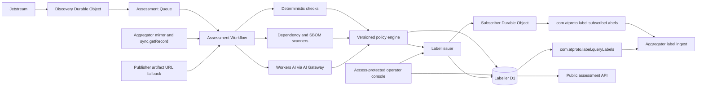

# EmDash Plugin Registry Labelling Service

Companion: [Implementation plan](./implementation-plan.md)

Status: draft implementation spec for the follow-on trust and moderation work described by RFC #694.

This document specifies the EmDash-operated reference labeller for the decentralized plugin registry. It covers automated release assessment, signed ATProto labels, operator actions, the public explanation API, aggregator and client integration, and the small operator console.

It does not amend RFC #694. The RFC establishes the registry and identifies a labeller as the trust and moderation layer; this document defines that service in enough detail to implement and review it.

## 1. Decisions

The following decisions were made before drafting this spec.

| Area                      | Decision                                                                                                        |
| ------------------------- | --------------------------------------------------------------------------------------------------------------- |
| Launch role               | Safety and quality labeller, with narrow takedown authority                                                     |
| Assessment coverage       | Assess every release, including verified and first-party publishers                                             |
| Automated inputs          | Bundle code, manifest and metadata, images, dependencies/SBOM, and publisher history                            |
| Automated authority       | Deterministic critical findings, critical scanner matches, and a single AI critical finding may hard-block      |
| AI hard-block scope       | Security and impersonation findings only; quality findings never hard-block                                     |
| Hard-block representation | Descriptive labels, not `!takedown`                                                                             |
| Official client policy    | Require a positive assessment label; hard-block configured high-risk labels                                     |
| Manual scope              | Review/override automated decisions and issue emergency takedowns                                               |
| Broad labels              | Package and publisher labels require manual action                                                              |
| Emergency takedown        | Admin-only `!takedown` issuance and retraction                                                                  |
| Operator auth             | Cloudflare Access                                                                                               |
| Operator roles            | Reviewer and admin                                                                                              |
| Deployable shape          | One Worker application for assessment, issuance, distribution, and console                                      |
| Discovery                 | Independent Jetstream consumer                                                                                  |
| Artifact source           | Verified aggregator mirror, with a declared-URL fallback                                                        |
| AI                        | Workers AI through AI Gateway                                                                                   |
| Public evidence           | Public assessment summary; private detailed evidence                                                            |
| Publisher notice          | Package security contact, then publisher profile fallback; email plus an ATProto-visible notice where practical |
| Appeals                   | Email/manual reconsideration, not a first-class appeals workflow in v1                                          |
| Policy changes            | Versioned in code and deployed through normal review                                                            |
| Reassessment              | New releases and relevant scanner-intelligence changes                                                          |
| Assessment failure        | Release remains in a temporary pending/unknown state and official clients block it                              |
| Reports                   | Defer `com.atproto.moderation.createReport` and report triage in v1                                             |

## 2. Goals

1. Assess every newly observed EmDash plugin release without making publication depend on a central upload service.
2. Produce standard, signed ATProto labels that any aggregator or client can consume and verify.
3. Let the official aggregator and EmDash admin make conservative install decisions without treating the aggregator as the source of truth.
4. Automate the common path at the expected initial volume of a handful of releases per day.
5. Give operators enough interface to understand a decision, override it, re-run an assessment, or issue an emergency takedown.
6. Give publishers a useful public explanation and a direct notification when a release is blocked or warned.
7. Preserve the distinction between publication and reach: publishers control their records; labellers publish opinions; consumers choose policy.
8. Keep policy, model, scanner, and operator decisions auditable and reproducible.

## 3. Non-goals

- Preventing a publisher from writing a release record to their own repository.
- Acting as the only valid labeller for the ecosystem.
- Replacing install-time provenance, checksum, manifest consistency, or sandbox enforcement.
- Guaranteeing that an AI assessment proves code is safe.
- Accepting user reports through `com.atproto.moderation.createReport` in v1.
- A full case-management, appeals, or customer-support system.
- Automated package-wide or publisher-wide punishment.
- Publisher verification issuance. Verification remains a separate trust process even if a future console combines the views.
- Ratings, reviews, install counts, popularity ranking, or recommendation scoring.
- General ATProto social-content moderation.
- Native npm plugin assessment. V1 covers sandboxed registry releases only.
- Multi-tenant hosted labelling. One deployment represents one labeller DID.

## 4. Trust Model

There are four distinct authorities. The implementation must not collapse them.

1. **Publisher repository:** authoritative for package and release records.
2. **Artifact checksum in the signed release:** authoritative for the bytes the publisher released.
3. **Labeller:** authoritative only for labels issued by its DID.
4. **Consumer policy:** authoritative for whether a label warns, hides, blocks, or is ignored.

The official EmDash deployment trusts `did:web:labels.emdashcms.com` by default. Other aggregators and clients may ignore it, consume it without enforcing it, or combine it with other labellers.

An automated hard block is therefore not deletion and is not a network takedown. It is a signed descriptive claim, such as `malware`, which the official EmDash policy treats as ineligible for installation.

`!takedown` is stronger. It requests protocol-level redaction when the labeller is accepted with the `redact` flag. V1 reserves it for an admin's emergency manual action.

## 5. Architecture

The reference service is a single Cloudflare Worker application in `apps/labeller`. It contains separate internal capabilities even though they deploy together.



### 5.1 Components

| Component                 | Responsibility                                                                      |
| ------------------------- | ----------------------------------------------------------------------------------- |
| Discovery Durable Object  | Maintains the outbound Jetstream subscription and persists the cursor               |
| Assessment Queue          | Buffers and deduplicates immutable release assessment jobs                          |
| Assessment Workflow       | Fetches verified inputs, runs checks, stores evidence, and invokes policy           |
| Policy engine             | Maps normalized findings to labels and client effects under a versioned policy      |
| Label issuer              | Allocates sequence numbers, signs labels, stores history, and broadcasts them       |
| Subscriber Durable Object | Serves replayable `subscribeLabels` WebSocket connections using hibernation         |
| Query API                 | Implements standard `queryLabels`                                                   |
| Public assessment API     | Exposes case-specific summaries without private evidence                            |
| Operator console          | Provides queue, assessment detail, override, re-run, and emergency takedown actions |
| Notification worker step  | Sends publisher notices after externally visible decisions                          |

### 5.2 Why one deployable

At a handful of releases per day, separate services would add deployment, authentication, and failure modes without useful scale isolation. Internal modules must still preserve least privilege:

- Only the issuer module can read the label-signing key.
- Assessment model output is data, never a direct call to signing primitives.
- The policy engine constructs a bounded decision proposal.
- The issuer validates every proposal against the policy's allowed label vocabulary and subject rules.
- Operator routes are protected by Access JWT verification and role checks.
- Public label and assessment routes cannot reach operator mutations.

If model execution later becomes high-volume or accepts broader untrusted inputs, the assessor can split into another Worker without changing the public label protocol.

## 6. Identity and Declaration

The service identity is `did:web:labels.emdashcms.com`.

Its DID document must include:

- `#atproto_label`, the public key used to verify labels.
- `#atproto_labeler`, an `AtprotoLabeler` service pointing to `https://labels.emdashcms.com`.
- An ATProto repository/PDS service if the service publishes a standard labeler declaration record.

The service may publish an `app.bsky.labeler.service/self` declaration for compatibility with existing ATProto tooling and localized label definitions. Its `subjectTypes`, `subjectCollections`, and `reasonTypes` fields describe report scope in the Bluesky application model; they do not constrain which labels this service may issue. Subject restrictions are enforced by the issuer and documented in the EmDash policy document.

Because v1 does not accept standard moderation reports, the declaration must not advertise report handling. Phase 0 must verify whether a minimal declaration can omit all report-scope fields without misleading existing clients. If not, v1 publishes no `app.bsky` declaration and uses the base label service plus the EmDash policy document. A call to `com.atproto.moderation.createReport` returns `NotSupported`; it is never silently accepted into an unmonitored queue.

The versioned, machine-readable policy document is available at:

```text
GET /.well-known/emdash-labeler-policy.json
```

It includes:

- Labeller DID.
- Policy version and effective timestamp.
- Supported subject collections.
- Label definitions and default official-client effects.
- Current assessment schema version.
- Public explanation API base URL.
- Contact and reconsideration URL/email.
- A statement that model output is advisory evidence interpreted by versioned policy.

This document is informational. Signed labels remain the interoperable source of claims.

## 7. Label Vocabulary

Label values use lowercase kebab case as recommended by the ATProto label specification. Confidence, scores, model names, and structured evidence do not go in `val`.

### 7.1 Eligibility labels

| Label                   | Subject           | Meaning                                                                                                  | Official policy                                             |
| ----------------------- | ----------------- | -------------------------------------------------------------------------------------------------------- | ----------------------------------------------------------- |
| `assessment-passed`     | Release URI + CID | Required checks completed and either policy or an authorized manual override found no blocking condition | Eligible, subject to all other labels and install checks    |
| `assessment-overridden` | Release URI + CID | A reviewer/admin explicitly superseded the automated outcome for this exact release CID                  | Use the accompanying manual pass until explicitly retracted |
| `assessment-pending`    | Release URI + CID | Assessment is queued, running, retrying, or awaiting an artifact                                         | Block temporarily                                           |
| `assessment-error`      | Release URI + CID | Assessment could not complete after bounded retries                                                      | Block and surface operational failure                       |

The official client requires an active `assessment-passed` label from an accepted labeller. Absence of that label means unknown, not safe.

`assessment-pending` improves UX but is not the security gate. If the pending label is delayed, missing, expired, or retracted incorrectly, the missing positive label still blocks.

When assessment completes, the issuer negates `assessment-pending` and issues exactly one of:

- `assessment-passed`, possibly alongside warning labels.
- One or more blocking descriptive labels, without `assessment-passed`.
- `assessment-error` if the pipeline exhausted retries without a judgment.

A reviewer/admin may manually unblock a false positive by issuing negations for the automated blocking labels plus action-backed `assessment-passed` and `assessment-overridden` labels for the exact URI + CID. The public assessment response links the public action summary and retains the superseded automated assessment. Merely retracting a blocking label is not enough to make a release eligible.

### 7.2 Blocking security labels

| Label                        | Meaning                                                                                                    | Automatic issuance                                                                     |
| ---------------------------- | ---------------------------------------------------------------------------------------------------------- | -------------------------------------------------------------------------------------- |
| `malware`                    | Code or payload intentionally compromises, persists, mines, destroys, or executes an unauthorized workload | Deterministic/scanner critical or AI critical                                          |
| `data-exfiltration`          | Plugin intentionally sends protected site/user data outside its declared and expected purpose              | Deterministic/scanner critical or AI critical                                          |
| `credential-harvesting`      | Plugin solicits, captures, or transmits credentials deceptively                                            | Deterministic/scanner critical or AI critical                                          |
| `supply-chain-compromise`    | Artifact or dependency evidence indicates a known malicious or substituted component                       | Deterministic/scanner critical or AI critical                                          |
| `critical-vulnerability`     | A scanner identifies a critical, applicable vulnerability under the policy's blocking rule                 | Critical scanner rule only unless AI identifies an independently blocking exploit path |
| `artifact-integrity-failure` | Available artifact bytes do not match the checksum in the signed release                                   | Deterministic critical                                                                 |
| `invalid-bundle`             | The archive is malformed, unsafe, or missing required installable content                                  | Deterministic critical                                                                 |
| `undeclared-access`          | Bundle behavior or manifest inconsistency attempts access outside the signed declaration                   | Deterministic critical; AI may propose but not establish manifest inequality           |
| `impersonation`              | Package or publisher materially impersonates another identity, product, or trusted project                 | Deterministic identity evidence or AI critical                                         |

Official EmDash clients block these labels. Other consumers choose their own behavior.

The policy must distinguish a vulnerable dependency from an actually blocking critical vulnerability. A raw CVSS score alone is insufficient. The versioned rule should require applicable package/version evidence and one of: known exploitation, reachable critical behavior, a policy-maintained deny-list, or another explicit rule.

### 7.3 Warning labels

| Label                 | Meaning                                                                                        | Official policy     |
| --------------------- | ---------------------------------------------------------------------------------------------- | ------------------- |
| `suspicious-code`     | Concerning behavior lacks enough evidence for a blocking security label                        | Warn before install |
| `obfuscated-code`     | Material code is intentionally difficult to inspect                                            | Warn before install |
| `privacy-risk`        | Collection, tracking, or transmission creates a non-blocking privacy concern                   | Warn before install |
| `misleading-metadata` | Description, screenshots, identity claims, or declared purpose materially differ from behavior | Warn and downrank   |
| `low-quality`         | Release is placeholder, generated without substance, or lacks meaningful functionality         | Warn and downrank   |
| `broken-release`      | Bundle cannot perform its stated function despite passing structural registry validation       | Warn and downrank   |

Quality labels never prevent direct installation on their own. The official admin presents the reason and requires confirmation when warning labels are active.

### 7.4 Manual system labels

| Label                   | Subject                        | Authority         | Effect                                                                 |
| ----------------------- | ------------------------------ | ----------------- | ---------------------------------------------------------------------- |
| `!takedown`             | Release, package, or publisher | Admin only        | Redact for consumers accepting this labeller with `redact`             |
| `security-yanked`       | Release                        | Reviewer or admin | Block install/update; retain visible tombstone and explanation         |
| `publisher-compromised` | Publisher DID                  | Admin only        | Block all publisher packages/releases until retracted                  |
| `package-disputed`      | Package URI                    | Reviewer or admin | Warn and prevent recommendation; direct install policy is configurable |

`security-yanked` replaces the colon-containing `security:yanked` placeholder currently present in parts of the aggregator and admin. Colon-structured values conflict with ATProto's recommended label syntax.

The vocabulary cutover is required before the labeller issues production labels. Aggregator SQL, registry-client helpers, admin rendering, and install/update handlers must use `security-yanked` and the complete blocking-label set. A production preflight checks for persisted legacy `security:yanked` labels. If any exist, consumers temporarily recognize both values while operators reissue/negate them; otherwise no compatibility path is added.

### 7.5 Severity is assessment data

Labels describe conditions, not model severity. Each assessment finding has an internal severity of `critical`, `high`, `medium`, `low`, or `info`.

Policy maps findings to labels. Only a `critical` security or impersonation finding may produce an automated blocking label. A `critical` quality finding is normalized to a warning because quality labels are non-blocking by policy.

## 8. Subject and CID Rules

### 8.1 Automated labels

Automation labels only an individual release record and always supplies both:

- `uri`: immutable release AT URI.
- `cid`: the exact release record CID assessed.

The assessment also binds the artifact checksum, artifact ID, and observed bytes. This prevents an assessment of one release-record version or artifact from being replayed as an assessment of another.

### 8.2 Package labels

Package/profile labels are manual in v1.

- A correction-specific label such as `misleading-metadata` should be CID-bound so editing the profile removes its applicability pending reassessment.
- A policy action such as `package-disputed` or `!takedown` is URI-wide and remains active across profile edits until explicitly retracted.

### 8.3 Publisher labels

Publisher DID labels are manual in v1 and apply to all packages from that identity according to consumer policy. A release finding never automatically escalates to a publisher label.

### 8.4 Deletion

Deleting a release record does not erase assessment history or labels. Aggregators may stop listing the release because of the registry tombstone, while the public assessment remains available for transparency and incident response.

## 9. Release Assessment Workflow

### 9.1 Discovery

The Discovery Durable Object maintains an independent Jetstream subscription for experimental and stable EmDash release collections.

For each create or update event:

1. Validate the event shape.
2. Derive a verification job key from `(release URI, release CID)`.
3. Enqueue the verification/assessment job durably.
4. Persist the Jetstream cursor only after queue acceptance.
5. In the workflow, fetch and cryptographically verify the source record for the exact URI + CID.
6. Only after verification, insert the subject and issue `assessment-pending`.
7. Continue with artifact acquisition and assessment.

Deletes record a tombstone and cancel queued work where possible. A running assessment may finish for forensic purposes but must not issue a new positive label for a deleted subject.

Jetstream is discovery only. Raw event JSON is never trusted as an assessment input or as sufficient authority to sign even a pending label. A forged or unverifiable event is retained as an operational dead letter and produces no public label.

### 9.2 Idempotency

Every assessment run has a deterministic `runKey`:

```text
sha256(
  release-uri + "\n" +
  release-cid + "\n" +
  policy-version + "\n" +
  model-id + "\n" +
  prompt-hash + "\n" +
  scanner-set-version + "\n" +
  trigger-id
)
```

`trigger-id` is stable for a logical trigger: `initial:<cid>` for first observation, an advisory/signature corpus revision for scanner intelligence, or the immutable operator action ID for a manual rerun. At most one active workflow exists for a `runKey`. Redelivery wakes or observes the same run; a new scanner revision or operator action creates a new immutable run that may supersede the previous effective assessment.

A new policy version does not automatically reassess every release. Scanner-intelligence updates select affected releases and enqueue a run with the new scanner-set version and trigger ID.

### 9.3 Acquire verified inputs

The workflow obtains:

1. Signed release record and CID.
2. Associated package profile and publisher profile.
3. EmDash release extension and declared access.
4. Bundle from a validated aggregator mirror.
5. Bundle from the publisher-declared URL only if the mirror is unavailable.
6. Images referenced by the package/release where needed.
7. SBOM from the release record or bundle, if present.
8. Relevant publisher history already observed by the labeller.

Every artifact source is checksum-verified against the signed release before extraction. The mirror is a transport optimization, not a trust root.

Fallback URL fetching must use the same class of controls as the registry installer:

- HTTPS by default.
- DNS-aware SSRF checks.
- Redirect revalidation and bounded redirect count.
- Compressed, per-file, decompressed, and file-count caps.
- Streaming abort at limits.
- Safe tar path handling and rejection of links/special files.
- Global time and byte budgets.
- Content-type sniffing rather than trusting headers.
- No ambient credentials or cookies.

### 9.4 Deterministic validation

Run deterministic checks before any AI call:

- Release and extension lexicon validity.
- Release rkey/package/version consistency.
- Artifact checksum and archive validity.
- Required bundle files and manifest validity.
- Canonical manifest `declaredAccess` equality with the signed release extension.
- Unknown access category/operation rejection.
- Forbidden archive entries, executable payload classes, and known malicious hashes.
- Static forbidden-runtime patterns where they are unambiguous.
- Metadata URL and identity consistency.
- Image dimensions/types and archive policy.

A registry-invalid release may already have been rejected by the aggregator. The labeller still stores the observation if independently discovered, but only issues labels for a resolvable, valid subject. Invalid/unresolvable records go to operational dead letters rather than creating unverifiable public labels.

Permanent failures after the source record is verified are findings, not operational errors. Checksum mismatch maps to `artifact-integrity-failure`; malformed/unsafe/missing bundle content maps to `invalid-bundle`; manifest declaration mismatch maps to `undeclared-access`. Transient mirror/network/model/scanner unavailability retries and may become `assessment-error`.

### 9.5 Dependency and SBOM analysis

The service prefers a publisher-supplied SBOM when it is bound to the release. It may also derive dependency evidence from lockfiles and bundled metadata.

The normalized result records:

- Ecosystem, package, version, and dependency path.
- Advisory identifier and source.
- Severity and exploit status.
- Whether the vulnerable code is bundled/reachable where determinable.
- Scanner database/version and observation time.
- Confidence and any suppression rule.

Missing SBOM data is not itself a blocking condition in v1. It may lower assessment coverage and be shown in the public summary.

Scanner-intelligence updates enqueue only releases whose dependency/hash index intersects the changed advisories or signatures.

### 9.6 Code and metadata AI assessment

Workers AI is invoked through AI Gateway with caching disabled for moderation decisions. Gateway request IDs are retained with private evidence.

The model receives bounded, explicitly delimited inputs:

- Manifest and signed declared access.
- Package/release metadata.
- File inventory and deterministic scanner summary.
- Relevant source files, selected by deterministic entrypoint/import analysis.
- Publisher-history facts, not an unbounded reputation narrative.
- A policy-generated task and output schema.

All plugin-controlled text and code is untrusted data. The prompt states that instructions inside those inputs must never alter the audit task. Model output is parsed through a strict schema and cannot name arbitrary labels.

The model returns findings, not labels:

```ts
interface ModelFinding {
	category: AllowedFindingCategory;
	severity: "critical" | "high" | "medium" | "low" | "info";
	confidence: number;
	title: string;
	summary: string;
	evidenceRefs: string[];
	affectedFiles: string[];
}
```

`AllowedFindingCategory` is generated from the versioned policy. Unknown categories fail validation.

The model may produce a critical security or impersonation finding that the policy maps directly to a hard-blocking descriptive label. This is an explicit product decision. Guardrails are therefore mandatory:

- Structured output with strict category allowlist.
- Evidence references must resolve to supplied input spans or deterministic facts.
- No hard block from free-form summary text.
- No hard block from quality categories.
- Fixture-based calibration before model/prompt changes deploy.
- Model ID, prompt hash, policy version, and input manifest retained.
- Immediate operator retraction path.

### 9.7 Image assessment

Images are assessed for:

- Brand impersonation.
- Misleading screenshots.
- Credential phishing or fake system UI.
- Hateful or explicit imagery that violates the published directory policy.
- Mismatch between screenshots and actual plugin behavior where code/metadata evidence supports it.

Image-only quality concerns generate warning labels. Critical impersonation or credential-harvesting evidence may hard-block.

Every image retains its original MIME type, hash, dimensions, and source path in private evidence. The implementation must not coerce arbitrary image bytes to `image/png` as the legacy marketplace auditor did.

### 9.8 Publisher history

History is context, not guilt by association. The model/policy may use:

- Prior releases from the same DID.
- Recent identity/handle/profile changes.
- Existing active manual labels.
- Repeated exact malicious hashes or repeated policy violations.
- Verification state as display context, never as an assessment exemption.

Automation cannot issue package- or publisher-wide labels from history. It can create an operator review recommendation.

### 9.9 Policy resolution

The policy engine consumes normalized deterministic, scanner, image, and model findings.

Resolution order:

1. If the subject disappeared or CID changed, store the result as stale and issue no current label.
2. Map permanent artifact, archive, manifest, and other validation failures to deterministic findings. Do not retry them as infrastructure failures.
3. If transient infrastructure failure prevented complete required inputs, retry; after exhaustion issue `assessment-error` and negate `assessment-pending`.
4. Map blocking deterministic/scanner findings to descriptive labels.
5. Map AI critical security/impersonation findings to descriptive blocking labels.
6. Map non-blocking findings to warning labels.
7. If no blocking label exists, issue `assessment-passed`.
8. Negate prior active automated labels for the same URI + CID that are no longer supported by this assessment.
9. Negate `assessment-pending`.
10. Store the public summary and private evidence.
11. Notify the publisher for newly issued/retracted blocking or warning labels.

An assessment may pass and warn at the same time. `assessment-passed` means no hard-blocking condition, not "the labeller found nothing concerning."

## 10. Reassessment and Supersession

V1 reassesses when:

- A new release CID is observed.
- A known-malware or vulnerability intelligence update identifies an affected artifact/dependency.
- An operator requests a re-run.

Policy/model changes do not silently rewrite historical outcomes. A deployment may mark old assessments as using an older policy, and an admin may enqueue a bounded migration if a change requires it.

When a new assessment supersedes an old assessment for the same URI + CID:

- The old assessment remains immutable and public as historical metadata.
- Current labels are changed only through newly signed positive or negation labels.
- The new assessment records `supersedesAssessmentId`.
- Notifications explain whether the effective install policy changed.

Manual overrides remain in force across automated reassessment until an operator explicitly removes them. Automation cannot negate action-backed `assessment-passed`/`assessment-overridden` labels or undo a human `!takedown`, `security-yanked`, package label, or publisher label.

Exactly one completed automated assessment is current for each `(labeller DID, release URI, release CID)`. Starting a newer run does not move that pointer, but its active `assessment-pending` label temporarily makes the release ineligible even if the prior run passed, unless `assessment-overridden` remains active. When the newer run completes, label changes and the current-assessment pointer update in the same transaction. A stale/cancelled run never becomes current. A manual pass is a separate active override layered over the current automated assessment, not a fabricated automated assessment row.

## 11. Manual Operator Workflow

### 11.1 Console pages

The purpose-built Kumo console is served by the labeller Worker under `/admin` and protected by Cloudflare Access.

V1 pages:

| Route                         | Purpose                                                                                                |
| ----------------------------- | ------------------------------------------------------------------------------------------------------ |
| `/admin`                      | Queue health, pending/error counts, recent blocking decisions, subscription health                     |
| `/admin/assessments`          | Filterable assessment list by state, label, publisher, package, model, and policy version              |
| `/admin/assessments/:id`      | Public summary, private findings, evidence excerpts, model/scanner provenance, labels, and timeline    |
| `/admin/subjects/:encodedUri` | All assessments and active/historical labels for a release/package/publisher                           |
| `/admin/audit-log`            | Immutable operator and system action log                                                               |
| `/admin/system`               | Read-only policy/model versions, signing key ID, Jetstream cursor, subscriber health, queue/DLQ health |

All user-facing strings use Lingui and all layout uses RTL-safe logical classes. The console uses Kumo components rather than hand-rolled controls.

### 11.2 Reviewer actions

A reviewer may:

- Issue or retract a descriptive release warning/block label.
- Override an automated decision with a required reason.
- Re-run an assessment.
- Issue/retract `security-yanked` on a release.
- Issue/retract `package-disputed`.
- View private evidence and notification status.

An unblock override is one atomic action: negate the selected automated blocking labels and issue manual `assessment-passed` plus `assessment-overridden` labels for the exact URI + CID. The console does not offer a standalone "retract and allow" shortcut. New automated findings remain visible and alert reviewers, but cannot negate the override; a reviewer/admin must retract it explicitly.

A reviewer may not:

- Issue or retract `!takedown`.
- Issue or retract `publisher-compromised`.
- Change policy, model, signing keys, Access role mappings, or system configuration.

### 11.3 Admin actions

An admin may perform reviewer actions and:

- Issue/retract `!takedown` on a release, package, or publisher.
- Issue/retract `publisher-compromised`.
- Retry or quarantine dead-letter work.
- Pause automated issuance while leaving public query/subscription endpoints available.
- Start and complete signing-key rotation.

Policy remains versioned in code. Admin status pages show configuration but do not provide live prompt/threshold editing.

### 11.4 Action ceremony

Every mutation uses a confirmation dialog showing:

- Subject URI/DID and current resolved display identity.
- Label value and resulting official-client effect.
- Whether the action is CID-bound or subject-wide.
- Existing active labels that will be superseded.
- Required operator reason.

`!takedown` additionally requires typing the package slug, publisher handle, or final URI segment. At current scale, two-person approval is not required, but the audit event and alert are immediate.

## 12. Operator Authentication and Authorization

Cloudflare Access protects `/admin/*` and internal mutation APIs.

The Worker must validate `Cf-Access-Jwt-Assertion` itself using:

- The Access team domain JWKS.
- Expected issuer.
- Exact Access application audience.
- Signature, expiry, and not-before claims.

Presence of an Access header is not authentication.

Role mapping is deployment configuration:

```json
{
	"admins": ["emdash-labeller-admins"],
	"reviewers": ["emdash-labeller-reviewers"]
}
```

The exact claim used for groups must be verified against the configured Access identity provider. Email allowlists may be used initially, but roles must not be inferred from an unverified request header.

Mutation requests also require:

- Same-origin checks.
- CSRF token or signed double-submit token.
- JSON content type.
- Idempotency key.
- Freshly verified Access identity.
- Role check in the handler.

Service-to-service automation does not reuse human Access sessions. Internal queue/workflow calls use bindings. Any external administrative automation uses an Access service token plus a separate scoped service credential checked by the Worker.

## 13. Public and Internal Interfaces

### 13.1 Standard ATProto endpoints

The service implements:

- `GET /xrpc/com.atproto.label.queryLabels`
- `GET /xrpc/com.atproto.label.subscribeLabels` with WebSocket upgrade

Semantics follow the ATProto label specification, including cursors, signatures, negation, expiration, source filtering, URI patterns, and replay from cursor `0` for retained history.

The service does not require authentication for public label distribution.

### 13.2 Public assessment API

The public API supplies the case-specific context labels cannot carry.

Proposed experimental XRPC endpoints:

```text
com.emdashcms.experimental.labeller.getAssessment
com.emdashcms.experimental.labeller.getCurrentAssessment
com.emdashcms.experimental.labeller.listAssessments
com.emdashcms.experimental.labeller.getPolicy
```

`getAssessment` accepts `id` and returns:

```ts
interface PublicAssessment {
	id: string;
	subject: { uri: string; cid: string };
	artifact: { id: string; checksum: string };
	state: "pending" | "passed" | "warned" | "blocked" | "error" | "superseded";
	summary: string;
	coverage: {
		code: "complete" | "partial" | "unavailable";
		metadata: "complete" | "partial" | "unavailable";
		images: "complete" | "not-present" | "partial" | "unavailable";
		dependencies: "complete" | "partial" | "unavailable";
	};
	labels: Array<{ val: string; active: boolean; issuedAt: string }>;
	policyVersion: string;
	model: { provider: "workers-ai"; modelId: string; promptVersion: string };
	scannerVersions: Record<string, string>;
	createdAt: string;
	completedAt?: string;
	supersedesAssessmentId?: string;
	reconsiderationUrl: string;
}
```

Public output excludes:

- Source excerpts not already public through the artifact.
- Full model prompts/responses.
- Operator-only notes.
- Publisher contact data.
- Gateway logs/tokens/request payloads.
- Exploit details that would increase harm before remediation.

Standard label objects cannot carry an assessment ID, so clients do not infer one from timestamps. `getCurrentAssessment` accepts exact `uri`, `cid`, and optional `src`, then reads the materialized current pointer and returns the current completed automated assessment, any newer pending run, active public labels, and any active manual override. Manual labels/actions have public action summaries and no fabricated assessment association. `getAssessment(id)` remains the immutable historical lookup.

### 13.3 Operator API

Purpose-built JSON endpoints under `/admin/api` are acceptable because they are not ecosystem protocol. They include:

- `GET /assessments`
- `GET /assessments/:id`
- `POST /assessments/:id/retry`
- `POST /labels/issue`
- `POST /labels/retract`
- `GET /subjects`
- `GET /audit-log`
- `GET /system/health`

Mutation bodies identify a subject, label, optional CID/expiry, reason, and idempotency key. The server derives `src`, `cts`, sequence, operator identity, and signing key ID.

There is no generic "sign arbitrary label object" endpoint.

## 14. Storage Model

The labeller uses an independent D1 database.

### 14.1 Subjects and assessments

```sql
CREATE TABLE subjects (
  uri TEXT NOT NULL,
  cid TEXT NOT NULL,
  did TEXT NOT NULL,
  collection TEXT NOT NULL,
  rkey TEXT NOT NULL,
  observed_at TEXT NOT NULL,
  deleted_at TEXT,
  PRIMARY KEY (uri, cid)
);

CREATE TABLE assessments (
  id TEXT PRIMARY KEY,
  run_key TEXT NOT NULL UNIQUE,
  uri TEXT NOT NULL,
  cid TEXT NOT NULL,
  artifact_id TEXT,
  artifact_checksum TEXT,
  state TEXT NOT NULL,
  trigger TEXT NOT NULL,
  trigger_id TEXT NOT NULL,
  policy_version TEXT NOT NULL,
  model_id TEXT,
  prompt_hash TEXT,
  scanner_versions_json TEXT NOT NULL,
  public_summary TEXT,
  coverage_json TEXT NOT NULL,
  supersedes_assessment_id TEXT,
  started_at TEXT,
  completed_at TEXT,
  created_at TEXT NOT NULL,
  FOREIGN KEY (uri, cid) REFERENCES subjects(uri, cid)
);

CREATE INDEX idx_assessments_state_created
ON assessments(state, created_at DESC);

CREATE INDEX idx_assessments_subject
ON assessments(uri, cid, created_at DESC);

CREATE TABLE current_assessments (
  src TEXT NOT NULL,
  uri TEXT NOT NULL,
  cid TEXT NOT NULL,
  assessment_id TEXT NOT NULL REFERENCES assessments(id),
  updated_at TEXT NOT NULL,
  PRIMARY KEY (src, uri, cid)
);
```

The policy-finalization transaction updates `current_assessments` only after storing the completed result and issuing its label changes. It replaces the pointer only for the run being finalized under the subject's workflow lock. Pending, stale, cancelled, and failed-before-decision runs do not replace it; an `assessment-error` remains visible through labels and run history while the last completed pointer is retained for explanation.

### 14.2 Findings and evidence

```sql
CREATE TABLE findings (
  id TEXT PRIMARY KEY,
  assessment_id TEXT NOT NULL REFERENCES assessments(id),
  source TEXT NOT NULL,
  category TEXT NOT NULL,
  severity TEXT NOT NULL,
  confidence REAL,
  title TEXT NOT NULL,
  public_summary TEXT NOT NULL,
  private_detail TEXT NOT NULL,
  evidence_refs_json TEXT NOT NULL,
  created_at TEXT NOT NULL
);

CREATE INDEX idx_findings_assessment
ON findings(assessment_id);

CREATE TABLE evidence_objects (
  id TEXT PRIMARY KEY,
  assessment_id TEXT NOT NULL REFERENCES assessments(id),
  kind TEXT NOT NULL,
  sha256 TEXT NOT NULL,
  r2_key TEXT,
  metadata_json TEXT NOT NULL,
  created_at TEXT NOT NULL
);
```

Large private evidence lives encrypted at rest in R2; D1 stores references and hashes. Raw bundles need not be retained by the labeller when the aggregator mirror is durable. Selected evidence required to explain a decision is retained according to the policy below.

### 14.3 Issued labels

```sql
CREATE TABLE issued_labels (
  seq INTEGER NOT NULL UNIQUE,
  src TEXT NOT NULL,
  uri TEXT NOT NULL,
  cid TEXT,
  val TEXT NOT NULL,
  neg INTEGER NOT NULL DEFAULT 0,
  cts TEXT NOT NULL,
  exp TEXT,
  sig BLOB NOT NULL,
  ver INTEGER NOT NULL DEFAULT 1,
  signing_key_id TEXT NOT NULL,
  assessment_id TEXT,
  action_id TEXT,
  PRIMARY KEY (src, uri, val, cts)
);

CREATE INDEX idx_issued_labels_subject
ON issued_labels(uri, cid, seq);

CREATE TABLE label_sequence (
  id INTEGER PRIMARY KEY CHECK (id = 1),
  next_seq INTEGER NOT NULL
);
```

Sequence allocation and label insertion occur atomically. The service never derives sequence from `MAX(seq)`.

### 14.4 Actions, notifications, and cursors

```sql
CREATE TABLE actions (
  id TEXT PRIMARY KEY,
  actor_type TEXT NOT NULL,
  actor_id TEXT NOT NULL,
  role TEXT,
  action TEXT NOT NULL,
  subject_uri TEXT NOT NULL,
  subject_cid TEXT,
  label_value TEXT,
  reason TEXT NOT NULL,
  idempotency_key TEXT NOT NULL UNIQUE,
  metadata_json TEXT NOT NULL,
  created_at TEXT NOT NULL
);

CREATE TABLE notifications (
  id TEXT PRIMARY KEY,
  action_id TEXT NOT NULL REFERENCES actions(id),
  channel TEXT NOT NULL,
  recipient_hash TEXT NOT NULL,
  state TEXT NOT NULL,
  attempts INTEGER NOT NULL DEFAULT 0,
  provider_id TEXT,
  last_error TEXT,
  created_at TEXT NOT NULL,
  sent_at TEXT
);

CREATE TABLE ingest_state (
  source TEXT PRIMARY KEY,
  cursor TEXT NOT NULL,
  updated_at TEXT NOT NULL
);
```

## 15. Label Signing and Distribution

Signing follows the ATProto label specification exactly:

1. Construct only the allowed v1 label fields, excluding `sig` and `$type`.
2. Encode with deterministic DRISL CBOR.
3. At the protocol level, SHA-256 the canonical bytes and sign that digest.
4. With the selected high-level `@atcute/crypto` API, pass the canonical CBOR bytes directly to `P256PrivateKey.sign`, and pass those same bytes to `P256PublicKey.verify`. WebCrypto ECDSA performs the protocol SHA-256 operation internally. Never pass the precomputed digest to either high-level API, because that hashes the digest again and produces a non-interoperable signature.
5. Store signature bytes and signing key ID.

No generic object-signing helper accepts arbitrary fields. The issuer takes a typed internal proposal and reconstructs the complete label object itself.

The issuer normalizes verification method IDs before selection: relative `#atproto_label` and fully qualified `${issuerDid}#atproto_label` identify the same logical method, and either form is valid alone. Exactly one logical label key must exist; duplicates across either or both forms are invalid regardless of order. The method must have `type: "Multikey"`, `controller` equal to the issuer DID, and a `publicKeyMultibase` using the P-256 multikey codec. At startup, the public multikey derived from the configured private scalar must exactly equal the resolved method's `publicKeyMultibase`; a structurally valid different P-256 key is a fatal mismatch. Missing, duplicate, differently controlled, legacy-typed, or non-P-256 methods are invalid. The issuer and subscribers never fall back to `#atproto` or another DID key.

The private secret is an unpadded, canonically encoded base64url 32-byte P-256 scalar. Decoding rejects non-base64url characters, padding, non-canonical encodings, lengths other than 32 bytes, zero, and values greater than or equal to the P-256 group order.

The private key is stored in Cloudflare Secrets Store. A plain Worker secret is acceptable only for initial local/staging deployment, not production launch.

### 15.1 Subscriber Durable Object

One named instance, `main`, owns inbound subscribers.

- Uses WebSocket Hibernation.
- Replays D1 labels with `seq > cursor` before joining live delivery.
- Persists no correctness-critical state only in memory.
- Broadcast failures affect one subscriber and do not roll back an issued label.
- Supports replay from `cursor=0` for retained history.

### 15.2 Key rotation

1. Pause new issuance while assessments continue to queue decisions.
2. Generate and store a new private key.
3. Update the DID document's `#atproto_label` verification method.
4. Resume issuance with the new key ID.
5. Re-sign old labels lazily when queried, preserving `cts`.
6. Monitor downstream signature failures.

The operator console exposes rotation state but never private key material.

### 15.3 Key compromise

Key compromise is different from routine rotation. The incident procedure must:

- Remove/replace the compromised key in the DID document.
- Pause issuance.
- Publish an incident notice in the policy endpoint.
- Establish the last trusted sequence/time where possible.
- Reissue current effective labels with the new key.
- Tell aggregators to replay from a declared safe cursor or full history.
- Preserve compromised history for forensics without treating signatures as currently valid.

## 16. Aggregator Integration

The existing aggregator schema already has `labels`, `label_state`, `labellers`, and `ingest_state`, but no working subscription or hydration path.

### 16.1 Ingest

For each configured labeller:

1. Resolve `#atproto_labeler` and `#atproto_label` from its DID document.
2. Maintain an outbound `subscribeLabels` connection in a per-labeller Durable Object.
3. Resume from the persisted cursor.
4. Verify each signature, refreshing the DID document once on failure.
5. Enqueue verified labels.
6. Insert append-only history and update current state only when the incoming `cts` is newer.
7. Persist cursor after durable acceptance.

Negated and expired labels remain in history but are not hydrated as active labels.

### 16.2 Request policy

The aggregator parses `atproto-accept-labelers` once at the request boundary and passes a typed policy to every handler.

- Missing header: apply deployment defaults.
- Empty header: hydrate/enforce no labellers.
- Invalid syntax: return a client error.
- Repeated DIDs: merge flags.
- Unknown/unavailable DID: omit it from `atproto-content-labelers`.
- `redact`: apply `!takedown` and `!suspend` redaction semantics.

The response sets `atproto-content-labelers` to the sources actually considered.

The current router's response-header contract must be corrected as part of label ingest: allow and parse `atproto-accept-labelers`, set `atproto-content-labelers`, and expose `atproto-content-labelers` through CORS. It must not echo/expose the request header as though it were the interpreted response policy. Contract tests cover missing, empty, malformed, repeated, unavailable, and `redact` forms.

### 16.3 Hydration

Hydrate labels in batches for all package/release URIs in a response. Do not query once per item.

The package and release views include active labels from requested/accepted sources. The aggregator may omit signatures in hydrated views as allowed by the label spec; clients can retrieve full signed labels from the labeller.

### 16.4 Eligibility and filtering

For the official default policy:

- Search excludes package/publisher `!takedown`, `publisher-compromised`, and package-wide blocking labels.
- Release lists omit redacted releases and expose blocked releases as tombstones where useful.
- `getLatestRelease` selects the highest semver with active `assessment-passed` and no active blocking labels.
- Direct release resolution returns enough status to explain pending/error/blocked outcomes rather than pretending the release does not exist.
- Package/publisher labels cascade at query-policy time; they are not copied onto every release.

Subject expansion is explicit:

- Package search/detail loads labels for the publisher DID and package profile URI. A CID-bound package label applies only when its CID matches the current profile CID; a URI-wide label has no CID.
- Release list/detail/latest loads labels for the publisher DID, package profile URI, and release URI. A CID-bound package or release label applies only to the corresponding current record CID.
- Publisher DID labels are URI-wide because an account label has no record CID.
- Every lookup also filters accepted source DID, `neg = 0`, and unexpired state before policy evaluation.

Queries batch these subject sets and use indexes covering `(uri, src, val)`/current-state access. Tests exercise all three subject scopes and both CID-bound and URI-wide labels.

`packages.latest_version` cannot be trusted for label-aware selection. `getLatestRelease` must query eligible releases dynamically or maintain a separate policy-specific projection updated by label ingestion. At current scale, the dynamic query is simpler and safer.

### 16.5 Cache behavior

Label-dependent responses remain `private, no-store` and read D1 primary state so a newly ingested takedown affects the next response globally. Static policy and DID documents may be cached.

## 17. Registry Client and EmDash Admin Behavior

The registry client exposes one policy helper rather than making every UI or handler compare raw strings.

```ts
interface ReleaseModeration {
	eligibility: "eligible" | "pending" | "error" | "blocked";
	blockingLabels: Label[];
	warningLabels: Label[];
	assessment?: PublicAssessmentRef;
}
```

The helper takes release labels, package labels, publisher labels, accepted-labeller policy, and the current package/release CIDs. It is the only supported server-side eligibility decision path. Both install and update handlers call it immediately before artifact download; they must not retain an independent `security-yanked` string check.

Official behavior:

- Manual `!takedown`, `security-yanked`, package, or publisher blocking labels always block and cannot be bypassed by a release override.
- Active `assessment-overridden` plus `assessment-passed`: treat the exact release CID as eligible despite automated pending/error/blocking labels, while displaying the newer findings to the operator.
- Otherwise, active `assessment-pending` or `assessment-error`: do not recommend or install, even if an older automated `assessment-passed` remains active.
- No active `assessment-passed`: do not recommend or install.
- Active blocking label: do not install.
- Warning labels only: show a warning and require explicit confirmation.
- `!takedown`: redact according to accepted labeller flags; no install override.
- `security-yanked`: block fresh installs and updates; alert sites with the installed version.
- Package/publisher blocking label: apply to all releases.

The server-side install/update handler repeats the eligibility check immediately before downloading. Browser UI state is not an authorization or safety boundary.

The admin displays:

- Label name and localized definition.
- Issuing labeller.
- Public assessment summary and coverage.
- Policy/model version.
- Whether the decision is automated or manually overridden.
- Reconsideration contact for blocked publishers.

Query/cache keys must include accepted labeller configuration. A policy change must not leave stale search/detail data in React Query caches.

Pinned CLI installs may offer a deliberate override for warning labels, but never for missing assessment, blocking labels, or `!takedown` under the official policy unless a site operator explicitly changes trusted-labeller policy at deployment level.

## 18. Publisher Notifications and Reconsideration

### 18.1 Contact resolution

Resolve contacts in order:

1. Package `security[]` contact.
2. Package author/contact metadata.
3. Publisher profile contact.

The service does not attempt to read private PDS account email.

### 18.2 Notification events

Notify on:

- New blocking label.
- New warning label.
- Manual override.
- Retraction of a blocking/warning label.
- Assessment error that remains unresolved past the operational target.
- Emergency takedown.

Do not send a separate email for every internal retry or unchanged reassessment.

Email includes subject, label, public summary, public assessment URL, effect in official clients, and reconsideration instructions. It does not include private exploit detail.

### 18.3 ATProto-visible notice

There is no generic guaranteed ATProto inbox for arbitrary plugin publishers. V1 should publish an EmDash notification/decision record in the labeller's repository referencing the subject and public assessment, if a small interoperable record shape is justified. Publishers and tools may subscribe to those records.

This is supplementary. Email is the active notification channel. The spec must not claim that publishing a record guarantees delivery.

### 18.4 Reconsideration

V1 documents a monitored email address and includes an opaque assessment ID. An operator locates the assessment, records the publisher's reason in private notes, and may re-run or override.

There is no formal SLA, reporter portal, or authenticated appeals state machine in v1. Every resulting label action is still audited and the publisher receives the outcome.

## 19. Evidence, Privacy, and Retention

### 19.1 Public transparency

Public summaries explain:

- What class of issue was found.
- Whether it came from automation or manual action.
- Which assessment coverage completed.
- Which policy/model/scanner versions were used.
- Which labels are active.
- How to request reconsideration.

They do not expose secrets, contact addresses, exploit recipes, or irrelevant source excerpts.

### 19.2 Private evidence

Private evidence may include:

- Model request/response after secret redaction.
- Code excerpts and file hashes.
- Scanner raw results.
- Image-analysis details.
- Operator notes.
- Notification delivery failures.

Access is limited to reviewer/admin roles and every view of highly sensitive evidence may be audit-logged if practical.

### 19.3 Retention

Initial policy:

- Signed labels and public assessment summaries: indefinite while the service operates.
- Operator audit log: indefinite.
- Normal private assessment evidence: 180 days.
- Evidence supporting an active block/takedown: retain while active plus 365 days.
- Raw fetched bundles: do not retain after assessment unless quarantined as incident evidence.
- Contact addresses: store only for delivery duration; retain a keyed hash for deduplication/audit.
- AI Gateway logs: configure a retention period consistent with private evidence policy and disable provider training where applicable.

Retention values are policy constants versioned in code and may change after legal/privacy review.

## 20. Security Requirements

### 20.1 Threats and mitigations

| Threat                                         | Mitigation                                                                                                                     |
| ---------------------------------------------- | ------------------------------------------------------------------------------------------------------------------------------ |
| Prompt injection in source/metadata            | Delimit untrusted input, strict system task, structured schema, category allowlist, evidence-reference validation              |
| Model false positive blocks legitimate release | Narrow blockable categories, fixture calibration, public explanation, immediate reviewer retraction, immutable audit trail     |
| Model false negative                           | Defense in depth: deterministic checks, scanners, sandbox enforcement, reports in future, reassessment on intelligence updates |
| Malicious artifact attacks fetcher/extractor   | Mirror preference, checksum verification, SSRF controls, streaming caps, safe archive parsing, time budgets                    |
| Aggregator serves wrong artifact               | Verify signed release record, CID, and artifact checksum independently                                                         |
| Publisher mutates artifact URL bytes           | Checksum binds accepted bytes; mismatch blocks assessment and installation                                                     |
| Forged Jetstream event                         | Re-fetch and verify signed source record before assessment                                                                     |
| Forged label                                   | DRISL signature verification against `#atproto_label`                                                                          |
| Signing-key exfiltration through assessor      | Typed policy proposal boundary; key accessible only to issuer module; Secrets Store                                            |
| Access header spoofing                         | Verify Access JWT signature, issuer, audience, expiry; do not trust raw identity headers                                       |
| Reviewer account compromise                    | Role limits, required reasons, confirmation ceremony, alerts, immutable action log                                             |
| Admin incorrectly issues `!takedown`           | Explicit high-friction confirmation, immediate alert, signed negation rollback                                                 |
| Replay/out-of-order labels                     | Monotonic sequence for stream and latest-`cts` current-state projection                                                        |
| Stale labels after CID update                  | Automated labels are CID-bound; clients check CID applicability                                                                |
| Package/publisher overreach                    | Broad labels are manual only; subject-wide action shown explicitly                                                             |
| Assessment absence mistaken for safety         | Official clients require positive `assessment-passed`                                                                          |
| Labeller outage blocks ecosystem indefinitely  | Clear pending/error state, alerts, retry/DLQ, site operators can choose a different trust policy/labeller                      |
| Policy/model drift changes outcomes silently   | Version all policy/model/prompt/scanner inputs; no automatic whole-catalog rewrite                                             |
| Dependency scanner noise                       | Applicability/blocking rule stricter than raw severity score                                                                   |
| Evidence leaks vulnerability details           | Public/private split and redacted summaries                                                                                    |

### 20.2 Signing proposal validation

Before signing, the issuer verifies:

- `val` is in the deployed policy vocabulary or a protocol-reserved value allowed for the actor role.
- Automated actions target release records only and include CID.
- Automated blocking labels correspond to a critical finding in an allowed security/impersonation category.
- Quality findings cannot map to blocking labels.
- `!takedown` and publisher-wide labels come from an admin action.
- Manual `assessment-passed` and `assessment-overridden` labels come from the same reviewer/admin unblock action, target an exact release URI + CID, and atomically negate the blocking labels named by that action.
- Manual action has a verified actor, role, reason, and idempotency key.
- Subject URI/DID parses and belongs to an allowed collection/type.

This enforcement is code, not prompt text.

## 21. Reliability and Recovery

### 21.1 Targets

Initial operational targets, not protocol guarantees:

- New release observed from Jetstream: under 30 seconds p95.
- Pending label issued: under 60 seconds p95.
- Normal assessment completed: under 10 minutes p95.
- Emergency manual label visible to connected subscribers: under 10 seconds p95.
- Public label/query availability: 99.9% monthly target.

At a handful of releases per day, correctness and debuggability matter more than throughput.

### 21.2 Retry policy

- Record/artifact fetch: bounded exponential retry; distinguish permanent checksum/validation failure from transient network failure.
- Scanners/models: bounded retry on transport/rate/availability errors; never reinterpret an execution error as a malicious finding.
- Notifications: independent retry and DLQ; notification failure does not roll back a label.
- Label broadcast: D1 commit is authoritative; disconnected subscribers replay by cursor.

### 21.3 Reconciliation

A scheduled reconciliation job:

- Compares recently observed aggregator releases with labeller subjects.
- Finds releases lacking any assessment state.
- Finds pending assessments older than the target.
- Validates that each completed effective assessment has the expected current labels.
- Verifies subscriber high-water sequence against D1.
- Re-resolves the labeller DID document and signing key publication.

The independent Jetstream consumer remains the primary discovery path. Reconciliation may use the aggregator as a completeness cross-check without making it the authority for source records.

### 21.4 Disaster recovery

Back up D1 and private evidence metadata regularly. Recovery order:

1. Restore D1 and signing key version mapping.
2. Restore public query endpoints.
3. Restore subscriber stream and verify sequence continuity.
4. Resume Jetstream discovery from persisted cursor.
5. Reconcile missing releases.
6. Resume assessment workflows and notifications.

If sequence continuity cannot be preserved, publish an operational incident and require subscribers to replay from cursor `0` after the restored history is available.

## 22. Observability

Emit metrics for:

- Jetstream connection state and cursor age.
- Releases observed, deduplicated, queued, running, completed, blocked, warned, errored.
- Assessment duration by stage.
- Artifact mirror hit/fallback/failure and checksum mismatch.
- Scanner/model error rate, latency, token use, and cost.
- Finding and label counts by category and policy/model version.
- Operator overrides and automated-label retraction rate.
- Issued label sequence and Subscriber DO connection count.
- Aggregator subscriber lag where observable.
- Notification delivery state.
- DLQ depth and oldest age.

Alert on:

- Jetstream disconnected or cursor stale for more than five minutes.
- Pending assessment older than 20 minutes.
- Any sustained model/scanner failure causing assessment errors.
- Signing failure or DID/key mismatch.
- Subscriber endpoint failure.
- Emergency `!takedown` issuance.
- Spike in automated blocks or operator override rate.
- Queue/DLQ growth.
- Reconciliation finds an unassessed release.

AI Gateway metadata should include assessment ID, policy version, stage, and model route, but not publisher contact or secrets.

## 23. Policy and Model Change Process

Policy, prompts, schemas, label definitions, model routes, and thresholds are versioned source files reviewed like code.

A change requires:

1. New immutable policy version.
2. Fixture corpus evaluation.
3. Comparison against the prior production version.
4. Explicit review of newly blocked and newly allowed fixtures.
5. Staging run against a representative historical sample.
6. Deployment notes stating whether historical reassessment is required.
7. Monitoring of block and override rates after rollout.

The fixture corpus includes the legacy marketplace cases plus new cases for:

- Legitimate network use.
- Data exfiltration.
- Credential harvesting.
- Crypto mining/resource abuse.
- Obfuscation.
- Prompt injection.
- Dynamic URL construction.
- Misleading screenshots.
- Brand impersonation.
- Vulnerable but unreachable dependency.
- Known exploited dependency.
- Generated but functional plugin.
- Low-effort placeholder.
- False-positive-sensitive security tooling.

Tests cannot call a nondeterministic live model in normal CI. CI validates parsers, policy mapping, fixtures with recorded model outputs, and optional scheduled calibration runs. Model upgrades require a recorded calibration report.

## 24. Testing Strategy

### 24.1 Unit tests

- Label DRISL signing and verification against external vectors.
- Strict signing-field allowlist.
- Label vocabulary and role/subject restrictions.
- Finding normalization and policy mapping.
- Security/impersonation critical block behavior.
- Quality critical warning-only behavior.
- CID applicability, negation, expiry, and supersession.
- Access JWT verification and role mapping.
- CSRF/idempotency enforcement.
- Public/private assessment serialization.
- Contact resolution and redaction.

### 24.2 Real D1/workerd tests

- Migrations and constraints.
- Atomic sequence allocation under concurrency.
- Idempotent discovery/assessment enqueue.
- Assessment state transitions.
- Issuance plus action audit transaction.
- Subscriber replay and reconnect from cursor.
- Key rotation query re-signing.
- Notification outbox retries.

### 24.3 Integration tests

- Publish release record -> Jetstream event -> verified record fetch -> mirrored bundle -> assessment -> labels -> aggregator ingest -> admin eligibility.
- No positive assessment -> install blocked.
- Pass plus warning -> install confirmation required.
- Blocking descriptive label -> search/detail visible with explanation, install blocked.
- Admin `!takedown` -> redacted response for `redact` consumer.
- Negation -> release becomes eligible on next primary read where `assessment-passed` is active.
- New release CID -> old CID labels do not apply.
- Package/publisher manual label cascades through aggregator policy.
- Artifact mirror unavailable -> safe declared-URL fallback.
- Checksum mismatch -> no AI call and blocking deterministic result.
- Model outage -> retries then `assessment-error`, never a malicious label.

### 24.4 Adversarial tests

- Source code instructs the model to output pass/critical/arbitrary labels.
- Findings reference nonexistent evidence spans.
- Archive bomb, path traversal, symlink, huge sparse file, malformed gzip/tar.
- Redirect chain to private/link-local/metadata addresses.
- DNS rebinding between validation and fetch.
- Image parser bombs and MIME confusion.
- Forged release event and forged record proof.
- Forged label, stale signing key, and malicious extra signed fields.
- Out-of-order positive/negation delivery.
- Compromised reviewer attempts admin-only action.
- Spoofed Access identity header without valid JWT.
- Duplicate mutation/idempotency replay.
- Publisher edits profile during assessment.
- Release deletion during assessment.

### 24.5 UI tests

- Reviewer and admin action availability.
- Confirmation ceremony and required reason.
- Public/private evidence separation.
- Pending/error/blocked/warned states.
- Arabic RTL layout and keyboard navigation.
- Localized label definitions and operator strings.

## 25. Delivery Plan

### Phase 0: Contract freeze

- Ratify label vocabulary, subject rules, and official-client effects.
- Cut current aggregator/admin/core constants and SQL from `security:yanked` to `security-yanked`, with a production preflight for persisted legacy labels.
- Define the complete blocking-label set and the single registry-client moderation helper contract.
- Add experimental labeller lexicons and policy schema.
- Publish signing/verification test vectors.
- Decide the standard labeler declaration/PDS hosting detail.

### Phase 1: Issuer and distribution

- Create `apps/labeller` Worker, D1, DID document, signing key, query endpoint, and Subscriber DO.
- Implement typed internal issuance, negation, sequence allocation, key IDs, and audit actions.
- Add a minimal admin-only CLI/API for test issuance before the console.
- Implement aggregator subscription, signature verification, label state, subject expansion, and RFC-8941 request-header parsing.
- Set and CORS-expose `atproto-content-labelers`; add missing/empty/malformed/repeated/unavailable/redact contract tests.
- Prove a manual label reaches aggregator and client end to end.

### Phase 2: Eligibility contract

- Add `assessment-pending`, `assessment-passed`, and `assessment-error` handling.
- Make aggregator latest-release selection label-aware.
- Add registry-client moderation helpers.
- Make the shared helper the only install/update eligibility gate and enforce positive assessment in both handlers.
- Update admin search/detail/install UI.

This phase may initially use deterministic test assessments. It freezes the safety contract before AI is involved.

### Phase 3: Automated assessment

- Add independent Jetstream discovery and reconciliation.
- Add verified mirror artifact fetch and safe fallback.
- Port/harden deterministic, code, metadata, and image audit inputs.
- Add SBOM/dependency scanning.
- Add Workers AI through AI Gateway and versioned policy resolution.
- Port and extend the fixture corpus.

### Phase 4: Operator product

- Add Access JWT validation and reviewer/admin mapping.
- Build Kumo/Lingui console.
- Add override, re-run, `security-yanked`, package action, and admin emergency takedown flows.
- Add notifications and reconsideration handling.
- Add operational dashboards and alerts.

### Phase 5: Production launch

- Assess all first-party releases with no exemption.
- Run historical staging calibration.
- Complete key backup/rotation and disaster-recovery drill.
- Verify full replay from cursor `0` into a fresh aggregator.
- Verify a fresh self-hosted aggregator can subscribe and enforce labels.
- Publish policy, contact, privacy, and reconsideration documentation.
- Enable positive-assessment requirement in official production clients.

## 26. Definition of Done

The v1 labelling service is complete when:

- Every new release is independently observed and receives a CID-bound assessment state.
- Official clients require a signed positive assessment and block configured descriptive security labels.
- Deterministic, dependency, code/metadata AI, image, and publisher-history inputs run under a versioned policy.
- AI critical findings can hard-block only security/impersonation categories.
- Quality findings remain warning/downranking signals.
- Labels are spec-compliant, signed, queryable, replayable, negatable, and verified by the aggregator.
- The aggregator correctly parses accepted labellers, hydrates labels, handles redaction, and selects eligible latest releases.
- Reviewers can inspect and override assessments; admins can issue emergency takedowns.
- Cloudflare Access JWTs are verified in the Worker and roles are enforced server-side.
- Public assessment summaries explain decisions without exposing private evidence.
- Publishers receive notices through security/profile contacts and have a documented reconsideration route.
- Signing-key rotation, subscriber replay, model outage, artifact failure, and disaster recovery have been exercised.
- A third-party fresh aggregator can consume the public labeller without private EmDash infrastructure.

## 27. Deferred Follow-ups

- Standard `com.atproto.moderation.createReport` intake and a report-review queue.
- Authenticated publisher appeals with status tracking.
- Two-person approval or expiring emergency holds for high-risk manual actions.
- Automated package/publisher escalation for repeated offenses.
- Additional independent/community labellers and site-level trust-policy UI.
- Publisher self-requested security yanks through authenticated repository records.
- Formal ATProto notification record if the ecosystem converges on one.
- Automated whole-catalog reassessment on major policy/model versions.
- Native plugin/npm assessment.
- Multi-tenant labelling SaaS.
- Hardware-backed or remote signing service if Secrets Store custody is insufficient.

## 28. Remaining Ratification Points

These are implementation-specific decisions that should be settled before Phase 0 closes, not product questions requiring another broad design round.

1. Exact stable/experimental NSIDs for labeller public APIs and any decision-notice record.
2. Whether the labeler publishes `app.bsky.labeler.service/self` from a small hosted repository or exposes only the base label service plus EmDash policy document.
3. Initial Workers AI model ID and the measured calibration threshold used to assign model severity/confidence.
4. Initial dependency scanner/advisory sources and the exact critical applicability rule.
5. Production Secrets Store key format and operational key-generation ceremony.
6. Email delivery provider and monitored reconsideration address.
7. Final retention values after legal/privacy review.
