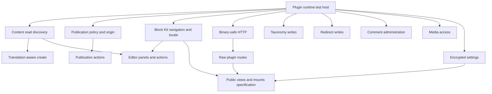

# Sandboxed plugin capability expansion plan

Status: Proposed

## Outcome

This plan expands the sandboxed plugin API into a portable, capability-gated surface that supports content governance, site maintenance, integrations, moderation, media processing, and host-rendered plugin interfaces. Each capability must work through the same public contract in native execution, Cloudflare Worker Loader, and Node.js workerd. Registry metadata, installation consent, test tooling, public documentation, and generated authoring guidance must describe the same authority.

The work is organized as one testing-foundation pull request, four short pull request stacks, and five independent pull requests. Public visitor views and conventional route mounts require a separate design decision before implementation. A capability is complete only when its contract, enforcement, consent, both sandbox bridges, production-boundary tests, documentation, and changeset land together.

## Decision

Build new capabilities on the repaired sandbox runtime and current authoring contract on `main`. Land a runtime-backed plugin test host before the capability stacks so each later pull request can prove behavior from a real host action through a real sandbox isolate.

After that testing foundation lands, deliver the first capability milestone in eight pull requests:

1. read-side schema and content discovery;
2. translation-aware content creation;
3. publication policy hooks and action origin;
4. plugin publication actions;
5. safe Block Kit navigation and admin locale context;
6. sandboxed content-editor panels and actions;
7. binary-safe outbound HTTP; and
8. raw plugin route requests and responses.

Taxonomy writes, redirect writes, comment administration, media access, and encrypted settings are independent vertical slices. They can proceed in parallel after the testing foundation. Safe public views and conventional route mounts remain behind a technical specification because they can affect first-party browser security and the logged-out request path.

Do not create a horizontal pull request that only adds every capability name. A capability declaration without its enforcement and consent boundary creates unused authority and makes later review less reliable.

## Current baseline

Sandboxed plugins are registry-distributed TypeScript modules that execute in isolated V8 runtimes. They reach EmDash through `PluginContext`, declared plugin storage, hooks, and named routes. The host renders Block Kit responses; plugin JavaScript does not run in the administrator's browser. Public pages accept structured metadata contributions, but arbitrary page fragments and Astro render components remain native-only.

The current public types are centered in:

- `packages/core/src/plugins/types.ts`;
- `packages/core/src/plugin-types.ts`;
- `packages/plugin-types/src/index.ts`;
- `packages/plugin-types/src/manifest-schema.ts`; and
- `packages/core/src/plugins/manifest-schema.ts`.

The runtime and runner boundaries are centered in:

- `packages/core/src/emdash-runtime.ts`;
- `packages/core/src/plugins/context.ts`;
- `packages/cloudflare/src/sandbox/`;
- `packages/workerd/src/sandbox/`; and
- `packages/plugin-test/`.

### Repaired sandbox baseline

The sandbox runtime routes isolated lifecycle, content, media, comment, email, cron, and page-metadata hooks through the shared host pipeline. The pipeline applies capability registration, priority, dependencies, timeout, error policy, enabled state, and exclusive-provider selection before invoking plugin code in Worker Loader or workerd.

Both runners use canonical capability names and expose plugin-scoped cron, content, media, HTTP, user, email, storage, and settings behavior through their bridges. Generated manifests and npm descriptors preserve hook, route, Model Context Protocol (MCP), settings, and field-widget metadata. Admin-generated settings are visible to sandbox code, lifecycle operations preserve exactly-once install semantics and cleanup ordering, and the production test suite includes a real host content action that reaches a real Worker Loader isolate.

Cloudflare reconstructs a WHATWG `Response` from a text body. The response object shape is portable, but arbitrary response bytes are not yet preserved. Binary-safe transport remains part of this capability plan.

`page:fragments` remains outside the sandbox boundary. Packaging warns about the declaration and the sandbox runtime excludes it.

## Goals

- Let a plugin discover the site's content model without hard-coded collection and field names.
- Let policy plugins inspect and cancel publication, scheduling, and unpublication without gaining permission to edit content.
- Let explicitly authorized plugins publish, unpublish, schedule, unschedule, and restore content through the same runtime behavior as REST, MCP, and the admin.
- Preserve translation groups, optimistic concurrency, revisions, taxonomy assignments, redirects, media usage, cache invalidation, and hook execution across plugin-initiated actions.
- Let Block Kit pages lead an administrator to the affected content and contribute bounded, entry-aware panels and actions.
- Support binary outbound requests and bounded raw inbound and outbound route bodies without exposing arbitrary first-party browser code.
- Add resource-specific APIs for taxonomies, redirects, comments, media, and encrypted settings with separate consent.
- Keep Cloudflare and Node.js behavior equivalent at the public API boundary.
- Give plugin authors a production-boundary test for every capability.

## Non-goals

- Do not give sandboxed plugins direct database, filesystem, process, or binding access.
- Do not let `content:write` implicitly publish content or restore deleted material.
- Do not let a read capability silently gain veto, mutation, or personal-data authority.
- Do not expose raw HTML, JavaScript, CSS, SVG, iframes, or arbitrary same-origin responses from sandboxed routes or public views.
- Do not let a runtime-installed plugin claim an arbitrary root path or existing Astro route from its manifest.
- Do not add schema writes in the first schema capability.
- Do not add taxonomy-definition management with ordinary term and assignment writes.
- Do not add comment deletion with ordinary moderation authority.
- Do not expose media storage keys, deployment secrets, signed preview URLs, password data, sessions, or passkeys.
- Do not add a query or plugin-discovery probe to logged-out routes that do not render a plugin view.
- Do not make intermediate branches in a stack independently deployable unless the branch defines and passes an explicit integration gate.

## Design invariants

### Explicit authority

Every material authority receives its own current capability name, `declaredAccess` representation, registry record, installation and update-consent description, runtime gate, and denial test. Existing installations do not gain new authority after an EmDash upgrade.

Capability implication is narrow and documented. A write capability may imply the matching read capability when the operation cannot be used safely without it. Content editing does not imply publication, restoration, revision-history access, or policy registration.

### Runtime-owned mutations

Plugin mutations call `EmDashRuntime` or shared handler-layer behavior. Sandbox bridges must not reproduce publication, revision, taxonomy, redirect, comment, or media business logic with direct SQL. Runtime-owned actions preserve hooks, authorization semantics, cache invalidation, media-usage maintenance, redirects, locale synchronization, and future invariants.

### Optimistic concurrency

Actions that change existing public or editorial state require an opaque precondition. Content actions use `_rev`. Redirect, taxonomy-term, and comment-status APIs need an equivalent version or expected-state guard before they expose replacement or destructive behavior.

A conflict returns a stable, non-retry-hiding result. A client must read the current state and recompute before retrying. Multi-entry operations remain resumable and report per-item results; the API must not imply cross-entry atomicity.

### Locale and translation identity

Content APIs preserve the row-per-locale model. An entry ID names one locale row. `translationGroup` names the logical entry across locales. New APIs must state whether they affect one row or the complete translation group.

Translation creation validates the source collection, locale, group identity, credits, non-translatable fields, and taxonomy assignments. A duplicate locale in one translation group fails closed even under concurrent creation.

### Personal and sensitive data

Comment, user, revision, and secret APIs expose different classes of sensitive data. Their consent descriptions name the data available to the plugin. The runtime redacts fields that the operation does not need.

Secrets are encrypted before persistence. Logs, errors, Block Kit responses, audit entries, and test snapshots must not contain secret plaintext, raw authorization headers, session state, or private media locations.

### Browser and route safety

The host validates every Block Kit response before rendering it. Browser-loaded resources and links use an allowlist or a host-resolved structured target. A sandboxed plugin cannot bypass `allowedHosts` by returning an arbitrary tracking image to the admin.

Raw routes use bounded, declared request and response modes. The host strips forbidden headers and refuses active same-origin response types. Default JSON routes retain their current envelope and behavior.

### Portable behavior

The public `PluginContext` is the contract. A method found in one wrapper but absent from the public type and other runner is not supported. Tests use shared behavior vectors across native execution, Cloudflare Worker Loader, Node.js workerd, and `@emdash-cms/plugin-test`.

### Logged-out performance

Schema discovery, content maintenance, and admin extension APIs run only when a plugin calls them. A public view runs only where a theme explicitly mounts it. Pages without a mounted view must retain their query count.

## Plugin test architecture

`@emdash-cms/plugin-test` keeps its direct isolate API for fast transport tests and adds a runtime-backed host for behavior that depends on EmDash orchestration. The API names the tested boundary so a test cannot present a direct hook call as proof that a real save, publication, lifecycle transition, scheduled tick, or authorized request reaches the plugin.

The existing `createPluginTestHost()` and its top-level `invokeHook()` and `invokeRoute()` methods remain available for backwards compatibility. Document them as transport-level operations.

Add an additive runtime-backed entry point:

```ts
const host = await createPluginRuntimeTestHost({
	site: {
		url: "https://example.test",
		locale: "en",
		trailingSlash: "never",
	},
	i18n: {
		defaultLocale: "en",
		locales: ["en", "fr"],
	},
});
```

The runtime host separates setup, actions, transport, and observation:

```ts
interface PluginRuntimeTestHost {
	readonly manifest: PluginManifest;

	transport: {
		invokeHook(name: string, event: unknown): Promise<unknown>;
		invokeRoute(name: string, input?: unknown, request?: PluginTestRequest): Promise<unknown>;
	};

	fixtures: PluginTestFixtures;
	actions: PluginTestActions;
	inspect: PluginTestInspectors;
	scheduled: PluginTestScheduler;

	restart(): Promise<void>;
	dispose(): Promise<void>;
}
```

### Fixture and action boundaries

`fixtures` creates initial state directly and does not fire plugin hooks. Fixture helpers return stable IDs and accept the metadata required by the domain. The foundation includes collections, fields, users, content, site configuration, and plugin state. Taxonomy, redirect, comment, media, and encrypted-setting fixtures land with their owning capability pull requests.

`actions` performs real host operations through `EmDashRuntime` and the handler layer. The foundation includes:

- content create, update, trash, permanent delete, publish, unpublish, schedule, unschedule, and restore;
- plugin install, activate, deactivate, update, and uninstall;
- media upload;
- public comment submission and administrative moderation;
- plugin route requests through the host dispatcher; and
- scheduled-task execution.

Action helpers accept the same actor, origin, revision, request, and authorization inputs as their production path. They return the production result rather than an invented test-only envelope.

`inspect` reads observable state without invoking plugin behavior. It covers content, plugin storage, key-value data, plugin settings, lifecycle status, scheduled tasks, and captured email. Domain inspectors grow with their owning capability pull request.

### Restart and time control

`restart()` terminates the runtime and sandbox runner, then creates a fresh runtime over the same database, plugin storage, media storage, and installed-plugin records. It does not preserve module or isolate memory. This boundary tests cold activation, install replay, persisted exclusive selection, scheduled tasks, and upgrade behavior.

The scheduler helper controls the effective test time and invokes the real scheduled-task driver. Tests do not call the `cron` hook directly when they need to prove task claiming, one-shot removal, retry, disabling, stale-lock recovery, or scheduled publication. If runtime code cannot accept an injected clock, add that seam in the testing-foundation pull request rather than editing cron rows from plugin tests.

### Route and administrator testing

The runtime host adds a request helper that exercises the same plugin-route dispatcher used by the Astro catch-all. It accepts a session user or token identity, permissions, scopes, headers, method, and body. The helper enforces authentication, authorization, cross-site request forgery protection, cache policy, and current JSON input behavior before the raw-route capability extends it.

Block Kit capability work adds `admin.loadPage()`, `admin.loadWidget()`, `admin.submit()`, and `admin.act()` on top of the same request helper. These methods return a validated `BlockResponse` and resolved host effects. They do not render React. Kumo markup, keyboard behavior, accessibility, and right-to-left layout remain browser-test responsibilities.

### Runner matrix

EmDash capability work runs one shared behavioral vector against native execution, Cloudflare Worker Loader, Node.js workerd, and the runtime-backed host. The generated plugin project keeps Worker Loader as its default test path. An opt-in Node/workerd matrix is appropriate for plugin authors that depend on response bytes, runtime-specific limits, or another runner-sensitive boundary; every generated plugin does not need to run both runners by default.

### Capability-owned helpers

Do not predict every domain API in the testing-foundation pull request. Extend the host with the owning capability:

| Capability work                | Test host addition                                                                           |
| ------------------------------ | -------------------------------------------------------------------------------------------- |
| Schema and translations        | Schema fixtures, translation groups, revision fixtures, and public-URL inspection            |
| Publication policy and actions | Actor and origin actions, revision conflicts, scheduler rejection, and reentrancy            |
| Block Kit                      | Validated page, widget, form, action, locale, and structured-link helpers                    |
| HTTP and raw routes            | External fetch interception, binary bodies, declared headers, body limits, and raw responses |
| Taxonomies and redirects       | Domain fixtures, assignment inspection, and versioned mutation state                         |
| Comments                       | Submission, moderation, personal-data, and notification inspection                           |
| Media                          | In-memory media storage, binary fixtures, byte limits, and metadata inspection               |
| Settings                       | Encrypted-value inspection, key rotation, tampering, and plaintext-absence checks            |

Do not add database mocks, manifest-literal snapshot helpers, or convenience APIs that only construct an event and assert the handler arguments. A runtime test triggers a production action and checks the resulting behavior or state. Direct isolate tests remain available when the transport itself is the subject.

## Capability contracts

The signatures below define the planning boundary. An implementation pull request may refine names and return envelopes, but it must preserve the authority, failure, and data-flow decisions in this document.

### Read-side schema and content discovery

Add `schema:read`, represented as `declaredAccess.schema.read`.

```ts
interface SchemaAccess {
	listCollections(): Promise<CollectionSchemaInfo[]>;
	getCollection(slug: string): Promise<CollectionSchemaInfo | null>;
}

interface CollectionSchemaInfo {
	slug: string;
	label: string;
	labelSingular: string | null;
	description: string | null;
	supports: string[];
	hasSeo: boolean;
	titleField: string | null;
	dateField: string | null;
	urlPattern: string | null;
	routable: boolean;
	hidden: boolean;
	fields: FieldSchemaInfo[];
}
```

`FieldSchemaInfo` includes the public field slug, label, type, required, unique, default, validation, widget options, searchable, indexed, translatable, and sort order. It excludes database IDs, internal timestamps, migration provenance, and raw SQL types.

Use the existing batched schema-registry listing rather than one query per collection. Database failures reject; they do not become an empty schema. Hidden collections remain visible because `hidden` is an admin-navigation property, not a security boundary.

Extend `ContentItem` under existing `content:read` with the safe identity needed by generic tools:

```ts
interface ContentItem {
	// Existing fields remain.
	authorId?: string | null;
	translationGroup?: string | null;
	liveRevisionId?: string | null;
	draftRevisionId?: string | null;
	version?: number;
}

interface ContentAccess {
	getTranslations?(
		collection: string,
		id: string,
	): Promise<{
		translationGroup: string;
		translations: ContentTranslationSummary[];
	}>;

	getPublicUrl?(collection: string, id: string): Promise<string | null>;
}
```

`getPublicUrl()` shares one resolver with sitemap, alternate-link, menu, and preview routing behavior. It accounts for `urlPattern`, Astro locale prefixes, custom locale paths, trailing-slash policy, routeability, publication status, and missing slugs. It returns `null` for content that has no public URL and never returns a signed preview URL.

Revision history can contain values that an administrator later removed. Add a separate `content:revisions:read` capability for `listRevisions()` and `getRevision()` rather than including history in ordinary `content:read`.

This work supports collection-agnostic content health, accessibility, operations, review, import, and localization plugins.

### Translation-aware content creation

Extend the existing create options additively:

```ts
interface ContentCreateOptions {
	locale?: string;
	translationOf?: string;
}
```

`translationOf` names an existing row in the same collection. Creation joins its translation group, preserves the repository's non-translatable field behavior, copies credits according to the existing content-translation path, and shares translation-group taxonomy assignments.

The implementation rejects a missing source, a source in another collection, an invalid locale, and a second row for the same locale and translation group. The uniqueness rule must be race-safe; a read-then-insert check without a database constraint or equivalent serialization is insufficient.

This work supports translation assistants, multilingual imports, GitHub content sync, and localization completeness workflows.

### Publication policy hooks and action origin

Add `hooks.content-policy:register`. Ordinary `content:read` does not grant authority to stop publication.

Add three synchronous policy hooks:

- `content:beforePublish`, invoked for manual, MCP, plugin, and scheduler publication;
- `content:beforeSchedule`, invoked when an editor or plugin schedules publication; and
- `content:beforeUnpublish`, invoked before live content is removed.

Do not add `beforeUnschedule`; an administrator must be able to cancel a future publication. A scheduled item runs `beforePublish` again when the scheduler attempts promotion because the content or policy may have changed since scheduling.

Use an explicit decision envelope:

```ts
type ContentPolicyDecision = void | { cancel: true; reason: string };

type ContentActionOrigin =
	| { source: "api" | "mcp" | "visual-editor" }
	| { source: "plugin"; pluginId: string }
	| { source: "scheduler" }
	| { source: "system" };
```

Keep `actor` for authenticated humans. Add `actor.source` only for the human entry path; do not create synthetic user IDs for a plugin or scheduler. Every policy event includes `origin`.

Validate a cancellation reason as 1 to 500 plain-text characters. Return stable `PUBLISH_REJECTED`, `SCHEDULE_REJECTED`, and `UNPUBLISH_REJECTED` codes without exposing exceptions. An explicit cancellation always wins. Unexpected failures follow the hook's error policy, with abort as the default.

Validate `_rev` before the hooks and again as part of the mutation precondition. A concurrent edit while a hook runs must cause the final action to conflict rather than publishing stale content.

When a policy explicitly rejects scheduler-driven publication, move the scheduled item to a needs-attention state or unschedule it with a stored public-safe reason. Do not retry a permanent policy rejection on every scheduler tick. Transient hook errors and timeouts remain retryable.

This work supports approval, compliance, retention, and publish-time content-quality plugins.

### Plugin publication actions

Add `content:publish`, which implies `content:read`, for publish, unpublish, schedule, and unschedule. Add separate `content:restore` authority for reading and restoring trashed content. Existing `content:write` installations do not gain either capability.

```ts
interface VersionedContentItem {
	item: ContentItem;
	_rev: string;
}

interface ContentAccess {
	getVersioned?(collection: string, id: string): Promise<VersionedContentItem | null>;

	publish?(
		collection: string,
		id: string,
		options: { _rev: string },
	): Promise<VersionedContentItem>;

	unpublish?(
		collection: string,
		id: string,
		options: { _rev: string },
	): Promise<VersionedContentItem>;

	schedule?(
		collection: string,
		id: string,
		options: { scheduledAt: string; _rev: string },
	): Promise<VersionedContentItem>;

	unschedule?(
		collection: string,
		id: string,
		options: { _rev: string },
	): Promise<VersionedContentItem>;

	getTrashedVersioned?(collection: string, id: string): Promise<VersionedContentItem | null>;

	restore?(
		collection: string,
		id: string,
		options: { _rev: string },
	): Promise<VersionedContentItem>;
}
```

The bridges call a host callback that routes into `EmDashRuntime.handleContent*`. They do not write status or revision columns directly. Add same-plugin, same-action, same-entry reentrancy detection so a policy hook cannot recursively publish its own entry.

Do not expose a `publishedAt` override in the first release. It can falsify historical publication dates and needs a separate use case and authority decision.

This work supports review cycles, autonomous publishing, expiry workflows, imports, and recovery tools.

### Taxonomy terms and assignments

Add `taxonomies:write`, represented as `declaredAccess.taxonomies.write`, and make it imply `taxonomies:read`.

The first API covers term creation and idempotent assignment deltas:

```ts
interface TaxonomyAccess {
	createTerm?(
		taxonomy: string,
		input: {
			label: string;
			slug?: string;
			parentId?: string | null;
			description?: string;
			locale?: string;
			translationOf?: string;
		},
	): Promise<TaxonomyTermInfo>;

	addEntryTerms?(
		collection: string,
		entryId: string,
		taxonomy: string,
		termIds: string[],
	): Promise<TaxonomyTermInfo[]>;

	removeEntryTerms?(
		collection: string,
		entryId: string,
		taxonomy: string,
		termIds: string[],
	): Promise<TaxonomyTermInfo[]>;
}
```

Use term IDs or translation-group IDs rather than unscoped slugs. Add and remove operations are set deltas so concurrent additions do not overwrite each other. Validate that the taxonomy is attached to the collection, the entry exists, every term belongs to the named taxonomy, locale constraints hold, and hierarchy rules prevent cycles.

Term replacement and deletion require an opaque row precondition. Taxonomy-definition create, update, delete, and collection attachment remain behind a future `taxonomies:manage` capability.

This work supports automatic classification, imports, frontmatter sync, bulk tagging, and content operations.

### Redirect reads and writes

Add `redirects:read` and `redirects:write`, with write implying read.

```ts
interface RedirectAccess {
	list(options?: RedirectListOptions): Promise<PaginatedResult<RedirectInfo>>;
	get(id: string): Promise<VersionedRedirect | null>;
	create(input: RedirectCreateInput): Promise<VersionedRedirect>;
	update(id: string, input: RedirectUpdateInput & { _rev: string }): Promise<VersionedRedirect>;
	delete(id: string, options: { _rev: string }): Promise<boolean>;
}
```

Reuse the existing redirect handlers for pattern, destination, duplicate, terminal-status, self-loop, and multi-hop loop validation. A plugin cannot set the host-owned automatic-redirect marker. Mutations invalidate redirect and loop caches only after success.

Installation consent states that the plugin can change where visitors are sent. Redirect mutation is not implied by content or schema authority.

This work supports broken-link repairs, permalink migration, slug-history tools, and imports.

### Block Kit navigation and UI locale

Validate every sandboxed page and widget response with the shared Block Kit validator before rendering. Apply one browser-resource policy to images and navigation so a plugin cannot cause the admin browser to load an unapproved tracking URL.

Add a structured navigation element:

```ts
interface LinkElement {
	type: "link";
	label: string;
	target:
		| { kind: "content"; collection: string; id: string; locale?: string }
		| { kind: "plugin-page"; path: string }
		| { kind: "plugin-settings" }
		| { kind: "external"; url: string };
	appearance?: "inline" | "primary" | "secondary";
}
```

The host constructs internal URLs. A plugin page target must name a route declared by the same plugin. External targets accept an explicit protocol allowlist and render with `noopener noreferrer`. A link never carries `action_id` and never dispatches a block action. Split form fields, action elements, and navigation elements in the type model rather than forcing every element into a form-shaped union.

Add host-attested UI context to Block Kit route calls:

```ts
interface PluginUiContext {
	surface: "admin-page" | "dashboard-widget" | "content-editor-panel";
	locale: string;
	direction: "ltr" | "rtl";
	contentLocale?: string;
}
```

Validate the admin locale against the enabled locale list. Keep the UI locale distinct from the content locale and `ctx.site.locale`. Sidebar labels require a later localized-text manifest shape; route context only localizes runtime Block Kit output.

This work supports direct repair links and localized dashboards for content quality, site health, review, retention, and synchronization plugins.

### Sandboxed content-editor panels and actions

Extend the manifest with bounded, collection-filtered panel and action declarations:

```ts
interface PluginAdminConfig {
	editorPanels?: Array<{
		id: string;
		title: string;
		route: string;
		collections?: string[];
		order?: number;
	}>;

	editorActions?: Array<{
		id: string;
		label: string;
		route: string;
		placement: "toolbar" | "overflow";
		collections?: string[];
		style?: "default" | "danger";
		confirm?: ConfirmDialog;
	}>;
}
```

The host invokes the route with an attested context containing collection, entry ID, content locale, version, and panel or action ID. The first release does not send unsaved field values. A plugin reads saved content through `ctx.content`, preserving capability consent.

The host re-fetches and authorizes the entry instead of trusting browser-supplied identity. Manifest filters control presentation only; the route permission remains the authorization boundary. Panels load when expanded and fail independently. Actions return bounded effects such as a toast, entry refresh, or host-resolved navigation target.

This work supports inline findings, review deadlines, legal holds, derived-field previews, and bounded repairs.

### Binary-safe outbound HTTP

Use one wire representation for both sandbox runners:

```ts
interface PluginHttpResponseWire {
	status: number;
	statusText: string;
	headers: Array<[string, string]>;
	finalUrl: string;
	redirected: boolean;
	body: Uint8Array;
}
```

Cloudflare RPC carries bytes directly. The workerd JSON transport may base64-encode them. Reconstruct a buffered WHATWG `Response` with working `text()`, `json()`, `arrayBuffer()`, `blob()`, `clone()`, URL, redirect state, and headers.

Enforce decoded request and response byte limits while reading the stream, not only from `Content-Length`. Preserve redirect-hop host checks, server-side request forgery protection, and credential stripping on cross-origin redirects. Document that sandbox responses are buffered rather than streamed.

This work supports media imports, OCR, scanners, attachment synchronization, and binary external APIs.

### Raw route requests and responses

Extend route metadata additively:

```ts
interface PluginRouteOptions {
	methods?: Array<"GET" | "HEAD" | "POST" | "PUT" | "PATCH" | "DELETE">;
	request?: {
		body: "none" | "json" | "text" | "bytes" | "form-data";
		maxBytes?: number;
		headers?: string[];
	};
	response?: "json" | "raw";
}
```

Absent options preserve the current method-agnostic, parsed-input, JSON-envelope behavior. The host enforces a declared method before sandbox invocation and returns `405` with `Allow` for other methods.

Do not rely on native `Response` cloning across both sandbox RPC mechanisms. Use an explicit response builder and wire envelope:

```ts
return pluginResponse({
	status: 201,
	headers: { "content-type": "text/csv" },
	body: { kind: "bytes", value: bytes },
});
```

The host bounds raw bodies, multipart part counts, filenames, individual part sizes, total response size, and declared incoming headers. It strips cookies, EmDash authorization, Cloudflare Access headers, CSRF headers, `Set-Cookie`, and hop-by-hop response headers. It refuses HTML, JavaScript, XHTML, SVG, and other active same-origin response types from a sandbox.

Raw body access alone does not make a webhook verifier safe. A route must declare the signature headers it needs, and the plugin must validate the signature before processing the body.

This work supports signed webhooks, CSV and calendar downloads, feeds, uploads, and zero-JavaScript forms.

### Comment reads and moderation

Add `comments:read` and `comments:moderate`, with moderate implying read.

```ts
interface CommentAccess {
	get(id: string): Promise<PluginComment | null>;
	list(options?: {
		status?: "approved" | "pending" | "spam";
		collection?: string;
		contentId?: string;
		limit?: number;
		cursor?: string;
	}): Promise<PaginatedResult<PluginComment>>;
	count(options?: CommentCountOptions): Promise<number>;
	setStatus(
		id: string,
		status: "approved" | "pending" | "spam",
		options: { expectedStatus: "approved" | "pending" | "spam" },
	): Promise<PluginComment>;
}
```

Consent for `comments:read` names author email, comment body, pseudonymous IP hash, user agent, and moderation metadata. If a use case does not need all of those fields, define a redacted result rather than treating `comments:read` as a shortcut to `users:read`.

`setStatus()` uses the core moderation service, compares the expected state, fires `comment:afterModerate` once, preserves approval notifications, and identifies the origin as the calling plugin. The first release excludes hard deletion and bulk replacement.

This work supports deterministic spam filtering, moderation queues, abuse analytics, digests, and retention review.

### Media metadata and bytes

Keep three authorities separate:

- `media:read` returns expanded safe metadata;
- `media:bytes:read` reads stored bytes; and
- `media:metadata:write` changes alt text, captions, and focal point.

Expanded metadata may include dimensions, alt text, caption, focal point, readiness status, content hash, blurhash, dominant color, and folder ID. It excludes the storage key and author identity.

```ts
interface MediaAccess {
	readBytes?(
		id: string,
		options?: { maxBytes?: number },
	): Promise<{
		bytes: Uint8Array;
		filename: string;
		mimeType: string;
		size: number;
		contentHash?: string;
	}>;

	updateMetadata?(
		id: string,
		patch: {
			alt?: string | null;
			caption?: string | null;
			focalX?: number | null;
			focalY?: number | null;
		},
	): Promise<MediaItem>;
}
```

Read only ready media. Enforce the byte limit against the actual stream. Metadata authority does not imply upload, replacement, or deletion.

This work supports duplicate detection, accessibility audits, EXIF privacy checks, OCR, derivative generation, and asset normalization.

### Encrypted plugin settings

Unify the generated settings form and sandbox settings store before adding encryption. Add `ctx.settings` and retain `ctx.kv.get("settings:key")` as a compatibility alias while existing plugins migrate.

Secret values use an authenticated envelope:

```ts
interface EncryptedPluginSetting {
	v: 1;
	kid: string;
	iv: string;
	ciphertext: string;
}
```

Use AES-GCM with additional authenticated data containing the plugin ID and setting key. Encrypt with the first configured key and decrypt by `kid` against the configured key list. Existing plaintext secrets remain readable during migration; saving them again encrypts them. A missing, wrong, or tampered key fails closed without logging the value.

The admin continues to return only whether a secret is set. Tests inspect the database and logs to confirm that plaintext is absent. Backup and restore documentation must state which encryption material is required for recovery.

This work supports authenticated GitHub sync, webhook verification, protected crawlers, and external APIs without storing credentials as ordinary JSON.

### Safe public views and conventional mounts

Public views require a separate technical specification. The initial direction is an explicit Astro component:

```astro
<PluginView plugin="@publisher/newsletter" view="signup" props={{ list: "news" }} />
```

The plugin returns a bounded semantic tree containing text, headings, stacks, lists, safe links, approved images, and form controls. It cannot return HTML, scripts, styles, classes, arbitrary attributes, iframes, or remote embedded resources. Forms post only to a declared public route belonging to the same plugin.

The theme opts in at a specific render site. Identical calls are request-cached. A missing, disabled, or failed plugin renders a bounded fallback and does not break the page. Pages without `<PluginView>` add no query or discovery work.

Runtime-installed plugins do not choose root mounts. If conventional paths are required, the site owner declares an exact static mapping in EmDash or Astro configuration. Build or startup validation rejects conflicts, reserved prefixes, existing Astro routes, `/`, and duplicate ownership. Changing a mount requires a deployment.

## Plugin opportunity map

The capability order is driven by useful plugins rather than by the number of API methods. The following table maps the principal plugin ideas to the capabilities they need.

| Plugin                       | Required capabilities                                                                               | Result                                                                                                                 |
| ---------------------------- | --------------------------------------------------------------------------------------------------- | ---------------------------------------------------------------------------------------------------------------------- |
| Content Guard                | schema and content discovery, Block Kit links, editor panels, publication policy                    | Reports and optionally blocks accessibility, style, SEO-field, readability, and duplicate-content failures             |
| Site Doctor                  | public URL resolution, binary-safe HTTP, Block Kit links, redirects                                 | Crawls rendered pages and offers bounded repairs for broken links, metadata, redirects, and accidental indexing states |
| Content Operations Workbench | schema discovery, content writes, publication actions, taxonomy and redirect writes, editor actions | Previews and executes resumable field, taxonomy, redirect, and lifecycle operations                                    |
| Comment Shield               | comment reads and moderation, existing comment hooks and storage                                    | Applies deterministic spam, repetition, reputation, and rate rules without an external model                           |
| Review Cycle                 | public URL and ownership reads, publication policy and actions, existing cron and email             | Tracks review deadlines, sends reminders, and performs explicitly authorized lifecycle actions                         |
| Retention Guard              | publication policy, content identity, editor panels                                                 | Prevents unpublication or publication that violates a hold or retention rule                                           |
| Newsletter                   | raw routes, encrypted settings, public views, existing email and storage                            | Provides subscription, confirmation, unsubscribe, publish-triggered delivery, and an admin view                        |
| GitHub content sync          | encrypted settings, raw routes, translation creation, taxonomy writes, publication actions          | Imports repository content into drafts and optionally publishes through the same policy boundary                       |
| Media processor              | binary-safe HTTP, media metadata and byte access                                                    | Performs duplicate detection, metadata extraction, privacy checks, OCR, or derivative creation                         |

Existing audit-log, webhook-notifier, forms, AT Protocol, embeds, Field Kit, AI moderation, and Cloudflare search plugins are not repeated by this plan. Core already owns redirects, backups, content duplication, comment-author notifications, sitemaps, robots, baseline social metadata and JSON-LD, and 404 logging. The capabilities above let plugins inspect or operate those domains without replacing their core implementation.

## Work organization

Do not place every capability in one linear stack. Land the testing foundation first. Four short stacks then carry real code dependencies. Five resource-specific pull requests branch independently from `main` and can be reviewed in parallel.



### Testing foundation

#### PR 0: runtime-backed plugin test host

Base: `main`.

Keep `createPluginTestHost()` for direct isolate tests. Add `createPluginRuntimeTestHost()` with the transport, fixtures, actions, inspectors, scheduler, restart, site, locale, user, and request boundaries defined in [Plugin test architecture](#plugin-test-architecture).

The foundation exposes only shipped EmDash actions and general fixtures. Each capability pull request adds its own domain methods and assertions. Acceptance requires one content, lifecycle, route, media, comment, cron, restart, and authorization journey through the real runtime and Worker Loader isolate. The package's conformance suite runs equivalent core journeys against Node.js workerd.

### Stack A: content discovery and translation

#### PR 1: content read discovery

Base: PR 0.

Deliver `schema:read`, safe `ContentItem` identity fields, `getTranslations()`, `getPublicUrl()`, and separately gated revision reads. Share one public shape and behavior suite across all adapters.

Acceptance requires:

- no schema query unless a plugin calls the API;
- batched collection and field listing;
- no preview URL or removed revision data under ordinary `content:read`;
- route-pattern and locale-aware public URLs; and
- registry consent and denial behavior for both read capabilities.

#### PR 2: translation-aware create

Base: PR 1.

Deliver `translationOf` with race-safe group-and-locale uniqueness, same-collection validation, credits, non-translatable fields, and taxonomy assignment behavior.

Acceptance requires equivalent native, Cloudflare, and workerd results plus realistic concurrent-create tests.

### Stack B: publication governance

#### PR 3: publication policy and origin

Base: PR 0.

Deliver `hooks.content-policy:register`, the three policy hooks, `ContentActionOrigin`, validated cancellation envelopes, scheduler needs-attention behavior, and shared trusted/sandbox ordering.

Acceptance requires manual, API, MCP, visual-editor, plugin, scheduler, and system origin tests. A rejected or failed policy hook must not change revision pointers or public state.

#### PR 4: publication actions

Base: PR 3.

Deliver `content:publish`, `content:restore`, versioned reads, runtime-routed state actions, same-action reentrancy rejection, and after-hook behavior.

Acceptance requires parity with REST and MCP for draft promotion, locale synchronization, redirects, scheduling fences, media usage, cache invalidation, and conflicts.

### Stack C: Block Kit navigation and editor context

#### PR 5: Block Kit navigation and locale

Base: PR 0.

Centralize Block Kit response validation and browser resource policy. Add structured links and attested UI locale/direction. Verify Kumo rendering, keyboard operation, external-link attributes, and Arabic right-to-left layout.

#### PR 6: editor panels and actions

Base: PR 5 and after the read-side contract from PR 1 is available.

Deliver manifest declarations, host-attested saved-entry context, lazy panel loading, route authorization, destructive confirmation, bounded effects, and failure isolation. Do not send unsaved content in the first release.

### Stack D: sandbox transport

#### PR 7: binary-safe HTTP

Base: PR 0.

Deliver one response wire format, byte limits, real buffered `Response` behavior, redirects, and shared invalid-byte fixtures on both runners.

#### PR 8: raw plugin routes

Base: PR 7.

Deliver route methods, declared body modes and headers, multipart limits, the raw response envelope, forbidden response headers and content types, and registry consent for routes that become public.

### Independent resource pull requests

#### PR 9: taxonomy writes

Deliver `taxonomies:write`, term creation, idempotent assignment deltas, hierarchy and locale validation, capability consent, and cache invalidation. Taxonomy-definition management remains out of scope.

#### PR 10: redirect writes

Deliver `redirects:read/write`, versioned mutations, existing loop and terminal-status behavior, host-owned automatic redirects, and visitor-routing consent copy.

#### PR 11: comment administration

Deliver `comments:read/moderate`, personal-data consent, cursor queries, counts, expected-status mutation, approval notification behavior, and recursion-safe moderation hooks. Deletion remains out of scope.

#### PR 12: media access

Deliver expanded safe metadata, `media:bytes:read`, `media:metadata:write`, real storage-adapter tests, byte limits, and proof that storage keys and author identity do not cross the boundary.

#### PR 13: encrypted settings

Unify generated settings with sandbox reads. Deliver `ctx.settings`, compatibility reads through `ctx.kv`, authenticated encryption, rotation, plaintext migration, redacted errors, and backup recovery guidance.

### Deferred specification

Write and approve the safe public views and conventional mounts specification after PRs 5, 8, and 13 stabilize the UI, route, and settings contracts. Split implementation into at least the host-rendered view protocol and the site-owner mount configuration. Do not append that work to Stack C or D.

## Pull request rules

Every capability pull request is a vertical slice. It includes:

1. public TypeScript types and capability names;
2. `declaredAccess` conversion and implication rules;
3. shared and core manifest validation;
4. registry lexicon and generated-type changes where required;
5. plugin CLI validation and generated artifacts;
6. installation and update-consent display;
7. core context or runtime callbacks;
8. Cloudflare bridge and wrapper behavior;
9. workerd bridge and wrapper behavior;
10. `@emdash-cms/plugin-test` fixtures and helpers;
11. public documentation, canonical skill, and generated skill source;
12. a reviewed changeset for every affected published package; and
13. denial, failure, concurrency, and production-boundary tests.

Keep stack branches internally consistent. A lower branch cannot expose a callable method whose authority or failure semantics land only in an upper branch. If a shared helper is needed by two independent stacks, land it with the first complete capability that uses it or extract a small prerequisite with its own behavior test; do not create a speculative framework.

Use separate worktrees for independent pull requests. One integration owner handles root package files, the lockfile, shared generated registry files, capability catalogs, and final stack rebases to reduce conflicts.

## Verification matrix

Each capability runs the smallest relevant tests during development and the complete matrix before its pull request is ready.

| Boundary           | Required evidence                                                                                                                             |
| ------------------ | --------------------------------------------------------------------------------------------------------------------------------------------- |
| Public contract    | Type tests and manifest-schema fixtures accept valid authority and reject unknown or malformed declarations                                   |
| Declared access    | Capability conversion, implication, consent diff, install, update, downgrade, and legacy-manifest tests                                       |
| Native context     | Handler-layer behavior, supported SQLite and PostgreSQL parity where database code is shared                                                  |
| Cloudflare sandbox | Real Worker Loader wrapper and bridge tests with D1 and configured media storage where relevant                                               |
| Node.js sandbox    | Real workerd runner and authenticated backing-service tests                                                                                   |
| Host event         | A real runtime event or route reaches a real isolate and returns through the host boundary                                                    |
| Registry artifact  | Bundle, manifest, descriptor, registry record, installation preview, and installed state round-trip the capability                            |
| Admin UI           | Kumo rendering, Lingui strings, keyboard access, error isolation, and Arabic right-to-left behavior                                           |
| Concurrency        | Stale revision, expected-state, duplicate creation, reentrancy, lost response, and bounded retry behavior                                     |
| Security           | Capability denial, cross-plugin isolation, personal-data redaction, secret redaction, request limits, and unsafe URL/header/content rejection |
| Performance        | No logged-out query increase outside an explicitly mounted public view; review query-count snapshots                                          |
| Documentation      | Public guide, API reference, canonical and generated skill, code samples, links, and upgrade implications agree with implementation           |

`@emdash-cms/plugin-test` retains direct hook and route invocation as a transport-level tool. Add runtime-backed helpers for capabilities that depend on host events, authorization, lifecycle, scheduling, or cache behavior. Documentation must state which boundary each helper proves.

## Integration gates

### G0 Runtime test foundation

PR 0 passes. The direct isolate host remains compatible, and the runtime host proves content, lifecycle, route, media, comment, cron, restart, and authorization journeys through a real Worker Loader isolate. Equivalent core journeys pass against Node.js workerd. Fixtures and production actions have separate namespaces and documented hook behavior.

G0 unblocks every capability pull request.

### G1 Read and navigation

PRs 1, 2, and 5 pass their capability, locale, browser-resource, and production-boundary tests. A generic plugin can discover collections, inspect content identity, create a translation, and link an administrator to the saved entry without hard-coded routes.

G1 unblocks Content Guard, localization tools, and the editor-panel stack.

### G2 Publication governance

PRs 3 and 4 pass manual, scheduler, MCP, plugin-origin, concurrency, reentrancy, and cache-invalidation tests. A plugin can stop publication without edit authority, and a separately authorized plugin can publish only through the same policy boundary.

G2 unblocks approval, review-cycle, retention, and autonomous publishing plugins.

### G3 Admin and transport

PRs 6, 7, and 8 pass UI, binary, raw-body, header, content-type, and real-isolate tests. A plugin can present an entry-aware panel and receive or return bounded non-JSON data without executing code in the browser.

G3 unblocks Site Doctor repair flows, signed webhooks, downloads, and GitHub sync.

### G4 Resource APIs

PRs 9 to 13 pass their domain authorization, personal-data, concurrency, storage, and recovery tests. Each capability can ship independently when its own tests and documentation are complete.

G4 unblocks the full content operations, comment moderation, media processing, and authenticated integration set.

### G5 Public view decision

The public-view specification proves escaping, URL and form-action confinement, output limits, explicit theme opt-in, failure behavior, and zero queries on pages without a mounted view. Conventional mounts prove build-time conflict detection and no dynamic route discovery on unrelated requests.

G5 unblocks implementation of newsletter, feedback, rating, related-content, and other visitor-facing components.

## Compatibility and rollout

- Add every method and field without removing the existing shape.
- Keep optional context properties and methods for compatibility while capabilities are negotiated at runtime.
- Normalize deprecated manifest capability names only at existing compatibility boundaries. New authoring accepts current names.
- Require renewed installation consent when a plugin release expands authority.
- Keep existing plugin installations active when they do not request a new capability.
- Do not backfill plugin state merely because a capability becomes available.
- Use forward-only migrations for any persisted revision, translation, redirect, moderation, or encrypted-setting state.
- Make migrations restartable after any completed statement and test partial completion on D1.
- Release shared types, core, both runners, plugin test, CLI, registry packages, and admin changes in one compatible release set for each capability.
- Keep experimental public-view wire formats explicitly versioned until the specification and conformance matrix are complete.

## Documentation plan

Each vertical pull request updates the canonical page for its surface:

- plugin capability and consent reference;
- hooks or API routes;
- storage and settings;
- Block Kit and admin extensions;
- testing guidance;
- the canonical `skills/creating-plugins` source;
- the generated skill template used by `emdash-plugin init`; and
- the package changeset.

User-facing documentation describes only merged behavior. This plan remains the source for unimplemented contracts and work organization. Do not copy proposed signatures into evergreen authoring guides before their integration gate passes.

## Decisions to confirm during implementation

The following decisions need concrete values or final names in their owning pull request. They do not change the authority boundaries in this plan.

- The maximum decoded outbound response size for sandbox HTTP.
- Default and maximum raw request, multipart part, and raw response sizes.
- The persisted representation and admin workflow for scheduler policy rejection.
- The opaque revision representation for redirects and taxonomy terms.
- Whether `comments:read` returns all personal fields or offers a default redacted view plus an additional personal-data capability.
- Whether expanded media metadata includes content hash for ordinary `media:read` or only `media:bytes:read`.
- The compatibility lifetime of `ctx.kv.get("settings:key")` after `ctx.settings` ships.
- The localized manifest-label representation for plugin navigation and editor extensions.

## Completion criteria

The capability program is complete when:

- every capability in this plan has one enforced authority and one consent description;
- native, Cloudflare, and workerd execution produce equivalent public results;
- the registry bundle, generated npm descriptor, installed state, and test host preserve the complete contract;
- a content policy plugin can stop a human, agent, plugin, or scheduler publication without edit authority;
- a separately authorized plugin can publish, translate, classify, redirect, moderate, and process media without bypassing core handlers or optimistic concurrency;
- Block Kit pages can navigate to affected content and contribute localized entry-aware interfaces without loading unapproved browser resources;
- raw routes and outbound HTTP preserve bounded binary data without enabling first-party script execution;
- secrets are encrypted and recoverable with documented key material;
- pages that do not mount a public plugin view retain their logged-out query count; and
- public documentation and generated authoring guidance contain no planned behavior presented as shipped behavior.
- the plugin test package distinguishes direct transport checks from real host actions and can reproduce cold restart, scheduled execution, authorization, and persisted-state behavior.
