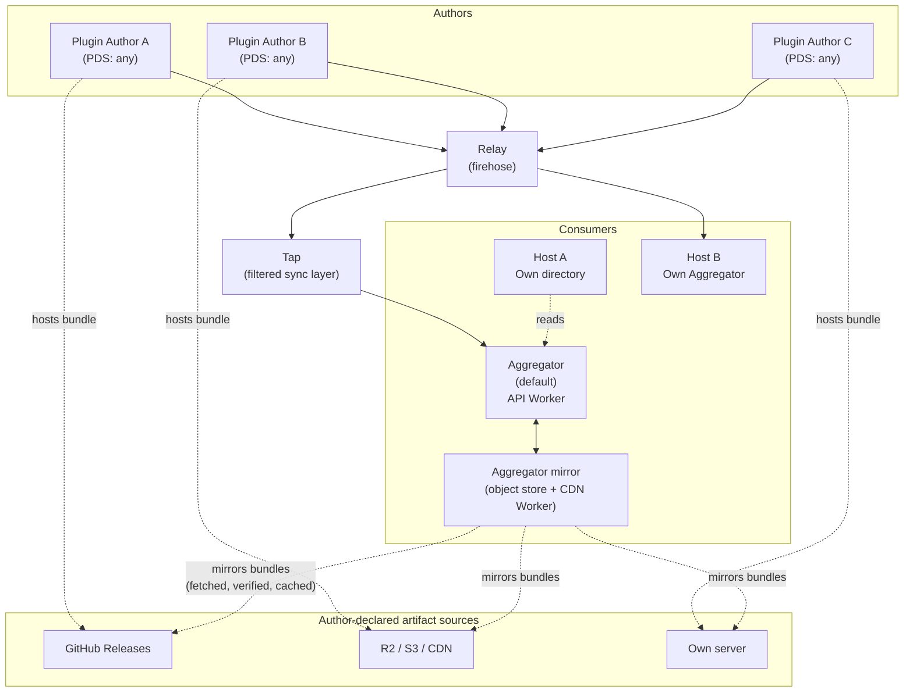
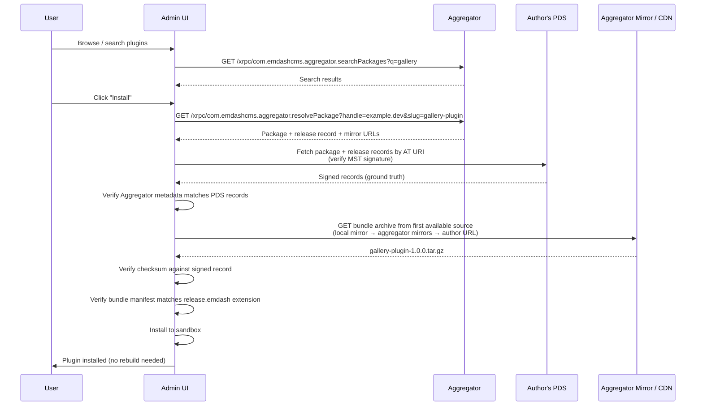
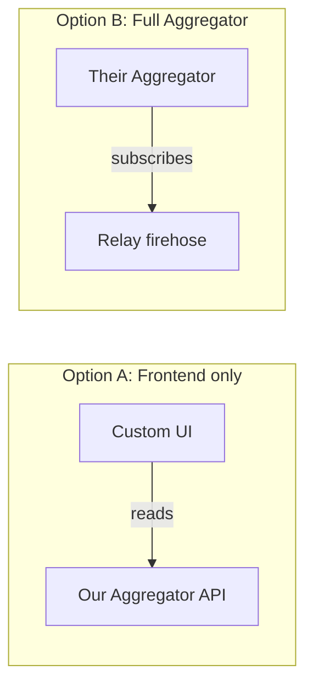

# RFC: Decentralized Plugin Registry

# Summary

This RFC proposes a decentralized plugin registry for EmDash that combines the data model from the [FAIR](https://fair.pm/) package management protocol with the identity and real-time distribution graph of the [AT Protocol](https://atproto.com/).

Under this architecture:

- Authors publish metadata records to their own atproto repositories (PDS).
- Plugin bundles (`.tar.gz` archives) are hosted by the author anywhere on the web.
- EmDash aggregators subscribe to the atproto firehose to index these records and provide fast search APIs.
- EmDash CMS installations verify plugin integrity via cryptographic signatures natively provided by atproto.

This registry is exclusively for **sandboxed plugins** — those running in isolated Worker sandboxes with declared capability manifests.

Because the sandbox provides safety assurance, the registry's primary goal is to prove _provenance_: authors retain full ownership of their distribution without relying on a centralized authority. Native plugins (npm-distributed) remain out of scope for this RFC.

# Example

A plugin author publishes a sandboxed plugin:

```bash
# Authenticate with your Atmosphere account
$ emdash plugin login
# Opens OAuth flow in browser, stores credentials locally

# Scaffold a new plugin project
$ emdash plugin init
# Creates a manifest.json with prompts for name, description, etc.

# Publish a release with an already-hosted artifact
$ emdash plugin publish --url https://github.com/example/gallery/releases/download/v1.0.0/gallery-plugin-1.0.0.tar.gz
# Fetches the bundle to compute the hash, creates a pm.fair.package.profile record
# on first publish, then creates a pm.fair.package.release record carrying EmDash
# extension data (capabilities, allowed hosts) under the com.emdashcms.* namespace.
```

A CMS user installs the plugin from the admin UI: they search the registry, pick a plugin, and install it with a click. The package record is stored in the author's own atproto repository, signed by their keys, and indexed by an aggregator for discovery.

# Background & Motivation

Centralised plugin registries create single points of failure, control and trust. When one organisation controls the registry, they control the supply chain. We've seen this play out repeatedly:

- The WordPress ecosystem's dependency on WordPress.org and the governance disputes that led to FAIR.
- npm's `left-pad` incident, where a single package removal broke thousands of builds.
- RubyGems, PyPI and other registries where a compromised account can push malicious updates to thousands of consumers.

In all of these cases, the root problem is the same: a central registry that conflates identity, hosting, discovery and trust into a single service under a single operator's control.

We want a plugin ecosystem where:

- Authors own their identity and their package metadata. It lives in their own repository, signed by their own keys, and is portable if they move providers.
- Anyone can host artifacts. There is no requirement to upload to a blessed server.
- Anyone can run a directory. Multiple competing directories can index the same package data with different curation, moderation and presentation.
- No single point of failure. If the primary aggregator goes down, plugins can still be resolved directly from the author's Personal Data Server.
- Trust signals (security audits, SBOM verification, vulnerability disclosure, publisher verification) are layered on top of the registry by independent labellers, not baked into the protocol.

Two existing protocols solve overlapping pieces of this problem:

- **[FAIR](https://fair.pm/)** is a Linux-Foundation-backed federated package protocol, originally targeted at the WordPress ecosystem and now also serving TYPO3. FAIR provides identity (W3C DIDs), signing, the aggregator/labeller architecture, mirror semantics, and a trust model with a site-side policy engine. FAIR's protocol is intentionally designed for any digital goods, not exclusively software, and is built around an HTTP repository API that any host (including a static host like GitHub Pages) can serve.
- **atproto** provides DID-anchored identity, signed repository data, real-time event distribution via a global firehose, a labeller architecture (Ozone) that FAIR has explicitly aligned with, and a mature developer ecosystem with reference implementations and tooling across many languages.

The two protocols are fundamentally aligned in philosophy, and increasingly aligned in architecture. FAIR has adopted atproto-style schema evolution rules (FAIR PR #79), utilizes atproto's `did:plc` natively, and is exploring the use of Ozone for labelers (FAIR #49). FAIR's protocol design explicitly cites atproto's aggregator pattern as inspiration.

This RFC therefore proposes that EmDash plugins be published using **FAIR package schemas over an atproto transport**. FAIR's protocol provides the package and release record shape, the trust model, and the mirror semantics; atproto provides the publishing transport, identity substrate, and firehose discovery. EmDash-specific concerns (capability declarations, sandbox bundle format, runtime distinction) live in a `com.emdashcms.*` extension.

Crucially, because EmDash has no installed base of FAIR-published packages, publishers use a single Publisher DID (their atproto identity) and the AT URI of each record as the package identity. This eliminates FAIR's legacy requirement of registering a separate DID for every individual package. See [Relationship to FAIR](#relationship-to-fair) for details.

# Goals

- **Zero-infrastructure publishing.** A plugin author needs only an Atmosphere account (their atproto identity) and a URL where they host their bundle artifact. Any Atmosphere account provider can be used: e.g. Bluesky, Tangled, npmx. No separate FAIR repository server is needed.
- **One identity for everything.** The author's atproto DID is their FAIR Publisher DID, their atproto signing identity, and the trust root for every package they publish. One key, one document, one account.
- **Decentralised discovery.** Aggregators subscribe to the atproto firehose for `pm.fair.package.*` records and build their own index. Anyone can run an aggregator. EmDash sites can talk to any FAIR-compatible aggregator.
- **Near-real-time updates.** Publishing a record propagates through the firehose with seconds-level latency under normal conditions, with occasional minutes-level lag during relay incidents. New releases reach aggregators (and from there, sites) without crawl-cycle delays. Deprecation and yank signals — applied via labellers in FAIR's trust model — propagate through the same channel.
- **Cryptographic integrity.** Every record is signed as part of the author's atproto repository (transitive MST signing). Artifact integrity is verified via multibase checksums on each artifact, signed transitively by the publisher's identity.
- **Portability.** Authors can migrate their atproto account between PDSes without losing their packages. The DID and all package records move with them; aggregators re-resolve and continue indexing.
- **Cross-ecosystem trust signals.** A labeller built for FAIR — security audit, SBOM verification, CRA compliance, publisher verification — works for EmDash plugins without modification, because labels are the same atproto-compatible records FAIR already specifies. EmDash operates its own publisher verification on top of this (see [Publisher Verification](#publisher-verification)).
- **Replace the existing centralised marketplace.** This RFC is not additive: it fully replaces EmDash's current first-party marketplace mechanism in a single rollout. See [For existing marketplace installs](#for-existing-marketplace-installs) for the migration plan.

# Non-Goals

- **Replacing atproto infrastructure.** We do not build or run a PDS, relay, or DID directory. We use existing atproto infrastructure.
- **Supporting non-atproto FAIR transports.** EmDash publishers do not publish to FAIR HTTP repositories. The atproto transport is the only publishing surface EmDash uses. FAIR aggregators that subscribe to the atproto firehose index EmDash records natively (a firehose-aware FAIR aggregator and an atproto AppView are the same thing under different names); aggregators that only support HTTP-polling will not see EmDash plugins, which is fine for now. We do not specify or build a bridge between the two transports.
- **Forking FAIR.** Where this RFC adopts FAIR's protocol shape (record fields, trust model, labeller architecture, extension mechanism), it does so as-specified, with contributions back where the shape needs to extend (notably the lexicon definitions for an atproto transport and the Publisher-Trust-without-per-package-DID mode). EmDash's design does not require FAIR to accept these contributions; see [Relationship to FAIR](#relationship-to-fair).
- **Mandating a specific artifact host.** Authors choose where to host their bundle artifacts. The aggregator may mirror artifacts it indexes, as FAIR's protocol already permits.
- **Trust and moderation primitives.** Reviews, reports, and the specific labellers EmDash trusts by default are planned but specified in a follow-on RFC. The protocol substrate (FAIR's labeller architecture, atproto-compatible signed labels via Ozone) is established here only by reference.
- **Supporting private/authenticated packages.** Paid and private plugins are a future extension. FAIR has draft support for commercial packages and authentication; we follow that work rather than reinvent it.
- **Inter-plugin dependency resolution.** FAIR's `requires`/`suggests` mechanism handles host-version constraints (`env:emdash`, `env:astro`); per-plugin peer declarations are deferred to a follow-on RFC.
- **Native plugins.** This registry covers sandboxed plugins exclusively. Native plugins (npm-distributed Astro integrations with full platform access) continue to be installed via `npm install` and configured in `astro.config.mjs`. They are not indexed by the aggregator, not surfaced in the admin UI's install flow, and have no records in this registry.

  This RFC does not specify how native plugins are discovered or how they integrate with the trust layer; see [Future support for native plugins](#future-support-for-native-plugins) for what a follow-on RFC would address and why we've deferred it.

# Relationship to FAIR

The registry described in this RFC borrows heavily from the [FAIR](https://fair.pm/) protocol's data model and trust architecture, but implements them over an atproto transport rather than HTTP.

EmDash plugins are structured as FAIR packages with a `com.emdashcms.*` extension that defines EmDash-specific concerns (sandbox capabilities, bundle conventions).

### Shared Concepts

- **Data Model:** The schema for package profiles and releases matches FAIR's definitions (including fields, CRA compliance metadata, and mirror semantics).
- **Identity:** EmDash uses W3C DIDs (specifically `did:plc` and `did:web`), which are supported by both atproto and FAIR.
- **Trust Architecture:** EmDash adopts FAIR's aggregator and labeler architecture (which FAIR is aligning with Bluesky's Ozone).

### Points of Divergence

- **Transport and Discovery:** EmDash does not use FAIR's HTTP repository API. Records are distributed via the atproto firehose and indexed by aggregators.
- **Record Structure:** FAIR embeds all releases inside a single Metadata Document. To optimize for the firehose, EmDash separates these into discrete `package.profile` and `package.release` records co-located in the publisher's repository; clients enumerate releases by listing the release collection on the PDS rather than following a HAL link.
- **Signing:** EmDash relies entirely on atproto's repo-level Merkle Search Tree (MST) signatures. It does not require or use the separate per-artifact `signature` field defined in FAIR Core. See [Trust model trade-offs](#trust-model-trade-offs) below.
- **Package Identity:** FAIR typically requires a unique DID for every package. EmDash uses a "Publisher-Trust" model where the AT URI (e.g., `at://<publisher-did>/.../<slug>`) serves as the unique package identifier, eliminating the need for per-package DIDs. See [Trust model trade-offs](#trust-model-trade-offs) below.

### Trust model trade-offs

FAIR's per-package DID model and EmDash's publisher-trust model both work; each gives up something the other gets for free. We've chosen the publisher-trust path deliberately, but the trade-offs are worth being explicit about so future readers understand which properties they're getting and which they aren't.

What FAIR's per-package DID model gives, and EmDash gives up:

- **Package transferability across publishers.** A FAIR package's identity travels with the package, so an OSS project handover or a commercial sale can move a package from one publisher to another without breaking its identity for downstream consumers. EmDash packages are identified by the publisher's DID plus a slug; transferring a package between publishers means publishing under a new identity, with whatever migration story that entails. For our scale this is acceptable — most plugins stay with their original author — but it's a real cost relative to the FAIR shape.
- **Per-package signing scope.** A FAIR publisher who maintains many packages can use distinct signing keys per package, which narrows the blast radius if any one key is compromised. EmDash uses a single per-publisher `#atproto` repo signing key (controlled by the PDS) for all of that publisher's packages — compromise of that key affects every package they publish, simultaneously. We accept this on the same grounds as npm and other publisher-keyed registries: realistic mitigation runs through labellers, takedowns, and key rotation rather than per-package isolation.
- **Per-asset / offline artifact verification.** FAIR's per-artifact signature field lets a cached artifact be verified against the publisher's signing key without any further network access. EmDash's MST commit signing covers the artifact's checksum transitively but only with online access to traverse the proof path. Practical scenarios where this matters are narrow: at install time the client always has network (it's fetching the artifact); air-gapped deployments use a local mirror that did its verification at ingest time; an installed plugin doesn't re-verify its bytes on every execution. We don't currently have a workflow that needs offline artifact verification, so we haven't added a per-artifact signature path. If one materialises, atproto's existing repo proof primitives (an MST inclusion proof captured at ingest time) would let us add it without changing the publisher-side keys or the on-PDS record shape.

What EmDash's publisher-trust model gives, and FAIR's model doesn't easily provide:

- **One identity per author.** Publishers don't manage a DID per package, a key per package, or a per-package registration step. Publishing is "write a record to your repo," same workflow as any other atproto record.
- **Built-in identity portability.** A publisher migrating between PDSes keeps their DID and all their package identities. FAIR has equivalent portability via DID, but EmDash gets it as a property of using atproto natively.
- **Free integration with the broader atproto trust ecosystem.** Verification, takedowns, and labels use the same primitives as Bluesky and other atproto applications. Publisher reputation can be cross-referenced against other atproto activity if a labeller or AppView wants to.

Both models converge on labellers as the primary mechanism for operational trust signals (verification, deprecation, takedowns). The structural difference is where the cryptographic root of package identity sits — at the package or at the publisher — and what falls out of that choice for transferability, key scope, and verifiability.

### Lexicon Namespaces

Because atproto requires lexicons (schemas), EmDash drafts these definitions under the `pm.fair.*` namespace as a proposed contribution to the FAIR project to formalize an atproto transport.

If FAIR does not adopt these lexicons, EmDash will publish the identical schemas under the `com.emdashcms.package.*` namespace and register them in FAIR's extension registry. The technical implementation remains identical in either case.

A separate question is whether FAIR formalises AT URIs as permitted `id` values for the atproto transport. If FAIR accepts that proposal, EmDash records are consumable by any FAIR client. If FAIR keeps `id` as DID-only, EmDash records cannot be served verbatim through FAIR's HTTP transport without an aggregator-side translation step that mints a derived DID per package. We treat this as a FAIR-side decision; for the EmDash registry's own purposes the AT URI is sufficient identity.

# Future support for native plugins

Native plugins (npm-distributed Astro integrations that run in the host process with full platform access) are an important part of EmDash's ecosystem, but are explicitly out of scope for this registry.

They are deferred because their trust and distribution models differ sharply from sandboxed plugins:

1. **Trust:** Native plugins require full platform privileges. Displaying them alongside sandboxed plugins in an automated "one-click install" UI risks conflating provenance with safety.
2. **Distribution:** Native plugins point to npm tarballs, introducing external concerns (`package.json` ownership, lockfile pinning, and `dist.integrity`) that the current FAIR/atproto registry design was not built to handle.
3. **UX:** The primary value of this registry is automated installation. Because native plugins require running `npm install` and manually editing `astro.config.mjs`, they do not benefit from this automated flow.

The status quo for native plugins remains unchanged: they continue to be distributed via npm, discovered through documentation, and installed manually. Integrating them into the decentralized registry will be addressed in a follow-on RFC once the trust framing and npm-as-artifact-source patterns stabilize.

# Prior Art

## FAIR Package Manager

[FAIR](https://fair.pm/) (Federated And Independent Repositories) is a decentralised package manager originating in the WordPress ecosystem and supported by the Linux Foundation. It uses W3C DIDs (both `did:web` and `did:plc`) as package identifiers and defines an HTTP-level repository API that can be served from a dedicated server or a static host such as GitHub.

FAIR validates the general approach of decentralised package identity. EmDash differs principally in how metadata moves through the network:

|                       | FAIR                                                                                           | This proposal                                                                                |
| --------------------- | ---------------------------------------------------------------------------------------------- | -------------------------------------------------------------------------------------------- |
| Identity model        | One DID per package; publisher keys registered on the package DID document                     | One DID per author, multiple packages per account                                            |
| Metadata transport    | HTTP repository API, servable from any static host                                             | atproto records in the author's repo, distributed via the firehose                           |
| Author infrastructure | Any host that can serve the repository API; CLI tooling automates setup                        | An Atmosphere account (hosted or self-hosted PDS)                                            |
| Discovery             | Aggregators (e.g. AspireCloud) index known repositories                                        | Aggregator subscribes to the relay firehose                                                  |
| Signing               | Publisher signing keys registered as verification methods on the DID document                  | Repo-level signing (records are signed as part of the MST)                                   |
| Ratings, reviews, etc | Not in the base protocol; addressed via the labeller layer                                     | Deferred to follow-on RFCs, via labeller or new rating/review lexicons                       |
| Artifact hosting      | Served from the repository host                                                                | Author hosts the artifact anywhere; URL + multibase checksum on each release artifact        |
| Trust model           | Light base protocol; code scanning and gating live in labellers with a site-side policy engine | Same pattern: permissive protocol, labeller-attached trust signals, site-decided enforcement |

## npm, crates.io, PyPI

Traditional centralised registries. Authors publish to a single server that handles storage, discovery, identity and trust. The model works well at scale but concentrates control and creates supply chain risk. Our design separates these concerns across independent infrastructure.

## Community Origins

This RFC synthesizes and formalizes two major architectural proposals from the EmDash community:

- **[#307](https://github.com/emdash-cms/emdash/discussions/307)** (@erlend-sh) introduced FAIR as a model for decentralized package management, noting the shared use of DIDs as a bridge to the atproto stack.
- **[#296](https://github.com/emdash-cms/emdash/discussions/296#discussioncomment-16534494)** (@BenjaminPrice) laid out the foundational trust model for a decentralized marketplace. This RFC adopts its core tenets: _the sandbox proves safety while signing proves provenance_, author-hosted artifacts are verified by integrity hashes, and zero-friction reviews are anchored to auto-generated site identities.

# Detailed Design

## AT Protocol Primer

This proposal builds on the [AT Protocol](https://atproto.com/guides/overview) ("atproto"), the decentralised social publishing protocol originally developed at Twitter. It is now primarily used to power the social network Bluesky, which also leads protocol development. It is also used for third-party services such as [Tangled](https://tangled.org/) (Git hosting), [Leaflet](https://leaflet.pub) (blogging) and [Streamplace](https://stream.place/) (live streaming). Here are the key concepts used throughout this document:

- **[Atmosphere account](https://atmosphereaccount.com/)** — A portable digital identity on the atproto network. One account works across all Atmosphere apps (Bluesky, Tangled, Leaflet, etc.) and is hosted by a provider the user chooses — an app like Bluesky, an independent host, or self-hosted infrastructure. The account can move between providers without losing data or identity. When this document refers to an "Atmosphere account", it means any account on an atproto-compatible host.

- **[DID](https://atproto.com/specs/did)** (Decentralized Identifier) — A permanent, globally unique identifier for an account (e.g. `did:plc:ewvi7nxzyoun6zhxrhs64oiz`). Defined as a W3C standard. DIDs resolve to documents containing the account's cryptographic keys and hosting location. Think of them like a portable UUID that also tells you where to find the account's data. FAIR also uses DIDs as package identifiers.

- **[Handle](https://atproto.com/specs/handle)** — A human-readable domain name mapped to a DID (e.g. `cloudflare.social` or `jay.bsky.team`). Domain ownership is verified via DNS or `.well-known` files. Handles are mutable — you can change yours — but your DID stays the same.

- **[PDS](https://atproto.com/guides/overview#personal-data-server-pds)** (Personal Data Server) — The server that hosts a user's data, and where a user signs up for an account. Bluesky runs PDSs for its users, but anyone can run their own and they are all interoperable. Other services that provide PDSs include [npmx](https://npmx.social), [Blacksky](https://blackskyweb.xyz/) and [Eurosky](https://eurosky.tech/). [Cirrus](https://github.com/ascorbic/cirrus/) lets you self-host a PDS in a Cloudflare Worker. If your PDS disappears, you can migrate to a new one because your identity is rooted in your DID, not in the server.

- **[Repository](https://atproto.com/specs/repository)** — A user's public dataset, stored as a signed Merkle Search Tree (MST) in their PDS. Every record in a repo is covered by the tree's cryptographic signature, so you can verify that any record really was published by the account's owner.

- **[Lexicon](https://atproto.com/specs/lexicon)** — A schema language for describing record types and APIs, similar to JSON Schema. Applications define lexicons to declare the shape of data they read and write. Lexicons are identified by NSIDs (Namespaced Identifiers) in reverse-DNS format, e.g. `site.standard.document` or `app.bsky.feed.post`.

- **[AT URI](https://atproto.com/specs/at-uri-scheme)** — A URI scheme for referencing specific records: `at://<did>/<collection>/<rkey>`. For example, `at://did:plc:abc123/pm.fair.package.profile/gallery-plugin`.

- **[Relay and Firehose](https://atproto.com/specs/sync)** — Relays aggregate data from many PDSes into a single event stream (the "firehose"). Any service can subscribe to the firehose to receive real-time notifications of record creates, updates and deletes across the entire network. Bluesky operates public relay infrastructure, and third-party relays exist as well.

- **[AppView](https://atproto.com/guides/overview)** — In atproto vocabulary: a service that subscribes to the firehose, indexes records it cares about, and serves an API for clients. Think of it like a specialised search engine and API for a particular type of atproto data. Unlike most other atproto services, an AppView is not generic; it is custom-built for a particular service where it implements the business logic of that app. Bluesky runs one AppView, as do third-party services such as [Leaflet](https://leaflet.pub/) or [Streamplace](https://stream.place/). This RFC uses the more general term **aggregator** for the equivalent role in the registry, both because that's FAIR's term for the same role and because it doesn't require atproto familiarity to read. The reference EmDash aggregator is implemented as an atproto AppView.

- **[XRPC](https://atproto.com/specs/xrpc)** — atproto's HTTP+JSON RPC layer. Mechanically just plain HTTPS GET/POST with JSON request/response bodies, served at `/xrpc/{nsid}` paths. Endpoints are described by Lexicons (the same schema language used for records), so clients in every atproto SDK can be generated from those Lexicons. From a non-atproto client's perspective it's indistinguishable from a regular JSON REST API; from an atproto client's perspective the schemas, error envelope, and service-discovery conventions are uniform across every service in the network.

- **[Labeller](https://atproto.com/specs/label)** — A service that publishes signed labels about records or accounts (e.g. "verified", "spam", "nsfw"). Labels are a lightweight moderation primitive that can be consumed by aggregators and clients.

## Plugin Types

EmDash supports both _sandboxed_ and _native_ plugins. **This registry covers sandboxed plugins exclusively;** native plugins continue to be installed via npm and are out of scope for this RFC. See [Future support for native plugins](#future-support-for-native-plugins) for the rationale.

### Sandboxed plugins

Sandboxed plugins run in isolated sandboxes. The default sandbox is implemented via Cloudflare Dynamic Workers. Their bundle's `manifest.json` declares exactly what resources they can access via a `declaredAccess` block (see [EmDash extension](#emdash-extension) for the full shape). They can be installed at runtime from the admin UI — no CLI, no build step, no restart required.

A minimal `manifest.json` for a plugin that subscribes to content saves and sends notification email:

```jsonc
{
	"id": "notify-on-publish",
	"version": "0.1.0",
	"declaredAccess": {
		"content": { "read": true },
		"email": { "send": true },
	},
	"hooks": [{ "name": "content:afterSave", "priority": 100 }],
}
```

The `declaredAccess` block is the trust contract: what the plugin commits to needing access to. The `hooks` block (and other implementation-contract fields like `routes`, `storage`, `admin`) are how the runtime wires the plugin up at load time. Both contracts live in the manifest; only the trust contract is replicated to the registry. See [The Publish Flow](#the-publish-flow) for how that split plays out at publish time.

For sandboxed plugins, the registry is the **complete distribution channel**: discovery → download → verify → install, all automated.

## Architecture Overview



**Authors** publish `package` and `release` records to their own PDS via standard atproto APIs. EmDash will provide a CLI command to do this, so plugin authors don't need to use the APIs directly. Bundle tarballs are hosted by the author wherever they choose.

**The relay** broadcasts all record operations via the firehose. This is existing atproto infrastructure — we do not run it.

**Aggregators** subscribe to the firehose, filter for our lexicon namespace, and build a searchable index. We run the default aggregator and publish an open source reference implementation; anyone else can run their own. The reference aggregator is implemented as an atproto AppView (see the [Primer](#at-protocol-primer)); the term "aggregator" is FAIR's, and the two communities mean the same thing by it once a FAIR aggregator gains firehose support. Once existing FAIR aggregators (e.g. AspireCloud) gain firehose support they will index EmDash records natively without any intermediary.

**EmDash clients** are built into the dashboard. They query an aggregator for discovery and can also resolve packages directly from an author's PDS, so the system degrades gracefully — if the aggregator is down, known packages can still be installed.

## Lexicons

The lexicons defined here mirror [FAIR's Metadata, Release, and Repository Documents](https://github.com/fairpm/fair-protocol/blob/main/specification.md) — same value types, same constraints, same semantics — translated from JSON-LD HTTP documents into atproto records. Field names are normalized to atproto's `lowerCamelCase` style guide rather than copied verbatim from FAIR's kebab-case / snake_case spec; an aggregator translating between transports applies a fixed name mapping at the boundary. See the [Field naming](#field-naming) callout below for details.

> **Namespace status.** This draft uses `pm.fair.*` for FAIR's core records, on the assumption that FAIR will adopt these definitions as part of formalising an atproto transport. If FAIR doesn't bless the `pm.fair.*` lexicons, EmDash publishes the package and release shapes under `com.emdashcms.package.*` and registers them in FAIR's extension registry as the canonical EmDash package types. Under that fallback the EmDash-specific data (capabilities, allowed hosts) moves to top-level fields on `com.emdashcms.package.release` rather than being nested in an `extensions` envelope — there is no point wrapping EmDash data in an extension when EmDash already owns the entire record schema. The field shape and semantics are otherwise identical. See [Relationship to FAIR](#relationship-to-fair).

The namespace split has two layers:

- **`pm.fair.*`** (or `com.emdashcms.package.*` under the fallback) — package identity, release artifacts, signing, mirrors, integrity. Tracks FAIR's spec semantics; field names follow atproto style (see the [Field naming](#field-naming) callout).
- **`com.emdashcms.*`** — EmDash-specific extension data: capability declarations, allowed hosts, compatibility constraints, bundle conventions, EmDash-defined artifact types. Attached to FAIR records via FAIR's extension mechanism.

### Structural translation: HTTP document → atproto records

FAIR's spec describes a Metadata Document with `releases` embedded inline as a list. atproto records are independent and addressed by AT URI. Embedding hundreds of releases inside a single record would mean every new release rewrites and re-emits the whole package record through the firehose. We diverge from FAIR's HTTP shape on this one axis, while preserving the field semantics:

- **`pm.fair.package.profile`** is the atproto-record form of FAIR's Metadata Document. It carries every required and optional Metadata Document property except `releases`. Releases are independent records in the same repository under the `pm.fair.package.release` collection; clients enumerate them by listing that collection on the publisher's PDS (or by querying an aggregator).
- **`pm.fair.package.release`** is the atproto-record form of FAIR's standalone Release Document. Each release is an independent record, addressed by AT URI, with its `version` as the record key.

This structural separation optimizes for the firehose, but preserves semantic compatibility with FAIR. An aggregator that exposes these atproto records via FAIR's current HTTP API enumerates releases on the publisher's PDS and inlines the resulting documents at serving time, producing a FAIR-spec-compliant JSON Metadata Document. An aggregator that subscribes to the firehose receives package and release events independently, which is the natural shape for atproto-native consumption.

This is the only structural divergence from FAIR's spec. Field types, validation rules, and semantic meanings are FAIR's; the names follow atproto convention.

#### Field naming

Field names in this RFC follow atproto's `lowerCamelCase` [Lexicon Style Guide](https://atproto.com/guides/lexicon-style-guide). FAIR's HTTP transport uses kebab-case (`content-type`) and snake_case (`last_updated`) variants of the same fields. An aggregator translating between the two transports applies a fixed name mapping at the boundary; the underlying values and semantics are identical. Cross-transport ref relationships that FAIR expresses as HAL `_links` (`https://fair.pm/rel/repo`, `https://fair.pm/rel/package`) are expressed here as named ref fields (`repo`, parent collection lookup) and synthesised back into HAL by the aggregator when serving FAIR HTTP. We choose atproto-native style because lossless round-tripping is symmetric — kebab/snake/HAL can be synthesised at the FAIR boundary just as easily as camelCase can be — and because atproto consumers (which is everyone reading these records natively) benefit from style-guide-conformant lexicons.

### `pm.fair.package.profile`

The atproto-record form of FAIR's [Metadata Document](https://github.com/fairpm/fair-protocol/blob/main/specification.md#metadata-document). Stored in the author's repo with the slug as the record key:

```
at://did:plc:abc123/pm.fair.package.profile/gallery-plugin
```

Or, using a handle:

```
at://example.dev/pm.fair.package.profile/gallery-plugin
```

**Schema** (matches FAIR Metadata Document):

| Property      | Type      | Required | Description                                                                                                                                                                                                                                                                                                                                                                                                                                                                                                                                                                                                                                                                                                                                                                                                                                                                                                                                                                                                                                                                                                |
| ------------- | --------- | -------- | ---------------------------------------------------------------------------------------------------------------------------------------------------------------------------------------------------------------------------------------------------------------------------------------------------------------------------------------------------------------------------------------------------------------------------------------------------------------------------------------------------------------------------------------------------------------------------------------------------------------------------------------------------------------------------------------------------------------------------------------------------------------------------------------------------------------------------------------------------------------------------------------------------------------------------------------------------------------------------------------------------------------------------------------------------------------------------------------------------------- |
| `id`          | string    | yes      | Canonical identifier of this package. For HTTP-published packages this is a DID, per FAIR's current spec. For atproto-published packages, this is the package record's AT URI (e.g. `at://did:plc:abc123/pm.fair.package.profile/gallery-plugin`) — the AT URI plays the role FAIR's spec assigns to a per-package DID in the atproto transport. The value is **derived from the record's location**, not authored by the publisher; the CLI fills it in at publish time. Aggregators MUST construct the expected AT URI as `at://{repo-did}/{collection}/{rkey}` from the firehose event's repo, collection, and rkey fields (or the AT URI used to fetch the record over HTTP), MUST compare it against `record.id`, and MUST reject the record at ingest if they disagree. Clients MUST perform the same check against the identifier they used to look up the record (matching FAIR's existing rule). The proposal that FAIR formalises AT URIs as a permitted identifier under the atproto transport is part of the upstream contribution described in [Relationship to FAIR](#relationship-to-fair). |
| `type`        | string    | yes      | Package type, from FAIR's [type registry](https://github.com/fairpm/fair-protocol/blob/main/registry.md#package-types). EmDash plugins use `emdash-plugin`. Custom types use `x-` prefix.                                                                                                                                                                                                                                                                                                                                                                                                                                                                                                                                                                                                                                                                                                                                                                                                                                                                                                                  |
| `license`     | string    | yes      | SPDX license expression, or `"proprietary"`.                                                                                                                                                                                                                                                                                                                                                                                                                                                                                                                                                                                                                                                                                                                                                                                                                                                                                                                                                                                                                                                               |
| `authors`     | Author[]  | yes      | At least one author. See [Author object](#author-object).                                                                                                                                                                                                                                                                                                                                                                                                                                                                                                                                                                                                                                                                                                                                                                                                                                                                                                                                                                                                                                                  |
| `security`    | Contact[] | yes      | At least one security contact. See [Contact object](#contact-object). FAIR requires this; clients should refuse to install a package without one.                                                                                                                                                                                                                                                                                                                                                                                                                                                                                                                                                                                                                                                                                                                                                                                                                                                                                                                                                          |
| `slug`        | string    | no       | URL-safe slug. Grammar: an ASCII letter (`A-Z` / `a-z`) followed by ASCII letters, digits, `-`, or `_` (matching FAIR's `ALPHA` followed by `ALPHA` / `DIGIT` / `-` / `_`). If present, MUST equal the record key. Aggregators MUST reject records where `slug` is present and disagrees with the rkey. If absent, clients use the rkey as the display slug.                                                                                                                                                                                                                                                                                                                                                                                                                                                                                                                                                                                                                                                                                                                                               |
| `name`        | string    | no       | Human-readable name. Displayed in listings.                                                                                                                                                                                                                                                                                                                                                                                                                                                                                                                                                                                                                                                                                                                                                                                                                                                                                                                                                                                                                                                                |
| `description` | string    | no       | Short description. SHOULD NOT exceed 140 characters.                                                                                                                                                                                                                                                                                                                                                                                                                                                                                                                                                                                                                                                                                                                                                                                                                                                                                                                                                                                                                                                       |
| `keywords`    | string[]  | no       | Search keywords. SHOULD NOT exceed 5 items.                                                                                                                                                                                                                                                                                                                                                                                                                                                                                                                                                                                                                                                                                                                                                                                                                                                                                                                                                                                                                                                                |
| `sections`    | object    | no       | Map of human-readable text sections. FAIR-recognised keys: `description`, `installation`, `faq`, `changelog`, `security`. Each value: `maxLength` 20000 bytes, `maxGraphemes` 2000. Section values are CommonMark-flavoured Markdown. See [Sections and long-form documentation](#sections-and-long-form-documentation) below.                                                                                                                                                                                                                                                                                                                                                                                                                                                                                                                                                                                                                                                                                                                                                                             |
| `lastUpdated` | string    | no       | RFC 3339 / ISO 8601 datetime for the package's last update (atproto lexicon `format: "datetime"`).                                                                                                                                                                                                                                                                                                                                                                                                                                                                                                                                                                                                                                                                                                                                                                                                                                                                                                                                                                                                         |

#### Author object

(FAIR Metadata Document `authors` items.)

| Property | Type         | Required |
| -------- | ------------ | -------- |
| `name`   | string       | yes      |
| `url`    | string (uri) | no       |
| `email`  | string       | no       |

Vendors SHOULD specify at least one of `url` or `email` per author.

#### Contact object

(FAIR Metadata Document `security` items.)

| Property | Type         | Required |
| -------- | ------------ | -------- |
| `url`    | string (uri) | no       |
| `email`  | string       | no       |

Vendors SHOULD specify at least one of `url` or `email` per contact. Clients SHOULD refuse to install packages without at least one valid security contact.

**Identity, mutability, and trust**

- The canonical package reference is the package record's AT URI, e.g. `at://did:plc:abc123/pm.fair.package.profile/gallery-plugin`.
- The atproto identity (the publisher's DID) is the trust root. Records are MST-signed by the publisher's signing key; aggregators verify against the publisher's DID document. There is no per-package DID — the AT URI is the package identifier.
- Handles are mutable; DIDs are not. Clients should re-resolve handles each time they display a package, rather than caching the handle string.
- The package record is mutable in atproto terms (updates flow through the firehose). Slug, however, is effectively immutable because it is the record key.
- The registry is permissive about what records an author can publish. Trust signals — verified-publisher labels, etc. — are layered on via labellers, as in FAIR's trust model.

**Runtime plugin identity** is separate from registry identity. EmDash's runtime uses `manifest.json`'s `id` field for storage namespacing and hook registration; the registry uses the AT URI. EmDash persists a mapping at install time so the two stay reconciled.

#### Sections and long-form documentation

The `sections` field carries _summaries_, not the full long-form documentation. Each entry is capped at 20 KB / 2000 graphemes — enough for a paragraph or two of a description, the most-recent release's changelog notes, brief installation instructions — but deliberately too small for the kind of multi-page documentation that lives in a project README. The 20 KB cap matches the threshold above which `goat lex lint` recommends blob-backed storage instead of inline strings.

This shape choice is deliberate. atproto records have a practical per-record size limit around 100 KB, and every record update rewrites and re-signs the whole record. A long inline README would either blow the size budget or make every documentation tweak a costly write that cascades through the publisher's MST and the firehose. Capping each section keeps the record small and update-cheap.

Section values are CommonMark-flavoured Markdown. FAIR's spec doesn't normatively specify a format for section content — it's permissive about what publishers store — but a single shared format makes the directory and admin UI's rendering predictable, and Markdown matches what publishers already write in the bundle's `README.md`. Clients rendering sections MUST treat them as untrusted input, sanitising the rendered output to strip any HTML the Markdown produces (or using a Markdown renderer that doesn't emit raw HTML in the first place). Publishers SHOULD assume that fancy embedded HTML, scripts, and similar will be stripped at render time and write plain Markdown accordingly.

Long-form documentation belongs in the bundled `README.md` (which the directory and admin UI can render alongside the section summaries) and on the publisher's own website. The directory MAY render `sections.description` as the primary in-listing summary and link to the bundled README for fuller documentation.

Future RFCs can introduce blob-backed long-form fields (similar to `at.markpub.text`'s `textBlob` pattern) if the trade-off shifts. For this RFC, the inline-with-cap shape is sufficient and matches the precedent set by `site.standard.publication`.

### `pm.fair.package.release`

The atproto-record form of FAIR's [Release Document](https://github.com/fairpm/fair-protocol/blob/main/specification.md#release-document). The record key encodes both the parent package's slug and the version, separated by `:` (see [Release rkey format](#release-rkey-format) below) — so a release's AT URI looks like `at://did:plc:abc123/pm.fair.package.release/gallery-plugin:1.2.0`. FAIR specifies version immutability: a release at a given version cannot be modified or replaced once published.

**Schema** (matches FAIR Release Document):

| Property     | Type   | Required                     | Description                                                                                                                                                                                                                                                                                                                                                                                                                     |
| ------------ | ------ | ---------------------------- | ------------------------------------------------------------------------------------------------------------------------------------------------------------------------------------------------------------------------------------------------------------------------------------------------------------------------------------------------------------------------------------------------------------------------------- |
| `package`    | string | yes                          | Slug of the parent package profile. MUST match the rkey of an existing `pm.fair.package.profile` record in the same repository. The publisher DID is implicit from the record's location; combined with `package`, the parent profile's AT URI is `at://<publisher-did>/pm.fair.package.profile/<package>`. Aggregators MUST reject release records whose `package` field does not resolve to a profile in the same repository. |
| `version`    | string | yes                          | Version, conforming to a subset of [semver 2.0](https://semver.org) (build metadata `+...` is disallowed because atproto record keys can't represent it). MUST equal the post-`:` portion of the rkey byte-for-byte. See [Release rkey format](#release-rkey-format) below for the formal grammar.                                                                                                                              |
| `artifacts`  | object | yes                          | Map of artifact type to artifact object (or list of artifact objects). MUST have at least one entry. See [Artifacts](#artifacts).                                                                                                                                                                                                                                                                                               |
| `provides`   | object | no                           | Capabilities the package provides. Map of capability type to string or list of strings.                                                                                                                                                                                                                                                                                                                                         |
| `requires`   | object | no                           | Dependencies. Map of `env:*` keys (extension-defined environment requirements) or package DIDs to version constraint strings. EmDash uses `env:emdash` and `env:astro`.                                                                                                                                                                                                                                                         |
| `suggests`   | object | no                           | Optional packages that may be installed alongside. Same shape as `requires`.                                                                                                                                                                                                                                                                                                                                                    |
| `auth`       | object | no                           | Authentication requirements (FAIR's commercial / private packages). Out of scope for this RFC, but the field is reserved.                                                                                                                                                                                                                                                                                                       |
| `sbom`       | Sbom   | no                           | Software bill of materials reference. See [SBOM](#sbom).                                                                                                                                                                                                                                                                                                                                                                        |
| `repo`       | string | no                           | AT URI or HTTPS URL of the source repository for this release (atproto lexicon `format: "uri"`). Equivalent to FAIR's `https://fair.pm/rel/repo` HAL relation.                                                                                                                                                                                                                                                                  |
| `extensions` | object | no (yes for `emdash-plugin`) | Open-union container for extension data, keyed by NSID. Each value is an embedded record carrying its own `$type` discriminator. Releases of type `emdash-plugin` MUST include a `com.emdashcms.package.releaseExtension` entry here. See [EmDash extension](#emdash-extension).                                                                                                                                                |

#### Release rkey format

A single publisher DID may host multiple package profiles. The release record's location must therefore identify both the package and the version. The rkey encodes both, with the package slug and version separated by a colon (`:`):

```
at://<publisher-did>/pm.fair.package.release/<package>:<version>
```

For example: `at://did:plc:abc123/pm.fair.package.release/gallery-plugin:1.2.0`.

Both halves of the rkey are subject to validation rules:

- The portion before `:` MUST equal `package` and follow the same grammar as `slug` on the package profile.
- The portion after `:` MUST equal `version`, byte-for-byte. The version string MUST therefore be composed only of characters allowed in atproto record keys: ASCII letters (`a-zA-Z`), digits (`0-9`), `.`, `-`, `_`, and `~`. Note that `:` is not permitted inside the version because it is the separator. Percent-encoding is **not** allowed (atproto record keys reserve but do not currently support `%`).

Aggregators MUST verify that:

1. The rkey contains exactly one `:` separator.
2. The pre-`:` portion equals `record.package`.
3. The post-`:` portion equals `record.version`.
4. A `pm.fair.package.profile` record with rkey equal to `record.package` exists in the same repository.

A release whose `package` field does not resolve to a profile in the same repository, or whose rkey does not match the expected `<package>:<version>` shape, MUST be rejected at ingest by aggregators and at install time by clients.

##### Restrictions on `version`

EmDash registry versions are a strict subset of [semver 2.0](https://semver.org). The following semver constructs are disallowed because they cannot be represented in an atproto record key:

- **Build metadata** (`+build.1`). Semver build metadata is informational and does not affect precedence; we drop support for it. Authors who want to track build identifiers MUST use a different mechanism (e.g. an artifact-level `id` field, or fields outside the registry record).

Prerelease tags (`-rc.1`, `-alpha`, etc.) are supported because their characters (`-`, `.`, alphanumerics) are all rkey-safe. Standard semver precedence rules apply for ordering.

Formally, the version grammar is:

```
version    := core ( "-" prerelease )?
core       := digits "." digits "." digits
prerelease := identifier ( "." identifier )*
identifier := [a-zA-Z0-9-]+        ; cannot be all-numeric with leading zeros, per semver
digits     := "0" | [1-9] [0-9]*
```

This is semver minus the build-metadata segment. Aggregators and clients MUST reject release records whose `version` does not match this grammar.

The release record's parent package is therefore explicit (via the `package` field, validated against the rkey and against the existence of the corresponding profile) rather than implicit. When serving these through FAIR HTTP, an aggregator synthesises the `https://fair.pm/rel/package` HAL relationship from `record.package` plus the implicit publisher DID.

#### Artifacts

The `artifacts` map keys are artifact types (FAIR-defined or extension-defined). Values are objects (or lists of objects) with the following common properties. Field names follow atproto's `lowerCamelCase` style guide; the FAIR HTTP transport's kebab-case names (`content-type`, `requires-auth`, `release-asset`) translate to these by mechanical mapping at the aggregator boundary.

| Property       | Type    | Required | Description                                                                                                                                                                                                                                                                                                                                                                                                                                                                                                                                                                                                   |
| -------------- | ------- | -------- | ------------------------------------------------------------------------------------------------------------------------------------------------------------------------------------------------------------------------------------------------------------------------------------------------------------------------------------------------------------------------------------------------------------------------------------------------------------------------------------------------------------------------------------------------------------------------------------------------------------- |
| `id`           | string  | no       | Unique ID within the artifact type.                                                                                                                                                                                                                                                                                                                                                                                                                                                                                                                                                                           |
| `contentType`  | string  | no       | MIME type of the artifact, per [RFC6838](https://datatracker.ietf.org/doc/html/rfc6838). FAIR HTTP equivalent: `content-type`.                                                                                                                                                                                                                                                                                                                                                                                                                                                                                |
| `requiresAuth` | boolean | no       | Whether the artifact requires authentication to access. FAIR HTTP equivalent: `requires-auth`.                                                                                                                                                                                                                                                                                                                                                                                                                                                                                                                |
| `releaseAsset` | boolean | no       | Whether the URL points to a platform release asset rather than a directly-served file (per recently-merged [FAIR PR #83](https://github.com/fairpm/fair-protocol/pull/83)). FAIR HTTP equivalent: `release-asset`.                                                                                                                                                                                                                                                                                                                                                                                            |
| `url`          | string  | no       | URL where the artifact can be downloaded.                                                                                                                                                                                                                                                                                                                                                                                                                                                                                                                                                                     |
| `signature`    | string  | no       | Optional cryptographic signature of the artifact. Retained for strict FAIR compatibility, but EmDash clients do not require it as integrity is proven via the atproto MST signature over the record's `checksum`.                                                                                                                                                                                                                                                                                                                                                                                             |
| `checksum`     | string  | no       | Checksum of the artifact in [multibase](https://github.com/multiformats/multibase)-encoded [multihash](https://github.com/multiformats/multihash) format (per proposed [FAIR PR #82](https://github.com/fairpm/fair-protocol/pull/82)). EmDash clients MUST support `sha2-256` (multihash code `0x12`) and SHOULD support `sha2-512` (`0x13`) and `blake3` (`0x1e`). The base prefix character is part of the value (we recommend `base32`, prefix `b`, for compactness and case-insensitivity). Clients reject artifacts whose checksum uses an unsupported hash function rather than skipping verification. |

The standard `package` artifact type is the primary installable. EmDash extension artifact types are documented in [EmDash extension](#emdash-extension).

#### SBOM

| Property   | Type         | Required | Description                                                                                |
| ---------- | ------------ | -------- | ------------------------------------------------------------------------------------------ |
| `format`   | string       | no       | `"cyclonedx"` or `"spdx"`.                                                                 |
| `url`      | string (uri) | no       | URL where the SBOM document can be fetched.                                                |
| `checksum` | string       | no       | Multibase checksum of the SBOM document, verifiable via the same trust chain as artifacts. |

Per FAIR PR #78. EmDash plugins SHOULD include `sbom` for CRA-readiness; clients MUST NOT refuse install solely because `sbom` is absent.

### EmDash extension

Registered with FAIR's extension registry as the `emdash-plugin` package type and associated artifact types. Per FAIR's extension model (see `ext-wp.md` and `ext-typo3.md`), this extension defines:

**Package type**: `emdash-plugin` — a sandboxed EmDash plugin.

**Environment requirements** (for use in `requires` / `suggests`):

- `env:emdash` — semver range the EmDash runtime must satisfy.
- `env:astro` — semver range the Astro framework must satisfy.

**Artifact types** for `emdash-plugin`:

| Type          | Description                                                                                                                                                                                                                                                                                                                                |
| ------------- | ------------------------------------------------------------------------------------------------------------------------------------------------------------------------------------------------------------------------------------------------------------------------------------------------------------------------------------------ |
| `package`     | The installable plugin bundle. MUST be a gzipped tar archive (`application/gzip`), MUST contain `manifest.json` and `backend.js` at the archive root, MAY contain `admin.js` and `README.md`. The `checksum` property is required for security verification. Subject to the bundle size caps in [Bundle size limits](#bundle-size-limits). |
| `icon`        | Square package icon. SHOULD be 128×128 or 256×256. `contentType`: `image/png`, `image/jpeg`, `image/webp`, `image/gif`, or `image/avif`. EmDash clients do **not** serve `image/svg+xml` (active-content XSS risk). SHOULD specify `width` and `height`. SHOULD NOT require auth. May specify `lang` (RFC4646) for localised icons.        |
| `screenshots` | UI screenshots. The `screenshots` value is a **list of artifact objects** (per the [Artifacts](#artifacts) "object or list of objects" rule). Per entry: `contentType` and dimension rules as for `icon`; each SHOULD NOT exceed 10 MB; SHOULD NOT require auth; may specify `lang`. FAIR's singular `screenshot` alias is not included.   |
| `banner`      | Wide listing-page header image. Common sizes 772×250 and 1544×500. `contentType` and rules as for `icon`. MAY be omitted; clients SHOULD ignore banners not matching a usable size.                                                                                                                                                        |

(The `icon`, `screenshots`, and `banner` record _shapes_ are deliberately identical to FAIR's WordPress and TYPO3 extensions — with `screenshots` as a list of artifacts; FAIR's singular `screenshot` alias is not included — so directory tooling can render them uniformly across ecosystems. EmDash diverges only on the image types its clients _serve_: the artifact proxy and CLI refuse `image/svg+xml` (active content) and add `image/webp` / `image/avif`. The record's `contentType` field itself stays an open string per FAIR, so a foreign SVG-bearing record still validates — EmDash just won't render it.)

**Extension properties on the release:**

atproto records validate against their declared Lexicon schemas. To allow other ecosystems to attach their own structured data without coordinated schema changes, the FAIR release Lexicon declares an `extensions` field as an open object whose values are typed via the `$type` discriminator that atproto already uses for embedded records. Each value is itself a record validated against the Lexicon named by its `$type`. (FAIR's HTTP transport achieves the equivalent via JSON-LD `@context` extensibility.)

EmDash defines a secondary Lexicon, `com.emdashcms.package.releaseExtension`, which is embedded inside the FAIR release record under that NSID key:

```json
{
	"$type": "pm.fair.package.release",
	"package": "gallery-plugin",
	"version": "1.0.0",
	"extensions": {
		"com.emdashcms.package.releaseExtension": {
			"$type": "com.emdashcms.package.releaseExtension",
			"declaredAccess": {
				"content": { "read": true },
				"media": { "read": true },
				"network": {
					"request": { "allowedHosts": ["images.example.com"] }
				}
			}
		}
	}
}
```

The release-level extension carries a single object, `declaredAccess`, describing every kind of access the plugin needs. Inside, each access category (`content`, `media`, `network`, `email`, …) carries a map of named operations (`read`, `write`, `request`, `send`, …). Each operation's value is a constraint object describing the limits placed on the access. Two shorthand rules apply:

- An operation value of `true` is sugar for `{}`. Both mean "grant the operation with no constraints applied."
- An operation that is omitted means "no access for this operation."

So `content: { read: true }` is the same as `content: { read: {} }`, both granting unrestricted content reads. `network: { request: { allowedHosts: [...] } }` grants outbound HTTP requests scoped to the listed hosts.

This shape serves two purposes:

1. **Forward-compatibility is additive.** New access categories — filesystem, subprocesses, environment variables, and the like — slot in as new optional fields under `declaredAccess` once they have well-defined runtime semantics. Existing records remain valid because the new fields are absent. Likewise, new operations can be added inside an existing category, and new constraint keys can be added inside an existing operation's constraint object.
2. **The constraint object is open.** Known constraint keys (defined in this RFC or by a future RFC) are enforced by clients that recognise them; unknown constraint keys are surfaced verbatim in install-consent UI but not enforced. See [Constraints](#constraints) below.

For the package type `emdash-plugin`, every operation declared in `declaredAccess` is enforced by the sandbox runtime: a plugin that tries to do something outside what it declared is denied at runtime, and any constraints whose keys are recognised by the runtime are applied. Future package types (e.g. a native plugin type added by a follow-on RFC) may reuse the same `declaredAccess` shape with a different enforcement contract; that's a problem for the RFC that introduces the new type, not for this one.

The sandbox recognises the access categories and operations listed below. Categories not enumerated here cannot be declared today; clients MUST reject release records that include unrecognised top-level fields under `declaredAccess`. Within a known category, an unrecognised _operation_ key is also a hard reject. Constraint keys, in contrast, are part of an open vocabulary — see [Constraints](#constraints).

The set covers what first-party EmDash plugins actually use, including the privileged host extension points a plugin registers into (email transport, email events, page fragments) and reading user records. Categories and operations that would make sense to add later but aren't normatively defined here include filesystem and subprocess access, environment-variable reads, and finer-grained scopes within `content`. Adding any of these is a purely additive lexicon change: a new optional field on `declaredAccess` (or a new operation inside an existing category) can be defined in a follow-on RFC without invalidating any existing record. The vocabulary expands cheaply but the lexicon evolution rules don't let us contract, so each addition is deliberate.

Operations come in two flavours. Most are **resource access** — the plugin reads or writes something the host owns (`content.read`, `media.write`, `network.request`, `email.send`). A few are **participation in a host extension point** — the plugin registers to observe, intercept, or _become_ a piece of host machinery (`email.events`, `email.transport`, `page.fragments`). The two are enforced at different boundaries: resource access is denied at the API surface when an undeclared call is made; participation is denied at **load time** — the runtime refuses to wire a hook into an extension point the plugin didn't declare. Participation operations are the system's highest-trust grants — `email.transport` sees every message the site and every other plugin sends — and the consent UI surfaces them accordingly. Where an extension point is exclusive (a site has at most one), that exclusivity is a property of the host, not a publisher-declared constraint: installing a plugin that declares `email.transport` replaces the current transport, and clients treat the operation as exclusive regardless of record contents.

**`content`** — access to site content (posts, pages, custom collections).

| Operation | Description                                                                         |
| --------- | ----------------------------------------------------------------------------------- |
| `read`    | Plugin may read content records. Constraint vocabulary reserved for follow-on RFCs. |
| `write`   | Plugin may create, update, or delete content records. Implies `read` at runtime.    |

**`media`** — access to uploaded media assets.

| Operation | Description                                                 |
| --------- | ----------------------------------------------------------- |
| `read`    | Plugin may read media metadata and fetch media bytes.       |
| `write`   | Plugin may upload, modify, or delete media. Implies `read`. |

**`network`** — outbound HTTP requests.

| Operation | Description                                                                                        |
| --------- | -------------------------------------------------------------------------------------------------- |
| `request` | Plugin may make outbound HTTP requests. Constraints below scope the access; `true` means unscoped. |

`network.request` constraints (v1):

| Constraint     | Type     | Description                                                                                                                                                                                                                                                                                                                                  |
| -------------- | -------- | -------------------------------------------------------------------------------------------------------------------------------------------------------------------------------------------------------------------------------------------------------------------------------------------------------------------------------------------- |
| `allowedHosts` | string[] | Allow-list of outbound host patterns. Each entry is a hostname pattern with no scheme, path, or port; a leading `*.` wildcard is permitted for subdomains. Absence means no host restriction (the plugin can call anywhere). Strongly recommended in practice; a plugin that doesn't constrain its outbound hosts is harder to reason about. |

**`email`** — sending mail through the host's mail service and participating in its delivery pipeline.

| Operation   | Description                                                                                                                                                                        |
| ----------- | ---------------------------------------------------------------------------------------------------------------------------------------------------------------------------------- |
| `send`      | Plugin may send mail. Constraint vocabulary reserved for follow-on RFCs (rate limits, recipient allow-lists, etc., per [Constraints](#constraints)).                               |
| `events`    | Plugin observes and may mutate every outgoing message, before and/or after send — including mail originated by the host and by other plugins, not just its own.                    |
| `transport` | Plugin becomes the host's mail transport: every message the site sends is delivered through it. Exclusive — a site has at most one transport; installing replaces the current one. |

**`page`** — participation in rendered page output.

| Operation   | Description                                                                                                      |
| ----------- | ---------------------------------------------------------------------------------------------------------------- |
| `fragments` | Plugin injects script and/or style fragments into rendered pages. Active content in the page origin; high trust. |

**`users`** — access to site user records.

| Operation | Description                                                                           |
| --------- | ------------------------------------------------------------------------------------- |
| `read`    | Plugin may read site user records. Constraint vocabulary reserved for follow-on RFCs. |

#### Constraints

Each operation's value is a constraint object (with `true` as sugar for the empty object). The keys of that object form an open vocabulary — clients that recognise a key enforce it; clients that don't surface it to the user but do not enforce it.

This is the forward-compatibility mechanism. We expect to need rate limits on `network.request` and `email.send`, recipient allow-lists on `email.send`, and other quantitative constraints in due course. Defining them now would commit the lexicon to a specific shape before we've written the runtime code that enforces them. Leaving the constraint object open lets publishers declare such constraints whenever they're ready, and lets future runtime versions enforce them, without requiring a new release-extension lexicon.

The contract for constraint keys:

- A publisher MAY include any constraint keys they want under any operation. The registry stores them verbatim.
- A client encountering an unrecognised constraint key MUST surface it to the admin in the install-consent UI as "additional constraint declared by the plugin: `<key>: <value>`" and MUST NOT silently ignore it.
- A client MUST NOT enforce constraints whose semantics it does not understand. A constraint declared in the lexicon but not yet implemented by the runtime is advisory only at that runtime version.
- A future runtime version that defines semantics for a particular constraint key gains an obligation to enforce it; older runtimes continue to treat it as advisory. This is the standard atproto evolution model — newer schemas mean newer behaviour, older clients fall back gracefully.
- Follow-on RFCs MAY normatively define specific constraint key/value shapes (e.g. `{ "rateLimit": { "perHour": 100 } }` under `email.send`). Once normatively defined, all clients implementing that RFC version MUST enforce them.

The only normative constraint key defined here is `allowedHosts` under `network.request`, defined above. Everything else is advisory until a follow-on RFC normatively specifies it.

**Path shorthand.** For brevity in the rules below and elsewhere in this document, `release.emdash.<field>` is shorthand for `release.extensions["com.emdashcms.package.releaseExtension"].<field>`. So `release.emdash.declaredAccess.network.request.allowedHosts` is the path to a plugin's outbound host allow-list.

**Manifest canonicalisation.** A plugin's bundled `manifest.json` and its release record's `declaredAccess` MUST describe the same access. Because `true` and `{}` are equivalent shorthand, the deep-equal check used at publish time and install time first canonicalises both sides — every operation value of `true` is replaced with `{}` before comparison. This way a manifest using the sugar form matches a release record using the explicit form (or vice versa) and the consistency check still passes.

**Extension validation rules:**

- A release whose package type is `emdash-plugin` MUST include a `package` artifact with `url` and `checksum`.
- A release whose package type is `emdash-plugin` MUST include `release.emdash.declaredAccess` with at least one operation populated across any category. A plugin that declares no access at all is not considered well-formed (it would have nothing to do).
- The `package` artifact's bytes MUST hash to the artifact's `checksum`.
- The bundle manifest's `declaredAccess` MUST be deep-equal to `release.emdash.declaredAccess` after canonicalisation (per the rule above). Checked at publish time by the CLI and at install time by the client.
- Clients MUST reject any release whose `declaredAccess` contains a top-level field not enumerated in the vocabulary above (unrecognised access category) or an unrecognised operation inside a known category. Lexicon evolution adds new fields over time; the client's own runtime version determines which are recognised.
- Unrecognised constraint _keys_ inside a known operation's constraint object MUST NOT cause rejection — they're surfaced to the user per the [Constraints](#constraints) contract.

#### Bundle size limits

Conforming clients and aggregators MUST reject `package` artifacts whose decompressed contents exceed any of:

- Total decompressed size ≤ **256 KB**.
- Per-file decompressed size ≤ **128 KB**.
- File count ≤ **20**.

Decompression MUST stream-validate against these caps and abort as soon as any is exceeded, without buffering the full archive — the caps double as tar-bomb defence.

These numbers are tied to the constrained surface of the sandboxed runtime. The host provides the API surface, storage, and UI primitives, so legitimate sandboxed plugins are small: the largest existing first-party sandboxed plugin (`atproto`, which performs OAuth, JWT signing, and ATProto network calls) is ~37 KB built; most are under 20 KB. The 256 KB cap leaves roughly 7× headroom over the largest observed real plugin.

The caps serve three purposes:

1. **Bounded parse / memory cost.** Restricted JS runtimes parse significantly slower than V8, and the parsed form is not shared across host isolates. 256 KB keeps cold-isolate plugin load in the tens of milliseconds and bounds heap growth as multiple plugins share an isolate.
2. **Reviewability.** A 256 KB bundle is something a marketplace reviewer (human or automated) can read end-to-end before approval. Larger ceilings concede that nobody reads the code, defeating the purpose of sandboxing untrusted code.
3. **Bounded cold-fetch latency.** First-load fetches happen on the user's request path; 256 KB is sub-100 ms over typical CDN paths.

**Layered enforcement.** The caps are protocol-level, not implementation-private. Three independent enforcement points are required:

- The publish CLI rejects oversized bundles before signing the release record.
- Aggregators reject oversized artifacts at ingest (see [Artifact mirroring](#artifact-mirroring)) and refuse to mirror them.
- Install clients re-validate at install time, after checksum verification, before handing the bundle to the sandbox loader.

Hosts MAY accept larger bundles for private, sideloaded plugins in their own deployments. Releases published under `pm.fair.package.release` with the `emdash-plugin` package type MUST conform to the caps; aggregators MUST reject non-conforming releases at ingest. If a future sandboxed-runtime feature legitimately requires more bytes (for example, embedded WASM modules or large locale catalogs), it will be introduced as a separate, opt-in artifact channel with its own caps rather than by widening these.

**Latest release selection:**

- The latest release for a package is the release record in the same repository with `record.package` equal to the target package's slug, having the highest semver `version` (compared using full semver precedence rules, not lexicographic ordering).
- Per FAIR's version-immutability rule (FAIR PR #77), if two release records share the same `(package, version)` pair, the record with the earliest creation time wins; later records MUST be ignored by aggregators and rejected by install clients. Aggregators SHOULD log duplicate-version attempts for audit and metrics.
- Deletion semantics follow proposed [FAIR PR #80](https://github.com/fairpm/fair-protocol/pull/80): deleted release records are tombstoned, MUST NOT appear in latest-release selection, and SHOULD NOT trigger uninstall on already-installed clients.

Yanked / deprecated states for releases or packages are not first-class fields in this RFC — they are handled via the labeller layer (see [Relationship to FAIR](#relationship-to-fair) and the trust/moderation follow-on RFC). A `security:yanked` or `deprecated` label on a release or package's AT URI signals client UI behaviour without changing the registry's protocol shape.

Inter-plugin dependencies are expressed via FAIR's `requires` map with package DIDs as keys. Reviews, reports and trust-layer records are intentionally out of scope.

### Lexicon evolution

atproto lexicons are immutable contracts once published. EmDash strictly adheres to the official [atproto Lexicon Style Guide](https://atproto.com/guides/lexicon-style-guide#lexicon-evolution) for evolution. Because FAIR has officially adopted identical schema evolution rules (additive, optional fields only; no narrowing or renaming), the registry inherits forward-compatibility for free.

If a genuinely incompatible shape is needed, a new lexicon must be published under a new NSID. The old NSID is retained for historical records. To avoid namespace churn, initial fields lean towards optional—we only require fields whose absence would render the record meaningless.

For follow-on features that require rapid iteration (e.g., reviews or reports), developers may use an experimental marker in the NSID (e.g. `com.emdashcms.experimental.review`). However, the core registry records (`pm.fair.package.profile`, `pm.fair.package.release`, and `com.emdashcms.package.releaseExtension`) are stable.

## Package Resolution

### Sandboxed plugin install flow



The PDS-direct fetch is the trust anchor for installation — the aggregator is a discovery and caching layer, not the authoritative source. See [Install provenance verification](#install-provenance-verification).

### By handle and slug (user-facing)

```
@example.dev/gallery-plugin
```

1. Resolve handle `example.dev` to a DID via the atproto handle resolution mechanism.
2. Form the canonical package identity: `<did>/gallery-plugin`.
3. Construct the AT URI: `at://<did>/pm.fair.package.profile/gallery-plugin`.
4. Fetch the package record from the author's PDS.
5. Determine the latest release for this package. The aggregator's `listReleases` endpoint returns releases scoped to `(did, package)` and is the recommended path. If the aggregator is unavailable, the client falls back to the publisher's PDS: it pages through the `pm.fair.package.release` collection via `com.atproto.repo.listRecords` and filters locally to records whose rkey starts with `<package>:`. (atproto's `listRecords` does not support a server-side rkey prefix filter, so the PDS-direct path is a full collection scan; this is acceptable for occasional use but is the reason the aggregator path is preferred.) Pick the highest semver version (excluding any tombstoned via deletion or labelled `security:yanked`).
6. Fetch the selected release record from the author's PDS by its full AT URI (`at://<did>/pm.fair.package.release/<package>:<version>`) to obtain the verified, signed copy. Verify the release record matches what the aggregator returned in step 5.
7. Fetch the `package` artifact (see [Artifact retrieval](#artifact-retrieval)) using its `url`. Verify the artifact's `checksum` against the downloaded bytes. Verify the bundle manifest's `declaredAccess` matches `release.emdash.declaredAccess`. Install to the sandbox.

### Metadata resolution

Package and release _records_ are looked up in this order:

1. **Local mirror**, if the site is configured with one — works offline and in air-gapped deployments. A mirror holds package and release records as well as cached artifacts, addressed by canonical package identity. Records served from a mirror must still be verified against the author's repo proof before install.
2. **Aggregator API** — fast, cached, has aggregated package and release metadata.
3. **Author's PDS directly** — slower, but works independently of the aggregator.

This means the registry is resilient to aggregator downtime for users who already know the canonical package identity, and installable from fully offline mirrors for operators that require it.

### Artifact retrieval

Record lookup and artifact download are separate concerns. Metadata has one source of truth (the author's signed repo); artifact _bytes_ can come from anywhere that serves content matching the artifact's signed checksum.

The client fetches artifacts in this order:

1. **Local mirror**, if configured.
2. **Aggregator mirrors**, as advertised in the release response envelope (see below).
3. **The `package` artifact's `url`**, as declared in the release record.
4. Fail, surfacing the reason to the user.

Aggregator mirrors are tried _before_ the author-declared URLs because URL rot is exactly the problem mirroring solves. The author's URLs are the canonical declaration but the least operationally reliable source; an aggregator's mirror is typically on a managed CDN.

The client always verifies the downloaded bytes against the artifact's `checksum`, no matter which source served them. The checksum is transitively MST-signed by the publisher, forming the cryptographic trust boundary.

### Artifact mirroring

The default aggregator auto-mirrors releases whose redistribution is unambiguous:

1. On indexing a new release record, the aggregator fetches the `package` artifact from its declared `url`.
2. It validates: the bytes hash to the artifact's `checksum`; the archive parses as a valid gzipped tar; the archive root contains `manifest.json` and `backend.js`; the decompressed contents conform to the [bundle size limits](#bundle-size-limits); the parsed manifest's `declaredAccess` is deep-equal to the release's `emdash` extension `declaredAccess`, after the canonicalisation in [EmDash extension](#emdash-extension).
3. It checks the redistribution policy (see [Mirror policy](#mirror-policy)) and either stores the validated bytes in its own content-addressed object store and advertises mirror URLs on subsequent release responses, or indexes the record metadata-only and leaves `mirrors` empty.

This validation exists to keep the mirror honest — the aggregator operator does not want to become a dumping ground for arbitrary binaries published under `pm.fair.package.release` records. It is _not_ a trust signal for clients. The client re-verifies integrity on download regardless, because a mirror operator might be compromised, stale, or lazy.

#### Mirror policy

Auto-mirroring republishes the publisher's bytes from EmDash-operated infrastructure. The default aggregator restricts this to artifacts whose license clearly grants redistribution:

- **Mirror by default:** releases whose package profile `license` is an OSI-approved SPDX expression that permits redistribution (the common case for plugins — MIT, Apache-2.0, BSD, MPL-2.0, and so on).
- **Do not mirror:** releases with `license: "proprietary"`, releases whose `package` artifact has `requiresAuth: true`, and releases whose `license` is a non-OSI or unrecognised SPDX expression. These are indexed metadata-only; clients fall through to the artifact's declared `url` for downloads.

The policy is an aggregator operational choice, not a protocol rule — third-party aggregators may set their own. The cap-on-redistribution stance is deliberately conservative to avoid hosting code under licenses that don't permit it, and to leave space for the future paid/private plugin work (FAIR's `auth` field, currently reserved) without baking in a precedent that EmDash mirrors everything.

**Release response envelope.** When the aggregator returns a release, it wraps the signed record in an envelope with mirror URLs it is currently serving:

```json
{
  "release": { ...release record verbatim... },
  "mirrors": [
    "https://cdn.emdashcms.com/d/did:plc:abc.../gallery-plugin/1.0.0.tgz"
  ]
}
```

- The `release` object is the signed record from the author's repo, passed through verbatim.
- `mirrors` is an aggregator-specific field, not part of the signed record. Different aggregators can legitimately advertise different URLs for the same release.
- The URL shape is opaque. Aggregators choose whatever path scheme suits their infrastructure; clients treat the URLs as-is.
- `mirrors` may be empty (aggregator operator chose not to mirror; artifact was rejected at validation; mirror is temporarily unavailable). An empty `mirrors` array is simply skipped in the retrieval chain — the client proceeds to the artifact's declared `url` as described in [Artifact retrieval](#artifact-retrieval).

**Domain separation.** Following the same pattern Bluesky uses for video and blob hosting (`video.bsky.app`, `cdn.bsky.app` separate from `api.bsky.app`), the default aggregator serves its API and its artifact mirror on separate domains, backed by independent Workers. The API service stays cheap, cookieless and low-latency; the artifact service carries the bandwidth. **This is an operational choice, not a protocol constant** — the CDN domain is advertised in the `mirrors` field, not hardcoded anywhere.

### Install provenance verification

- The aggregator is used for discovery and indexing, not as the final trust anchor for installation.
- Before installing a plugin, the client must fetch the package record and selected release record by AT URI from the author's PDS, or obtain an equivalent verified repo proof.
- If the source records cannot be verified, or if they do not match the metadata returned by the aggregator, installation must fail.

### Outbound network considerations

The sandboxed install flow is architecturally different from the current marketplace mechanism: the admin server fetches artifacts from arbitrary author-chosen URLs rather than from a single trusted marketplace host. This widens the admin's outbound-network surface and is worth stating explicitly:

- The admin server must be able to make outbound HTTPS requests to arbitrary hosts referenced in release records. In air-gapped deployments, configure the local mirror resolution step so the admin never contacts an external artifact host.
- The artifact host is not trusted for integrity — the signed checksum on each artifact is authoritative — but it is trusted for availability, and a fetch against it may be used to fingerprint the site.
- Operators may restrict the set of artifact hosts they will fetch from via admin configuration. A policy surface for this is specified in the follow-on hosted-artifact RFC.

### Deletion semantics

- Aggregators should retain tombstones for deleted package and release records in their internal index.
- Deleted packages must not appear in search results and must not be installable.
- If a package identified by `did/slug` has been deleted, direct package lookups should return a deleted response rather than silently pretending the package never existed.
- Deleted releases must be excluded from release lists, excluded from latest-release selection, and must not be installable.
- Deleting a package or release does not require uninstalling already-installed site-local copies. Removal from a site remains an explicit admin action.
- The default aggregator removes mirrored artifacts for deleted releases from its object store.

An author who wants to pull a release deletes the record; the aggregator stops advertising it, the mirror stops serving it, and existing local installs keep running until an admin updates or uninstalls them. This differs deliberately from npm's yank-but-keep-installable primitive: because EmDash plugins are top-level installs with no transitive dependency chain, there is no `left-pad` failure mode for a pulled release to propagate through. If future RFCs introduce inter-plugin dependencies, a proper yank primitive may be needed at that point.

### Update Discovery and Takedowns

Update discovery is driven by the admin UI. When an admin logs into the dashboard or visits the plugins page, the frontend client performs a throttled query directly against the configured aggregator, passing the list of installed plugins to check for newer versions. The throttle is per-site rather than per-admin, and the default cadence is at most one automatic check every 6 hours. Admins can also trigger an immediate, unthrottled check via a "Check for updates" button in the UI.

- **Normal Updates:** If the aggregator returns a newer version, the CMS surfaces an "Update Available" badge in the admin UI.
- **Takedowns:** If a plugin is found to be malicious, the EmDash-operated takedown labeller (a labeller service publishing signed labels per atproto's [label spec](https://atproto.com/specs/label)) issues a `security:yanked` label against the package's or release's AT URI. The aggregator relays these labels in its response envelope; the admin UI surfaces a critical warning and disables the plugin's execution in the sandbox. Clients independently verify label signatures against the labeller's DID rather than trusting the aggregator's relayed copy — see [Threat model](#threat-model).

The latest-release selection filter (defined in [By handle and slug](#by-handle-and-slug-user-facing) step 5) is also the natural integration point for additional policy filters layered on top of the protocol — for example, a minimum release age to delay surfacing brand-new releases of established packages as the recommended install or update, narrowing the window in which a compromised publisher account can push a malicious release to admin-panel installs and auto-update prompts. Such filters are admin-UI / client policy, not a protocol shape change: they operate over the same signed records and labels the resolution flow already produces. Specifying defaults, per-site overrides, and the brand-new-package exemption is the follow-on trust/moderation RFC's job.

#### Label conventions

The registry uses a small, fixed set of labels from the EmDash takedown labeller and any labellers a site operator additionally subscribes to. The protocol value space is atproto's standard label format; the conventional label values consumed by EmDash clients are:

| Label             | Applied to                | Client behaviour                                                                                                                 |
| ----------------- | ------------------------- | -------------------------------------------------------------------------------------------------------------------------------- |
| `security:yanked` | release or package AT URI | Hide from latest-release selection; surface warning on installed sites; disable in sandbox.                                      |
| `deprecated`      | package AT URI            | Show deprecation badge in directory; allow new installs but encourage alternatives.                                              |
| `verified`        | publisher DID             | Used in conjunction with `com.emdashcms.publisher.verification` records (see [Publisher Verification](#publisher-verification)). |

A follow-on trust/moderation RFC will expand this vocabulary; This RFC establishes only the subset above.

## The Publish Flow

A single file, **`manifest.json`**, lives at the root of the bundle archive and serves as the source of truth for everything about the plugin. It carries two distinct contracts in one file:

- **The trust contract** — the `declaredAccess` block plus package-level metadata (`id`, `version`, `name`, `description`, `authors`, `license`, `security`, etc.). The CLI publish flow lifts these into the registry's `pm.fair.package.profile` and `pm.fair.package.release` records.
- **The implementation contract** — `hooks`, `routes`, `storage`, `admin`, etc. The runtime reads these when loading the plugin into the sandbox to wire up event subscriptions, API routes, storage buckets, and admin UI extension points. These fields stay bundle-internal and are not replicated to the registry.

The split matters because the registry only needs to know what a plugin _claims_ access to, not how it implements that. An admin auditing a plugin's permissions reads the trust contract; the runtime loading the plugin reads the implementation contract; the file is the same.

On first publish, the CLI reads the manifest from the built bundle and creates the `pm.fair.package.profile` record in the author's atproto repo. Subsequent publishes create `pm.fair.package.release` records against the existing package. There is no separate "register" step — publishing is the only way a package appears in the registry.

The deep-equal consistency check between bundle and release record (see [Extension validation rules](#emdash-extension)) compares the trust-contract subset only — specifically `manifest.json`'s `declaredAccess` against the release record's `release.emdash.declaredAccess`. The implementation contract has no equivalent in the release record so there's nothing to compare it against; that's intentional.

How `manifest.json` is authored — as hand-written JSON, generated from a TypeScript source like `manifest.ts`, or any other build flow — is an EmDash CLI / build-tool concern and out of scope for this RFC. The registry only sees the resulting JSON in the bundle.

### Publish flow

Publishing is URL-based:

```bash
$ emdash plugin publish --url https://github.com/example/gallery/releases/download/v1.0.0/gallery-plugin-1.0.0.tar.gz
```

1. Fetches the bundle archive from the URL, validates it conforms to the [bundle size limits](#bundle-size-limits), and computes its multibase checksum.
2. Reads `manifest.json` from the bundle. Extracts the trust-contract fields: `declaredAccess` (for the release's `emdash` extension) and the package-level metadata `name`, `slug`, `description`, `authors`, `license`, `security`, etc. (for the package profile). The implementation-contract fields (`hooks`, `routes`, `storage`, `admin`) are not used at this step; they stay bundle-internal for the runtime to consume at install time.
3. On first publish for a `slug`, creates the `pm.fair.package.profile` record. Always creates the `pm.fair.package.release` record with a `package` artifact carrying the URL and checksum, and the `emdash` extension carrying the `declaredAccess` block lifted from the manifest.

This requires the author to host the bundle somewhere (commonly a GitHub release) before running `publish`. A `--file <path>` flag that publishes a local tarball — uploading it to a default hosted artifact location and recording the resulting URL — is intended follow-on work that pairs with the hosted-artifact RFC. This RFC does not include it; first-publish DX is "build → upload → publish", roughly three commands rather than `npm publish`'s one.

### Multi-Author Packages

A package is always published under a single Publisher DID. For teams and organizations, collaborative publishing is handled via a shared organizational DID — the team creates one atproto account for the org, and individual members publish through it. There are two paths to this:

1. **Interactive:** team members `emdash plugin login` to the org account via OAuth on their own machines, with the granular scopes described in [Authentication](#authentication). Suitable for small teams where one or two people handle releases.
2. **CI/CD:** the org generates an app password for the publish use case and stores it in the CI secrets store. The CI job sets `EMDASH_PLUGIN_IDENTIFIER` and `EMDASH_PLUGIN_APP_PASSWORD` and runs `emdash plugin publish` non-interactively. See [Authentication](#authentication) for why credentials go through env vars and not flags, and why CI uses app passwords rather than OAuth.

As atproto's auth-scopes work matures — granular scopes are already deployed for interactive OAuth on bsky.social and rolling out to the self-hosted PDS distribution; permission sets and machine-credential flows are in progress — individual team members will be able to publish to the organization's repository using their personal keys with scoped tokens, and CI will move off app passwords. The plugin records themselves don't change with the auth path.

Directory-based packaging, upload flows, hosted artifact publishing, and dedicated GitHub Actions are planned follow-on work and intentionally omitted from the initial spec.

## Components

### What we build and host

**Registry Aggregator (default instance)**

The core indexing service. Subscribes to a relay firehose, filters for `pm.fair.package.*` records (or the `com.emdashcms.package.*` fallback), indexes into a database, auto-mirrors release artifacts (subject to [Mirror policy](#mirror-policy)), and serves a public read API. The reference deployment splits the API service and the artifact mirror across two Cloudflare Workers on separate domains, following the same pattern Bluesky uses for `api.bsky.app` vs. `video.bsky.app` / `cdn.bsky.app`. The API stays low-bandwidth and cookieless; the artifact mirror carries the egress. The aggregator software is open source and can be self-hosted by anyone. We expect EmDash hosting platforms may run their own aggregator instances, both for resilience and to have more control over mirroring policies.

**API surface.** The aggregator exposes its read API as [XRPC](https://atproto.com/specs/xrpc) — atproto's HTTP+JSON RPC layer — with endpoints defined as Lexicons under `com.emdashcms.aggregator.*` (or `pm.fair.aggregator.*` if FAIR adopts the namespace). XRPC is not exotic: it's plain HTTPS GET/POST with JSON bodies, served from `/xrpc/{nsid}` paths. Choosing it here means we describe the entire registry — records and APIs — in one Lexicon-defined schema system, atproto SDKs in any language pick up our APIs by codegen, and the aggregator participates in the same service-discovery conventions as every other atproto service. Non-atproto clients can hit the endpoints with `fetch` or `curl` directly; nothing about XRPC requires an atproto-aware client for read traffic.

| Lexicon (NSID)                              | Description                                                                                            |
| ------------------------------------------- | ------------------------------------------------------------------------------------------------------ |
| `com.emdashcms.aggregator.searchPackages`   | List/search packages. Query parameters include `q`, `limit`, `cursor` (atproto pagination convention). |
| `com.emdashcms.aggregator.getPackage`       | Get a specific package by canonical `did` and `slug`.                                                  |
| `com.emdashcms.aggregator.listReleases`     | List releases for the package identified by `did` and `slug`.                                          |
| `com.emdashcms.aggregator.getLatestRelease` | Get the latest release for a package, wrapped in an envelope with current mirror URLs.                 |
| `com.emdashcms.aggregator.resolvePackage`   | Resolve `handle` and `slug` to canonical `did/slug` identity and return the package.                   |

A request looks like:

```
GET /xrpc/com.emdashcms.aggregator.searchPackages?q=gallery&limit=20
```

returning JSON of the shape `{ packages: [...], cursor }`. All release-returning endpoints return the envelope described in [Artifact mirroring](#artifact-mirroring): the signed release record plus a `mirrors` array of URLs the aggregator is currently serving the artifact from. The specific mirror URL scheme is an implementation detail of each aggregator and is not part of the protocol.

**Standard atproto record access.** Alongside the EmDash-specific endpoints above, the aggregator implements [`com.atproto.repo.getRecord`](https://atproto.com/lexicons/com-atproto-repo#comatprotorepogetrecord) for the indexed FAIR record collections (`pm.fair.package.profile`, `pm.fair.package.release`, and the `com.emdashcms.experimental.package.*` fallback). Clients — including generic atproto tooling that knows nothing about the EmDash registry — can fetch a record by `repo` (DID), `collection` (NSID), and `rkey` directly from the aggregator without resolving and contacting the publisher's PDS. Responses follow the standard atproto shape (`{ uri, cid, value }`); the aggregator returns its indexed copy of the record as-is. This is a discovery and caching convenience: it lets the aggregator stand in for the PDS for cheap reads, but it is not itself a trust anchor for installation — install-time provenance is still established as described in [Install provenance verification](#install-provenance-verification).

**Aggregator selection.** EmDash sites choose which aggregator they use via a three-layer precedence chain:

1. **Default**, baked into EmDash. Points at the official aggregator we operate. Works out of the box, no configuration needed.
2. **`astro.config.mjs`**, via a `plugins.registryAggregator` (or similar) option on the `emdash()` integration. Suitable for enterprise/air-gapped deployments where the aggregator choice is part of the site's build configuration.
3. **Admin UI setting**, for runtime override without a redeploy. Stored per-site; takes precedence over the config value.

Precedence is admin-UI > astro.config > default. The config and admin settings accept a base URL; EmDash constructs API paths relative to it.

**Aggregator ingestion defences.** To keep firehose-indexed aggregators from being DoS'd by record-spam, the default aggregator applies ingestion-time validation and rate limiting. Specific numbers (per-DID record rate, per-package release rate, etc.) are operational parameters of the reference aggregator, tuned post-launch against observed traffic, and are documented in the aggregator's deployment notes rather than this protocol spec. The shape of the protections is:

- **Per-DID rate limit** on new records, with steady-state and burst allowances. Over-limit records are dropped (not indexed); the author can retry later.
- **Per-record size cap** of 100 KB. Records larger than this are rejected at ingest. This matches atproto's practical MST-entry limit; within it, individual field caps (e.g. `description` ≤ 140 chars, `sections` entries bounded) still apply.
- **Per-package release backpressure** — once a package accumulates a large number of releases, further releases from the same package are rate-limited more aggressively. Not a hard cap; a signal to catch accidental runaway publishing.
- **Structural validation** against the lexicon schemas before any storage work. Malformed records never reach the database.
- **Artifact reachability check** for sandboxed releases. The aggregator attempts to fetch the artifact at index time (the same fetch it would do to mirror it); if unreachable or oversized, the release is indexed as metadata-only and flagged, and the mirror is not populated.
- **Duplicate-version detection.** A second release record at an existing version under the same package is ignored at ingest time.

These are aggregator-implementation concerns, not protocol rules — third-party aggregators may apply stricter or looser policies. Deeper trust-layer protections (author reputation, labeller signals) are planned in the follow-on trust RFC.

#### Upstream sync

The default aggregator sources its events from a public relay; the specific source is an operational setting rather than a protocol constant. Practical options:

- **Direct relay subscription.** Bluesky's Sync 1.1 relay at `relay1.us-east.bsky.network` is the canonical public firehose. The aggregator subscribes via `com.atproto.sync.subscribeRepos` and filters for `pm.fair.package.*` records (or the `com.emdashcms.package.*` fallback).
- **Tap as a sync layer.** [Tap](https://docs.bsky.app/blog/introducing-tap) is a single-tenant Go service that subscribes to a relay, verifies MST integrity and signatures, and emits filtered events for a configured set of collections. Its "collection signal" mode is designed for exactly this case — track only repositories that contain at least one of the registry record types. This is the recommended upstream for the reference aggregator: we get cryptographic verification and filtering out of the box without reimplementing them in the aggregator. Two caveats: Tap is Go and runs as a long-lived process, so the reference deployment splits the aggregator (Cloudflare Workers + D1) from the Tap instance (a small VM or container). And Tap is Bluesky-operated infrastructure on a relatively young codebase — if Tap pivots or stops being maintained, the aggregator falls back to direct relay subscription and reimplements the verification step itself.
- **Jetstream.** `jetstream2.us-east.bsky.network` exposes a simplified JSON firehose that's useful for prototyping and for implementations that don't want to handle CAR/CBOR decoding directly.

The choice between these is operational. The protocol is identical regardless of how events are sourced — if any given upstream becomes unavailable or starts filtering records we depend on, the aggregator can be pointed at an alternative without client-side changes.

**Web directory (default instance)**

A browsable website for searching and viewing plugins. Reads from the aggregator API. Displays package details, release history, author info and install instructions.

**Lexicons**

The lexicon definitions, published as JSON in a public repository. These are the protocol's source of truth.

### What we build and distribute (not hosted)

**CLI tool (`emdash plugin`)**

A subcommand of the EmDash CLI for publishing and managing plugins. Writes to the author's PDS using either atproto OAuth (interactive) or app passwords (CI/CD); reads come from the aggregator. See [Authentication](#authentication).

#### Authentication

Interactive publishing (a developer running `emdash plugin publish` on their own machine) uses atproto OAuth with granular scopes. The CLI requests the minimum permissions it needs:

- `repo:pm.fair.package.profile` — create and update package profile records (or `com.emdashcms.package.profile` under the namespace fallback).
- `repo:pm.fair.package.release` — create release records (action restricted to `create`; releases are version-immutable so update/delete are not requested).

The CLI's client metadata document declares these scopes, the user reviews them in the PDS auth flow, and the issued tokens are scoped accordingly. A leaked CLI token grants only the ability to publish/edit plugin records under the user's account — not their posts, blobs, identity, or account settings. As permission sets become broadly deployed, the CLI will switch to requesting `include:com.emdashcms.publishing` (a Lexicon-published bundle covering both repo permissions in one user-facing description), but the underlying granular scopes remain the contract.

Granular scopes are deployed on bsky.social and rolling out to the self-hosted PDS distribution as of late 2025; PDSes that have not yet shipped granular-scope support fall back to atproto's "transitional" coarse scopes for the same operations. The CLI accepts both.

**Non-interactive publishing (CI/CD)** uses app passwords. Bluesky's own OAuth client guide states plainly: "OAuth is not currently recommended as an auth solution for 'headless' clients, such as command-line tools or bots." OAuth confidential clients exist but require a server component with `private_key_jwt` — a CLI invoked from a CI runner doesn't fit that shape. App passwords are formally deprecated in atproto but kept supported precisely because the headless story isn't done.

The CLI accepts app-password credentials **only via environment variables**: `EMDASH_PLUGIN_IDENTIFIER` (handle or DID) and `EMDASH_PLUGIN_APP_PASSWORD`. There is deliberately no `--app-password` flag — flags appear in shell history, in CI build logs, and in `ps` output, and are too easy to leak. Env vars are the only credential channel for non-interactive publishing.

The recommended pattern is:

- Create a **dedicated organisational atproto account** for plugin publishing rather than using an individual contributor's account. This account holds the publishing rights for all the org's plugins.
- Generate an app password specifically for CI; rotate it on a regular cadence; revoke it immediately if a CI runner is suspected of compromise.
- Store the app password in the CI secrets store and inject it as an env var at job time, never in the repo or in command lines.

Interactive `emdash plugin login` requires OAuth — we don't accept app passwords there, because there's no UX win and the security floor is meaningfully lower. The split is deliberate: scoped OAuth for humans, env-var-only app passwords for CI until atproto provides a real headless-client story.

App passwords today are full-account credentials. Two upcoming developments would change this:

- **Scoped app passwords.** Bluesky has discussed extending the granular-permission system to app passwords so a CI credential could be limited to `repo:pm.fair.package.*` rather than full account access. If/when this ships, the CLI uses scoped app passwords by default in CI.
- **A first-class atproto headless-client auth profile.** OAuth's standard flows assume a browser; an atproto-native machine-credential flow (whether device-code, client-credentials, or something new) would let CI use OAuth properly. There's no concrete spec for this yet.

The CLI is structured so the credential type is an implementation detail — when either of the above ships, the CI publish path migrates without any change to the plugin records themselves or the user-facing commands.

Commands:

| Command                                      | Description                                                          |
| -------------------------------------------- | -------------------------------------------------------------------- |
| `emdash plugin login`                        | Authenticate via atproto OAuth.                                      |
| `emdash plugin init`                         | Scaffold a starter project with a `manifest.json` (like `npm init`). |
| `emdash plugin publish`                      | Publish a release. See [The Publish Flow](#the-publish-flow).        |
| `emdash plugin search <query>`               | Search the aggregator index.                                         |
| `emdash plugin info <did/slug\|handle/slug>` | Display package details and latest release.                          |

**Client library (npm package)**

A TypeScript library wrapping the Lexicon operations for third-party integrations. The discovery half wraps an XRPC agent pointed at the configured aggregator; the publishing half wraps a PDS-bound atproto agent.

```ts
import { RegistryClient } from "@emdash/plugin-registry";

const client = new RegistryClient({
	aggregator: "https://registry.emdashcms.com",
});

// Discovery (XRPC calls to aggregator)
const results = await client.searchPackages({ q: "gallery" });
const pkg = await client.getPackage({ did: "did:plc:abc...", slug: "gallery-plugin" });

// Release responses are enveloped: the signed record plus aggregator-advertised mirror URLs.
const { release, mirrors } = await client.getLatestRelease({
	handle: "example.dev",
	slug: "gallery-plugin",
});
// mirrors[] is the ordered list of aggregator mirror URLs; the client tries these before the
// artifact's declared url, and verifies the downloaded bytes against the artifact's
// checksum at each step.

// Publishing a sandboxed plugin (writes to PDS via OAuth agent).
// Matches FAIR's Metadata Document shape exactly.
await client.createPackage(agent, {
	// `id` is derived from the resulting record's AT URI at publish time and is not
	// supplied by the author.
	type: "emdash-plugin",
	slug: "gallery-plugin",
	name: "Gallery Plugin",
	description: "A beautiful image gallery.",
	license: "MIT",
	authors: [{ name: "example", url: "https://example.dev" }],
	security: [{ url: "https://example.dev/.well-known/security.txt" }],
});

// Releases follow FAIR's Release Document shape, with EmDash extension data.
// `package` references the parent profile by slug; the resulting release is
// stored at at://<did>/pm.fair.package.release/gallery-plugin:1.0.0.
await client.createRelease(agent, {
	package: "gallery-plugin",
	version: "1.0.0",
	artifacts: {
		package: {
			url: "https://github.com/example/gallery/releases/download/v1.0.0/gallery-plugin-1.0.0.tar.gz",
			contentType: "application/gzip",
			checksum: "uEi...", // multibase-encoded sha-256
		},
		icon: {
			url: "https://example.dev/gallery/icon.png",
			contentType: "image/png",
		},
	},
	requires: {
		"env:emdash": ">=2.0.0 <3",
	},
	extensions: {
		"com.emdashcms.package.releaseExtension": {
			$type: "com.emdashcms.package.releaseExtension",
			declaredAccess: {
				content: { read: true },
				media: { read: true },
				network: {
					request: { allowedHosts: ["images.example.com"] },
				},
			},
		},
	},
});
```

GitHub Actions, hosted upload services, artifact caches and labellers are planned follow-on work. They are deliberately omitted from the initial protocol and implementation plan so the initial system can focus on publishing, discovery and installation.

### What we do NOT build

- **A PDS.** Authors use any existing PDS — Bluesky's hosted service, a self-hosted instance, or any other compliant PDS. We may in future host a PDS to allow easy signup for authors, but this is not in scope for this RFC and is not required for the system to function.
- **A relay.** We subscribe to existing relay infrastructure.
- **A sync / firehose-filtering layer.** The reference deployment plans to use [Tap](https://docs.bsky.app/blog/introducing-tap) to subscribe to a relay, verify MST integrity and signatures, and deliver filtered registry-record events to the aggregator; alternatives (direct relay subscription, Jetstream) are equally viable. See [Upstream sync](#upstream-sync) for the trade-offs.
- **A custom signing system.** atproto's repo-level MST signing covers every record in the author's repo as a side-effect of normal publishing, so releases don't need a separate per-artifact signing step.
- **A DID directory.** We use the existing [PLC directory](https://plc.directory/) and [did:web](https://atproto.com/specs/did) resolution.

## Reference Implementations

We provide reference implementations for every component in the initial system. The goal is that every required layer of the stack can be run independently.

| Component                 | What it is                                                                     | We host a default?            | Others can run their own?                               |
| ------------------------- | ------------------------------------------------------------------------------ | ----------------------------- | ------------------------------------------------------- |
| **Lexicons**              | JSON schema definitions for the registry record types and the EmDash extension | n/a (published in a Git repo) | n/a                                                     |
| **Aggregator**            | Firehose consumer + index + read API                                           | ✅ Yes                        | ✅ Yes — subscribe to the relay, index the same records |
| **Package mirror**        | Optional artifact mirror for releases                                          | ✅ Yes                        | ✅ Yes — the protocol allows any mirror strategy        |
| **Web directory**         | Browsable plugin directory website                                             | ✅ Yes                        | ✅ Yes — reads from any aggregator API                  |
| **CLI (`emdash plugin`)** | Publish, search and manage plugins                                             | n/a (distributed via npm)     | n/a                                                     |
| **Client library**        | TypeScript SDK for third-party integrations                                    | n/a (published to npm)        | n/a                                                     |

The reference aggregator is designed to run on Cloudflare Workers + D1, but the reference implementations are not Cloudflare-specific in their interfaces, only in their deployment target. Any host could reimplement the same APIs against their own infrastructure.

The web directory reference implementation is an Astro site that reads from the aggregator API. It can be deployed anywhere Astro runs.

## Third-Party Integration

### Hosting a directory

A third party that wants to offer their own plugin directory has two core options:



**Option A: Frontend only.** Build a UI that queries the public aggregator API. Zero backend infrastructure. Could be a static site.

**Option B: Full Aggregator.** Subscribe to the relay firehose, build their own index, serve their own API. Complete independence from our infrastructure.

In both cases, the package data is the same. It all comes from authors' atproto repos.

## Security Model

### Identity and provenance

Every package record is part of an atproto [repository](https://atproto.com/specs/repository), which is a Merkle Search Tree signed by the account's signing key. This means:

- The aggregator can verify that a package record was published by the DID that claims to own it.
- Records cannot be forged by third parties.
- If the aggregator is compromised, clients can independently verify records by fetching from the author's PDS and checking the repo signature.

For installation, the aggregator is a discovery layer. The install flow must verify package and release records against the author's repo before trusting their metadata.

### Artifact integrity

Every release artifact carries a multibase `checksum`, which is transitively authenticated by the author's signing key via the atproto repo's MST signature.

A client verifies:

1. The release record belongs to the expected DID (via repo signature).
2. The artifact served at the artifact's `url` hashes to the artifact's `checksum`.
3. The bundle manifest's `declaredAccess` block is deep-equal to `release.emdash.declaredAccess`.

The bundle is downloaded, hashed, and compared against the record before any install side effects occur. A failure at any step aborts the install with a specific error message.

### Key rotation and revocation

atproto handles key rotation at the DID level. If an author's key is compromised, they rotate it via the [PLC directory](https://plc.directory/) (or did:web update). Existing records remain valid (they were signed by the old key at the time), but new records must use the new key. This is handled transparently by the PDS.

### Access declarations, sandbox enforcement, and trust

The `declaredAccess` block on each release is both the trust signal the admin UI surfaces and the configuration the sandbox enforces. Because the block lives on each release (not the package profile), it is always authoritative for the version being installed: the admin UI shows the user exactly what this version of the plugin will be able to do, and the sandbox enforces exactly those boundaries.

Releases with no `emdash` extension data are not installable by EmDash. A FAIR-shaped record without EmDash extension fields might still be valid in some other ecosystem, but the EmDash admin UI treats it as non-installable.

#### Sandbox enforcement

For the package type `emdash-plugin`, the EmDash runtime enforces `declaredAccess` at the boundaries of the sandbox. The enforcement model:

- **Operations not declared are denied.** A plugin whose `declaredAccess.email` is empty (or absent) cannot send mail. The runtime exposes `email.send` only to plugins that declared it; other plugins do not receive a working API surface for that operation. Calls fall through to "this operation is not available to this plugin" rather than reaching any host code.
- **Operations declared with no constraints (`true` or `{}`) are granted unconditionally**, subject to the host platform's own underlying limits (request/CPU caps, abuse rate limits, etc.) which apply to all sandboxed code regardless of plugin declarations.
- **Operations declared with normatively-defined constraints are granted under those constraints.** This RFC normatively defines exactly one constraint key — `allowedHosts` under `network.request`. A plugin declaring `network: { request: { allowedHosts: ["images.example.com"] } }` may make outbound HTTP requests to `images.example.com` only; requests to any other host fail at the sandbox boundary, with the plugin receiving an error.
- **Operations declared with constraint keys the runtime does not recognise are granted as if the unrecognised constraints were absent**, but the constraints are surfaced to the admin at install time per the [Constraints](#constraints) contract. A plugin declaring `email: { send: { rateLimit: { perHour: 10 } } }` against a runtime that doesn't yet enforce `rateLimit` is allowed to send mail, the host platform's own underlying limits apply, the rate-limit constraint is shown to the admin in the install-consent UI, and a future runtime version that adds `rateLimit` enforcement will start applying it without the publisher needing to re-publish.

Enforcement happens at runtime, not at the API surface. The runtime intercepts every operation that maps to a `declaredAccess` category before any host-platform side effect can occur. There is no path for plugin code to escape the declared boundaries within the sandbox; if a future change to the runtime were to introduce one, that would be a sandbox vulnerability addressed via the takedown labeller and a runtime patch, not a registry-spec issue.

The host platform's own underlying limits (Workers CPU and memory ceilings, network request caps per invocation, etc.) apply on top of `declaredAccess` enforcement and are out of scope for this RFC. They protect the host from runaway plugins regardless of what was declared.

#### What's enforced and what's advisory

| Category and operation | What's enforced                                                                          | What's advisory                                                                                                                                                                   |
| ---------------------- | ---------------------------------------------------------------------------------------- | --------------------------------------------------------------------------------------------------------------------------------------------------------------------------------- |
| `content.read`         | Whether the operation is granted at all.                                                 | Any constraint keys (none normatively defined here).                                                                                                                              |
| `content.write`        | Whether the operation is granted at all. Implies `read`.                                 | Any constraint keys.                                                                                                                                                              |
| `media.read`           | Whether the operation is granted at all.                                                 | Any constraint keys.                                                                                                                                                              |
| `media.write`          | Whether the operation is granted at all. Implies `read`.                                 | Any constraint keys.                                                                                                                                                              |
| `network.request`      | Whether the operation is granted at all, and the `allowedHosts` constraint when present. | Any other constraint keys (notably rate limits, reserved for a follow-on RFC).                                                                                                    |
| `email.send`           | Whether the operation is granted at all.                                                 | All constraint keys (rate limits, recipient allow-lists, etc., reserved for a follow-on RFC). Plugins that declare email send get unconstrained send within host platform limits. |

Constraints listed as advisory today are exactly the constraints follow-on RFCs are expected to normatively specify and the runtime to start enforcing. Publishers can declare them now; future runtime versions will pick up enforcement.

#### Why this shape

Some operations are fine as binary grants — `content.read` either applies or it doesn't, and there isn't an obvious quantitative constraint to put on it. Others benefit from finer control: outbound HTTP requests can be scoped to specific hosts, and operations like email sending may want rate limits or recipient allow-lists when those become well-defined. Modelling every operation as `operation: <constraints object>` (with `true` as sugar when there are no constraints) gives both shapes a single home. The vocabulary of constraint keys is open, so publishers can declare structured limits even before the runtime enforces them — and once a follow-on RFC normatively defines a constraint and the runtime starts enforcing it, records that pre-declared the limit become enforced without re-publication.

### Publisher Profile

Identity-level metadata for a publisher lives in a `com.emdashcms.publisher.profile` record at rkey `self`, one per publisher DID. This is distinct from the per-package `pm.fair.package.profile` record: a single publisher may publish many packages, and the publisher profile is the canonical landing surface for "who is publishing these packages?" — a `displayName`, a short bio, a homepage URL, and identity-level contact channels.

Per-package fields like `authors[]` and `security[]` on package profile records remain authoritative for their respective packages. The publisher profile does not override them; clients render package-level fields when present and fall back to the publisher profile only when a package omits them.

Publishing a `publisher.profile` is optional: a DID may ship plugins without one, and clients fall back to the handle and per-package metadata for display. However, **a verified publisher MUST publish a `publisher.profile`** — the verification record (below) binds against its `displayName` field, and a verification claim whose subject has no resolvable publisher profile is invalid.

### Publisher Verification

To establish trust and prevent name squatting, the registry defines a `com.emdashcms.publisher.verification` lexicon, modeled on Bluesky's `app.bsky.graph.verification` shape but in EmDash's own namespace so the semantics are scoped to plugin publishing. The official EmDash identity (`did:web:emdashcms.com`) publishes these records to its own repository, pointing to the DIDs of vetted publishers. The EmDash aggregator reads these records and includes this status in the package envelope, allowing the CMS Admin UI to render a "Verified Publisher" badge. The mechanics inherit directly from Bluesky's "Trusted Verifier" pattern (a publisher record signed by a trusted issuer), providing cryptographically verifiable curation, but the namespace separation ensures EmDash's verification semantics can evolve independently and aren't tied to changes Bluesky makes to its social-graph verification.

A verification record binds to two snapshot values captured at issuance time: the subject's `handle` (resolved from their DID document) and the subject's `displayName` (read from their `publisher.profile`). The verification is in force only while both current values match the snapshots byte-for-byte. A handle change or a displayName change invalidates the verification until the issuer re-attests. This matches Bluesky's verification semantics — the goal is the same: defend against handle reuse (an attacker acquiring a previously trusted handle) and identity drift (a publisher changing what they call themselves without re-attestation). It is also the structural reason the publisher profile is required for verified publishers: without a `displayName` the verification has nothing to bind against.

The "Verified Publisher" badge is scoped to **sandboxed plugins published in the EmDash registry**. Verification is not a statement about a publisher's npm packages, native plugins, or any other distribution channel. The admin UI surfaces this scope in the verification badge's tooltip / details so users understand what is and isn't being verified. Native plugins are not surfaced in the registry-facing admin UI, so there is no path for the badge to be misread as covering them.

The verification mechanism extends naturally to delegation. A `com.emdashcms.publisher.verification` record is just a signed claim that one DID vouches for another; nothing in the protocol restricts who can issue these claims. EmDash's own identity is the root, but EmDash can verify other verifiers — trusted hosting platforms, regional partners, security research organisations — and each of those can in turn verify publishers they trust. Clients consume the resulting graph via the existing `atproto-accept-labelers` mechanism: an admin can choose which verifiers they trust, and the badge displayed alongside a plugin reflects whichever path of trust the client accepted. This is the same Trusted Verifier transitivity Bluesky uses, applied to plugin publishing rather than social profiles. A formal trust-graph specification — including how transitive verification is rendered, how to revoke trust, and how to bound the verifier graph against pathological cases — is part of the follow-on trust/moderation RFC; this RFC establishes only the substrate.

### Threat model

| Threat                                  | Mitigation                                                                                                                                                                                                                                                                                                                                                                                                                                                                                            |
| --------------------------------------- | ----------------------------------------------------------------------------------------------------------------------------------------------------------------------------------------------------------------------------------------------------------------------------------------------------------------------------------------------------------------------------------------------------------------------------------------------------------------------------------------------------- |
| Compromised author account              | Key rotation via DID. Existing records remain attributable to the compromised identity, and clients can verify provenance directly from the repo history.                                                                                                                                                                                                                                                                                                                                             |
| Stolen CI app password                  | An attacker who exfiltrates an org's CI app password can publish arbitrary releases under that org's identity, including under a verified-publisher badge. Mitigations: dedicated org accounts (no individual exposure), regular rotation, env-var-only credentials (not on command lines), and the takedown-labeller path for rapid response once detected. The follow-on hosted-publishing RFC introduces signed publish receipts to make unauthorised publishes detectable on the aggregator side. |
| Malicious package                       | Out of scope for this RFC. Initial mitigation is integrity verification, capability-consent UX, and directory-level curation. Dedicated reporting and labelling are planned in later RFCs.                                                                                                                                                                                                                                                                                                            |
| Aggregator compromise                   | Installs verify package and release records against the author's repo before trusting metadata. Integrity hashes are checked client-side.                                                                                                                                                                                                                                                                                                                                                             |
| Falsified labels in aggregator envelope | The aggregator relays labels but is not the source of truth for them. Clients verify label signatures against the issuing labeller's DID rather than trusting the aggregator's relayed copy. A compromised aggregator can withhold labels (failing open) but cannot forge `security:yanked` or `verified` claims that wouldn't validate against a labeller's signing key.                                                                                                                             |
| Permission set Lexicon hijacking        | The CLI's planned `include:com.emdashcms.publishing` permission set is published under EmDash's own NSID, so an attacker would need to compromise EmDash's publishing identity to alter it. Operators of high-assurance PDSes can additionally configure Lexicon override repositories (per the [auth-scopes proposal](https://github.com/bluesky-social/proposals/tree/main/0011-auth-scopes)) to pin known-good versions of the permission set.                                                     |
| Artifact host compromise                | Per-artifact multibase checksums, MST-signed by the publisher, detect tampered bundle archives.                                                                                                                                                                                                                                                                                                                                                                                                       |
| PDS goes down                           | Author migrates to another PDS. DID stays the same.                                                                                                                                                                                                                                                                                                                                                                                                                                                   |
| Relay goes down                         | Multiple relays exist in the atproto network. The aggregator can subscribe to alternatives.                                                                                                                                                                                                                                                                                                                                                                                                           |

# Testing Strategy

## Protocol-level testing

- **Lexicon validation:** Automated tests that verify record creation and validation against the lexicon schemas for both the `pm.fair.*` shape and the `com.emdashcms.package.*` fallback shape.
- **Round-trip tests:** Create package and release records on a test PDS, verify they appear in the aggregator index, verify the EmDash client can resolve and install from them.
- **Integrity verification:** Test that the EmDash client correctly rejects artifacts whose multibase checksum does not match the release record's artifact entry.
- **Provenance verification:** Test that install fetches package and release records from the author's repo (or equivalent verified proof) and rejects aggregator metadata that does not match source records.
- **Manifest consistency:** Test that the EmDash client refuses to install a release whose bundle `manifest.json` declares a `declaredAccess` that isn't deep-equal (after canonicalisation) to the release's `emdash` extension data.
- **Metadata fallback:** Test that the EmDash client falls back to PDS-direct record lookup when the aggregator is unreachable.
- **Artifact source fallback:** Test that the client walks the local mirror → aggregator mirror → artifact's declared `url` chain correctly when earlier sources are unavailable, and that the checksum is re-verified at each source.
- **Aggregator mirror validation:** Test that the aggregator rejects artifacts that violate any of the [bundle size limits](#bundle-size-limits) (total decompressed size, per-file size, file count), fail to parse as valid `.tar.gz`, are missing required root entries, or whose parsed manifest `declaredAccess` disagrees with the release record's `emdash` extension. Verify decompression aborts on cap violation without buffering the full archive.
- **Missing extension handling:** Test that the EmDash install client refuses to install a release with no `emdash` extension data, and that a generic directory can still render the release's metadata.
- **Deletion handling:** Delete package and release records on a test PDS, verify the aggregator retains tombstones (per FAIR's deletion semantics), removes the mirrored artifact from its object store, and removes them from search and install flows. Verify deletion does not trigger automatic uninstall on already-installed clients.
- **Labeller-driven yank:** Apply a `security:yanked` label (via a configured labeller) to a release's AT URI; verify the EmDash admin UI surfaces this on already-installed sites and excludes the release from latest-release selection.

## Integration testing

- **End-to-end publish flow:** CLI login → init → publish → verify record exists → verify aggregator indexes it → verify EmDash can install it.
- **Third-party directory:** Verify a frontend-only directory can read and display packages from the aggregator API.

## Adversarial testing

- **Tampered artifacts:** Serve a bundle archive whose bytes do not match the artifact's multibase checksum; verify the client rejects it, no matter which source (author URL, aggregator mirror, local mirror) served it.
- **Mirror as arbitrary-file dump:** Publish a release record whose artifact `checksum` points at an unrelated binary; verify the aggregator refuses to mirror it.
- **Duplicate-version override:** Publish a second release record with the same `(package, version)` pair as an existing release; verify the aggregator ignores the later record, install clients refuse it, and the earlier record remains canonical.
- **Cross-package release confusion:** Publish a release whose `package` field references a profile that doesn't exist in the same repository; verify the aggregator rejects it at ingest. Publish a release whose rkey doesn't match `<package>:<version>`; verify the aggregator rejects it at ingest.
- **Ingestion spam:** Publish records faster than the aggregator's per-DID rate limit; verify excess records are dropped at ingest and the aggregator stays responsive.
- **Access inflation:** Publish a release whose `release.emdash.declaredAccess` claims fewer permissions than the bundle's `manifest.json` actually requests at runtime. Verify the EmDash client rejects the install at manifest-consistency check time.
- **Unknown-constraint smuggling:** Publish a release whose declared operation includes an unrecognised constraint key (e.g. `network: { request: { rateLimit: { perHour: 10 } } }` against a client that does not yet enforce rate limits). Verify the client surfaces the constraint in the install-consent UI rather than silently accepting or silently rejecting it; verify the sandbox does not enforce the constraint.
- **Unknown access category or operation:** Publish a release whose `declaredAccess` includes a top-level category, or an operation inside a known category, not in the vocabulary defined here. Verify the client rejects the install (in contrast to unknown constraints, which are advisory).
- **Sugar / canonicalisation skew:** Publish a release with `content: { read: true }` and a manifest with `content: { read: {} }` (or vice versa). Verify the deep-equal check passes after canonicalisation.
- **Forged records:** Attempt to create records claiming to be from a different DID; verify the aggregator and client reject them (via MST signature failure).

# Drawbacks

- **Dependency on atproto infrastructure.** The system relies on the atproto relay network and PDS ecosystem being available and functioning. If atproto as a whole experiences issues, the registry is affected. However, the fallback-to-PDS design means the system degrades gracefully rather than failing entirely.

- **Atmosphere account required for authors.** Authors must have an Atmosphere account (practically, a Bluesky account) to publish. This is a lower barrier than running a server, but it's still a dependency on a specific ecosystem. If atproto adoption stagnates, this could limit the author pool.

- **Artifact hosting is author-declared, partially mirrored.** The canonical URL list in a release record is the author's choice, which may rot over time. The default aggregator auto-mirrors releases under OSI-approved redistributable licenses so installs remain possible after author URLs die (see [Mirror policy](#mirror-policy)); proprietary or unauth-required artifacts are indexed metadata-only, so URL rot for those bundles breaks installs. Third-party aggregators are not obligated to mirror anything. Fully hosted publishing flows (upload services, CI-driven mirror pinning) are planned follow-on work.

- **Lexicon immutability.** Atproto lexicons are immutable contracts once published. Field choices are effectively permanent for the NSIDs in this RFC. We address this by adopting atproto's native evolution rules (see [Lexicon evolution](#lexicon-evolution)) and leaning towards optional fields, but the initial schema design still needs to be close to right.

- **New concept for most plugin authors.** Most CMS plugin developers are not familiar with atproto, DIDs, or decentralised protocols. The tooling must abstract this so the publish experience approaches the simplicity of `npm publish`. The first-publish flow does not reach that bar yet — see the next bullet.

- **First-publish DX is rougher than `npm publish`.** This RFC requires authors to host their bundle (typically as a GitHub release) before running `emdash plugin publish --url`. A `--file` flag that uploads a local tarball is deferred to the hosted-artifact RFC. Until that lands, the publish loop is "build → upload → publish" rather than a single command.

- **CI/CD auth uses unscoped app passwords.** Interactive OAuth uses granular scopes (the CLI requests only `repo:pm.fair.package.*`), so a leaked CLI token grants only plugin-publishing access. CI is different — atproto explicitly does not recommend OAuth for headless clients today, and confidential-client OAuth doesn't fit the CI-runner shape. This RFC ships with app-password support for CI publishing because the alternative — no CI publishing — would push every release through manual local commands, which is worse. App passwords are full-account credentials with no scoping; the mitigation is operational (dedicated org accounts, rotation, env-var-only credentials) and the path migrates to scoped app passwords or a real headless-OAuth profile as soon as either ships upstream. See [Authentication](#authentication).

- **Sparse day-one search.** At launch the aggregator has no quality signals — no install counts, no ratings, no labellers beyond publisher-verification and takedowns. Discovery ranking is metadata-only (recency, keyword match, name match) and the directory will feel empty before authors publish. Mitigation: EmDash's own first-party sandboxed plugins publish through the registry first, so the directory ships with real, useful content on day one. Better ranking lands when the follow-on trust/labeller RFCs add install counts, reviews and verification signals.

- **Pre-label gap.** Beyond search ranking, the period between the directory opening to third-party publishers and the trust/moderation RFCs landing has limited tools to distinguish legitimate plugins from squatters or malicious entries. Publisher verification and takedowns are the only protections. See [Pre-label gap and launch tempo](#pre-label-gap-and-launch-tempo) for non-normative discussion of how to manage this risk.

- **Sandboxed-only scope leaves native plugins discoverable only through documentation.** Until the follow-on native-plugin RFC lands, native plugins remain on npm with no integrated discovery. This is a real UX cost relative to a unified registry; the alternative was specifying ahead of FAIR's still-emerging package-manager-source pattern. See [Future support for native plugins](#future-support-for-native-plugins).

# Alternatives

## Use FAIR directly

Adopt the FAIR protocol as-is, writing an EmDash-specific extension. This would mean each package gets its own DID, authors publish to a FAIR-compatible repository host, and we run or consume an aggregator for discovery.

**Why not:** Higher infrastructure burden on authors. No social layer. Weaker discovery (crawling vs. firehose). The PHP-specific reference implementation provides little reusable code for EmDash.

## Build a traditional centralised registry

Run a server. Authors create accounts. Packages are uploaded to our storage. We handle identity, discovery, trust and hosting.

**Why not:** This is the model we're explicitly trying to avoid. It concentrates control, creates a single point of failure, and makes us the bottleneck for the entire ecosystem.

## Use IPFS / content-addressed storage

Host artifacts on IPFS or a similar content-addressed network. Package metadata could be published as IPNS records or via a smart contract.

**Why not:** IPFS has persistent availability and performance issues for this use case. The tooling maturity is significantly behind atproto. We'd still need to solve identity and discovery separately.

## Use ActivityPub

Publish packages as ActivityPub objects. Directories are ActivityPub servers that follow author accounts.

**Why not:** ActivityPub's data model isn't well suited for structured, queryable records. There's no equivalent of the firehose for efficient indexing. Identity is server-bound, not portable. The protocol is designed for social messaging, not structured data distribution.

## Include native plugins in this RFC

Specify the registry shape to also handle native (npm-distributed) plugins from day one — synthesise records for them, surface them in the same directory, build the cross-runtime install UX.

**Why not:** Discussed in detail in [Future support for native plugins](#future-support-for-native-plugins). Briefly: the trust model differs sharply, the distribution shape doesn't fit cleanly until FAIR's package-manager-source pattern stabilises, and the registry's value is highest where install is automated. Including native plugins in this RFC forces design compromises in three places we'd rather get right separately.

# Adoption Strategy

## Pre-label gap and launch tempo

The registry's protocol design defers reviews, ratings, and most labellers to follow-on RFCs. The Implementation Plan calls for the publisher-verification lexicon and the takedown labeller to ship in parallel with the registry, but that's a thin layer of trust signal compared to what a mature ecosystem has. There's a real period — between the directory opening to third-party publishers and the trust/moderation RFCs landing — where the signals an admin can use to distinguish a legitimate plugin from a squatter or a malicious one are limited to publisher verification, name proximity, and the absence of takedown labels.

How big a problem this is depends on growth rate. Reviewers raised two concrete reference points:

- **FAIR has been deliberately slow-rolling the WordPress ecosystem opening** until their trust labeller is in place, partly because AI-generated plugin submissions have swamped the existing review team. EmDash will eventually have to think about the same pressures.
- **An attacker squatting on a name like `gallery-plugin`** sits next to the legitimate one in search results, with no trust signal beyond verification. The directory's small size in the early days makes this more visible — users click into everything when there's not much content — but also makes it easier for squatting to scale faster than legitimate publishing.

A few approaches have been suggested:

- **Open directory at launch with publisher-verification + takedown labellers running.** Accept that pre-label-gap noise will exist; rely on the takedown path to handle malicious plugins reactively. This is the simplest tempo and matches how npm, crates.io, etc. operate.
- **Whitelist-only directory at launch, expanding by review.** First-party EmDash plugins plus a curated set of trusted third-party publishers; new publishers admitted as they're vetted. Slower ramp, lower noise, but creates a gatekeeping mechanism that the rest of the protocol is explicitly designed to avoid. Tension with the "anyone can publish" principle.
- **Open directory but with verification badges as a hard filter by default.** Anyone can publish; the admin UI defaults to showing only verified publishers, with a toggle to view unverified. Compromise position — the protocol stays open, the default UI experience is curated, the toggle preserves user choice. Closest analogue to how Bluesky's discoverability works for unverified accounts.
- **Web-of-trust verification.** Build on the verification-delegation mechanism already specified in [Publisher Verification](#publisher-verification). EmDash verifies a small set of root verifiers — managed hosting platforms, security research organisations, regional partners. Those verifiers in turn verify publishers they trust, and so on transitively. A plugin shows up with a verified badge if any path of trust the client accepts reaches its publisher. This pushes the curation problem out to a distributed graph rather than centralising it on EmDash, scales better than direct verification, and lets users choose whose judgement to trust without forcing a single source of truth. The full mechanics — transitive rendering, revocation, sybil resistance, depth bounds — are the trust/moderation RFC's job.
- **Open directory with a review-quality labeller as part of launch.** Ship Ben's "review-quality labeller" or similar alongside the registry, automating the spam / low-effort detection that human moderators would otherwise do. Heavier lift; defers some load to the labeller infrastructure work.
- **Minimum release age on admin-panel installs and update prompts.** The admin UI's latest-release selection filter (see [Update Discovery and Takedowns](#update-discovery-and-takedowns)) holds back releases below a configured age — defaulting to something in the 24-72 hour range — when computing "the version we recommend installing or updating to." Pinned-version installs from the CLI bypass the filter; brand-new packages whose entire observed release history is within the holdback window are exempt, so the policy doesn't block first-time publishing of new plugins. The threat model this addresses is "compromised publisher account pushes a malicious release of an established plugin"; the holdback gives the takedown labeller a detection window before the malicious version reaches existing users via update prompts or fresh admin-UI installs. The "attacker deletes all old releases to bypass the brand-new-package exemption" case is closed by the existing tombstone-aware deletion semantics (aggregators retain tombstones for deleted releases, so prior history remains observable for the exemption decision). Configurable per site, with an explicit admin "install anyway" escape hatch behind a confirm dialog and a separate permission. This is a client/admin-UI policy, not a protocol change.

The right answer depends on observed traffic patterns at launch and on how quickly the trust/moderation RFCs land. The Implementation Plan currently treats publisher verification and the takedown labeller as parallel-track work, which gives us the first option as a baseline. Moving to the third option (verification-default UI) is a non-protocol change to the admin UI; the registry doesn't need to know. The minimum-release-age filter is similarly UI-side and could ship alongside the open-directory baseline as a low-cost mitigation while the broader trust signals catch up.

The follow-on trust/moderation RFC is the natural place to formalise whichever phasing strategy ends up being chosen, including the review-quality labeller.

## For plugin authors

1. **Phase 1 — CLI.** Authors install the EmDash CLI, authenticate with their Atmosphere account (`emdash plugin login`), scaffold a project (`emdash plugin init`), and publish their sandboxed plugin (`emdash plugin publish --url <hosted-bundle>`). Three commands for first publish; subsequent releases are a single `publish` invocation. This is the minimum viable experience.
2. **Future work.** Automation and web publishing flows can be layered on once the core protocol is stable.

We dogfood the system first by publishing EmDash's own first-party sandboxed plugins through it.

## For EmDash users

EmDash ships with the registry client built in. Users search for and install sandboxed plugins through the admin UI or CLI. The browse-and-install experience should feel as smooth as a centralised registry; the underlying decentralisation surfaces only in publisher attribution (handles like `@example.dev`) and in the "Verified by EmDash" badge wording on the publisher-verification UI. Native plugins continue to be installed via `npm install` and configured in `astro.config.mjs`; their discoverability is handled through documentation rather than the registry.

## For hosting providers and third parties

We provide the client library on npm. A host can integrate plugin browsing and installation into their platform with minimal effort. We document the aggregator API and provide examples of building custom directories. All reference implementations are open source and designed to be self-hosted.

## For existing marketplace installs

The current centralised marketplace uses a `_plugin_state` table with `source='marketplace'` and a `marketplace_version` field. As part of Phase 1, this is replaced wholesale rather than run in parallel.

The current marketplace contains only first-party EmDash plugins; no third-party authors have published to it. This makes the cutover straightforward — there is no third-party coordination burden, and we control every plugin that needs to be republished. Concretely:

- All existing first-party plugins are republished through the new registry as part of the same release that ships the registry client.
- On upgrade, each existing `source='marketplace'` row is matched to its corresponding new-registry package, and the stored identity is rewritten to the AT URI of the matched package record. The installed bundle is not re-downloaded — the migration is metadata-only.
- There is no parallel-running period. The new registry replaces the old marketplace in a single release.

If a third-party marketplace ecosystem develops in the future before this RFC ships, the migration plan will need to add a deprecation window. That is not the situation we're shipping into.

# Implementation Plan

## Experimentation strategy

The lexicon namespace question (`pm.fair.*` vs `com.emdashcms.package.*`) is one of the few items in this RFC that depends on a decision outside our control: whether the FAIR TSC accepts our lexicons as the formal atproto transport. We don't want to block real implementation work on a coordination round-trip, and we don't want to commit to either stable namespace before we've stress-tested the design with running code.

The plan is to ship the registry under an explicitly-experimental namespace, learn from real implementations, and migrate to the stable namespace once the FAIR question is decided.

**Experimental NSIDs.** All EmDash-defined records and APIs ship under `com.emdashcms.experimental.*` until the stable namespace is determined. Concretely:

- `com.emdashcms.experimental.package.profile` — the FAIR-shaped package metadata record
- `com.emdashcms.experimental.package.release` — the FAIR-shaped release record
- `com.emdashcms.experimental.package.releaseExtension` — the EmDash-specific extension data
- `com.emdashcms.experimental.publisher.profile` — publisher identity-level profile
- `com.emdashcms.experimental.publisher.verification` — publisher verification claims
- `com.emdashcms.experimental.aggregator.*` — aggregator XRPC endpoints

This puts us firmly inside our own namespace (no FAIR squatting), signals to consumers that the shape is not a stable contract, and gives us room to iterate without having to issue V2 lexicons later. The pattern is sanctioned by atproto's [Lexicon Style Guide](https://atproto.com/guides/lexicon-style-guide#naming-conventions), which calls out experimental markers in NSIDs as the right way to ship things that aren't yet committed to interoperability.

**Migration.** Once the stable namespace is decided — `pm.fair.*` if FAIR adopts the lexicons, `com.emdashcms.package.*` otherwise — a one-time migration runs:

1. Publishers republish their records under the stable NSIDs (the CLI provides a `migrate` command).
2. The aggregator re-indexes records under the new collections.
3. The admin install state in each EmDash site rewrites stored AT URIs from experimental to stable form (similar pattern to the marketplace migration described in [For existing marketplace installs](#for-existing-marketplace-installs)).
4. Experimental NSIDs are deprecated and aggregator clients stop accepting writes to them.

The migration is mechanical — same shape, different NSIDs — and the shape stability period before migration gives us time to find issues that would otherwise have to be lived with under the strict atproto lexicon evolution rules.

**What we expect to learn from experimentation.** Things the spec can't predict:

- DX of the actual publish flow (is three commands too many? does `--file` need to land sooner?).
- Whether long-text fields hit Jetstream's per-record cap in practice.
- Aggregator query patterns and whether the cache strategy holds up.
- Which constraint vocabulary publishers actually want under `declaredAccess`.
- Whether the install-consent UI works for non-technical admins.

These are answerable only by shipping; experimental NSIDs give us a principled way to ship without overcommitting.

**Experimental signalling.** The web directory shows an "Experimental Registry" banner during the experimental phase. The CLI `init` command prints a note about the experimental status. The CLI's `publish` command warns once per session that records are being written to experimental NSIDs and will need migration when the stable namespace is decided.

**Why not skip the experimental phase and pick a stable namespace now?** Two reasons. First, the FAIR-namespace question is genuinely undecided; picking `com.emdashcms.package.*` now means doing the migration work later if FAIR adopts. Second, atproto's lexicon evolution rules are strict — fields can be added but not removed or restructured. We're going to find shape issues by running the system, and the experimental phase is where we can fix them without leaving cruft behind. Even if FAIR's decision were instant, we'd still want a shape-iteration window.

## Phase 1: Foundation

The work has a clear dependency chain — lexicons block both the CLI and the aggregator; the CLI blocks dogfooding (we need to publish first-party plugins to have anything to index); the aggregator blocks the admin UI install flow. The admin UI is the last critical-path item.

**Critical path:**

1. **Lexicons.** Design and publish the schemas. This blocks everything else and is worth spending disproportionate time on. During development, publish under clearly-experimental NSIDs (e.g. `com.emdashcms.experimental.package`, `com.emdashcms.experimental.release`) to allow iteration without commitment. Move to the stable namespace — `pm.fair.*` if FAIR adopts the lexicons, `com.emdashcms.package.*` otherwise — once the schema is settled, and in any case before the public beta launch.
2. **CLI.** `login`, `init`, `publish --url`, `search`. Authenticates via OAuth (interactive) and app passwords (CI). Validates manifests against the lexicon schemas locally before submitting.
3. **First-party plugin republishing.** Use the CLI to publish all existing first-party EmDash plugins through the new flow. This catches schema and CLI bugs before the aggregator is ready and gives us real data for the aggregator to index.
4. **Aggregator.** Firehose subscription (via Tap or direct), record indexing, mirror policy, public read API. Verified against the first-party plugin records published in step 3.
5. **Admin UI install flow.** Search, provenance verification (PDS-direct fetch), integrity verification, capability consent, install.

**Parallel work** (can land any time before Phase 1 ships):

- **Publisher verification lexicon** (`com.emdashcms.publisher.verification`). Define the schema, publish it, set up the EmDash signing identity. Used by step 5's admin UI to render the verified-publisher badge for first-party plugins on day one. If this slips, the badge is hidden initially and added in a point release without further protocol changes.
- **Takedown labeller.** Stand up the EmDash-operated labeller and the aggregator's label-relay path. Required for the takedown story but not the install story.

Milestone: "I can publish a sandboxed plugin from the CLI and someone else can install it from the admin UI, with provenance verified against the publisher's PDS."

### Success criteria

- Every existing first-party EmDash sandboxed plugin is published through the new registry and installs cleanly via the admin UI on a fresh EmDash site.
- The marketplace migration runs successfully on existing installs and rewrites stored identities to AT URIs without re-downloading bundles.
- An external developer can publish a plugin from a third-party PDS (we test against at least Bluesky's hosted service and one alternative PDS) and have it indexed by the aggregator and installable from EmDash.
- Median firehose-to-aggregator indexing latency is under 10 seconds for new releases under normal relay conditions.
- The default aggregator and CDN sustain 1k installs/min for a popular release without degraded latency.

### Day-one plugin set

The release republishes EmDash's existing first-party sandboxed plugins through the new registry. The exact list is determined by what's shipping in the release that includes the registry, but the migration test plan covers each one end-to-end: republish through the new flow, verify the aggregator indexes the record, verify a fresh install on a clean site works, verify the marketplace migration rewrites the existing-install identity to the new AT URI.

## Planned follow-on RFCs

- Automation layers, including GitHub Actions and web publishing flows.
- Hosted artifact workflows, including upload services and cache layers.
- Site identity, via a `did:web` derived from each site's domain, as the mechanism for signed install records and authenticated reviews without requiring the site operator to hold an Atmosphere account.
- Trust and moderation primitives, including labels, reviews, reports and SBOM consumption. The labeller architecture (atproto-compatible signed labels, possibly via Ozone, with site-configurable `require`/`warn`/`info`/`ignore` behaviour) is the intended starting point.
- Dependency and compatibility metadata.
- **Native plugin support.** See [Future support for native plugins](#future-support-for-native-plugins) for what this RFC would address.

# Unresolved Questions

## Lexicon namespace

This draft proposes `pm.fair.*` for FAIR's core records, with `com.emdashcms.package.*` as the fallback if FAIR doesn't bless the lexicons. The decision is FAIR's to make and depends on engagement with the FAIR project; it does not block our implementation but it does affect downstream tooling and ecosystem positioning.

A separable but related question is whether FAIR formalises AT URIs as permitted `id` values under the atproto transport. See [Relationship to FAIR](#relationship-to-fair) for what changes if FAIR rejects that proposal.

## Other open questions

- **Deprecation / un-deprecation policy.** The lexicon allows authors to remove the `deprecated` field from a package record (it's just a field edit). The reference CLI refuses to do this to prevent quiet re-activation, but a non-reference client could. Worth deciding whether this should be a protocol-level constraint (e.g. "once set, `deprecated` must remain set"), a label-driven mitigation, or simply a documented risk.
