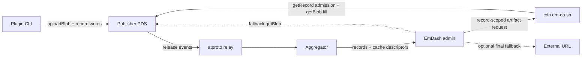
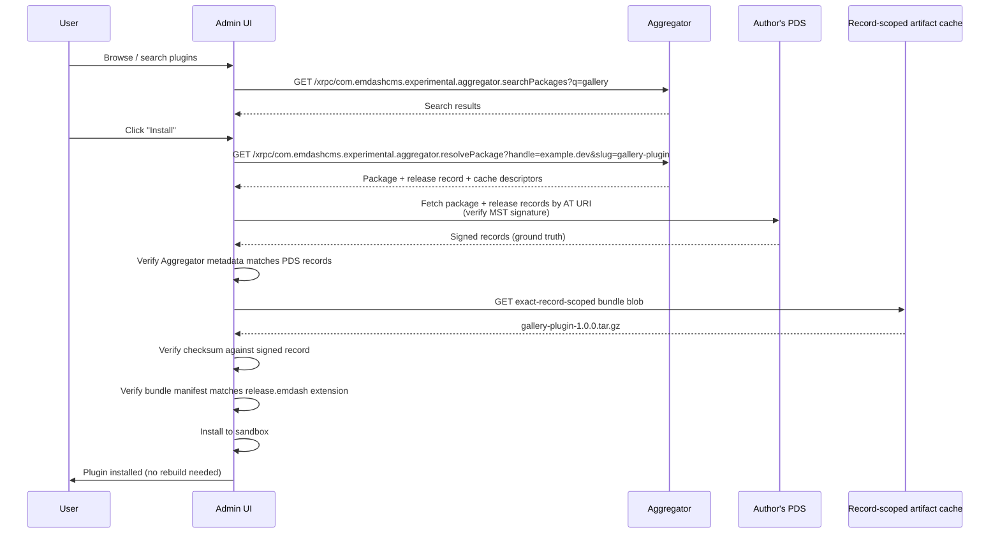
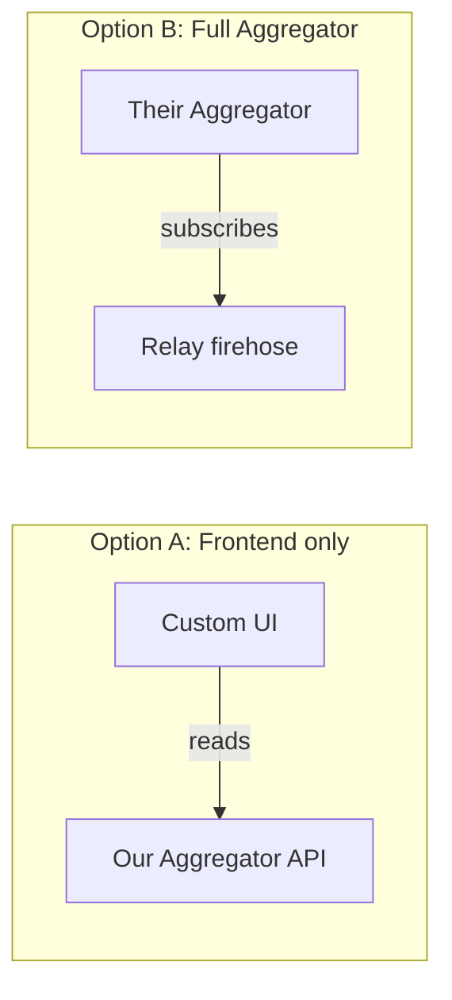

# RFC: Decentralized Plugin Registry

# Summary

This RFC defines a decentralized plugin registry for EmDash. The registry uses a FAIR-derived package schema on an atproto-native transport.

- Authors publish package and release records to their Atmosphere account's Personal Data Server (PDS).
- The publisher's PDS stores plugin bundles and listing images as atproto blobs by default. A release can name an external HTTPS URL as an alternative source.
- Aggregators subscribe to the atproto firehose and index eligible records for discovery.
- Installing sites resolve the signed records, retrieve artifacts from an advertised record-scoped cache, the publisher's PDS, or the external URL, and verify every artifact checksum.

The registry covers sandboxed plugins. Native plugins distributed through npm remain out of scope.

# Example

A plugin author publishes a sandboxed plugin from its source directory:

```bash
emdash-plugin login alice.example.com
emdash-plugin init
emdash-plugin publish
```

`publish` builds and validates the bundle, uploads the bundle and declared listing images to the publisher's PDS, creates the package profile on the first release, and creates an immutable release record. Authors that already host a bundle can pass `--url https://example.com/plugin.tar.gz` instead.

An administrator searches an aggregator from the EmDash admin UI and installs a release. The installer fetches the publisher-signed record and accepts artifact bytes only when their multihash matches the signed checksum.

# Background & Motivation

A registry combines four responsibilities: publisher identity, artifact hosting, discovery, and trust policy. Keeping those responsibilities under one operator makes package availability and publisher access depend on that operator.

Atproto already supplies portable account identity, signed repositories, blob storage, and real-time record distribution. EmDash uses those primitives directly. Aggregators provide searchable projections, and independent labellers provide moderation and trust signals. Neither becomes the install-time integrity authority.

The release schema derives from FAIR's package and release documents. EmDash retains that useful field model without depending on FAIR governance, namespace decisions, or an HTTP transport.

# Goals

- **Zero-infrastructure publishing.** A plugin author needs an Atmosphere account and the EmDash plugin CLI. The publisher's PDS stores release artifacts by default.
- **Publisher-owned identity and data.** The publisher DID identifies the account, and an AT URI identifies each package or release record.
- **Decentralised discovery.** Any aggregator can index the release collection and apply its own listing policy.
- **Cryptographic integrity.** Publisher-signed records bind artifacts by multihash. Blob-backed artifacts also bind the checksum to the blob CID.
- **Portable installation.** Clients can fall through independent artifact sources without weakening checksum verification.
- **Replace the existing centralised marketplace.** The registry replaces the first-party marketplace in one rollout. See [For existing marketplace installs](#for-existing-marketplace-installs).

# Non-Goals

- **Replacing atproto infrastructure.** EmDash does not operate a PDS, relay, or DID directory as part of the registry.
- **Defining an HTTP transport bridge.** A bridge to FAIR-shaped HTTP documents can be added later, but does not constrain the record format or identity model.
- **Mandating one external artifact host.** PDS blobs are the default. Authors can still attach an external `url`.
- **Defining trust and moderation policy.** Reviews, reports, and default labeller policy belong in follow-on work.
- **Defining gated package authentication.** The `auth` open union and `requiresAuth` semantics reserve the wire shape. A follow-on RFC must define each supported method before clients can install gated packages.
- **Inter-plugin dependency resolution.** `requires` and `suggests` carry constraints, but peer-package resolution is deferred.
- **Native plugins.** Native Astro integrations continue to be distributed through npm and configured in `astro.config.mjs`.

# Relationship to FAIR

The package and release fields originate in FAIR's schema. EmDash separates profiles and releases into atproto records, uses a publisher DID plus record key as identity, and relies on repository signatures and blob CIDs for integrity. The result is an atproto-native protocol, not an implementation of FAIR's HTTP repository protocol.

The mechanical field-name mapping is retained so a future bridge can translate records without redefining the schema:

| FAIR HTTP field | atproto field   |
| --------------- | --------------- |
| `content-type`  | `contentType`   |
| `requires-auth` | `requiresAuth`  |
| `release-asset` | `releaseAsset`  |
| `screenshot`    | `screenshots[]` |

The publisher-keyed model makes account keys authoritative for all packages in that repository. Package transfer requires a new publisher identity, and offline verification requires retaining the signed record proof alongside cached bytes. In return, authors manage one portable identity and publish ordinary repository records.

### Lexicon Namespaces

Experimental records use `com.emdashcms.experimental.package.*`. The stable target is `com.emdashcms.package.*`.

# Future support for native plugins

Native plugins (npm-distributed Astro integrations that run in the host process with full platform access) are an important part of EmDash's ecosystem, but are explicitly out of scope for this registry.

They are deferred because their trust and distribution models differ sharply from sandboxed plugins:

1. **Trust:** Native plugins require full platform privileges. Displaying them alongside sandboxed plugins in an automated "one-click install" UI risks conflating provenance with safety.
2. **Distribution:** Native plugins point to npm tarballs, introducing external concerns (`package.json` ownership, lockfile pinning, and `dist.integrity`) that the current FAIR/atproto registry design was not built to handle.
3. **UX:** The primary value of this registry is automated installation. Because native plugins require running `npm install` and manually editing `astro.config.mjs`, they do not benefit from this automated flow.

The status quo for native plugins remains unchanged: they continue to be distributed via npm, discovered through documentation, and installed manually. Integrating them into the decentralized registry will be addressed in a follow-on RFC once the trust framing and npm-as-artifact-source patterns stabilize.

# Prior Art

## FAIR Package Manager

[FAIR](https://fair.pm/) (Federated And Independent Repositories) is a decentralised package manager originating in the WordPress ecosystem and supported by the Linux Foundation. It uses W3C DIDs (both `did:web` and `did:plc`) as package identifiers and defines an HTTP-level repository API that can be served from a dedicated server or a static host such as GitHub.

FAIR validates the general approach of decentralised package identity. EmDash differs principally in how metadata moves through the network:

|                       | FAIR                                                                                           | This proposal                                                                                |
| --------------------- | ---------------------------------------------------------------------------------------------- | -------------------------------------------------------------------------------------------- |
| Identity model        | One DID per package; publisher keys registered on the package DID document                     | One DID per author, multiple packages per account                                            |
| Metadata transport    | HTTP repository API, servable from any static host                                             | atproto records in the author's repo, distributed via the firehose                           |
| Author infrastructure | Any host that can serve the repository API; CLI tooling automates setup                        | An Atmosphere account (hosted or self-hosted PDS)                                            |
| Discovery             | Aggregators (e.g. AspireCloud) index known repositories                                        | Aggregator subscribes to the relay firehose                                                  |
| Signing               | Publisher signing keys registered as verification methods on the DID document                  | Repo-level signing (records are signed as part of the MST)                                   |
| Ratings, reviews, etc | Not in the base protocol; addressed via the labeller layer                                     | Deferred to follow-on RFCs, via labeller or new rating/review lexicons                       |
| Artifact hosting      | Served from the repository host                                                                | Publisher PDS blobs by default, with an optional external URL                                |
| Trust model           | Light base protocol; code scanning and gating live in labellers with a site-side policy engine | Same pattern: permissive protocol, labeller-attached trust signals, site-decided enforcement |

## npm, crates.io, PyPI

Traditional centralised registries. Authors publish to a single server that handles storage, discovery, identity and trust. The model works well at scale but concentrates control and creates supply chain risk. Our design separates these concerns across independent infrastructure.

## Community Origins

This RFC synthesizes and formalizes two major architectural proposals from the EmDash community:

- **[#307](https://github.com/emdash-cms/emdash/discussions/307)** (@erlend-sh) introduced FAIR as a model for decentralized package management, noting the shared use of DIDs as a bridge to the atproto stack.
- **[#296](https://github.com/emdash-cms/emdash/discussions/296#discussioncomment-16534494)** (@BenjaminPrice) laid out the foundational trust model for a decentralized marketplace. This RFC adopts its core tenets: _the sandbox proves safety while signing proves provenance_, author-hosted artifacts are verified by integrity hashes, and zero-friction reviews are anchored to auto-generated site identities.

# Detailed Design

## AT Protocol Primer

This proposal builds on the [AT Protocol](https://atproto.com/guides/overview) ("atproto"), the decentralised social publishing protocol originally developed at Twitter. It is now primarily used to power the social network Bluesky, which also leads protocol development. It is also used for third-party services such as [Tangled](https://tangled.org/) (Git hosting), [Leaflet](https://leaflet.pub) (blogging) and [Streamplace](https://stream.place/) (live streaming). Here are the key concepts used throughout this document:

- **[Atmosphere account](https://atmosphereaccount.com/)** — A portable digital identity on the atproto network. One account works across all Atmosphere apps (Bluesky, Tangled, Leaflet, etc.) and is hosted by a provider the user chooses — an app like Bluesky, an independent host, or self-hosted infrastructure. The account can move between providers without losing data or identity. When this document refers to an "Atmosphere account", it means any account on an atproto-compatible host.

- **[DID](https://atproto.com/specs/did)** (Decentralized Identifier) — A permanent, globally unique identifier for an account (e.g. `did:plc:ewvi7nxzyoun6zhxrhs64oiz`). Defined as a W3C standard. DIDs resolve to documents containing the account's cryptographic keys and hosting location. Think of them like a portable UUID that also tells you where to find the account's data. FAIR also uses DIDs as package identifiers.

- **[Handle](https://atproto.com/specs/handle)** — A human-readable domain name mapped to a DID (e.g. `cloudflare.social` or `jay.bsky.team`). Domain ownership is verified via DNS or `.well-known` files. Handles are mutable — you can change yours — but your DID stays the same.

- **[PDS](https://atproto.com/guides/overview#personal-data-server-pds)** (Personal Data Server) — The server that hosts a user's data, and where a user signs up for an account. Bluesky runs PDSs for its users, but anyone can run their own and they are all interoperable. Other services that provide PDSs include [npmx](https://npmx.social), [Blacksky](https://blackskyweb.xyz/) and [Eurosky](https://eurosky.tech/). [Cirrus](https://github.com/ascorbic/cirrus/) lets you self-host a PDS in a Cloudflare Worker. If your PDS disappears, you can migrate to a new one because your identity is rooted in your DID, not in the server.

- **[Repository](https://atproto.com/specs/repository)** — A user's public dataset, stored as a signed Merkle Search Tree (MST) in their PDS. Every record in a repo is covered by the tree's cryptographic signature, so you can verify that any record really was published by the account's owner.

- **[Lexicon](https://atproto.com/specs/lexicon)** — A schema language for describing record types and APIs, similar to JSON Schema. Applications define lexicons to declare the shape of data they read and write. Lexicons are identified by NSIDs (Namespaced Identifiers) in reverse-DNS format, e.g. `site.standard.document` or `app.bsky.feed.post`.

- **[AT URI](https://atproto.com/specs/at-uri-scheme)** — A URI scheme for referencing specific records: `at://<did>/<collection>/<rkey>`. For example, `at://did:plc:abc123/com.emdashcms.experimental.package.profile/gallery-plugin`.

- **[Relay and Firehose](https://atproto.com/specs/sync)** — Relays aggregate data from many PDSes into a single event stream (the "firehose"). Any service can subscribe to the firehose to receive real-time notifications of record creates, updates and deletes across the entire network. Bluesky operates public relay infrastructure, and third-party relays exist as well.

- **[AppView](https://atproto.com/guides/overview)** — In atproto vocabulary: a service that subscribes to the firehose, indexes records it cares about, and serves an API for clients. Think of it like a specialised search engine and API for a particular type of atproto data. Unlike most other atproto services, an AppView is not generic; it is custom-built for a particular service where it implements the business logic of that app. Bluesky runs one AppView, as do third-party services such as [Leaflet](https://leaflet.pub/) or [Streamplace](https://stream.place/). This RFC uses the more general term **aggregator** for the equivalent role in the registry, both because that's FAIR's term for the same role and because it doesn't require atproto familiarity to read. The reference EmDash aggregator is implemented as an atproto AppView.

- **[XRPC](https://atproto.com/specs/xrpc)** — atproto's HTTP+JSON RPC layer. Mechanically just plain HTTPS GET/POST with JSON request/response bodies, served at `/xrpc/{nsid}` paths. Endpoints are described by Lexicons (the same schema language used for records), so clients in every atproto SDK can be generated from those Lexicons. From a non-atproto client's perspective it's indistinguishable from a regular JSON REST API; from an atproto client's perspective the schemas, error envelope, and service-discovery conventions are uniform across every service in the network.

- **[Labeller](https://atproto.com/specs/label)** — A service that publishes signed labels about records or accounts (e.g. "verified", "spam", "nsfw"). Labels are a lightweight moderation primitive that can be consumed by aggregators and clients.

## Plugin Types

EmDash supports both _sandboxed_ and _native_ plugins. **This registry covers sandboxed plugins exclusively;** native plugins continue to be installed via npm and are out of scope for this RFC. See [Future support for native plugins](#future-support-for-native-plugins) for the rationale.

### Sandboxed plugins

Sandboxed plugins run in isolated sandboxes. The default sandbox is implemented via Cloudflare Dynamic Workers. Their bundle's `manifest.json` declares exactly what resources they can access via a `declaredAccess` block (see [EmDash extension](#emdash-extension) for the full shape). They can be installed at runtime from the admin UI — no CLI, no build step, no restart required.

A minimal `manifest.json` for a plugin that subscribes to content saves and sends notification email:

```jsonc
{
	"id": "notify-on-publish",
	"version": "0.1.0",
	"declaredAccess": {
		"content": { "read": true },
		"email": { "send": true },
	},
	"hooks": [{ "name": "content:afterSave", "priority": 100 }],
}
```

The `declaredAccess` block is the trust contract: what the plugin commits to needing access to. The `hooks` block (and other implementation-contract fields like `routes`, `storage`, `admin`) are how the runtime wires the plugin up at load time. Both contracts live in the manifest; only the trust contract is replicated to the registry. See [The Publish Flow](#the-publish-flow) for how that split plays out at publish time.

For sandboxed plugins, the registry is the **complete distribution channel**: discovery → download → verify → install, all automated.

## Architecture Overview


```mermaid
flowchart LR
    CLI[Plugin CLI] -->|uploadBlob + record writes| PDS[Publisher PDS]
    PDS -->|release events| RELAY[atproto relay]
    RELAY --> AGG[Aggregator]
    AGG -->|records + cache descriptors| ADMIN[EmDash admin]
    ADMIN -->|record-scoped artifact request| CDN[cdn.em-da.sh]
    CDN -->|getRecord admission + getBlob fill| PDS
    ADMIN -.->|fallback getBlob| PDS
    ADMIN -.->|optional final fallback| URL[External URL]
```

Publishers upload release artifacts and write package records to their PDS. Relays distribute record events to aggregators, which build searchable policy-filtered projections. Cumulus at `cdn.em-da.sh` admits only blobs referenced by the named release record. Installing sites verify signed records and package checksums independently of both services.

## Lexicons

The Lexicons use a FAIR-derived field model and atproto-native record structure. Package profiles and releases are independent records so a new release does not rewrite the complete package history.

The namespace has two layers:

- `com.emdashcms.experimental.package.profile` and `com.emdashcms.experimental.package.release` define package identity, releases, artifacts, and integrity metadata.
- `com.emdashcms.experimental.package.releaseExtension` carries the sandbox access contract and EmDash-specific release metadata.

Experimental NSIDs are normative for this RFC. The stable target is `com.emdashcms.package.*`. The [Relationship to FAIR](#relationship-to-fair) section defines the complete HTTP field-name mapping retained for a possible future bridge.

### `com.emdashcms.experimental.package.profile`

A package profile is stored in the publisher repository with the slug as its record key:

```
at://did:plc:abc123/com.emdashcms.experimental.package.profile/gallery-plugin
```

Or, using a handle:

```
at://example.dev/com.emdashcms.experimental.package.profile/gallery-plugin
```

**Schema:**

| Property      | Type      | Required | Description                                                                                                                                                                      |
| ------------- | --------- | -------- | -------------------------------------------------------------------------------------------------------------------------------------------------------------------------------- |
| `id`          | string    | yes      | Canonical package AT URI, derived from the publisher DID, collection, and record key. Aggregators and clients reject a record whose value does not match its location.           |
| `type`        | string    | yes      | Package type. EmDash plugins use `emdash-plugin`; custom types use the `x-` prefix.                                                                                              |
| `license`     | string    | yes      | SPDX license expression, or `"proprietary"`.                                                                                                                                     |
| `authors`     | Author[]  | yes      | At least one author. See [Author object](#author-object).                                                                                                                        |
| `security`    | Contact[] | yes      | At least one security contact. Clients refuse installation when none is valid.                                                                                                   |
| `slug`        | string    | no       | URL-safe slug. If present, it must equal the record key.                                                                                                                         |
| `name`        | string    | no       | Human-readable name. Displayed in listings.                                                                                                                                      |
| `description` | string    | no       | Short description. SHOULD NOT exceed 140 characters.                                                                                                                             |
| `keywords`    | string[]  | no       | Search keywords. SHOULD NOT exceed 5 items.                                                                                                                                      |
| `sections`    | object    | no       | Map of CommonMark text sections. Recognised keys are `description`, `installation`, `faq`, `changelog`, and `security`. Each value is limited to 20000 bytes and 2000 graphemes. |
| `lastUpdated` | string    | no       | RFC 3339 / ISO 8601 datetime for the package's last update (atproto lexicon `format: "datetime"`).                                                                               |

#### Author object

| Property | Type         | Required |
| -------- | ------------ | -------- |
| `name`   | string       | yes      |
| `url`    | string (uri) | no       |
| `email`  | string       | no       |

Vendors SHOULD specify at least one of `url` or `email` per author.

#### Contact object

| Property | Type         | Required |
| -------- | ------------ | -------- |
| `url`    | string (uri) | no       |
| `email`  | string       | no       |

Vendors SHOULD specify at least one of `url` or `email` per contact. Clients SHOULD refuse to install packages without at least one valid security contact.

**Identity, mutability, and trust**

- The canonical package reference is the package record's AT URI, e.g. `at://did:plc:abc123/com.emdashcms.experimental.package.profile/gallery-plugin`.
- The atproto identity (the publisher's DID) is the trust root. Records are MST-signed by the publisher's signing key; aggregators verify against the publisher's DID document. There is no per-package DID — the AT URI is the package identifier.
- Handles are mutable; DIDs are not. Clients should re-resolve handles each time they display a package, rather than caching the handle string.
- The package record is mutable in atproto terms (updates flow through the firehose). Slug, however, is effectively immutable because it is the record key.
- The registry is permissive about what records an author can publish. Trust signals — verified-publisher labels, etc. — are layered on via labellers, as in FAIR's trust model.

**Runtime plugin identity** is separate from registry identity. EmDash's runtime uses `manifest.json`'s `id` field for storage namespacing and hook registration; the registry uses the AT URI. EmDash persists a mapping at install time so the two stay reconciled.

#### Sections and long-form documentation

The `sections` field carries _summaries_, not the full long-form documentation. Each entry is capped at 20 KB / 2000 graphemes — enough for a paragraph or two of a description, the most-recent release's changelog notes, brief installation instructions — but deliberately too small for the kind of multi-page documentation that lives in a project README. The 20 KB cap matches the threshold above which `goat lex lint` recommends blob-backed storage instead of inline strings.

This shape choice is deliberate. atproto records have a practical per-record size limit around 100 KB, and every record update rewrites and re-signs the whole record. A long inline README would either blow the size budget or make every documentation tweak a costly write that cascades through the publisher's MST and the firehose. Capping each section keeps the record small and update-cheap.

Section values are CommonMark-flavoured Markdown. FAIR's spec doesn't normatively specify a format for section content — it's permissive about what publishers store — but a single shared format makes the directory and admin UI's rendering predictable, and Markdown matches what publishers already write in the bundle's `README.md`. Clients rendering sections MUST treat them as untrusted input, sanitising the rendered output to strip any HTML the Markdown produces (or using a Markdown renderer that doesn't emit raw HTML in the first place). Publishers SHOULD assume that fancy embedded HTML, scripts, and similar will be stripped at render time and write plain Markdown accordingly.

Long-form documentation belongs in the bundled `README.md` (which the directory and admin UI can render alongside the section summaries) and on the publisher's own website. The directory MAY render `sections.description` as the primary in-listing summary and link to the bundled README for fuller documentation.

Future RFCs can introduce blob-backed long-form fields (similar to `at.markpub.text`'s `textBlob` pattern) if the trade-off shifts. For this RFC, the inline-with-cap shape is sufficient and matches the precedent set by `site.standard.publication`.

### `com.emdashcms.experimental.package.release`

A release record represents one immutable package version. Its record key is `<package>:<version>`.

| Field        | Type       | Required | Description                                                                                      |
| ------------ | ---------- | -------- | ------------------------------------------------------------------------------------------------ |
| `package`    | string     | yes      | Parent package-profile record key in the same repository.                                        |
| `version`    | string     | yes      | Canonical semantic version without build metadata. It must match the version in the record key.  |
| `artifacts`  | object     | yes      | Installable bundle and optional listing images.                                                  |
| `provides`   | object     | no       | Capabilities supplied by the package.                                                            |
| `requires`   | object     | no       | Environment or package constraints.                                                              |
| `suggests`   | object     | no       | Optional related packages.                                                                       |
| `auth`       | open union | no       | Authentication method for gated artifacts. No variants are defined by this RFC.                  |
| `sbom`       | object     | no       | Software bill of materials reference.                                                            |
| `repo`       | URI        | no       | Source repository for this release.                                                              |
| `extensions` | object     | no       | Extension records keyed by NSID. Sandboxed EmDash releases include the EmDash release extension. |

The `artifacts` object has the following slots:

| Slot          | Shape                       | Required |
| ------------- | --------------------------- | -------- |
| `package`     | artifact                    | yes      |
| `icon`        | image artifact              | no       |
| `banner`      | image artifact              | no       |
| `screenshots` | up to eight image artifacts | no       |

Each artifact contains a required `checksum` and at least one retrieval source:

| Field             | Type             | Required      | Description                                                                  |
| ----------------- | ---------------- | ------------- | ---------------------------------------------------------------------------- |
| `blob`            | atproto blob ref | conditionally | Bytes stored on the publisher's PDS.                                         |
| `url`             | URI              | conditionally | Explicit external source.                                                    |
| `checksum`        | string           | yes           | Lowercase base32 multibase-encoded multihash. Clients must support sha2-256. |
| `id`              | string           | no            | Identifier within the artifact slot.                                         |
| `contentType`     | string           | no            | MIME type.                                                                   |
| `requiresAuth`    | boolean          | no            | Whether retrieval requires the method in `auth`.                             |
| `releaseAsset`    | boolean          | no            | Whether URL retrieval requires `Accept: application/octet-stream`.           |
| `signature`       | string           | no            | Reserved artifact signature.                                                 |
| `width`, `height` | integer          | no            | Image dimensions, each at most 8192 pixels.                                  |
| `lang`            | language tag     | no            | Locale for an image artifact.                                                |

An artifact must carry `blob`, `url`, or both. The Lexicon cannot express this cross-field constraint, so publishing clients and installers enforce it. If both fields are present, both sources must serve bytes matching `checksum`.

Blob constraints are encoded on each slot so the PDS checks uploads when it validates the record:

| Slot                              | Accepted MIME types                     | Maximum compressed bytes |
| --------------------------------- | --------------------------------------- | -----------------------: |
| `package`                         | `application/gzip`                      |                   262144 |
| `icon`, `banner`, `screenshots[]` | `image/png`, `image/jpeg`, `image/webp` |                  1048576 |

SVG is not accepted. Listing images are served through fixed Cumulus image presets, which re-encode publisher-supplied rasters. Package blobs are served verbatim so their checksum remains stable.

For a blob artifact, `checksum` must equal the multihash embedded in `blob.ref`'s CID. Blob CIDs use the `raw` codec and sha2-256. Clients compare the fields before fetching, then hash the fetched bytes as they do for every other source.

The `auth` field is an open union so a follow-on RFC can add gated-package methods without changing the release record. A future variant should include `hint` and `hint_url`. Until a client recognises the variant, it displays the hint when present and refuses installation. A blob with `requiresAuth: true` is not retrieved through `com.atproto.sync.getBlob`; the recognised auth method must provide its retrieval path.

### EmDash extension

The `emdash-plugin` package type defines the following EmDash-specific fields and validation rules:

**Package type**: `emdash-plugin` — a sandboxed EmDash plugin.

**Environment requirements** (for use in `requires` / `suggests`):

- `env:emdash` — semver range the EmDash runtime must satisfy.
- `env:astro` — semver range the Astro framework must satisfy.

**Artifact types** for `emdash-plugin`:

| Type          | Description                                                                                                                                                                                                                                                                                                                                |
| ------------- | ------------------------------------------------------------------------------------------------------------------------------------------------------------------------------------------------------------------------------------------------------------------------------------------------------------------------------------------ |
| `package`     | The installable plugin bundle. MUST be a gzipped tar archive (`application/gzip`), MUST contain `manifest.json` and `backend.js` at the archive root, MAY contain `admin.js` and `README.md`. The `checksum` property is required for security verification. Subject to the bundle size caps in [Bundle size limits](#bundle-size-limits). |
| `icon`        | Square package icon. SHOULD be 128×128 or 256×256. Accepted types are `image/png`, `image/jpeg`, and `image/webp`. SVG is not accepted. SHOULD specify `width` and `height`. SHOULD NOT require auth. May specify `lang`.                                                                                                                  |
| `screenshots` | UI screenshots. The value is a list of up to eight image artifact objects. Each entry follows the `icon` MIME and dimension rules, has a 1 MiB blob limit, SHOULD NOT require auth, and may specify `lang`.                                                                                                                                |
| `banner`      | Wide listing-page header image. Common sizes 772×250 and 1544×500. `contentType` and rules as for `icon`. MAY be omitted; clients SHOULD ignore banners not matching a usable size.                                                                                                                                                        |

**Extension properties on the release:**

The release Lexicon declares an `extensions` field as an open object. Each value uses an atproto `$type` discriminator and is validated against that Lexicon when the consumer recognises it.

EmDash defines `com.emdashcms.experimental.package.releaseExtension`, embedded inside the release record under that NSID key:

```json
{
	"$type": "com.emdashcms.experimental.package.release",
	"package": "gallery-plugin",
	"version": "1.0.0",
	"extensions": {
		"com.emdashcms.experimental.package.releaseExtension": {
			"$type": "com.emdashcms.experimental.package.releaseExtension",
			"declaredAccess": {
				"content": { "read": {} },
				"media": { "read": {} },
				"network": {
					"request": { "allowedHosts": ["images.example.com"] }
				}
			}
		}
	}
}
```

The release-level extension carries a single object, `declaredAccess`, describing every kind of access the plugin needs. Inside, each access category (`content`, `media`, `network`, `email`, …) carries a map of named operations (`read`, `write`, `request`, `send`, …). Each operation's value is a constraint object describing the limits placed on the access. Two shorthand rules apply:

- An operation value of `true` is sugar for `{}`. Both mean "grant the operation with no constraints applied."
- An operation that is omitted means "no access for this operation."

So `content: { read: true }` is the same as `content: { read: {} }`, both granting unrestricted content reads. `network: { request: { allowedHosts: [...] } }` grants outbound HTTP requests scoped to the listed hosts.

This shape serves two purposes:

1. **Forward-compatibility is additive.** New access categories — filesystem, subprocesses, environment variables, and the like — slot in as new optional fields under `declaredAccess` once they have well-defined runtime semantics. Existing records remain valid because the new fields are absent. Likewise, new operations can be added inside an existing category, and new constraint keys can be added inside an existing operation's constraint object.
2. **The constraint object is open.** Known constraint keys (defined in this RFC or by a future RFC) are enforced by clients that recognise them; unknown constraint keys are surfaced verbatim in install-consent UI but not enforced. See [Constraints](#constraints) below.

For the package type `emdash-plugin`, every operation declared in `declaredAccess` is enforced by the sandbox runtime: a plugin that tries to do something outside what it declared is denied at runtime, and any constraints whose keys are recognised by the runtime are applied. Future package types (e.g. a native plugin type added by a follow-on RFC) may reuse the same `declaredAccess` shape with a different enforcement contract; that's a problem for the RFC that introduces the new type, not for this one.

The sandbox recognises the access categories and operations listed below. Categories not enumerated here cannot be declared today; clients MUST reject release records that include unrecognised top-level fields under `declaredAccess`. Within a known category, an unrecognised _operation_ key is also a hard reject. Constraint keys, in contrast, are part of an open vocabulary — see [Constraints](#constraints).

The initial vocabulary is deliberately narrow. Reading user records, registering host-pluggable hooks (email transport, page fragments, etc.), and finer-grained scopes within `content` are deferred until their release-extension fields and runtime semantics can be specified together. Adding any of these is a purely additive lexicon change: a new optional field on `declaredAccess` (or a new operation inside an existing category) can be defined in a follow-on RFC without invalidating any existing record. The lexicon evolution rules let the vocabulary expand but do not let it contract.

**`content`** — access to site content (posts, pages, custom collections).

| Operation | Description                                                                         |
| --------- | ----------------------------------------------------------------------------------- |
| `read`    | Plugin may read content records. Constraint vocabulary reserved for follow-on RFCs. |
| `write`   | Plugin may create, update, or delete content records. Implies `read` at runtime.    |

**`media`** — access to uploaded media assets.

| Operation | Description                                                 |
| --------- | ----------------------------------------------------------- |
| `read`    | Plugin may read media metadata and fetch media bytes.       |
| `write`   | Plugin may upload, modify, or delete media. Implies `read`. |

**`network`** — outbound HTTP requests.

| Operation | Description                                                                                        |
| --------- | -------------------------------------------------------------------------------------------------- |
| `request` | Plugin may make outbound HTTP requests. Constraints below scope the access; `true` means unscoped. |

`network.request` constraints (v1):

| Constraint     | Type     | Description                                                                                                                                                                                                                                                                                                                                  |
| -------------- | -------- | -------------------------------------------------------------------------------------------------------------------------------------------------------------------------------------------------------------------------------------------------------------------------------------------------------------------------------------------- |
| `allowedHosts` | string[] | Allow-list of outbound host patterns. Each entry is a hostname pattern with no scheme, path, or port; a leading `*.` wildcard is permitted for subdomains. Absence means no host restriction (the plugin can call anywhere). Strongly recommended in practice; a plugin that doesn't constrain its outbound hosts is harder to reason about. |

**`email`** — sending mail through the host's mail service.

| Operation | Description                                                                                                                                          |
| --------- | ---------------------------------------------------------------------------------------------------------------------------------------------------- |
| `send`    | Plugin may send mail. Constraint vocabulary reserved for follow-on RFCs (rate limits, recipient allow-lists, etc., per [Constraints](#constraints)). |

#### Constraints

Each operation's value is a constraint object (with `true` as sugar for the empty object). The keys of that object form an open vocabulary — clients that recognise a key enforce it; clients that don't surface it to the user but do not enforce it.

This is the forward-compatibility mechanism. We expect to need rate limits on `network.request` and `email.send`, recipient allow-lists on `email.send`, and other quantitative constraints in due course. Defining them now would commit the lexicon to a specific shape before we've written the runtime code that enforces them. Leaving the constraint object open lets publishers declare such constraints whenever they're ready, and lets future runtime versions enforce them, without requiring a new release-extension lexicon.

The contract for constraint keys:

- A publisher MAY include any constraint keys they want under any operation. The registry stores them verbatim.
- A client encountering an unrecognised constraint key MUST surface it to the admin in the install-consent UI as "additional constraint declared by the plugin: `<key>: <value>`" and MUST NOT silently ignore it.
- A client MUST NOT enforce constraints whose semantics it does not understand. A constraint declared in the lexicon but not yet implemented by the runtime is advisory only at that runtime version.
- A future runtime version that defines semantics for a particular constraint key gains an obligation to enforce it; older runtimes continue to treat it as advisory. This is the standard atproto evolution model — newer schemas mean newer behaviour, older clients fall back gracefully.
- Follow-on RFCs MAY normatively define specific constraint key/value shapes (e.g. `{ "rateLimit": { "perHour": 100 } }` under `email.send`). Once normatively defined, all clients implementing that RFC version MUST enforce them.

The only normative constraint key defined here is `allowedHosts` under `network.request`, defined above. Everything else is advisory until a follow-on RFC normatively specifies it.

**Path shorthand.** For brevity in the rules below and elsewhere in this document, `release.emdash.<field>` is shorthand for `release.extensions["com.emdashcms.experimental.package.releaseExtension"].<field>`. So `release.emdash.declaredAccess.network.request.allowedHosts` is the path to a plugin's outbound host allow-list.

**Manifest canonicalisation.** A plugin's bundled `manifest.json` and its release record's `declaredAccess` MUST describe the same access. Because `true` and `{}` are equivalent shorthand, the deep-equal check used at publish time and install time first canonicalises both sides — every operation value of `true` is replaced with `{}` before comparison. This way a manifest using the sugar form matches a release record using the explicit form (or vice versa) and the consistency check still passes.

**Extension validation rules:**

- A release whose package type is `emdash-plugin` MUST include a `package` artifact with `checksum` and at least one of `blob` or `url`.
- A release whose package type is `emdash-plugin` MUST include `release.emdash.declaredAccess` with at least one operation populated across any category. A plugin that declares no access at all is not considered well-formed (it would have nothing to do).
- The `package` artifact's bytes MUST hash to the artifact's `checksum`.
- The bundle manifest's `declaredAccess` MUST be deep-equal to `release.emdash.declaredAccess` after canonicalisation (per the rule above). Checked at publish time by the CLI and at install time by the client.
- Clients MUST reject any release whose `declaredAccess` contains a top-level field not enumerated in the vocabulary above (unrecognised access category) or an unrecognised operation inside a known category. Lexicon evolution adds new fields over time; the client's own runtime version determines which are recognised.
- Unrecognised constraint _keys_ inside a known operation's constraint object MUST NOT cause rejection — they're surfaced to the user per the [Constraints](#constraints) contract.

#### Bundle size limits

Conforming clients and aggregators MUST reject `package` artifacts whose decompressed contents exceed any of:

- Total decompressed size ≤ **256 KB**.
- Per-file decompressed size ≤ **128 KB**.
- File count ≤ **20**.

Decompression MUST stream-validate against these caps and abort as soon as any is exceeded, without buffering the full archive — the caps double as tar-bomb defence.

These numbers are tied to the constrained surface of the sandboxed runtime. The host provides the API surface, storage, and UI primitives, so legitimate sandboxed plugins are small: the largest existing first-party sandboxed plugin (`atproto`, which performs OAuth, JWT signing, and ATProto network calls) is ~37 KB built; most are under 20 KB. The 256 KB cap leaves roughly 7× headroom over the largest observed real plugin.

The caps serve three purposes:

1. **Bounded parse / memory cost.** Restricted JS runtimes parse significantly slower than V8, and the parsed form is not shared across host isolates. 256 KB keeps cold-isolate plugin load in the tens of milliseconds and bounds heap growth as multiple plugins share an isolate.
2. **Reviewability.** A 256 KB bundle is something a marketplace reviewer (human or automated) can read end-to-end before approval. Larger ceilings concede that nobody reads the code, defeating the purpose of sandboxing untrusted code.
3. **Bounded cold-fetch latency.** First-load fetches happen on the user's request path; 256 KB is sub-100 ms over typical CDN paths.

**Layered enforcement.** The caps are protocol-level, not implementation-private. Three independent enforcement points are required:

- The publish CLI rejects oversized bundles before signing the release record.
- Aggregators reject oversized artifacts at ingest and exclude the release from listings.
- Install clients re-validate at install time, after checksum verification, before handing the bundle to the sandbox loader.

Hosts MAY accept larger bundles for private, sideloaded plugins in their own deployments. Releases published under `com.emdashcms.experimental.package.release` with the `emdash-plugin` package type MUST conform to the caps; aggregators MUST reject non-conforming releases at ingest. If a future sandboxed-runtime feature legitimately requires more bytes (for example, embedded WASM modules or large locale catalogs), it will be introduced as a separate, opt-in artifact channel with its own caps rather than by widening these.

**Latest release selection:**

- The latest release for a package is the release record in the same repository with `record.package` equal to the target package's slug, having the highest semver `version` (compared using full semver precedence rules, not lexicographic ordering).
- If two release records share the same `(package, version)` pair, the record with the earliest creation time wins. Aggregators ignore later records and record the duplicate attempt for audit.
- Deleted release records are tombstoned, do not participate in latest-release selection, and do not trigger uninstall on existing clients.

Yanked and deprecated states are handled through the labeller layer. A `security:yanked` or `deprecated` label on a release or package AT URI signals client UI behaviour without changing the registry record.

Inter-plugin dependencies are expressed through `requires`. Reviews, reports, and trust-layer records are out of scope.

### Lexicon evolution

Atproto Lexicons are immutable contracts once published. EmDash follows the [atproto Lexicon evolution rules](https://atproto.com/guides/lexicon-style-guide#lexicon-evolution): additions are optional and existing fields are not narrowed or renamed.

If a genuinely incompatible shape is needed, a new lexicon must be published under a new NSID. The old NSID is retained for historical records. To avoid namespace churn, initial fields lean towards optional—we only require fields whose absence would render the record meaningless.

The core registry records (`com.emdashcms.experimental.package.profile`, `com.emdashcms.experimental.package.release`, and `com.emdashcms.experimental.package.releaseExtension`) are experimental contracts. Incompatible revisions may replace them before migration to a stable namespace; clients MUST use the exact NSIDs they implement rather than treating the experimental prefix as a wildcard.

## Package Resolution

### Sandboxed plugin install flow


```mermaid
sequenceDiagram
    participant User
    participant Admin as Admin UI
    participant Aggregator
    participant PDS as Author's PDS
    participant Cumulus as Record-scoped artifact cache

    User->>Admin: Browse / search plugins
    Admin->>Aggregator: GET /xrpc/com.emdashcms.experimental.aggregator.searchPackages?q=gallery
    Aggregator-->>Admin: Search results
    User->>Admin: Click "Install"
    Admin->>Aggregator: GET /xrpc/com.emdashcms.experimental.aggregator.resolvePackage?handle=example.dev&slug=gallery-plugin
    Aggregator-->>Admin: Package + release record + cache descriptors
    Admin->>PDS: Fetch package + release records by AT URI<br/>(verify MST signature)
    PDS-->>Admin: Signed records (ground truth)
    Admin->>Admin: Verify Aggregator metadata matches PDS records
    Admin->>Cumulus: GET exact-record-scoped bundle blob
    Cumulus-->>Admin: gallery-plugin-1.0.0.tar.gz
    Admin->>Admin: Verify checksum against signed record
    Admin->>Admin: Verify bundle manifest matches release.emdash extension
    Admin->>Admin: Install to sandbox
    Admin->>User: Plugin installed (no rebuild needed)
```

The PDS-direct fetch is the trust anchor for installation — the aggregator is a discovery and caching layer, not the authoritative source. See [Install provenance verification](#install-provenance-verification).

### By handle and slug (user-facing)

```
@example.dev/gallery-plugin
```

1. Resolve handle `example.dev` to a DID via the atproto handle resolution mechanism.
2. Form the canonical package identity: `<did>/gallery-plugin`.
3. Construct the AT URI: `at://<did>/com.emdashcms.experimental.package.profile/gallery-plugin`.
4. Fetch the package record from the author's PDS.
5. Determine the latest release for this package. The aggregator's `listReleases` endpoint returns releases scoped to `(did, package)` and is the recommended path. If the aggregator is unavailable, the client falls back to the publisher's PDS: it pages through the `com.emdashcms.experimental.package.release` collection via `com.atproto.repo.listRecords` and filters locally to records whose rkey starts with `<package>:`. (atproto's `listRecords` does not support a server-side rkey prefix filter, so the PDS-direct path is a full collection scan; this is acceptable for occasional use but is the reason the aggregator path is preferred.) Pick the highest semver version (excluding any tombstoned via deletion or labelled `security:yanked`).
6. Fetch the selected release record from the author's PDS by its full AT URI (`at://<did>/com.emdashcms.experimental.package.release/<package>:<version>`) to obtain the verified, signed copy. Verify the release record matches what the aggregator returned in step 5.
7. Fetch the `package` artifact through an advertised record-scoped cache, the publisher PDS, or its explicit `url`. Verify the artifact's `checksum` against the downloaded bytes. Verify the bundle manifest's `declaredAccess` matches `release.emdash.declaredAccess`. Install to the sandbox.

### Metadata resolution

Package and release _records_ are looked up in this order:

1. **Aggregator API** — fast, cached, and policy-filtered for discovery.
2. **Author's PDS directly** — slower, but works independently of the aggregator for known package identities.

Records returned by an aggregator are verified against the publisher repository before installation.

### Artifact retrieval

For an artifact with a blob ref, the installer tries sources in this order:

1. Each recognised record-scoped cache service in the aggregator envelope.
2. The artifact's `blob`, fetched from the publisher's PDS through `com.atproto.sync.getBlob?did=<publisher-did>&cid=<blob-cid>`.
3. The artifact's explicit `url`, when present.
4. Fail the installation and report the attempted source classes.

The installer resolves the publisher's PDS endpoint from the publisher DID document. PDS and external URL requests use the same verified-resource controls: HTTPS only, no embedded credentials, public-address resolution on every redirect, response-size limits, and bounded header and total timeouts. A PDS is publisher-controlled from the installing site's perspective and receives no network exemption.

The installer checks a blob CID against the signed `checksum` before fetching. It hashes bytes returned by every raw source and falls through when a cache returns corrupt bytes. A URL-only artifact remains valid; it is tried last because the publisher's PDS is already part of record resolution and narrows the set of outbound hosts.

If `requiresAuth` is true, the installer does not call the public `getBlob` endpoint. It uses the method in `auth` only when that variant is recognised. Otherwise it displays the variant's `hint`, when present, and refuses installation.

### Cumulus artifact cache

Cumulus runs at `https://cdn.em-da.sh` in record-scoped mode as a pull-through cache in front of publisher PDSes. The aggregator stores no artifact bytes.

Artifact URLs use this shape:

```text
/r/{did}/com.emdashcms.experimental.package.release/{slug}:{version}/{recordCid}/{blobCid}
/img/{preset}/r/{did}/com.emdashcms.experimental.package.release/{slug}:{version}/{recordCid}/{blobCid}
```

Before serving a blob, Cumulus fetches the named release record, requires its CID to equal `recordCid`, and confirms that the exact revision references `blobCid`. Admission is limited to the release collection and rejects any artifact with `requiresAuth: true`. Gated blobs are neither served nor cached.

Cumulus purges the release record's cache tag when Jetstream reports an update or deletion. The registry labeller subscription purges the same tag when a withdrawal label becomes active.

Package bundles use the raw route and are served verbatim. Listing images use the image route with fixed `avatar`, `banner`, and `feed_thumbnail` presets and are re-encoded before delivery.

The aggregator envelope does not enumerate artifact URLs. Its required `artifactCaches` array contains typed service descriptors. The record-scoped Cumulus variant carries `serviceEndpoint`; clients combine it with the release URI, release CID, and each public blob CID. Unknown cache variants are ignored.

The aggregator still downloads and validates each bundle at ingest. Tar parsing, decompressed limits, required entries, and the `declaredAccess` comparison gate listing eligibility rather than artifact storage. Clients repeat the same validation at install time.

Cumulus is a cache rather than durable storage. If a publisher PDS disappears, its records and blobs become unavailable together after cached entries expire. A durable R2 tier can be added later without changing release records.

### Install provenance verification

- The aggregator is used for discovery and indexing, not as the final trust anchor for installation.
- Before installing a plugin, the client must fetch the package record and selected release record by AT URI from the author's PDS, or obtain an equivalent verified repo proof.
- If the source records cannot be verified, or if they do not match the metadata returned by the aggregator, installation must fail.

### Outbound network considerations

Blob hosting narrows the default installer egress surface. An install can contact an advertised artifact cache, the publisher PDS resolved from the signed record identity, and an explicit artifact `url` when present. Every destination passes the same HTTPS, redirect, DNS, timeout, and response-size controls. Artifact caches and PDSes are trusted for availability only; the signed checksum remains authoritative for package bytes.

### Deletion semantics

- Aggregators should retain tombstones for deleted package and release records in their internal index.
- Deleted packages must not appear in search results and must not be installable.
- If a package identified by `did/slug` has been deleted, direct package lookups should return a deleted response rather than silently pretending the package never existed.
- Deleted releases must be excluded from release lists, excluded from latest-release selection, and must not be installable.
- Deleting a package or release does not require uninstalling already-installed site-local copies. Removal from a site remains an explicit admin action.
- Cumulus purges the record-scoped cache tag for deleted releases.

An author who wants to pull a release deletes the record; the aggregator stops advertising it, Cumulus purges the record tag, and existing local installs keep running until an admin updates or uninstalls them. This differs deliberately from npm's yank-but-keep-installable primitive: because EmDash plugins are top-level installs with no transitive dependency chain, there is no `left-pad` failure mode for a pulled release to propagate through. If future RFCs introduce inter-plugin dependencies, a proper yank primitive may be needed at that point.

### Update Discovery and Takedowns

Update discovery is driven by the admin UI. When an admin logs into the dashboard or visits the plugins page, the frontend client performs a throttled query directly against the configured aggregator, passing the list of installed plugins to check for newer versions. The throttle is per-site rather than per-admin, and the default cadence is at most one automatic check every 6 hours. Admins can also trigger an immediate, unthrottled check via a "Check for updates" button in the UI.

- **Normal Updates:** If the aggregator returns a newer version, the CMS surfaces an "Update Available" badge in the admin UI.
- **Takedowns:** If a plugin is found to be malicious, the EmDash-operated takedown labeller (a labeller service publishing signed labels per atproto's [label spec](https://atproto.com/specs/label)) issues a `security:yanked` label against the package's or release's AT URI. The aggregator relays these labels in its response envelope; the admin UI surfaces a critical warning and disables the plugin's execution in the sandbox. Clients independently verify label signatures against the labeller's DID rather than trusting the aggregator's relayed copy — see [Threat model](#threat-model).

The latest-release selection filter (defined in [By handle and slug](#by-handle-and-slug-user-facing) step 5) is also the natural integration point for additional policy filters layered on top of the protocol — for example, a minimum release age to delay surfacing brand-new releases of established packages as the recommended install or update, narrowing the window in which a compromised publisher account can push a malicious release to admin-panel installs and auto-update prompts. Such filters are admin-UI / client policy, not a protocol shape change: they operate over the same signed records and labels the resolution flow already produces. Specifying defaults, per-site overrides, and the brand-new-package exemption is the follow-on trust/moderation RFC's job.

#### Label conventions

The registry uses a small, fixed set of labels from the EmDash takedown labeller and any labellers a site operator additionally subscribes to. The protocol value space is atproto's standard label format; the conventional label values consumed by EmDash clients are:

| Label             | Applied to                | Client behaviour                                                                                                                              |
| ----------------- | ------------------------- | --------------------------------------------------------------------------------------------------------------------------------------------- |
| `security:yanked` | release or package AT URI | Hide from latest-release selection; surface warning on installed sites; disable in sandbox.                                                   |
| `deprecated`      | package AT URI            | Show deprecation badge in directory; allow new installs but encourage alternatives.                                                           |
| `verified`        | publisher DID             | Used in conjunction with `com.emdashcms.experimental.publisher.verification` records (see [Publisher Verification](#publisher-verification)). |

A follow-on trust/moderation RFC will expand this vocabulary; This RFC establishes only the subset above.

## The Publish Flow

Plugin authors publish with the EmDash plugin CLI:

```bash
emdash-plugin login alice.example.com
emdash-plugin publish
```

The default flow performs these steps:

1. Build the sandboxed plugin and validate the decompressed bundle limits.
2. Create the gzip archive and reject it if the compressed package blob exceeds 262144 bytes.
3. Upload the bundle with `com.atproto.repo.uploadBlob` as `application/gzip`.
4. Resolve each manifest `release.artifacts` file relative to the manifest, validate it as PNG, JPEG, or WebP, and upload it as a blob.
5. Derive each artifact `checksum` from the returned blob CID and verify that the CID matches the uploaded bytes.
6. Create the package profile when it does not exist and create the immutable release record in one repository commit.

The OAuth client requests the existing repository scopes plus `blob:application/gzip` and `blob:image/*`. Before uploading, the CLI checks the granted scope and asks the author to log in again when the stored grant lacks a required blob scope.

Authors can publish an externally hosted bundle with `--url <https-url>`. On that path, the CLI downloads the URL, computes the checksum from the served bytes, validates the bundle, and writes a URL artifact. `--local <path>` can cross-check a local copy against those downloaded bytes. Listing images still use publisher-PDS blobs.

The manifest stores listing artifacts only as file paths. The CLI has no `--artifact-base-url` or HTTP PUT uploader.

### Multi-Author Packages

A package is published under one publisher DID. Team members can use the organisation's Atmosphere account for interactive releases. Automated releases use the create-only delegated publishing flow in [RFC 0002](./0002-attested-automated-publishing.md); CI receives no reusable atproto credential.

## Components

### What we build and host

**Registry aggregator.** The default aggregator subscribes to an atproto relay, verifies and indexes package records, applies listing policy, and serves XRPC read APIs. Bundle validation gates listing eligibility. The aggregator stores no artifact bytes.

| Lexicon                                                  | Description                                                      |
| -------------------------------------------------------- | ---------------------------------------------------------------- |
| `com.emdashcms.experimental.aggregator.searchPackages`   | Search eligible packages.                                        |
| `com.emdashcms.experimental.aggregator.getPackage`       | Get a package by publisher DID and slug.                         |
| `com.emdashcms.experimental.aggregator.listReleases`     | List eligible releases for a package.                            |
| `com.emdashcms.experimental.aggregator.getLatestRelease` | Get the highest eligible semantic version.                       |
| `com.emdashcms.experimental.aggregator.resolvePackage`   | Resolve a handle and slug to the canonical DID and package view. |

Release envelopes include an `artifactCaches` array of open-union service descriptors. The default aggregator advertises a `recordScopedBlobCache` with `serviceEndpoint: "https://cdn.em-da.sh"`. Clients derive URLs only for public blob refs and bind each request to the envelope's exact release CID. Cache descriptors are unsigned operational data; clients still verify the signed release and artifact checksum independently.

**Cumulus.** The default cache is deployed at `https://cdn.em-da.sh`. It admits only blobs referenced by `com.emdashcms.experimental.package.release` records and refuses gated artifacts. Cumulus performs the record-membership check on each cache fill; the aggregator does not vouch for or copy the bytes.

**Web directory.** The directory reads the aggregator API and displays packages, releases, publisher information, and install controls.

**Lexicons.** The JSON Lexicons and generated types are the protocol source of truth.

### What we build and distribute (not hosted)

**EmDash plugin CLI.** `emdash-plugin` authenticates with atproto OAuth, builds and uploads artifacts, writes release records, and reads discovery data from an aggregator.

The interactive client requests repository permissions for the registry record collections and these blob permissions:

- `blob:application/gzip`
- `blob:image/*`

The CLI checks the granted blob scopes before upload. It does not fall back to a broader credential for blob publishing. [RFC 0002](./0002-attested-automated-publishing.md) defines non-interactive publishing through a delegated release service.

| Command                                 | Description                                                   |
| --------------------------------------- | ------------------------------------------------------------- |
| `emdash-plugin login`                   | Authenticate with an Atmosphere account.                      |
| `emdash-plugin init`                    | Scaffold a sandboxed plugin.                                  |
| `emdash-plugin publish`                 | Build, upload, and publish a release.                         |
| `emdash-plugin publish --url <url>`     | Publish an externally hosted bundle.                          |
| `emdash-plugin search <query>`          | Search the aggregator.                                        |
| `emdash-plugin info <publisher> <slug>` | Display a package and its latest release hosting mode.        |
| `emdash-plugin validate`                | Validate a manifest and report the default blob hosting mode. |

**Registry client.** `@emdash-cms/registry-client` wraps discovery XRPC calls and authenticated publisher-repository operations. Its publishing client exposes `uploadBlob(bytes, mimeType)` and typed record writes.

**Registry verification.** `@emdash-cms/registry-verification` validates record invariants, derives checksums from blob CIDs, resolves publisher PDS endpoints, fetches artifacts in the required order, and verifies downloaded bytes. The same implementation runs under Node.js and workerd.

### What we do NOT build

- **A PDS.** Authors use any existing PDS — Bluesky's hosted service, a self-hosted instance, or any other compliant PDS. We may in future host a PDS to allow easy signup for authors, but this is not in scope for this RFC and is not required for the system to function.
- **A relay.** We subscribe to existing relay infrastructure.
- **A sync / firehose-filtering layer.** The reference deployment plans to use [Tap](https://docs.bsky.app/blog/introducing-tap) to subscribe to a relay, verify MST integrity and signatures, and deliver filtered registry-record events to the aggregator; alternatives (direct relay subscription, Jetstream) are equally viable. See [Upstream sync](#upstream-sync) for the trade-offs.
- **A custom signing system.** atproto's repo-level MST signing covers every record in the author's repo as a side-effect of normal publishing, so releases don't need a separate per-artifact signing step.
- **A DID directory.** We use the existing [PLC directory](https://plc.directory/) and [did:web](https://atproto.com/specs/did) resolution.

## Reference Implementations

We provide reference implementations for every component in the initial system. The goal is that every required layer of the stack can be run independently.

| Component                 | What it is                                                                     | We host a default?            | Others can run their own?                               |
| ------------------------- | ------------------------------------------------------------------------------ | ----------------------------- | ------------------------------------------------------- |
| **Lexicons**              | JSON schema definitions for the registry record types and the EmDash extension | n/a (published in a Git repo) | n/a                                                     |
| **Aggregator**            | Firehose consumer + index + read API                                           | ✅ Yes                        | ✅ Yes — subscribe to the relay, index the same records |
| **Web directory**         | Browsable plugin directory website                                             | ✅ Yes                        | ✅ Yes — reads from any aggregator API                  |
| **CLI (`emdash plugin`)** | Publish, search and manage plugins                                             | n/a (distributed via npm)     | n/a                                                     |
| **Client library**        | TypeScript SDK for third-party integrations                                    | n/a (published to npm)        | n/a                                                     |

The reference aggregator is designed to run on Cloudflare Workers + D1, but the reference implementations are not Cloudflare-specific in their interfaces, only in their deployment target. Any host could reimplement the same APIs against their own infrastructure.

The web directory reference implementation is an Astro site that reads from the aggregator API. It can be deployed anywhere Astro runs.

## Third-Party Integration

### Hosting a directory

A third party that wants to offer their own plugin directory has two core options:


```mermaid
graph LR
    subgraph "Option A: Frontend only"
        FA["Custom UI"] -->|reads| AV["Our Aggregator API"]
    end

    subgraph "Option B: Full Aggregator"
        FD["Their Aggregator"] -->|subscribes| RELAY["Relay firehose"]
    end
```

**Option A: Frontend only.** Build a UI that queries the public aggregator API. Zero backend infrastructure. Could be a static site.

**Option B: Full Aggregator.** Subscribe to the relay firehose, build their own index, serve their own API. Complete independence from our infrastructure.

In both cases, the package data is the same. It all comes from authors' atproto repos.

## Security Model

### Identity and provenance

Every package record is part of an atproto [repository](https://atproto.com/specs/repository), which is a Merkle Search Tree signed by the account's signing key. This means:

- The aggregator can verify that a package record was published by the DID that claims to own it.
- Records cannot be forged by third parties.
- If the aggregator is compromised, clients can independently verify records by fetching from the author's PDS and checking the repo signature.

For installation, the aggregator is a discovery layer. The install flow must verify package and release records against the author's repo before trusting their metadata.

### Artifact integrity

Every release artifact carries a multibase `checksum`, which is transitively authenticated by the author's signing key via the atproto repo's MST signature.

A client verifies:

1. The release record belongs to the expected DID (via repo signature).
2. A blob artifact's CID multihash equals the artifact's `checksum`.
3. Package bytes returned by an advertised artifact cache, the publisher PDS, or an external URL hash to the artifact's `checksum`.
4. The bundle manifest's `declaredAccess` block is deep-equal to `release.emdash.declaredAccess`.

The bundle is downloaded, hashed, and compared against the record before any install side effects occur. A failure at any step aborts the install with a specific error message.

### Key rotation and revocation

atproto handles key rotation at the DID level. If an author's key is compromised, they rotate it via the [PLC directory](https://plc.directory/) (or did:web update). Existing records remain valid (they were signed by the old key at the time), but new records must use the new key. This is handled transparently by the PDS.

### Access declarations, sandbox enforcement, and trust

The `declaredAccess` block on each release is both the trust signal the admin UI surfaces and the configuration the sandbox enforces. Because the block lives on each release (not the package profile), it is always authoritative for the version being installed: the admin UI shows the user exactly what this version of the plugin will be able to do, and the sandbox enforces exactly those boundaries.

Releases with no `emdash` extension data are not installable by EmDash. A FAIR-shaped record without EmDash extension fields might still be valid in some other ecosystem, but the EmDash admin UI treats it as non-installable.

#### Sandbox enforcement

For the package type `emdash-plugin`, the EmDash runtime enforces `declaredAccess` at the boundaries of the sandbox. The enforcement model:

- **Operations not declared are denied.** A plugin whose `declaredAccess.email` is empty (or absent) cannot send mail. The runtime exposes `email.send` only to plugins that declared it; other plugins do not receive a working API surface for that operation. Calls fall through to "this operation is not available to this plugin" rather than reaching any host code.
- **Operations declared with no constraints (`true` or `{}`) are granted unconditionally**, subject to the host platform's own underlying limits (request/CPU caps, abuse rate limits, etc.) which apply to all sandboxed code regardless of plugin declarations.
- **Operations declared with normatively-defined constraints are granted under those constraints.** This RFC normatively defines exactly one constraint key — `allowedHosts` under `network.request`. A plugin declaring `network: { request: { allowedHosts: ["images.example.com"] } }` may make outbound HTTP requests to `images.example.com` only; requests to any other host fail at the sandbox boundary, with the plugin receiving an error.
- **Operations declared with constraint keys the runtime does not recognise are granted as if the unrecognised constraints were absent**, but the constraints are surfaced to the admin at install time per the [Constraints](#constraints) contract. A plugin declaring `email: { send: { rateLimit: { perHour: 10 } } }` against a runtime that doesn't yet enforce `rateLimit` is allowed to send mail, the host platform's own underlying limits apply, the rate-limit constraint is shown to the admin in the install-consent UI, and a future runtime version that adds `rateLimit` enforcement will start applying it without the publisher needing to re-publish.

Enforcement happens at runtime, not at the API surface. The runtime intercepts every operation that maps to a `declaredAccess` category before any host-platform side effect can occur. There is no path for plugin code to escape the declared boundaries within the sandbox; if a future change to the runtime were to introduce one, that would be a sandbox vulnerability addressed via the takedown labeller and a runtime patch, not a registry-spec issue.

The host platform's own underlying limits (Workers CPU and memory ceilings, network request caps per invocation, etc.) apply on top of `declaredAccess` enforcement and are out of scope for this RFC. They protect the host from runaway plugins regardless of what was declared.

#### What's enforced and what's advisory

| Category and operation | What's enforced                                                                          | What's advisory                                                                                                                                                                   |
| ---------------------- | ---------------------------------------------------------------------------------------- | --------------------------------------------------------------------------------------------------------------------------------------------------------------------------------- |
| `content.read`         | Whether the operation is granted at all.                                                 | Any constraint keys (none normatively defined here).                                                                                                                              |
| `content.write`        | Whether the operation is granted at all. Implies `read`.                                 | Any constraint keys.                                                                                                                                                              |
| `media.read`           | Whether the operation is granted at all.                                                 | Any constraint keys.                                                                                                                                                              |
| `media.write`          | Whether the operation is granted at all. Implies `read`.                                 | Any constraint keys.                                                                                                                                                              |
| `network.request`      | Whether the operation is granted at all, and the `allowedHosts` constraint when present. | Any other constraint keys (notably rate limits, reserved for a follow-on RFC).                                                                                                    |
| `email.send`           | Whether the operation is granted at all.                                                 | All constraint keys (rate limits, recipient allow-lists, etc., reserved for a follow-on RFC). Plugins that declare email send get unconstrained send within host platform limits. |

Constraints listed as advisory today are exactly the constraints follow-on RFCs are expected to normatively specify and the runtime to start enforcing. Publishers can declare them now; future runtime versions will pick up enforcement.

#### Why this shape

Some operations are fine as binary grants — `content.read` either applies or it doesn't, and there isn't an obvious quantitative constraint to put on it. Others benefit from finer control: outbound HTTP requests can be scoped to specific hosts, and operations like email sending may want rate limits or recipient allow-lists when those become well-defined. Modelling every operation as `operation: <constraints object>` (with `true` as sugar when there are no constraints) gives both shapes a single home. The vocabulary of constraint keys is open, so publishers can declare structured limits even before the runtime enforces them — and once a follow-on RFC normatively defines a constraint and the runtime starts enforcing it, records that pre-declared the limit become enforced without re-publication.

### Publisher Profile

Identity-level metadata for a publisher lives in a `com.emdashcms.experimental.publisher.profile` record at rkey `self`, one per publisher DID. This is distinct from the per-package `com.emdashcms.experimental.package.profile` record: a single publisher may publish many packages, and the publisher profile is the canonical landing surface for "who is publishing these packages?" — a `displayName`, a short bio, a homepage URL, and identity-level contact channels.

Per-package fields like `authors[]` and `security[]` on package profile records remain authoritative for their respective packages. The publisher profile does not override them; clients render package-level fields when present and fall back to the publisher profile only when a package omits them.

Publishing a `publisher.profile` is optional: a DID may ship plugins without one, and clients fall back to the handle and per-package metadata for display. However, **a verified publisher MUST publish a `publisher.profile`** — the verification record (below) binds against its `displayName` field, and a verification claim whose subject has no resolvable publisher profile is invalid.

### Publisher Verification

To establish trust and prevent name squatting, the registry defines a `com.emdashcms.experimental.publisher.verification` lexicon, modeled on Bluesky's `app.bsky.graph.verification` shape but in EmDash's own namespace so the semantics are scoped to plugin publishing. The official EmDash identity (`did:web:emdashcms.com`) publishes these records to its own repository, pointing to the DIDs of vetted publishers. The EmDash aggregator reads these records and includes this status in the package envelope, allowing the CMS Admin UI to render a "Verified Publisher" badge. The mechanics inherit directly from Bluesky's "Trusted Verifier" pattern (a publisher record signed by a trusted issuer), providing cryptographically verifiable curation, but the namespace separation ensures EmDash's verification semantics can evolve independently and aren't tied to changes Bluesky makes to its social-graph verification.

A verification record binds to two snapshot values captured at issuance time: the subject's `handle` (resolved from their DID document) and the subject's `displayName` (read from their `publisher.profile`). The verification is in force only while both current values match the snapshots byte-for-byte. A handle change or a displayName change invalidates the verification until the issuer re-attests. This matches Bluesky's verification semantics — the goal is the same: defend against handle reuse (an attacker acquiring a previously trusted handle) and identity drift (a publisher changing what they call themselves without re-attestation). It is also the structural reason the publisher profile is required for verified publishers: without a `displayName` the verification has nothing to bind against.

The "Verified Publisher" badge is scoped to **sandboxed plugins published in the EmDash registry**. Verification is not a statement about a publisher's npm packages, native plugins, or any other distribution channel. The admin UI surfaces this scope in the verification badge's tooltip / details so users understand what is and isn't being verified. Native plugins are not surfaced in the registry-facing admin UI, so there is no path for the badge to be misread as covering them.

The verification mechanism extends naturally to delegation. A `com.emdashcms.experimental.publisher.verification` record is just a signed claim that one DID vouches for another; nothing in the protocol restricts who can issue these claims. EmDash's own identity is the root, but EmDash can verify other verifiers — trusted hosting platforms, regional partners, security research organisations — and each of those can in turn verify publishers they trust. Clients consume the resulting graph via the existing `atproto-accept-labelers` mechanism: an admin can choose which verifiers they trust, and the badge displayed alongside a plugin reflects whichever path of trust the client accepted. This is the same Trusted Verifier transitivity Bluesky uses, applied to plugin publishing rather than social profiles. A formal trust-graph specification — including how transitive verification is rendered, how to revoke trust, and how to bound the verifier graph against pathological cases — is part of the follow-on trust/moderation RFC; this RFC establishes only the substrate.

### Threat model

| Threat                                  | Mitigation                                                                                                                                                                                                                                                                                                                                                                                                                                        |
| --------------------------------------- | ------------------------------------------------------------------------------------------------------------------------------------------------------------------------------------------------------------------------------------------------------------------------------------------------------------------------------------------------------------------------------------------------------------------------------------------------- |
| Compromised author account              | Key rotation via DID. Existing records remain attributable to the compromised identity, and clients can verify provenance directly from the repo history.                                                                                                                                                                                                                                                                                         |
| Stolen publisher OAuth token            | Repository and blob scopes limit the token to registry records and the declared artifact MIME classes. The publisher revokes the session and rotates account keys when necessary. Automated publishing uses the separately scoped delegated flow in RFC 0002.                                                                                                                                                                                     |
| Malicious package                       | Out of scope for this RFC. Initial mitigation is integrity verification, capability-consent UX, and directory-level curation. Dedicated reporting and labelling are planned in later RFCs.                                                                                                                                                                                                                                                        |
| Aggregator compromise                   | Installs verify package and release records against the author's repo before trusting metadata. Integrity hashes are checked client-side.                                                                                                                                                                                                                                                                                                         |
| Falsified labels in aggregator envelope | The aggregator relays labels but is not the source of truth for them. Clients verify label signatures against the issuing labeller's DID rather than trusting the aggregator's relayed copy. A compromised aggregator can withhold labels (failing open) but cannot forge `security:yanked` or `verified` claims that wouldn't validate against a labeller's signing key.                                                                         |
| Permission set Lexicon hijacking        | The CLI's planned `include:com.emdashcms.publishing` permission set is published under EmDash's own NSID, so an attacker would need to compromise EmDash's publishing identity to alter it. Operators of high-assurance PDSes can additionally configure Lexicon override repositories (per the [auth-scopes proposal](https://github.com/bluesky-social/proposals/tree/main/0011-auth-scopes)) to pin known-good versions of the permission set. |
| Artifact source compromise              | Per-artifact multibase checksums detect changed bundle bytes from a cache, PDS, or external URL. Blob-backed records also bind the checksum to the CID.                                                                                                                                                                                                                                                                                           |
| PDS goes down                           | Author migrates to another PDS. DID stays the same.                                                                                                                                                                                                                                                                                                                                                                                               |
| Relay goes down                         | Multiple relays exist in the atproto network. The aggregator can subscribe to alternatives.                                                                                                                                                                                                                                                                                                                                                       |

# Testing Strategy

## Protocol-level testing

- **Lexicon validation:** Automated tests that verify record creation and validation against the shipped `com.emdashcms.experimental.*` lexicon schemas.
- **Round-trip tests:** Create package and release records on a test PDS, verify they appear in the aggregator index, verify the EmDash client can resolve and install from them.
- **Integrity verification:** Test that the EmDash client correctly rejects artifacts whose multibase checksum does not match the release record's artifact entry.
- **Provenance verification:** Test that install fetches package and release records from the author's repo (or equivalent verified proof) and rejects aggregator metadata that does not match source records.
- **Manifest consistency:** Test that the EmDash client refuses to install a release whose bundle `manifest.json` declares a `declaredAccess` that isn't deep-equal (after canonicalisation) to the release's `emdash` extension data.
- **Metadata fallback:** Test that the EmDash client falls back to PDS-direct record lookup when the aggregator is unreachable.
- **Artifact source fallback:** Test advertised cache → publisher PDS blob → external URL ordering and checksum verification on every package source.
- **Aggregator listing validation:** Test that the aggregator excludes bundles that violate decompressed limits, fail tar parsing, omit required root entries, or disagree with the signed `declaredAccess` extension.
- **Missing extension handling:** Test that the EmDash install client refuses to install a release with no `emdash` extension data, and that a generic directory can still render the release's metadata.
- **Deletion handling:** Delete package and release records on a test PDS, verify the aggregator retains tombstones, Cumulus purges the record cache tag, and search/install omit the records. Verify deletion does not uninstall existing plugins.
- **Labeller-driven yank:** Apply a `security:yanked` label (via a configured labeller) to a release's AT URI; verify the EmDash admin UI surfaces this on already-installed sites and excludes the release from latest-release selection.

## Integration testing

- **End-to-end publish flow:** CLI login → init → publish → verify record exists → verify aggregator indexes it → verify EmDash can install it.
- **Third-party directory:** Verify a frontend-only directory can read and display packages from the aggregator API.

## Adversarial testing

- **Tampered artifacts:** Serve a bundle whose bytes do not match the artifact checksum from a URL, PDS, or advertised cache and verify the client rejects it.
- **Cumulus admission:** Verify that a mismatched release-record CID or an unreferenced blob CID is refused, and that raw and image routes share the exact-record check.
- **Duplicate-version override:** Publish a second release record with the same `(package, version)` pair as an existing release; verify the aggregator ignores the later record, install clients refuse it, and the earlier record remains canonical.
- **Cross-package release confusion:** Publish a release whose `package` field references a profile that doesn't exist in the same repository; verify the aggregator rejects it at ingest. Publish a release whose rkey doesn't match `<package>:<version>`; verify the aggregator rejects it at ingest.
- **Ingestion spam:** Publish records faster than the aggregator's per-DID rate limit; verify excess records are dropped at ingest and the aggregator stays responsive.
- **Access inflation:** Publish a release whose `release.emdash.declaredAccess` claims fewer permissions than the bundle's `manifest.json` actually requests at runtime. Verify the EmDash client rejects the install at manifest-consistency check time.
- **Unknown-constraint smuggling:** Publish a release whose declared operation includes an unrecognised constraint key (e.g. `network: { request: { rateLimit: { perHour: 10 } } }` against a client that does not yet enforce rate limits). Verify the client surfaces the constraint in the install-consent UI rather than silently accepting or silently rejecting it; verify the sandbox does not enforce the constraint.
- **Unknown access category or operation:** Publish a release whose `declaredAccess` includes a top-level category, or an operation inside a known category, not in the vocabulary defined here. Verify the client rejects the install (in contrast to unknown constraints, which are advisory).
- **Sugar / canonicalisation skew:** Publish a release with `content: { read: true }` and a manifest with `content: { read: {} }` (or vice versa). Verify the deep-equal check passes after canonicalisation.
- **Forged records:** Attempt to create records claiming to be from a different DID; verify the aggregator and client reject them (via MST signature failure).

# Drawbacks

- **Dependency on atproto infrastructure.** The system relies on the atproto relay network and PDS ecosystem being available and functioning. If atproto as a whole experiences issues, the registry is affected. However, the fallback-to-PDS design means the system degrades gracefully rather than failing entirely.

- **Atmosphere account required for authors.** Authors must have an Atmosphere account (practically, a Bluesky account) to publish. This is a lower barrier than running a server, but it's still a dependency on a specific ecosystem. If atproto adoption stagnates, this could limit the author pool.

- **The cache is not durable storage.** Cumulus uses Workers Cache. If a publisher's PDS and records disappear, cached artifacts eventually disappear as well. A durable tier can be added later.

- **Lexicon immutability.** Atproto lexicons are immutable contracts once published. Field choices are effectively permanent for the NSIDs in this RFC. We address this by adopting atproto's native evolution rules (see [Lexicon evolution](#lexicon-evolution)) and leaning towards optional fields, but the initial schema design still needs to be close to right.

- **PDS blob policy varies by provider.** The default depends on account providers accepting small `application/gzip` blobs. The external URL source remains available when a provider declines that MIME type or applies unsuitable limits.

- **Sparse day-one search.** At launch the aggregator has no quality signals — no install counts, no ratings, no labellers beyond publisher-verification and takedowns. Discovery ranking is metadata-only (recency, keyword match, name match) and the directory will feel empty before authors publish. Mitigation: EmDash's own first-party sandboxed plugins publish through the registry first, so the directory ships with real, useful content on day one. Better ranking lands when the follow-on trust/labeller RFCs add install counts, reviews and verification signals.

- **Pre-label gap.** Beyond search ranking, the period between the directory opening to third-party publishers and the trust/moderation RFCs landing has limited tools to distinguish legitimate plugins from squatters or malicious entries. Publisher verification and takedowns are the only protections. See [Pre-label gap and launch tempo](#pre-label-gap-and-launch-tempo) for non-normative discussion of how to manage this risk.

- **Sandboxed-only scope leaves native plugins discoverable only through documentation.** Until the follow-on native-plugin RFC lands, native plugins remain on npm with no integrated discovery. This is a real UX cost relative to a unified registry; the alternative was specifying ahead of FAIR's still-emerging package-manager-source pattern. See [Future support for native plugins](#future-support-for-native-plugins).

# Alternatives

## Use FAIR directly

Adopt the FAIR protocol as-is, writing an EmDash-specific extension. This would mean each package gets its own DID, authors publish to a FAIR-compatible repository host, and we run or consume an aggregator for discovery.

**Why not:** Higher infrastructure burden on authors. No social layer. Weaker discovery (crawling vs. firehose). The PHP-specific reference implementation provides little reusable code for EmDash.

## Build a traditional centralised registry

Run a server. Authors create accounts. Packages are uploaded to our storage. We handle identity, discovery, trust and hosting.

**Why not:** This is the model we're explicitly trying to avoid. It concentrates control, creates a single point of failure, and makes us the bottleneck for the entire ecosystem.

## Use IPFS / content-addressed storage

Host artifacts on IPFS or a similar content-addressed network. Package metadata could be published as IPNS records or via a smart contract.

**Why not:** IPFS has persistent availability and performance issues for this use case. The tooling maturity is significantly behind atproto. We'd still need to solve identity and discovery separately.

## Use ActivityPub

Publish packages as ActivityPub objects. Directories are ActivityPub servers that follow author accounts.

**Why not:** ActivityPub's data model isn't well suited for structured, queryable records. There's no equivalent of the firehose for efficient indexing. Identity is server-bound, not portable. The protocol is designed for social messaging, not structured data distribution.

## Include native plugins in this RFC

Specify the registry shape to also handle native (npm-distributed) plugins from day one — synthesise records for them, surface them in the same directory, build the cross-runtime install UX.

**Why not:** Discussed in detail in [Future support for native plugins](#future-support-for-native-plugins). Briefly: the trust model differs sharply, the distribution shape doesn't fit cleanly until FAIR's package-manager-source pattern stabilises, and the registry's value is highest where install is automated. Including native plugins in this RFC forces design compromises in three places we'd rather get right separately.

# Adoption Strategy

## Pre-label gap and launch tempo

The registry's protocol design defers reviews, ratings, and most labellers to follow-on RFCs. The Implementation Plan calls for the publisher-verification lexicon and the takedown labeller to ship in parallel with the registry, but that's a thin layer of trust signal compared to what a mature ecosystem has. There's a real period — between the directory opening to third-party publishers and the trust/moderation RFCs landing — where the signals an admin can use to distinguish a legitimate plugin from a squatter or a malicious one are limited to publisher verification, name proximity, and the absence of takedown labels.

How big a problem this is depends on growth rate. Reviewers raised two concrete reference points:

- **FAIR has been deliberately slow-rolling the WordPress ecosystem opening** until their trust labeller is in place, partly because AI-generated plugin submissions have swamped the existing review team. EmDash will eventually have to think about the same pressures.
- **An attacker squatting on a name like `gallery-plugin`** sits next to the legitimate one in search results, with no trust signal beyond verification. The directory's small size in the early days makes this more visible — users click into everything when there's not much content — but also makes it easier for squatting to scale faster than legitimate publishing.

A few approaches have been suggested:

- **Open directory at launch with publisher-verification + takedown labellers running.** Accept that pre-label-gap noise will exist; rely on the takedown path to handle malicious plugins reactively. This is the simplest tempo and matches how npm, crates.io, etc. operate.
- **Whitelist-only directory at launch, expanding by review.** First-party EmDash plugins plus a curated set of trusted third-party publishers; new publishers admitted as they're vetted. Slower ramp, lower noise, but creates a gatekeeping mechanism that the rest of the protocol is explicitly designed to avoid. Tension with the "anyone can publish" principle.
- **Open directory but with verification badges as a hard filter by default.** Anyone can publish; the admin UI defaults to showing only verified publishers, with a toggle to view unverified. Compromise position — the protocol stays open, the default UI experience is curated, the toggle preserves user choice. Closest analogue to how Bluesky's discoverability works for unverified accounts.
- **Web-of-trust verification.** Build on the verification-delegation mechanism already specified in [Publisher Verification](#publisher-verification). EmDash verifies a small set of root verifiers — managed hosting platforms, security research organisations, regional partners. Those verifiers in turn verify publishers they trust, and so on transitively. A plugin shows up with a verified badge if any path of trust the client accepts reaches its publisher. This pushes the curation problem out to a distributed graph rather than centralising it on EmDash, scales better than direct verification, and lets users choose whose judgement to trust without forcing a single source of truth. The full mechanics — transitive rendering, revocation, sybil resistance, depth bounds — are the trust/moderation RFC's job.
- **Open directory with a review-quality labeller as part of launch.** Ship Ben's "review-quality labeller" or similar alongside the registry, automating the spam / low-effort detection that human moderators would otherwise do. Heavier lift; defers some load to the labeller infrastructure work.
- **Minimum release age on admin-panel installs and update prompts.** The admin UI's latest-release selection filter (see [Update Discovery and Takedowns](#update-discovery-and-takedowns)) holds back releases below a configured age — defaulting to something in the 24-72 hour range — when computing "the version we recommend installing or updating to." Pinned-version installs from the CLI bypass the filter; brand-new packages whose entire observed release history is within the holdback window are exempt, so the policy doesn't block first-time publishing of new plugins. The threat model this addresses is "compromised publisher account pushes a malicious release of an established plugin"; the holdback gives the takedown labeller a detection window before the malicious version reaches existing users via update prompts or fresh admin-UI installs. The "attacker deletes all old releases to bypass the brand-new-package exemption" case is closed by the existing tombstone-aware deletion semantics (aggregators retain tombstones for deleted releases, so prior history remains observable for the exemption decision). Configurable per site, with an explicit admin "install anyway" escape hatch behind a confirm dialog and a separate permission. This is a client/admin-UI policy, not a protocol change.

The right answer depends on observed traffic patterns at launch and on how quickly the trust/moderation RFCs land. The Implementation Plan currently treats publisher verification and the takedown labeller as parallel-track work, which gives us the first option as a baseline. Moving to the third option (verification-default UI) is a non-protocol change to the admin UI; the registry doesn't need to know. The minimum-release-age filter is similarly UI-side and could ship alongside the open-directory baseline as a low-cost mitigation while the broader trust signals catch up.

The follow-on trust/moderation RFC is the natural place to formalise whichever phasing strategy ends up being chosen, including the review-quality labeller.

## For plugin authors

1. **Phase 1 — CLI.** Authors install the EmDash plugin CLI, authenticate with their Atmosphere account, scaffold a project, and run `emdash-plugin publish`. The CLI builds and uploads the release artifacts.
2. **External hosting.** Authors whose PDS cannot host a bundle pass `--url` while listing images remain PDS blobs.

We dogfood the system first by publishing EmDash's own first-party sandboxed plugins through it.

## For EmDash users

EmDash ships with the registry client built in. Users search for and install sandboxed plugins through the admin UI or CLI. The browse-and-install experience should feel as smooth as a centralised registry; the underlying decentralisation surfaces only in publisher attribution (handles like `@example.dev`) and in the "Verified by EmDash" badge wording on the publisher-verification UI. Native plugins continue to be installed via `npm install` and configured in `astro.config.mjs`; their discoverability is handled through documentation rather than the registry.

## For hosting providers and third parties

We provide the client library on npm. A host can integrate plugin browsing and installation into their platform with minimal effort. We document the aggregator API and provide examples of building custom directories. All reference implementations are open source and designed to be self-hosted.

## For existing marketplace installs

The current centralised marketplace uses a `_plugin_state` table with `source='marketplace'` and a `marketplace_version` field. As part of Phase 1, this is replaced wholesale rather than run in parallel.

The current marketplace contains only first-party EmDash plugins; no third-party authors have published to it. This makes the cutover straightforward — there is no third-party coordination burden, and we control every plugin that needs to be republished. Concretely:

- All existing first-party plugins are republished through the new registry as part of the same release that ships the registry client.
- On upgrade, each existing `source='marketplace'` row is matched to its corresponding new-registry package, and the stored identity is rewritten to the AT URI of the matched package record. The installed bundle is not re-downloaded — the migration is metadata-only.
- There is no parallel-running period. The new registry replaces the old marketplace in a single release.

If a third-party marketplace ecosystem develops in the future before this RFC ships, the migration plan will need to add a deprecation window. That is not the situation we're shipping into.

# Implementation Plan

## Experimentation strategy

Registry records and APIs use `com.emdashcms.experimental.*` while their shapes are being exercised by the reference CLI, aggregator, verifier, and admin installer. The stable package namespace is `com.emdashcms.package.*`.

Stabilisation requires a deliberate namespace migration: publishers republish records under the stable collections, aggregators index both namespaces during the transition, and installed package identities are rewritten without downloading bundle bytes again. This migration does not depend on a FAIR namespace or transport decision.

## Phase 1: Foundation

The work has a clear dependency chain — lexicons block both the CLI and the aggregator; the CLI blocks dogfooding (we need to publish first-party plugins to have anything to index); the aggregator blocks the admin UI install flow. The admin UI is the last critical-path item.

**Critical path:**

1. **Lexicons.** Publish the experimental profile, release, extension, and aggregator schemas, including slot-specific blob constraints.
2. **CLI.** Implement `login`, `init`, blob-default `publish`, URL-alternative publishing, `search`, `info`, and `validate`. Request and verify the repository and blob OAuth scopes.
3. **First-party plugin republishing.** Use the CLI to publish all existing first-party EmDash plugins through the new flow. This catches schema and CLI bugs before the aggregator is ready and gives us real data for the aggregator to index.
4. **Aggregator.** Subscribe to the firehose, validate records and bundles, index eligible releases, and advertise the `cdn.em-da.sh` record-scoped cache service.
5. **Admin UI install flow.** Search, record verification, cache/PDS/URL resolution, integrity verification, capability consent, and install.

**Parallel work** (can land any time before Phase 1 ships):

- **Publisher verification lexicon** (`com.emdashcms.experimental.publisher.verification`). Define the schema, publish it, set up the EmDash signing identity. Used by step 5's admin UI to render the verified-publisher badge for first-party plugins on day one. If this slips, the badge is hidden initially and added in a point release without further protocol changes.
- **Takedown labeller.** Stand up the EmDash-operated labeller and the aggregator's label-relay path. Required for the takedown story but not the install story.

Milestone: "I can publish a sandboxed plugin from the CLI and someone else can install it from the admin UI, with provenance verified against the publisher's PDS."

### Success criteria

- Every existing first-party EmDash sandboxed plugin is published through the new registry and installs cleanly via the admin UI on a fresh EmDash site.
- The marketplace migration runs successfully on existing installs and rewrites stored identities to AT URIs without re-downloading bundles.
- An external developer can publish a plugin from a third-party PDS (we test against at least Bluesky's hosted service and one alternative PDS) and have it indexed by the aggregator and installable from EmDash.
- Median firehose-to-aggregator indexing latency is under 10 seconds for new releases under normal relay conditions.
- The default aggregator and CDN sustain 1k installs/min for a popular release without degraded latency.

### Day-one plugin set

The release republishes EmDash's existing first-party sandboxed plugins through the new registry. The exact list is determined by what's shipping in the release that includes the registry, but the migration test plan covers each one end-to-end: republish through the new flow, verify the aggregator indexes the record, verify a fresh install on a clean site works, verify the marketplace migration rewrites the existing-install identity to the new AT URI.

## Planned follow-on RFCs

- Gated-package authentication variants for the open `auth` union.
- An optional durable artifact tier behind Cumulus.
- Site identity, via a `did:web` derived from each site's domain, as the mechanism for signed install records and authenticated reviews without requiring the site operator to hold an Atmosphere account.
- Trust and moderation primitives, including labels, reviews, reports and SBOM consumption. The labeller architecture (atproto-compatible signed labels, possibly via Ozone, with site-configurable `require`/`warn`/`info`/`ignore` behaviour) is the intended starting point.
- Dependency and compatibility metadata.
- **Native plugin support.** See [Future support for native plugins](#future-support-for-native-plugins) for what this RFC would address.

# Unresolved Questions

- **Hosted PDS blob policy.** Confirm whether large hosted providers accept and support `application/gzip` uploads for this use case before making blob publishing the stable default.
- **Artifact signatures.** The `signature` field is not used by either retrieval path. Decide whether to remove it when the namespace stabilises.
- **Licence-based cache admission.** Decide whether Cumulus should decline proprietary artifacts or treat record-scoped purgeable caching differently from durable republication.
- **Compressed package limit.** The 262144-byte package-blob ceiling matches the decompressed bundle ceiling as an initial value. Measure real bundle distributions before stabilisation.
- **Deprecation reversal.** Decide whether removing a package deprecation marker is valid, requires a label transition, or remains a client-policy concern.
