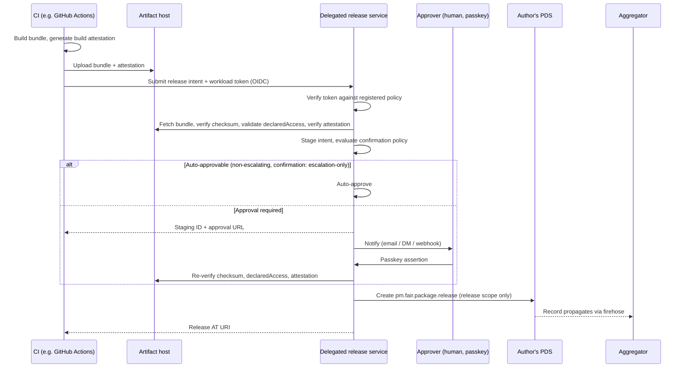

# RFC: Attested Automated Publishing

# Summary

[RFC 0001](https://github.com/emdash-cms/emdash/blob/wip/plugin-rfc/rfcs/0001-plugin-registry.md) defines how sandboxed plugins are published as FAIR records over an atproto transport, and how a site installing a plugin verifies them. For non-interactive (CI) publishing it suggests **app passwords** — full-account atproto credentials stored in a CI secrets store — while noting that app passwords are a deprecated stopgap kept only because atproto's headless-client story is unfinished.

This RFC supersedes RFC 0001's app-password suggestion and defines the CI publishing path properly. It specifies:

1. A **delegated release service** — a service holding a granular OAuth scope limited to release records (`repo:pm.fair.package.release`, create-only) for authors who delegate to it, which creates release records on their behalf. Anyone can run one. CI authenticates to it with a short-lived workload token (e.g. GitHub Actions OIDC), never a stored account credential.
2. **Build provenance** — an attestation, carried on the release, binding the published artifact to the source revision and workflow that built it, verifiable independently of the registry and the delegated release service.
3. **Release policy** — author-signed declarations on the package profile (`requireProvenance`, `confirmation`) that constrain how releases may be published, enforced by the delegated release service and verifiable by the installing site.

The delegated release service is not a registry, verifier, aggregator, labeller, or trust authority. It is a delegated writer. The publisher trusts it to hold a release-scoped OAuth session and enforce staging policy. The installing site does not trust it for integrity: installs verify the publisher's atproto records, the artifact checksum, the Sigstore attestation, and the author-signed release policy.

The attested flow this RFC describes is the way to publish from CI, and the only way to produce provenance. App-password publishing is not implemented in the EmDash CLI and is not part of this design; it remains possible only insofar as an author's PDS independently chooses to permit it, which is outside EmDash's tooling and outside this RFC.

Everything new is defined under `com.emdashcms.*`, reusing RFC 0001's extension mechanism. Build provenance is generic enough that we also propose it as a FAIR artifact field; see [Provenance and FAIR](#provenance-and-fair).

# Background & Motivation

## The attack this is built against

Since September 2025 the npm ecosystem has been under sustained attack by the self-replicating Shai-Hulud worm and its successors (the "Mini Shai-Hulud" waves attributed to the TeamPCP group, ongoing through 2026). Security researchers describe Shai-Hulud as a prototype for a new class of automated supply-chain attack that weaponises developer identity and the implicit trust in CI/CD pipelines. The attack chain has distinct stages, and they are worth setting out because each maps to a specific defence in this RFC:

1. **Credential capture.** Initial compromise via phishing (spoofed npm MFA-update prompts) or a poisoned dependency, harvesting a maintainer's long-lived publishing credential.
2. **Secret exfiltration.** The payload steals credentials from cloud providers, CI/CD systems, and developer workstations. Recent waves steal CI secrets directly — GitHub Actions cache poisoning, and OIDC tokens read from process memory.
3. **Backdoored publish under a legitimate identity.** Using the captured publishing rights, the attacker publishes trojanised versions of packages the victim controls. The releases are validly signed by the real maintainer's credential; only the contents are malicious.
4. **Self-propagation.** The worm backdoors every package the victim can publish and uses the harvested tokens to spread laterally, at machine speed — one recent wave published over 300 malicious versions across 323 packages in a 22-minute automated burst.

The common thread is a **long-lived publishing credential** that, once stolen, grants the attacker the victim's full publishing rights, and a publish step that **attests nothing about the build**, so a backdoored artifact published under a genuine identity is indistinguishable from a legitimate release.

## Where RFC 0001 is exposed

RFC 0001's CI path stores an app password — a full-account atproto credential — in the CI secrets store. This reproduces both weaknesses the worm exploits:

- The app password is a full-account secret in the place most exposed to stages 1 and 2. A leaked one grants the attacker the author's entire account, not the right to publish one plugin. That is the "every package the victim can publish" propagation surface.
- RFC 0001's signed `checksum` proves the bytes are what the publisher blessed, but says nothing about where those bytes came from. An attacker who reaches the build pipeline (stage 2/3) can cause a valid, correctly-signed release to point at a poisoned artifact, and nothing in RFC 0001 detects it.

The mapping of stages to defences lives in the [Threat model](#threat-model-additions).

# Goals

- **No stored account credential in CI.** The automated path authenticates with a short-lived workload token. There is no long-lived publishing secret for a Shai-Hulud-style payload to exfiltrate.
- **Scope-bounded delegated publishing.** The component that writes releases holds an OAuth scope limited to release records, never profile, identity, or account scopes. A compromise cannot reach other collections.
- **Independent build verification.** A site installing a plugin can confirm the artifact was built from a declared source by a declared workflow, trusting neither the registry, the aggregator, nor the delegated release service.
- **Author-controlled, verifiable release policy.** An author can require that releases carry provenance, signed into the profile where the delegated release service cannot reach it.
- **Human-in-the-loop on escalation.** Any release that widens a package's `declaredAccess` requires a passkey approval from an approver the author authorised. A stolen workload token cannot escalate on its own.
- **Run-anywhere.** Anyone can host a delegated release service, as anyone can host an aggregator or mirror under RFC 0001. EmDash hosts a default; third parties and individual authors can run their own.
- **Backwards-compatible and additive.** Records without provenance remain valid and installable. Absent provenance means "no attestation", not "untrusted", unless the author's signed policy requires it.

# Non-Goals

- **Fully-unattended signing with no held session anywhere.** atproto has no non-interactive grant that lets a stateless CI job sign a repo write with no held credential. The delegated release service holds a confidential-client session, established once interactively. See [The delegated release service](#the-delegated-release-service).
- **Interactive publishing.** RFC 0001's interactive OAuth path is unchanged. This RFC concerns the automated path.
- **Specifying Sigstore or the SLSA predicate.** These are defined upstream. We specify only the fields and checks this RFC needs; the attestation's internal format is referenced, not redefined.
- **Native plugins.** Out of scope here as in RFC 0001.
- **Making the delegated release service an install-time trust root.** The service writes records for authors who delegate to it. It does not verify packages for installers, and installers do not configure or trust it.
- **Confirmation receipts verifiable at install.** Staged releases ([Staged releases](#staged-releases)) carry their approval evidence at the delegated release service. Surfacing that evidence on the release record, so the _installing site_ can verify human approval happened rather than only that the author's policy asked for it, remains [Future work](#future-work).
- **Two-person review and per-capability policy.** Noted as [Future work](#future-work); not specified.

# Actor and trust model

This RFC has several actors whose names are easy to conflate. They have different trust relationships.

| Actor                     | Chosen by          | Trusted by                                              | Role                                                                                              |
| ------------------------- | ------------------ | ------------------------------------------------------- | ------------------------------------------------------------------------------------------------- |
| Publisher PDS             | Publisher          | Installing sites, via atproto record verification       | Holds signed package profile and release records.                                                 |
| Delegated release service | Publisher          | Publisher                                               | Holds release-scoped OAuth, receives CI intents, enforces staging policy, writes release records. |
| CI/build platform         | Publisher          | Publisher and installing sites, through Sigstore policy | Builds the artifact and emits provenance.                                                         |
| Artifact host             | Publisher          | Nobody for integrity                                    | Hosts bundle and attestation bytes; checksums bind them to the signed release.                    |
| Sigstore/transparency log | Ecosystem/verifier | Installing sites                                        | Verifies build identity and attestation transparency.                                             |
| Aggregator                | Site/operator      | Convenience only                                        | Discovers, indexes, mirrors, and flags records; cannot forge valid releases.                      |
| Labeller                  | Site/operator      | Site/operator                                           | Issues moderation/trust labels used for discovery and policy presentation.                        |
| Installing site           | Site owner         | Itself                                                  | Re-verifies release record, artifact, provenance, and policy before install.                      |

The publisher trusts the delegated release service operationally: it may create release records using a release-scoped OAuth grant, and it may enforce staging policy.

The installing site does not trust the delegated release service for integrity. It verifies the release as if the service were malicious: fetch the signed atproto record, verify the publisher's MST chain, verify the artifact checksum, verify the Sigstore attestation, and check the publisher-signed release policy.

A compromised delegated release service can publish releases its delegated scope permits, but it cannot make invalid provenance valid, cannot alter the package profile, and cannot make the installing site skip verification.

## Three meanings of verification

This RFC uses "verify" in three separate ways:

- **Record authenticity:** atproto/MST proof that a package profile or release record came from the publisher DID.
- **Build provenance:** Sigstore/SLSA proof that artifact bytes came from the declared workflow and source.
- **Policy enforcement:** checks performed before writing or installing, such as `requireProvenance`, `confirmation`, `declaredAccess`, and approver policy.

The delegated release service participates in policy enforcement before writing. It is not the source of record authenticity or build provenance.

## What is stored where

Package profile record, on the publisher PDS:

- package metadata;
- repository;
- release policy;
- approvers;
- `requireProvenance`;
- `confirmation`.

Release record, on the publisher PDS:

- artifact URL;
- artifact checksum;
- `declaredAccess`;
- provenance reference URL;
- provenance checksum.

Staged intent, inside the delegated release service only:

- OIDC claims;
- approval state;
- passkey approval evidence;
- staging ID;
- notification/audit details.

Sigstore bundle, on the artifact host:

- build identity;
- source revision;
- workflow identity;
- artifact digest.

The delegated release service is therefore not a durable public trust database. The durable public data used by installers lives in the publisher's signed atproto records and in the referenced provenance document.

## Which service does a user configure?

Publishers configure a delegated release service because it is their delegated writer.

Installers configure aggregators and accepted labellers for discovery, filtering, and policy presentation.

Installers do not configure a delegated release service to verify releases. The release record names the artifact and provenance; verification follows those references and the publisher DID.

The default EmDash delegated release service is only a hosted delegated writer. It has no special protocol authority. A release written by it verifies the same way as a release written by any other delegated release service or by the publisher directly: against the publisher's PDS record and the attached provenance.

# The delegated release service

## What it is

A delegated release service creates `pm.fair.package.release` records on behalf of authors who delegate to it. Earlier drafts called this a "signing service", but that name makes it sound like an install-time verifier or authority. Its role is narrower: it is a delegated writer for release records.

It holds, per delegating author, an atproto session authorised with a **granular OAuth scope limited to the release record**: `repo:pm.fair.package.release` with the action restricted to `create` (releases are version-immutable in RFC 0001, so update and delete are not requested). This is the release-only scope RFC 0001 already defines for interactive publishing, used here for the automated path. The scope syntax and semantics are specified in the [atproto Permissions specification](https://atproto.com/specs/permission). The key property is that a session bearing this scope can create release records and do nothing else: it cannot read or write the package profile, the author's identity, their other collections, or account settings.

It authenticates to atproto as a confidential OAuth client (`private_key_jwt`), so its sessions are long-lived but revocable: removing the service's key from its published JWKS invalidates every session it holds.

It also holds _staged release intents_ pending human approval and runs the passkey ceremonies for approvers the author has authorised; see [Staged releases](#staged-releases).

Like the aggregator, the mirror, and the artifact host in RFC 0001, it is trusted for availability and convenience, never for install-time integrity: every release it produces is verified by the installing site against the author's PDS, the artifact checksum, `declaredAccess`, release policy, and provenance when present.

## Anyone can run one

The delegated release service follows RFC 0001's run-anywhere pattern. EmDash operates a default instance, with no special authority. Hosting platforms and plugin directories can run one for their users; individual authors can self-host. The software is the same in every case, the scope bound is identical, and the choice of delegated release service is the author's. See [What you trust a delegated release service for](#what-you-trust-a-delegated-release-service-for).

If `evil.example` runs a delegated release service and writes a release for a publisher, that release is accepted only if the publisher explicitly delegated release scope to `evil.example`. Installers do not ask "do I trust evil.example?" They ask: did the publisher DID sign this release record, does the artifact checksum match, does the provenance verify, and does the profile policy allow it?

The centralized dependency in the provenance story is Sigstore and the build platform identity, not the delegated release service. The service stores no globally trusted verification database.

## The automated release flow

Step by step:

1. **CI builds and attests.** The build produces the bundle and a build attestation (e.g. via `actions/attest-build-provenance`, which attests an arbitrary tarball and emits an SLSA provenance statement carrying the source repository, ref, commit, and workflow). CI uploads both the bundle and the attestation document to the artifact host — the attestation must be fetchable at a URL the release record can reference, not left only in the build platform's own attestation store.
2. **CI submits a release intent with a workload token**, not a stored credential. With GitHub Actions this is an OIDC token, audience-scoped to the delegated release service, carrying claims (repository, workflow, ref) that identify the build. The token is short-lived.
3. **The delegated release service verifies the token against a registered policy** the author set up ahead of time: which repository and workflow may publish which package. No policy match, no signature.
4. **The delegated release service re-derives trust from the bytes**, not from CI's assertion: it fetches the bundle, recomputes the multibase `checksum`, validates that the bundle manifest's `declaredAccess` is deep-equal to what the release will declare (RFC 0001's existing consistency check), and verifies the attestation (the same four checks the installing site performs — see [Verification](#verification)).
5. **The delegated release service stages the intent and evaluates the confirmation policy.** Auto-approvable intents proceed immediately; intents requiring human approval are held pending a passkey ceremony. See [Staged releases](#staged-releases).
6. **On approval (auto or human), the delegated release service re-runs the four-layer check and creates the release record** in the author's PDS using its release-scoped session, carrying the artifact `checksum`, the `declaredAccess`, and the provenance reference. From there it is an ordinary RFC 0001 release: it propagates via the firehose and is verified by the installing site at install time.

The delegated release service never holds a profile-scoped session, so it cannot create or alter the package profile, including the release policy that governs it. That separation is the basis of the downgrade defence ([Release policy](#release-policy)).

## The held session

atproto has no grant for stateless headless writes. A confidential-client session, minted once interactively, is the closest available mechanism, and the delegated release service holds one. Compared with app passwords: the credential is release-scoped instead of full-account, revocable, and held in one place the author chose instead of duplicated into every CI runner. PDS-side MFA, if any, applies at the initial authorisation.

Recent Shai-Hulud variants steal workload tokens from CI memory. A stolen token lets an attacker call the delegated release service as that workflow, but the layers behind it (provenance, `requireProvenance`, the escalation gate) catch what the token alone cannot bypass. See the [Threat model](#threat-model-additions). No single stolen credential is sufficient.

# Staged releases

Every automated release passes through staging. CI submits a _release intent_; the PDS record is written only after the intent is approved, either automatically (when policy allows) or by a human approver presenting a passkey.

## What is staged

On submission, the delegated release service runs the same four-layer check the installing site runs ([Verification](#verification)) and rejects early if any layer fails. The staged intent records:

- the artifact URL, `checksum`, and `declaredAccess`;
- the provenance reference and its `checksum`;
- the submitting workload's OIDC claims (repository, workflow, ref, run ID);
- the submission timestamp and an intent ID.

At approval time the delegated release service **re-runs the four-layer check** before signing. This catches an artifact host that has changed bytes between submit and approve, an attestation that has been substituted, or profile records that have moved on (e.g. `repository` changed). Verifying once at submit is for fast rejection; verifying again at approve is what the signature actually rests on.

## Auto-approval versus human approval

The delegated release service evaluates the package's `confirmation` policy ([Release policy](#release-policy)) against the staged intent:

- **`escalation-only`** (default): the intent auto-approves _unless_ it widens `declaredAccess` relative to the package's previous release (an _escalation_). Escalating intents require human approval. A first-ever release whose `declaredAccess` is non-empty is an escalation from the implicit empty floor.
- **`always`**: every intent requires human approval, escalation or not.

The escalation gate is not configurable. Profile policy can tighten it (require approval for every release) but cannot loosen it. An author with no `confirmation` field and no enrolled approver still has the gate: an escalating intent in that state is held, will not auto-approve, and expires unapproved. The fix is to enrol an approver, not to bypass the gate.

From CI's perspective, the delegated release service's response is either a release AT URI (auto-approved, written) or a staging ID plus approval URL (held).

## Approver identities

The author signs an `approvers` list into the profile policy ([Release policy](#release-policy)) declaring whose passkeys the delegated release service may accept. Each entry is an atproto DID (`did:plc:…` or `did:web:…`). Non-atproto identity bindings (email, OIDC, and so on) are deliberately not part of this RFC; see [Future work](#future-work).

The delegated release service MUST refuse approvals from DIDs not on the signed `approvers` list. The set of authorised humans is on the author's signed profile (where the delegated release service cannot rewrite it); the passkey material is at the delegated release service (which the protocol cannot carry).

## Enrolment

An approver listed in `approvers` cannot approve until they have enrolled a passkey at the delegated release service. The delegated release service **MUST** refuse approval attempts from DIDs for which no credential is registered. "Listed but not enrolled" is a no-op; it does not silently authorise a JIT enrol-and-approve flow.

The enrolment ceremony has two parts, in order:

1. **DID control proof via atproto OAuth.** The approver signs in at their PDS through an OAuth flow initiated by the delegated release service. The delegated release service requests no write scopes — only enough to verify the DID. On completion the delegated release service has a verified resolution from "the browser session" to the approver's DID, which it checks against the DID the enrolment URL was issued for.
2. **WebAuthn registration.** The delegated release service initiates a WebAuthn registration ceremony bound to its own origin. The approver creates a passkey locally (platform authenticator or hardware key). The delegated release service stores the credential associated with the DID.

The delegated release service MUST persist enrolment outcomes so revocation, re-enrolment, and listing-versus-enrolled status are queryable by the author. Enrolment does not produce an approval; the approver returns to the approval surface separately. Approval is a deliberate decision on top of an established identity, never a side effect of identity setup.

**Invitations.** The invitation channel is operator policy, not protocol. When the author adds an entry via the CLI or admin UI, they typically pass the new approver's contact channel (e.g. email) to the delegated release service privately, not on the signed profile. The delegated release service then issues an enrolment URL and delivers it. Authors who skip this can direct approvers to the enrolment endpoint manually. The enrolment URL authorises nothing on its own; the OAuth ceremony is what proves DID control.

**Re-enrolment.** An approver who loses their authenticator MAY re-enrol by repeating the ceremony. The delegated release service MUST require the OAuth proof again, MUST replace the previous credential (multiple credentials per DID MAY be supported as an explicit "add another authenticator" action), and MUST log the re-enrolment and notify the author. An unexpected re-enrolment is a signal the author needs to see.

**Revocation.** Removing a DID from the signed `approvers` list revokes that approver for that package as soon as the delegated release service observes the profile update on the firehose. The delegated release service MAY retain the credential record if the same DID is still listed on other packages it serves.

**Cross-package and cross-signer.** A passkey enrolment is per (DID, delegated release service) pair, bound to the delegated release service's origin. The same DID can be enrolled at multiple delegated release services, with independent credentials. Within one delegated release service, an already-enrolled DID listed on a new package does not need to re-enrol; the delegated release service SHOULD inform the approver of the new association.

## Approval surface

The delegated release service hosts the approval surface itself: a web view (the approval URL returned to CI) and a CLI command (`emdash plugin approve <stage-id> --signer <url>`), both speaking the same JSON API. Other clients — an EmDash site's admin UI, third-party dashboards — MAY consume that API; the delegated release service MUST implement it. The contract is the API; the UI is conventional. This is the run-anywhere shape applied to approval: anyone can run the delegated release service, anyone can build a client against the API.

The approver's view, before they touch the passkey, shows the submitting workflow's OIDC claims, the artifact `checksum`, the `declaredAccess` (with an explicit diff against the previous release when escalating), and the provenance reference. The WebAuthn assertion is bound to the delegated release service's origin and to a server-issued challenge tied to the staging ID, so an assertion captured from one delegated release service cannot be replayed at another.

## Lifecycle

- **TTL.** Staged intents expire after an operator-configured window (recommended 24 hours). An expired intent is discarded; CI resubmits if still wanted.
- **Cancellation.** The submitting workflow MAY cancel its own staged intent before approval (using the same OIDC identity it submitted under). An approver MAY explicitly reject an intent; rejection is logged and the submitter is notified.
- **Notification.** When an intent is held for approval, the delegated release service notifies registered approvers via their configured channel (email, atproto DM, webhook — operator choice). The notification carries the staging ID and approval URL only; the substantive details are shown by the approval surface itself after the approver authenticates.
- **Storage.** Staged intents live in the delegated release service's own storage; they are not records in the author's PDS. The delegated release service is now stateful in a way it was not when it merely held a session — see [Drawbacks](#drawbacks).

## What this gates and what it does not

Staging gates the _publication_ of a release intent into the author's PDS. It does not gate the bundle's existence on the artifact host (already uploaded by CI), nor anything else outside the delegated release service's reach. An attacker with a stolen workload token can submit intents and waste storage; they cannot publish, and they cannot escalate. Staging does not protect against a delegated release service that ignores its own policy. That risk is the same as before; staging extends what the delegated release service is trusted _to enforce_, not what it is trusted _for_.

# Build provenance

## The provenance reference

A release gains an optional reference to a build attestation, modelled on RFC 0001's existing `sbom` artifact-sibling: an externally-hosted document, referenced by URL, integrity-bound by a multibase-multihash `checksum`, and therefore transitively signed by the author's repo MST like everything else in the record.

| Property           | Type         | Required | Description                                                                                                                                            |
| ------------------ | ------------ | -------- | ------------------------------------------------------------------------------------------------------------------------------------------------------ |
| `predicateType`    | string       | yes      | Attestation predicate type URI, e.g. `https://slsa.dev/provenance/v1`. A type the verifier does not understand is treated as present-but-unverifiable. |
| `url`              | string (uri) | yes      | Where the attestation document (a Sigstore bundle) can be fetched.                                                                                     |
| `checksum`         | string       | yes      | Multibase-multihash checksum of the attestation document, same format as RFC 0001 artifact checksums.                                                  |
| `sourceRepository` | string (uri) | yes      | Source repository the artifact was built from. Cross-checked against the profile's `repository` at verification time.                                  |
| `builderId`        | string (uri) | yes      | Build workflow identity (e.g. workflow path plus ref). The attestation's own builder identity must match this.                                         |

The artifact digest is not duplicated here. The release already carries the artifact's `checksum`; verification compares the attestation's subject digest against that, so there is one source of truth for the digest.

## Provenance and FAIR

Build provenance is not EmDash-specific — every FAIR ecosystem with author-hosted artifacts has the same build-pipeline gap, and the natural home is a FAIR artifact field beside `checksum`, `signature`, and `sbom`. We will propose it upstream. Until or unless FAIR adopts it, the reference is carried under `com.emdashcms.package.releaseExtension` (alongside `declaredAccess`), so this RFC is not blocked on a FAIR decision — the same dual-track approach RFC 0001 takes on the `pm.fair.*` versus `com.emdashcms.package.*` namespace question.

## Author-generated, not registry-generated

The registry never witnesses the build. The attestation is generated by the author's CI and is self-contained; the delegated release service, aggregator, and mirror pass it through and vouch for nothing. This is weaker than a registry-witnessed build (it trusts the build platform and Sigstore to have attested correctly) and stronger than identity-signing alone (forging it requires compromising the source-and-build chain, not merely a publishing credential or the artifact host).

# Verification

"The installing site" below means the EmDash site that is installing the plugin — the admin server performing the install, per RFC 0001's install flow.

When a release carries provenance, the installing site verifies four claims, all of which must hold. This is additive to RFC 0001's existing install checks (PDS-direct record fetch, MST signature, artifact `checksum`, `declaredAccess` deep-equal) and runs only when provenance is present (subject to policy, below). The delegated release service performs the same four checks before signing; the installing site repeats them because the delegated release service is not trusted for integrity.

1. **Authentic.** The attestation's Sigstore signature verifies and its signer is a build-platform workload identity. Sigstore verification mechanics are upstream; this RFC requires only that the check passes.
2. **Describes this artifact.** The attestation's subject digest equals the release artifact's `checksum` (both decoded to raw bytes and compared).
3. **Matches the signed reference.** The fetched attestation matches the `checksum` for it in the signed release record.
4. **Built from the declared source.** The attestation's builder and source are consistent with `builderId` and `sourceRepository`, and `sourceRepository` is consistent with the package profile's `repository` field.

Without layer 1 the attestation is an unsigned document anyone could write. Without layer 2 a genuine attestation from an unrelated build can be attached to a malicious artifact. Without layer 3 a mirror can substitute a different Sigstore-valid attestation describing an unrelated source. Without layer 4 an attacker's own pipeline can produce a valid attestation of their malicious artifact (layers 1–3 pass because they genuinely built it); only layer 4 catches that the source is not the one the package claims.

Layer 4 must accommodate legitimate build repositories that differ from source repositories (monorepos, build-farm repositories). Because both `builderId` and the profile's `repository` are author-signed, the check is whether this is the builder the author's own signed records point at, not whether it is the same organisation as the source. An installing site may apply stricter operator-configured policy.

**Absent versus failed.** Absent provenance falls back to RFC 0001 trust and is not a failure — unless the package's signed policy requires provenance ([Release policy](#release-policy)), in which case absent is a hard reject. Failed provenance (present but a layer fails) is tampering or misconfiguration: the installing site warns clearly and blocks per operator policy, and does not silently downgrade it to absent.

**What it does not establish.** A verified chain proves origin, not safety. A compromised author building malware from their own real repository through their own real workflow passes all four layers. Provenance answers "where did this come from"; the sandbox answers "is it safe to run". The installing site surfaces provenance as origin information, not as a safety endorsement.

# Release policy

## The fields

An author can constrain how releases of their package are published, by signing policy into the **package profile** through `com.emdashcms.package.profileExtension`. (RFC 0001's `com.emdashcms.package.releaseExtension` carries per-release fields like `declaredAccess` and the provenance reference; the profile extension introduced here carries package-level policy that applies to every release.) Because it lives on the profile, it is governed by the `repo:pm.fair.package.profile` scope, which the delegated release service does not hold.

| Field               | Type    | Default           | Meaning                                                                                                                                                                                                                                                                                                                                                                                                                                                                                                                        |
| ------------------- | ------- | ----------------- | ------------------------------------------------------------------------------------------------------------------------------------------------------------------------------------------------------------------------------------------------------------------------------------------------------------------------------------------------------------------------------------------------------------------------------------------------------------------------------------------------------------------------------ |
| `requireProvenance` | boolean | `false`           | If true, a release of this package without valid build provenance is invalid: the installing site rejects it and a conforming aggregator flags it. This is the verifiable control.                                                                                                                                                                                                                                                                                                                                             |
| `confirmation`      | string  | `escalation-only` | `escalation-only` (default) or `always`. Both values gate escalating releases (intents widening `declaredAccess` versus the prior release) on a passkey approval; `always` extends the gate to every release. The escalation gate is not configurable; see [Staged releases](#staged-releases). Enforced by the delegated release service.                                                                                                                                                                                     |
| `approvers`         | array   | `[]`              | atproto DIDs the delegated release service may accept passkey approvals from for this package. Listed approvers must enrol a passkey at the delegated release service before they can approve; see [Enrolment](#enrolment). An empty list combined with any release that requires approval (every release under `always`, or any escalating release under `escalation-only`) means the release cannot be approved and will expire. Authors who never want to escalate may keep the list empty; everyone else must populate it. |

**Absent means default.** A profile with no policy is `requireProvenance: false`, `confirmation: escalation-only`, `approvers: []`. This must not be inverted: treating absence as strict would retroactively invalidate every existing package. The escalation gate still applies: an existing package whose first signed-policy release escalates is held until an `approvers` entry exists and approves it.

`requireProvenance` is the load-bearing control because it is verifiable by the installing site and by aggregators: anyone can check whether a release has valid provenance and whether the profile requires it. `confirmation` is enforced by the delegated release service and is not verifiable after the fact by the installing site (a past release cannot be checked for whether it was human-confirmed, only the policy that asked for it). Client-verifiable confirmation via signed receipts is [Future work](#future-work).

## Defeating the downgrade attack

With `requireProvenance: true` signed into the profile, an attacker who has gained a release-publishing capability still cannot publish a malicious release that a client will install:

- Publish without provenance — the installing site and conforming aggregators reject it; the signed profile policy requires provenance.
- Publish with provenance — they must produce a valid attestation, which by [Verification](#verification) layer 4 must be built from the profile's declared source. With only a release-publishing capability and not the source-build chain, they cannot.

The remaining move is to weaken the policy first (`requireProvenance: true` to `false`), then publish freely. Two mechanisms block this:

- **Scope separation (primary control).** The policy is on the profile, governed by `repo:pm.fair.package.profile`. The delegated release service holds only `repo:pm.fair.package.release` and cannot touch the policy. A compromised delegated release service or a stolen workload token has no reach to the profile. Scope separation, not the delegated release service's tenancy, is what bounds the attack.
- **History-based detection (defence in depth).** The policy lives in the author's append-only signed repository, and the firehose carries every profile version in order. A weakening transition is a distinguishable event. A conforming aggregator treats policy as a ratchet, cheap to tighten and conspicuous to loosen: it flags loosening transitions, continues to enforce the stricter prior policy for a cooldown window (operator-configured, e.g. 7–14 days) while the author's security contact is notified. This reuses RFC 0001's existing labeller layer; a policy-downgrade flag is the same kind of signal as `security:yanked`. The downgrade cannot be silent or immediately effective; a legitimate author downgrading waits out the cooldown, which is the right cost for loosening one's own posture.

The strongest further step, refusing to lower a once-asserted floor without an out-of-band signal tied to the account's atproto rotation key, is [Future work](#future-work).

## Aggregator handling of policy-violating releases

For a release that violates its package's `requireProvenance` policy (absent or failed provenance), a conforming aggregator:

- **MAY** refuse to index it (operator discretion, consistent with RFC 0001's position that the aggregator is discovery, not authority).
- **SHOULD NOT** return it in default search and discovery results, so a violating release is not promoted, while keeping it visible in explicit audit or debug views.
- **MUST** flag it as policy-violating wherever it is exposed.

This is scoped to the policy in force at the release's publication time, determined by firehose ordering (more reliable here than the author-supplied creation timestamp): releases that predate a later-added policy are not retroactively violations. The installing site remains the authoritative gate; aggregator handling surfaces the problem earlier. Determining provenance validity requires the aggregator to run the four-layer check at index time, a capability beyond RFC 0001's structural validation, noted as a cost in [Drawbacks](#drawbacks).

# Delegated publishing without protocol changes

RFC 0001 leaves multi-author and team publishing to a shared organisational atproto account. The signing-service model gives a cleaner pattern for delegating _release approval_ without any protocol support, expressed entirely as signing-service policy:

- The package is owned by a **dedicated publisher account**: an atproto account used for nothing except publishing this package (or this organisation's packages). It holds the profile and is the identity releases are signed under.
- That account delegates, to the delegated release service, a release-scoped session and a workflow-publishing policy describing which CI workflows may trigger a release. The set of humans whose passkeys can approve releases is named in the profile's `approvers` list (see [Release policy](#release-policy)), signed by the publisher account.
- Individual contributors never hold the publisher account's credentials. They trigger releases through CI; approvals (required for every escalating release, and for every release under `confirmation: always`) are granted with each approver's own passkey against their own identity.

Because the publisher account does nothing else, the blast radius of its compromise is bounded to that package's releases, and because approval delegation lives in signing-service policy rather than the protocol, teams can change who may approve without touching any record or any lexicon. This needs no protocol support beyond the release-scoped delegation already described; it is a deployment pattern the delegated release service enables, and the recommended one for teams.

# What you trust a delegated release service for

The delegated release service is bounded by its scope.

A delegated release service **can**:

- Create `pm.fair.package.release` records for authors who delegated the release scope to it.
- Hold staged release intents, run the passkey ceremonies that approve them, and enforce the profile's `confirmation` policy and `approvers` list.

A delegated release service **cannot**:

- Modify package profiles — so it cannot alter `declaredAccess`-governing metadata, security contacts, the release policy (`requireProvenance` / `confirmation`), or the `approvers` list. The downgrade defence holds whichever delegated release service is used.
- Touch anything outside the release collection — no identity, posts, or account settings. A compromise cannot self-propagate across the author's other records, unlike the npm-token compromises Shai-Hulud exploits.
- Produce provenance that passes verification — a release with absent or bogus provenance is caught at install by the four-layer check, as any tampered artifact is. The delegated release service is untrusted for integrity, like the aggregator and artifact host in RFC 0001.

**Residual risk.** A compromised delegated release service that ignores its own staging and approval policy can publish unwanted but still-verified releases for its delegating authors; a multi-tenant one can do so for all of them. The damage is bounded by the create-only release scope: no account takeover, no profile change, no escalation past the profile's signed `declaredAccess`. `requireProvenance` (out of the delegated release service's reach) and install-time verification constrain even that. Staging raises the cost of compromise (policy enforcement must also be subverted) without eliminating it. Authors who reject the multi-tenant blast radius run their own delegated release service.

# Threat model additions

Extends RFC 0001's threat model. Stages refer to the Shai-Hulud chain in [Background](#background--motivation).

| Threat                                                                                                                       | Mitigation                                                                                                                                                                                                                                                                                                                                                                                                                                                                            |
| ---------------------------------------------------------------------------------------------------------------------------- | ------------------------------------------------------------------------------------------------------------------------------------------------------------------------------------------------------------------------------------------------------------------------------------------------------------------------------------------------------------------------------------------------------------------------------------------------------------------------------------- |
| Harvested CI publishing credential (stages 1–2)                                                                              | The automated path holds no reusable credential in CI — only a short-lived workload token, audience-scoped to the delegated release service. There is no stored account secret to exfiltrate.                                                                                                                                                                                                                                                                                         |
| Stolen workload token from CI memory (stage 2, recent waves)                                                                 | A stolen token lets the attacker submit a staged intent as that workflow, but cannot produce an attestation that cross-checks against the author's signed source (verification layer 4); under `requireProvenance`, a provenance-less release is invalid; and any escalating release requires a passkey approval the attacker does not hold.                                                                                                                                          |
| Stolen workload token used to escalate `declaredAccess`                                                                      | The intent is staged and held; escalation requires a passkey approval from a profile-listed approver. The attacker reaches staging and no further.                                                                                                                                                                                                                                                                                                                                    |
| Approval-link phishing of an approver                                                                                        | The approval URL alone grants nothing. The passkey ceremony binds to the delegated release service's origin and a server-issued challenge tied to the staging ID. The approval surface shows the workload claims, artifact `checksum`, and `declaredAccess` diff before the passkey is touched.                                                                                                                                                                                       |
| Stale-attestation replay through staging (substituted bytes between submit and approve)                                      | The delegated release service re-runs the four-layer check at approval time, not only at submission.                                                                                                                                                                                                                                                                                                                                                                                  |
| Backdoored artifact published under a genuine identity (stage 3)                                                             | Build provenance binds the artifact to source and workflow; the installing site detects that the bytes were not built from the declared source. RFC 0001's identity-signing alone does not detect this.                                                                                                                                                                                                                                                                               |
| Self-propagation across the victim's other packages and records (stage 4)                                                    | The delegated release service's session is scoped to release records only; it cannot reach the profile, identity, or other collections. There is no broad publishing right to capture.                                                                                                                                                                                                                                                                                                |
| Tampered or foreign-source attestation (stapled, substituted, or built from an attacker's repo)                              | Verification layers 2, 3, and 4 reject: the attestation must describe this artifact's checksum, match the signed reference, and have a source consistent with the profile's `repository`.                                                                                                                                                                                                                                                                                             |
| Compromised delegated release service publishes unwanted release                                                             | Bounded by the create-only release scope: cannot alter profile, policy, `approvers`, identity, or `declaredAccess`, and cannot forge passing provenance. A compromised service that ignores its own staging policy can still publish releases its release-scoped session allows; staging raises the cost of compromise (policy enforcement must also be subverted) but does not lower the existing floor. Damage is limited to unwanted-but-verified releases for delegating authors. |
| Attacker with compromised profile credential adds attacker-controlled DID to `approvers`, then self-enrols and self-approves | Pre-registration adds latency: the attacker must complete the OAuth + WebAuthn enrolment at the delegated release service before they can approve. Both the `approvers` change (observable on the firehose) and the enrolment event (observable at the delegated release service, with author notification recommended) are visible signals. A firehose-driven cooldown on `approvers` additions is [Future work](#future-work).                                                      |
| Downgrade: weaken `requireProvenance`, then publish provenance-less                                                          | Out of the delegated release service's scope entirely (policy is profile-scoped). Through a compromised profile credential it is non-silent and delayed: aggregators flag the loosening and enforce the prior policy through a cooldown while the author is notified.                                                                                                                                                                                                                 |

# What this means if you want to publish

**Interactively** — unchanged from RFC 0001: `emdash plugin login`, `init`, build, host the bundle, `publish --url`.

**Automatically — the path this RFC defines:**

1. Once, set up delegation: register, with a delegated release service you trust, which repository and workflow may publish your package, and grant it the release scope for your account (interactive OAuth, one time). For sole tenancy, run your own delegated release service and delegate to that.
2. Sign your `approvers` list (atproto DIDs) into your profile and have each approver enrol a passkey at the delegated release service. Enrolment is a one-time OAuth-against-PDS ceremony followed by WebAuthn registration; the delegated release service refuses approvals from listed-but-not-enrolled DIDs. This is required before any release that escalates `declaredAccess` can be approved, and before any release at all if you set `confirmation: always`. Packages that never escalate can technically skip this, but enrolling at least one approver up front is recommended: escalations tend to appear later, and an unenrolled approver means a held-and-expiring intent at the worst moment.
3. Optionally set further policy on your profile: `requireProvenance: true` to require an attestation on every release; `confirmation: always` to require human approval on every release, not just escalating ones. Policy lives on the profile and is changed only through the profile path, not by your CI and not by the delegated release service.
4. In CI: build the bundle, generate the attestation, upload both to your artifact host, and submit a release intent to the delegated release service with your workload token. No app password, no account secret in the runner. Non-escalating intents return a release URI directly; escalating intents (or all intents, under `always`) return a staging ID and approval URL.
5. When approval is required, an authorised (already-enrolled) approver visits the approval URL or runs `emdash plugin approve <stage-id> --signer <url>`, reviews the submission, and presents their passkey. The delegated release service re-verifies and writes the release. New approvers added to a package go through `emdash plugin enrol --signer <url>` (or the equivalent web URL) once before they can approve.

Steady state is an ordinary CI release. The credential in the runner is ephemeral; the release-writing capability lives at the service you chose; your policy and approvers live where neither CI nor the delegated release service can rewrite them; and any release that widens `declaredAccess` waits for an approver you authorised.

# Reference architecture

Two third-party sandboxed plugins, illustrating the trust layout (hosting specifics are illustrative, not prescriptive):

- **`gallery-plugin`** by `@example.dev`: bundle and attestation hosted on GitHub Releases; published through the EmDash-operated delegated release service; profile sets `requireProvenance: true`, `confirmation: always`, and `approvers: ["did:plc:example-dev"]` with a passkey registered against that DID. Every CI release is held for the author's own passkey approval.
- **`forms-plugin`** by `@studio.example`: bundle and attestation on the studio's own R2 bucket; published through a delegated release service the studio's hosting platform runs; `confirmation: escalation-only` (default) with `approvers` listing three studio engineers by `did:plc:…`, each enrolled with a passkey at the studio's delegated release service. Routine releases auto-approve; any release widening `declaredAccess` is held until one of the named engineers approves with a passkey.

| Component                            | Operated by                       | Trusted for                                                                                                  | Not trusted for                                                                       |
| ------------------------------------ | --------------------------------- | ------------------------------------------------------------------------------------------------------------ | ------------------------------------------------------------------------------------- |
| Author's PDS                         | author or their provider          | holding the signed records (the trust root)                                                                  | —                                                                                     |
| Artifact host (GitHub Releases / R2) | author or third party             | availability of bundle and attestation                                                                       | integrity — checksum and attestation are verified against the signed record           |
| Delegated release service            | anyone (EmDash / platform / self) | creating release records for delegating authors; holding staged intents; running passkey approval ceremonies | profile, policy, `approvers`, or identity changes; integrity (re-verified at install) |
| Aggregator                           | anyone (EmDash / platform / self) | discovery, indexing, mirroring, policy flagging                                                              | being the install-time trust anchor                                                   |
| Installing site                      | site operator                     | running all verification; the final gate                                                                     | —                                                                                     |

The pattern is RFC 0001's throughout: independent, run-anywhere components, none trusted by the installing site for integrity. The delegated release service is one more such component, scope-bounded, that any party can host.

# Drawbacks

- **The delegated release service holds a session.** It is not stateless; it holds a revocable, release-scoped confidential-client session per delegating author. This is what atproto's current auth allows for headless writes. The gain is scope and revocability, not statelessness.
- **The delegated release service is stateful in more than one way.** Beyond the held atproto session it stores staged intents, registered approver passkey credentials, notification routing, and the audit trail of approvals and rejections. Operators must provision storage, handle approver passkey loss and recovery, and treat the staging store as security-sensitive (a staged intent reveals workflow claims and an artifact checksum). Self-hosting is correspondingly more work than running a stateless verifier would be.
- **Approver onboarding is a separate ceremony from the first approval.** Pre-registration is required: a listed-but-not-enrolled approver is a no-op. Adding a new approver mid-cycle means a one-time OAuth + WebAuthn ceremony before they can act. JIT enrolment-during-approval was considered and rejected; mixing identity setup with consent is the wrong UX for the most security-sensitive action in the system.
- **Trust shifts rather than disappears.** Provenance trades trust in the publishing credential for trust in the build platform and Sigstore. It is strongest for reputable hosted CI and weakest where the build environment is already suspect (for example self-hosted runners with attacker-influenceable claims).
- **Aggregators gain a verification cost.** Enforcing `requireProvenance` and flagging downgrades requires an aggregator to run four-layer attestation verification at index time, beyond RFC 0001's structural validation.
- **`confirmation` is not verifiable at install.** It constrains the delegated release service, not the installing site. An operator expecting "always confirm" to be checkable at install will not find it so without future signed receipts.
- **Partial verification is worse than none.** An installing site implementing some but not all four layers implies assurance it does not provide. Implement all four, or surface provenance as unverified.

# Future work

- **Tightening the default to `confirmation: always`** — making human approval on every release the protocol default rather than an opt-in. The current default (`escalation-only`) is calibrated for the long tail of small/solo authors; the npm trusted-publishing direction suggests the ecosystem may converge on always-confirm. Promoting it is the next ratchet point.
- **Non-atproto approver identities** — email-bound or OIDC-bound approvers, with a binding scheme strong enough to match the `did:` path. This RFC deliberately restricts `approvers` to atproto DIDs because the `did:` route reuses the trust model the rest of the protocol already commits to; admitting a weaker identity here would smuggle "the delegated release service decides who an approver is" back into the design. A future RFC could add other identity types if the binding can be made non-asymmetric.
- **`approvers` change ratchet** — extending the firehose-driven cooldown that already applies to `requireProvenance` downgrades so it also applies to `approvers` additions. This would close the path where an attacker who compromises the profile credential adds their own DID and self-enrols. Not specified here because the appropriate cooldown duration is unclear and the existing scope-separation and notification defences already raise the cost.
- **Policy floor tied to the rotation key** — refusing to lower a once-asserted `requireProvenance` floor without a signature from the account's atproto rotation key, closing the compromised-profile-credential downgrade.
- **Per-capability policy** — requiring provenance or confirmation only when specific `declaredAccess` categories are present.
- **A first-class atproto headless-credential flow** — if atproto gains a machine-credential grant, the delegated release service's held session could shorten or be removed; the records and verification here are unaffected.

# Unresolved Questions

- **`predicateType`: closed or open set?** Closed (SLSA v1 only) is simpler to verify; open requires the explicit "unknown predicate is unverifiable, treated as failed not absent" handling specified above.
- **Multi-author packages and quorum.** The `approvers` list and staged-release model give teams a clean shape: any one approver on the list can approve. Whether the protocol should support _quorum_ approvals (e.g. two-of-three for sensitive packages) is open. The current design admits this as a future per-package field on the profile; no protocol-level support is needed today.
- **Approver recovery.** When an approver loses their passkey, recovery is the delegated release service operator's concern (the protocol has no opinion). For self-hosted delegated release services this is straightforward; for shared services it needs a defined ceremony that is not itself a downgrade vector. Out of scope for this RFC, in scope for any production deployment.
